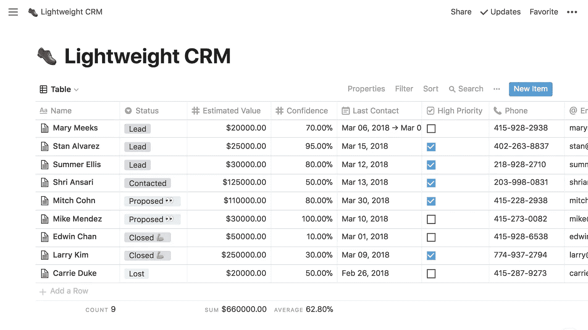
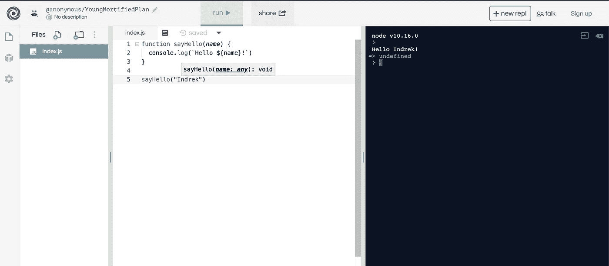
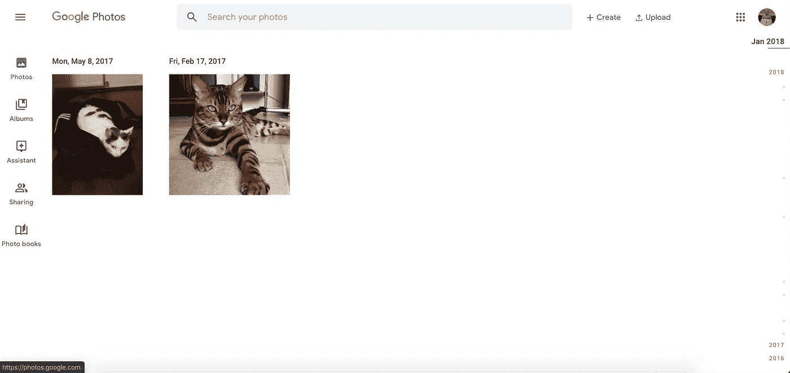
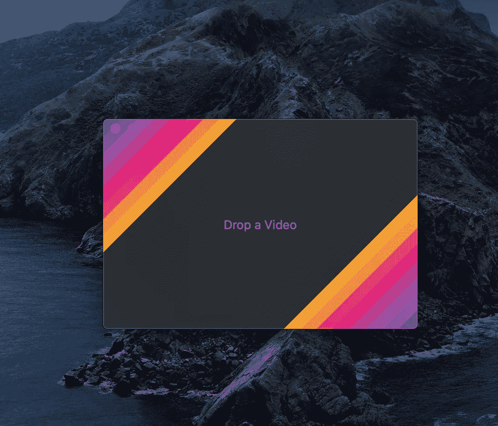
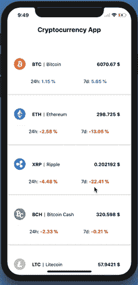

# 以下是 5 个前端挑战—2019 年 11 月版

> 原文：<https://betterprogramming.pub/here-are-5-frontend-challenges-nov-2019-edition-44d8133ab988>

## 通过构建这些应用来提高你的前端技能

由[亚历山德鲁·阿西亚](https://unsplash.com/@alexacea?utm_source=medium&utm_medium=referral)在 [Unsplash](https://unsplash.com?utm_source=medium&utm_medium=referral) 拍摄的照片

作为一名开发人员，最有效的成长方式之一就是尽可能多地构建。通过构建以下应用来提高您的前端技能。

这里有五个你可以从今天开始构建的前端想法。

# 1.概念克隆

[概念](https://www.notion.so/)应用程序改善了文档、任务的工作流程，让您可以创建待办任务，并在手机、平板电脑和笔记本电脑等设备之间同步所有数据。

观念 app—[https://www.notion.so/](https://www.notion.so/)

## 通过构建概念应用程序，您将学到什么

*   [HTML 拖放 API](https://developer.mozilla.org/en-US/docs/Web/API/HTML_Drag_and_Drop_API) 。用户可以用鼠标选择*可拖动的*元素，将这些元素拖动到一个*可放下的*元素上，释放鼠标按钮即可放下这些元素。
*   如何在手机和笔记本电脑之间同步实时数据？
*   因为我们允许用户创建、阅读、更新和删除笔记(CRUD)——我们正在学习基本的 CRUD 技能。

# 2.复制. it 克隆

Repl.it 是一个实时协作的代码编辑工具。你可以选择不同的语言，比如 JavaScript、Python 和 [Go](https://golang.org/) ，并在浏览器环境中执行代码。

对于代码面试或快速演示非常有用。相当整洁！

https://repl.it/

## 您将从构建 Repl.it 克隆中学到什么

*   如何在浏览器上运行和执行服务器端代码(客户端)。
*   读取输入，如代码编辑器，并显示输出结果。注意`sayHello`功能结果被输出到右边的控制台。
*   如何在网上创建文件和文件夹并保存结果。
*   如何突出代码语法？

# 3.Google 相册克隆

[谷歌照片](https://www.google.com/photos/about/)是谷歌开发的照片分享和存储服务。

上传、裁剪和处理图片是任何现代应用程序的关键。用户想要上传头像，分享猫的图片——知道如何有效地处理图片很重要。

谷歌照片—[https://www.google.com/photos/about/](https://www.google.com/photos/about/)

## 通过构建 Google 相册克隆版，您将学到什么

*   如何在手机、平板电脑、笔记本电脑，甚至更大的屏幕(如电视)上创建响应迅速的图像。
*   如何处理图像上传，尤其是处理较大的图像(> 1mb)和批量上传。
*   为缩略图或打开画廊时处理图像文件、裁剪照片和调整照片大小。
*   *加成* ***:*** 如何将图片存储在云端或本地数据库中。

# 4.吉夫斯基克隆

[Gifski](https://gif.ski/) 应用程序使用 [pngquant](https://pngquant.org/) 的奇特功能将视频帧转换为 GIF 动画，以实现高效的跨帧调色板和时间抖动。

它生成每帧使用数千种颜色的动画 gif。

吉夫斯基—[https://gif.ski/](https://gif.ski/)

## 通过构建 Gifski 克隆体，您将学到什么

*   如何将. mp4 等视频文件转换为？gif(图像)格式。
*   如何使用拖放 HTML API？
*   图像优化和处理的工作原理。

注: [Gifsky 是开源的](https://github.com/ImageOptim/gifski)并且在 GitHub 上！

# 5.加密货币价格跟踪器

React 本地加密货币跟踪器

## 通过构建加密货币价格追踪器克隆版，您将学到什么

*   如何使用 API 并从 API 远程获取数据。
*   如何以列表形式显示数据？

额外收获:如果你感兴趣，我不久前写了一篇关于用 React Native 构建加密货币价格追踪器的[教程](https://medium.com/better-programming/bitcoin-ripple-ethereum-price-checker-with-react-native-redux-e9d076037092)。

注意:这里有一个 [GitHub 示例库。](https://github.com/indreklasn/react-native-redux-crypto-tracker)

# 结论

感谢阅读，我希望你找到了一个有趣的项目来工作。如果你喜欢这种类型的帖子，这里是之前关于前端挑战的[帖子](https://medium.com/better-programming/here-are-6-frontend-challenges-to-code-9952190c97cc)。

寻找更多的编码想法？永远不要耗尽编码的想法，永远不要。 [**在这里获取权限，来一堆被我挑战的前端。**](https://gumroad.com/l/IuqKc)

保持好奇，快乐编码！