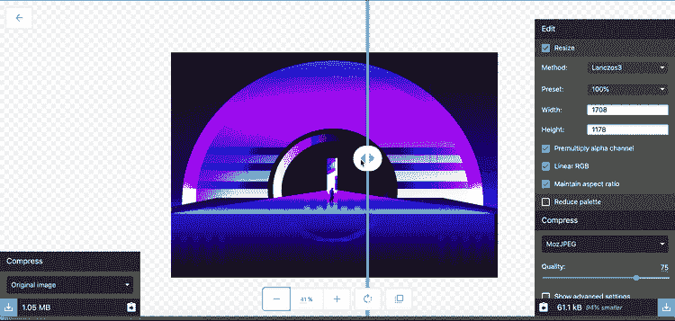
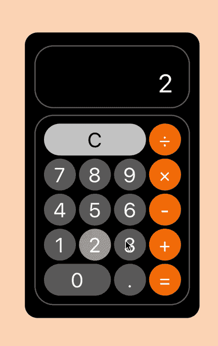
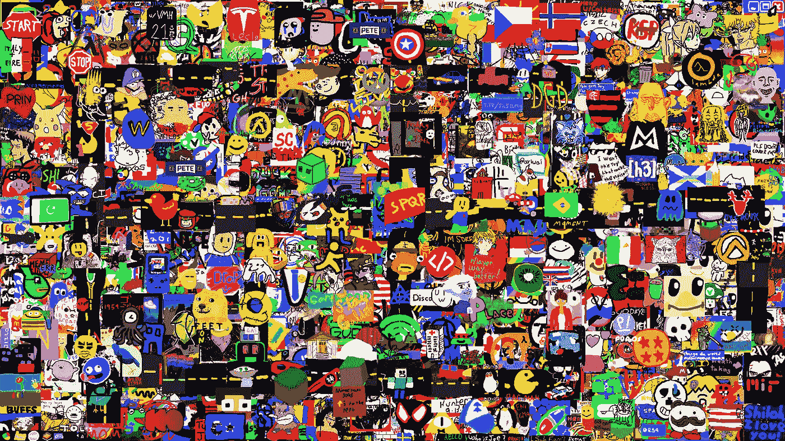
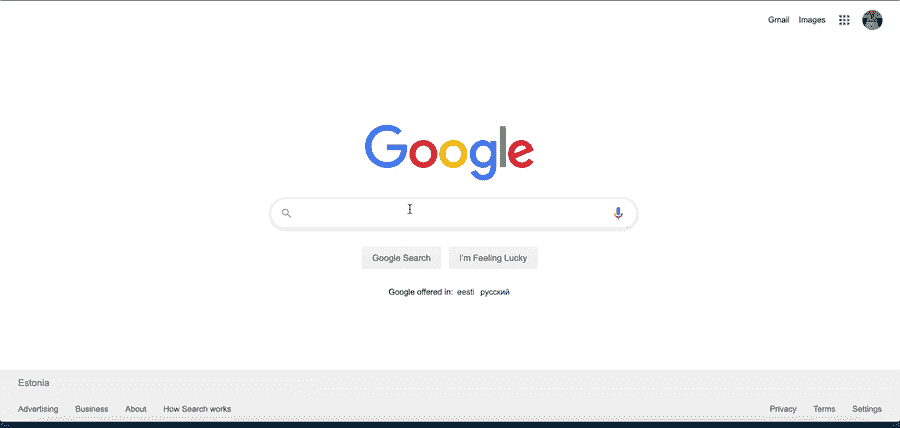
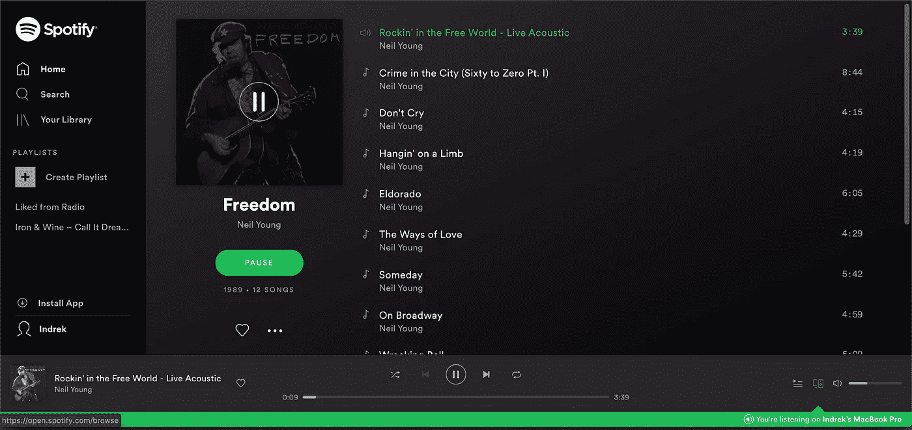

# 这里有 5 个发人深省的应用程序需要编写

> 原文：<https://betterprogramming.pub/here-are-5-thought-provoking-apps-to-code-915a87424bc1>

## 通过构建这五个应用程序来锻炼您的编码能力

诺德伍德主题公司在 [Unsplash](https://unsplash.com?utm_source=medium&utm_medium=referral) 上拍摄的照片

像生活中的所有事情一样，通过付出努力和汗水，变得擅长编码是可以实现的。通过投入 10，000 小时，你成为一个熟练的人。编码和其他技能没什么不同。我们的编码人员经常渴望编码，但经常缺乏想法。

这里有一些很酷的应用程序，我认为每个熟练的开发人员都应该至少构建一次。

# Squoosh

[Squoosh](https://squoosh.app/) 是一款图像压缩网络应用，允许你深入各种图像压缩器提供的高级选项。

示例 [Squoosh](https://squoosh.app/) 应用程序

通过构建 Squoosh 应用程序，您将了解以下内容:

*   如何调整图像大小和处理图像
*   基本拖放 API 介绍
*   事件监听器和 API 如何工作
*   文件上传和导出

**注意:**图像压缩在本地处理；不会向服务器发送额外的数据。你可以选择在客户端或者服务器端处理图像压缩。

# 计算器

真的吗？计算器？是的，的确是:一个计算器。理解基本的数学运算符以及它们是如何协同工作的，这在处理一个哪怕只是稍微复杂一点的应用程序时是至关重要的。迟早，你将不得不与数字打交道——为什么不早点适应呢？

计算器 app—[https://jarodburchill.github.io/CalculatorReactApp/](https://jarodburchill.github.io/CalculatorReactApp/)

通过构建计算器，您将了解到:

*   使用数字和数学运算符
*   事件监听器 API
*   如何定位元素和设计应用程序的样式

# 层

图层是一个社区，每个人都可以在共享的艺术板上绘制一个像素。最初的想法来自 Reddit 社区。r/Layer 社区是一个创造性探索的画布，每个人都可以进行创作和贡献。

图层画布—[https://www.reddit.com/r/layer/](https://www.reddit.com/r/layer/)

通过构建图层，您将了解到:

*   JavaScript 画布是如何工作的——知道如何操作画布在这样的应用程序中至关重要
*   如何协调用户权限？每个用户可以每 15 分钟画一个像素，无需登录。拥有用户是可选的。
*   管理 cookie 会话

Reddit 层

# 网站爬虫(搜索引擎)

现在每个人都有一个网站爬虫，为什么不自己建一个呢？网站爬虫在搜索信息时很方便。我们每天都依赖于搜索引擎，这种需求只会随着信息可用性的扩大而增长。

谷歌网站爬虫(搜索引擎)

通过构建网站爬虫，你将学到什么:

*   抓取网站的工作原理
*   如何索引网站并根据排名和声誉显示它们
*   将索引网站存储到数据库以及如何使用数据库

# 音乐播放器(Spotify、Apple Music)

每个人都喜欢听音乐——这只是我们生活中很自然的一部分。让我们构建一个音乐播放器，以更好地理解现代音乐流媒体平台的底层机制是如何工作的。

Spotify Web 示例

通过构建音乐流媒体平台，您将了解到:

*   如何使用 API？使用 [Spotify](https://developer.spotify.com/documentation/web-api/) 或 [Apple Music](https://developer.apple.com/documentation/applemusicapi) API
*   如何播放、停止或获取下一首或上一首歌曲
*   如何处理音量
*   如何管理用户路由和浏览器历史 API

# 结论

感谢阅读。我希望你找到了开始编写下一个应用程序的灵感。

如果你是 JavaScript 新手，想学习这门语言，我建议你从阅读书籍和构建东西开始。从《 [*一种更聪明的学习 JavaScript 的方法*](https://amzn.to/2LOkzjj) 》一书开始，这里有一个有趣的应用程序列表，可以用来构建。

 [## 成为顶级开发人员的秘诀是构建东西！这里有一个有趣的应用程序列表！

medium.com](https://medium.com/better-programming/the-secret-to-being-a-top-developer-is-building-things-heres-a-list-of-fun-apps-to-build-aac61ac0736c)