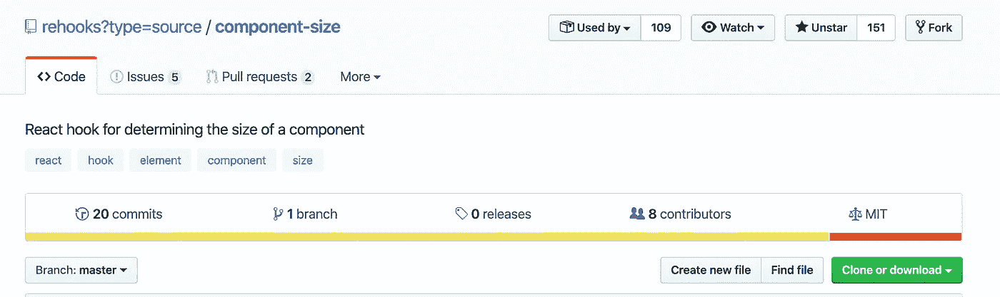
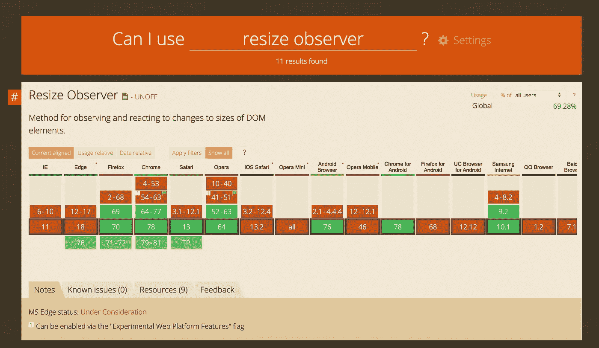
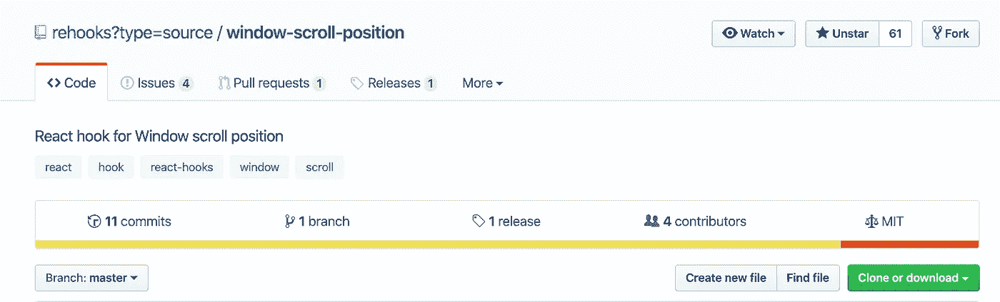
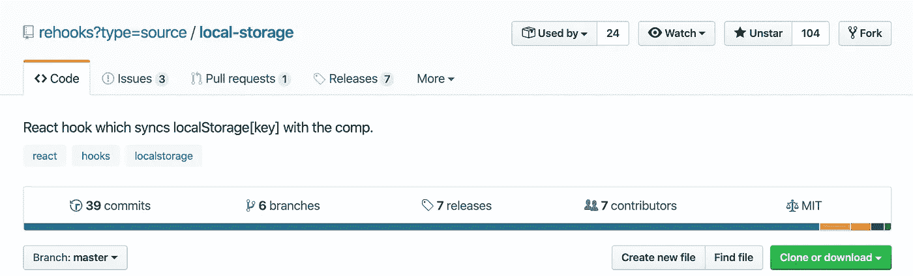
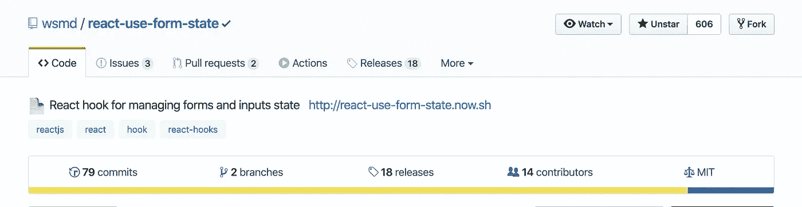
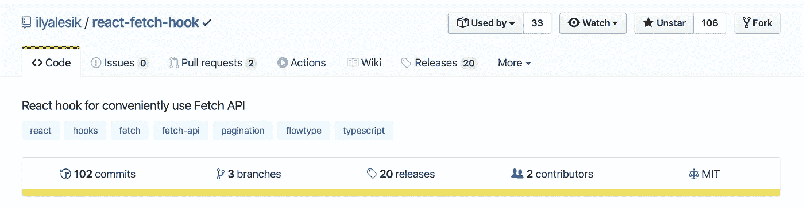
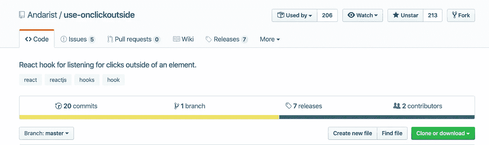

# 这里有 6 个可怕的反应钩

> 原文：<https://betterprogramming.pub/here-are-6-awesome-react-hooks-2ff0c0b35218>

## 你知道现在有成千上万个有用的 React 挂钩可以开始使用吗？


奥斯卡·伊尔迪兹在 [Unsplash](https://unsplash.com?utm_source=medium&utm_medium=referral) 上拍摄的照片

根据 [React 文档](https://reactjs.org/docs/hooks-overview.html):

> 挂钩是让您从功能组件“挂钩”React 状态和生命周期特性的功能。钩子在类内部不起作用——它们让你在没有类的情况下使用 React。(我们[不建议](https://reactjs.org/docs/hooks-intro.html#gradual-adoption-strategy)在一夜之间重写你现有的组件，但是如果你愿意，你可以在新的组件中使用钩子。)React 提供了几个类似`useState`的内置钩子。您还可以创建自己的挂钩，以便在不同组件之间重用有状态行为

这里有五个方便的 React 挂钩，你可以从今天开始使用。

**注:** 如果 React 钩子对你来说是一个新概念，可以看看我之前的帖子“[揭秘 React 钩子](https://medium.com/better-programming/demystifying-react-hooks-a0b56a6254c2)”

[](https://medium.com/better-programming/demystifying-react-hooks-a0b56a6254c2) [## 揭秘 React 挂钩

### 钩子如何节省你的时间并提高你代码库的质量

medium.com](https://medium.com/better-programming/demystifying-react-hooks-a0b56a6254c2) 

事不宜迟，这里有五个 React 挂钩，您可以从今天开始在 React 项目中使用。

# `@rehooks/component-size`

`@rehooks/component-size`是一个 React 钩子，用于确定一个组件的大小。当涉及到在调整大小时需要重新渲染的响应性图像和组件时，这很有用。



@ re hooks/component-size[GitHub 页面](https://github.com/rehooks/component-size)

## 安装

```
yarn add @rehooks/component-size
```

## 使用

```
import { useRef } from '[react](https://github.com/facebook/react)'
import useComponentSize from '[@rehooks/component-size](https://github.com/rehooks/component-size)'function MyComponent() {
  let ref = useRef(null)
  let size = useComponentSize(ref)
  // size == { width: 100, height: 200 }
  let { width, height } = size
  let imgUrl = `https://via.placeholder.com/${width}x${height}` return (
    <div style={{ width: '100%', height: '100%' }}>
      
    </div>
  )
}
```

**注意:** [ResizeObserver](https://developers.google.com/web/updates/2016/10/resizeobserver) 是用来确定一个元素是否被调整大小的 API。Chrome 的浏览器支持相当不错，但在其他主流浏览器中仍然缺乏支持。



[*resize observer*](https://caniuse.com/#search=resize%20observer)*浏览器支持*

# `@rehooks/window-scroll-position`

`@rehooks/window-scroll-position`是一个用于确定窗口滚动位置的 React 钩子。当您希望根据用户是否滚动以及滚动的位置来制作对象动画时，这很有用。



[@ rehooks/window-scroll-position](https://github.com/rehooks/window-scroll-position)

## 安装

```
yarn add @rehooks/window-scroll-position
```

## 使用

```
import useWindowScrollPosition from '[@rehooks/window-scroll-position](https://github.com/rehooks/window-scroll-position)'function MyComponent() {
  // optionally you can pass options, those are default:
  let options = {
    throttle: 100,
  }
  let position = useWindowScrollPosition(options)
  // position == { x: 0, y: 0 }
  return <div />
}
```

# `@rehooks/local-storage`

`@rehooks/local-storage`是一个 React 钩子，用于实现与本地存储的同步。



`[@rehooks/local-storage](https://github.com/rehooks/local-storage)`

## 安装

**纱线**

```
yarn add @rehooks/local-storage
```

**NPM**

```
npm i @rehooks/local-storage
```

## 使用

`writeStorage`:这可以是应用程序中的任何地方。

```
import React from 'react';
import { writeStorage } from '@rehooks/local-storage';let counter = 0;const MyButton = () => (
  <button onClick={_ => writeStorage('i', ++counter)}>
    Click Me
  </button>
);
```

`useLocalStorage`:该组件将从本地存储接收自身更新。

```
import React from 'react';
import { useLocalStorage } from '@rehooks/local-storage';function MyComponent() {
  const [counterValue] = useLocalStorage('i'); // send the key to be tracked.
  return (
    <div>
      <h1>{counterValue}</h1>
    </div>
  );
}
```

`deleteFromStorage:`您也可以从本地存储器中删除项目。

```
import { writeStorage, deleteFromStorage } from '@rehooks/local-storage';writeStorage('name', 'Homer Simpson'); // Add an item firstdeleteFromStorage('name'); // Deletes the itemconst thisIsNull = localStorage.getItem('name'); // This is indeed null
```

## 完整示例

```
import React from 'react';
import ReactDOM from 'react-dom';
import { writeStorage, deleteFromStorage, useLocalStorage } from '@rehooks/local-storage';const startingNum = 0;const App = () => {
  const [getNum, setNum] = useLocalStorage('num'); return (
    <>
      <p>{getNum}</p>
      <button onClick={_ => setNum(getNum ? getNum + 1 : 0)}>Increment</button>
      <button onClick={_ => deleteFromStorage('num')}>Delete</button>
    </>
  );
};// Assuming there is a div in index.html with an ID of 'root'
ReactDOM.render(<App />, document.getElementById('root'));
```

`@rehooks/local-storage` API 文档可以在这里[找到。](https://rehooks.github.io/local-storage)

# 反应-使用-形式-状态

在 React 中管理表单状态有时会有点笨拙。T21 已经有很多很好的解决方案让管理表单变得轻而易举。然而，这些解决方案中有许多是固执己见的，包含了大量最终可能不会被使用的功能，并且/或者需要额外运输一些字节。

幸运的是，最近引入的 [React 钩子](https://reactjs.org/docs/hooks-intro.html)和编写定制钩子的能力为共享状态逻辑提供了新的可能性。表单状态也不例外。

`react-use-form-state`是一个小的 React 钩子，它试图[简化管理表单状态](https://github.com/wsmd/react-use-form-state#examples)，使用您熟悉的本地表单输入元素。



[反应-使用-形式-状态](https://github.com/wsmd/react-use-form-state)

## 入门指南

首先，将`react-use-form-state`添加到您的项目中:

```
npm install --save react-use-form-state
```

注意`react-use-form-state`需要`react@^16.8.0`作为对等依赖。

## 基本用法

```
import { useFormState } from 'react-use-form-state';export default function SignUpForm({ onSubmit }) {
  const [formState, { text, email, password, radio }] = useFormState(); function handleSubmit(e) {
    // ...
  } return (
    <form onSubmit={handleSubmit}>
      <input {...text('name')} />
      <input {...email('email')} required />
      <input {...password('password')} required minLength="8" />
      <input {...radio('plan', 'free')} />
      <input {...radio('plan', 'premium')} />
    </form>
  );
}
```

从上面的例子来看，当用户填写表单时，`formState`对象看起来像这样:

```
{
  values: {
    name: 'Mary Poppins',
    email: 'mary@example.com',
    password: '1234',
    plan: 'free',
  },
  touched: {
    name: true,
    email: true,
    password: true,
    plan: true,
  },
  validity: {
    name: true,
    email: true,
    password: false,
    plan: true,
  },
  errors: {
    password: 'Please lengthen this text to 8 characters or more',
  },
  clear: Function,
  clearField: Function,
  reset: Function,
  resetField: Function,
  setField: Function,
}
```

## 初态

`useFormState`获取一个初始状态对象，其键与输入的名称相匹配。

```
export default function RentCarForm() {
  const [formState, { checkbox, radio, select }] = useFormState({
    trip: 'roundtrip',
    type: ['sedan', 'suv', 'van'],
  });
  return (
    <form>
      <select {...select('trip')}>
        <option value="roundtrip">Same Drop-off</option>
        <option value="oneway">Different Drop-off</option>
      </select>
      <input {...checkbox('type', 'sedan')} />
      <input {...checkbox('type', 'suv')} />
      <input {...checkbox('type', 'van')} />
      <button>Submit</button>
    </form>
  );
}
```

查看 [API 文档](https://github.com/wsmd/react-use-form-state#api)部分进行深入研究。

# 反应取钩

`react-fetch-hook`是一个 React 钩子，方便使用 Fetch API。该套件包括以下内容:

*   Tiny (397B) —通过[尺寸限制](https://github.com/ai/size-limit)计算
*   包括流和类型脚本类型



[反应抓取挂钩](https://github.com/ilyalesik/react-fetch-hook)

## 入门指南

**纱线**

```
yarn add react-fetch-hook
```

**NPM**

```
npm i react-fetch-hook --save
```

## 使用

```
import React from "[react](https://github.com/facebook/react)";
import useFetch from "[react-fetch-hook](https://github.com/ilyalesik/react-fetch-hook)";

const Component = () => {
  const { isLoading, data } = useFetch("https://swapi.co/api/people/1");

  return isLoading ? (
    <div>Loading...</div>
  ) : (
    <UserProfile {...data} />
  );
};
```

`useFetch`接受与 fetch 函数相同的参数。

## 自定义格式化程序

默认是`response => response.json()`格式化程序。您可以像这样传递自定义格式化程序:

```
const { isLoading, data } = useFetch("https://swapi.co/api/people/1", {
    formatter: (response) => response.text()
});
```

## 多个请求

支持`useFetch`在同一个文件/组件中的多个实例:

```
const result1 = useFetch("https://swapi.co/api/people/1");
const result2 = useFetch("https://swapi.co/api/people/2");if (result1.isLoading && result2.isLoading) {
  return <div>Loading...</div>;
} return <div>
    <UserProfile {...result1.data} />
    <UserProfile {...result2.data} />
</div>
```

# 使用-onclickoutside

这是一个 React 钩子，用于监听元素外部的点击。它与模式、弹出窗口、提醒或个人资料导航结合使用非常有用。



[使用-onclickoutside](https://github.com/Andarist/use-onclickoutside)

## 入门指南

**纱线**

```
yarn add use-onclickoutside
```

**用法**

我们创建一个`ref`并将`ref`传递给`useOnClickOutside`钩子。

```
import React, { useRef } from '[react](https://github.com/facebook/react)'
import useOnClickOutside from '[use-onclickoutside](https://github.com/Andarist/use-onclickoutside)'export default function Modal({ close }) {
  const ref = useRef(null)
  useOnClickOutside(ref, close) return <div ref={ref}>{'Modal content'}</div>
}
```

注意 [useRef](https://reactjs.org/docs/hooks-reference.html#useref) 的用法，这是标准 React 包提供的标准 React 钩子。

`useRef`返回一个可变的 ref 对象，其`.current`属性被初始化为传递的参数(`initialValue`)。返回的对象将在组件的整个生存期内保持不变

# 结论

感谢阅读，我希望你学到了新的东西。编码快乐！