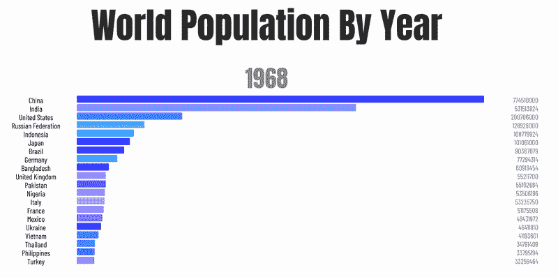
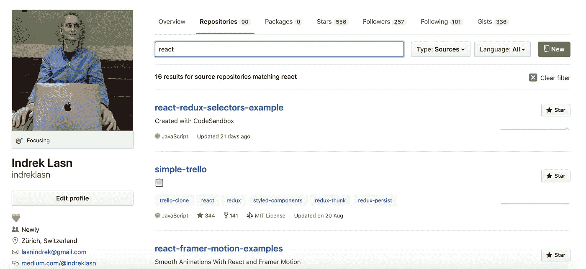
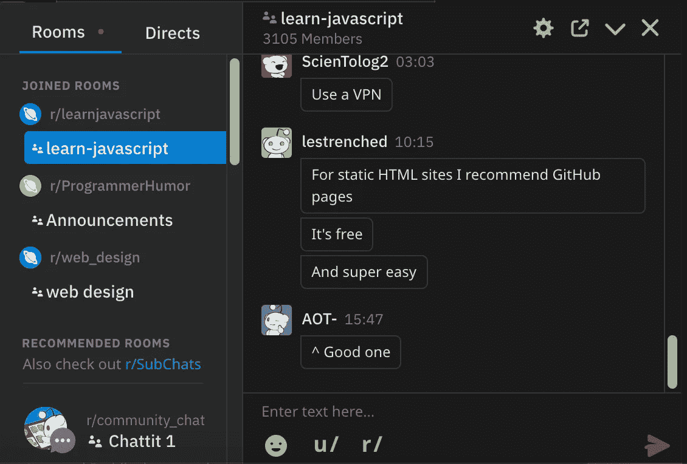
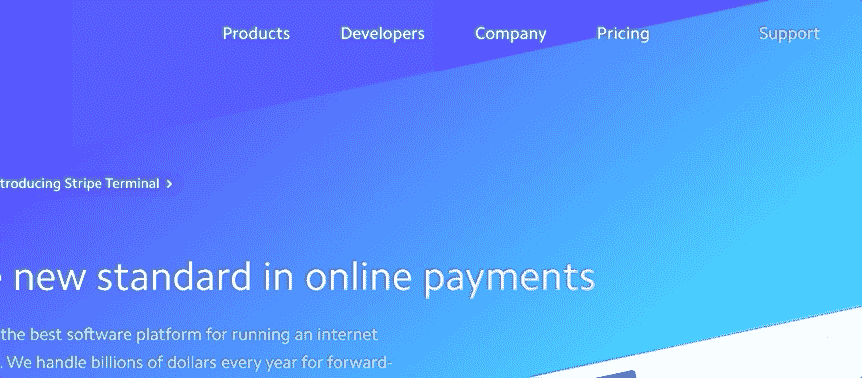

# 下面是代码的 6 个前端挑战

> 原文：<https://betterprogramming.pub/here-are-6-frontend-challenges-to-code-9952190c97cc>

## 您能够对这些前端挑战进行编码吗？

由[奥拉夫·阿伦斯·罗特内](https://unsplash.com/@olav_ahrens?utm_source=medium&utm_medium=referral)在 [Unsplash](https://unsplash.com?utm_source=medium&utm_medium=referral) 拍摄的照片

前端开发既紧张又艰难，但是通过实践，你可以掌握这门技术。如果您愿意投入工作和精力，您将能够在前端开发领域成为一名熟练的问题解决者。成为优秀的前端开发人员的一个有效方法是简单地构建并解决尽可能多的挑战。

这里有六个挑战，你可以从今天开始解决，成为前端开发大师。事不宜迟，以下是你可能应该编写代码的六个挑战。

[成为媒介会员直接支持我的工作](https://trevorlasn.medium.com/membership)。你也可以在媒体上看到所有的故事。提前感谢！

# 1.信用卡表格

一种奇妙的信用卡形式，具有流畅和甜蜜的微交互。包括数字格式化、验证和自动卡类型检测。它是用 Vue.js 构建的，也是完全响应的。

看直播[这里](http://codepen.io/JavaScriptJunkie/pen/YzzNGeR)。

信用卡表单—[https://github.com/muhammederdem/credit-card-form](https://github.com/muhammederdem/credit-card-form)

## 通过解决挑战你会学到什么

*   表单处理和验证
*   处理事件侦听器(例如，当字段改变时，它将在信用卡上打印值)
*   了解如何在页面上显示和定位元素，尤其是与表单重叠的信用卡

# 2.从头开始绘制条形图

条形图或条形图是一种用矩形条表示分类数据的图表或图形，矩形条的高度或长度与它们所表示的值成比例。

条形图可以垂直或水平绘制。竖条图有时被称为折线图。

## 通过解决挑战你会学到什么

*   以结构化和易于理解的方式显示数据
*   可选:学习如何使用`<canvas>`元素以及如何用它绘制元素

你可以在这里找到按年份划分的世界人口数据。

 [## 按年份分列的世界人口

### 从公元前 5000 年到当前年份(2019 年)全球总人口的历史增长

www.worldometers.info](https://www.worldometers.info/world-population/world-population-by-year/) 

# 3.推特之心动画

早在 2016 年，Twitter 就为他们的推文点赞推出了这个超赞的动画。截至 2019 年，它看起来仍然很 rad，为什么不自己创建一个呢？

像动画一样的推特

## 通过解决挑战你会学到什么

*   CSS 属性如何工作
*   如何操纵 HTML 元素并制作动画
*   如何结合 JavaScript、HTML 和 CSS

# 4.具有搜索功能的 GitHub 存储库

这里什么都没有——GitHub 库基本上只是一个美化了的列表。

任务是显示存储库，并允许用户过滤存储库。使用[官方 GitHub API](https://developer.github.com/v3/) 获取每个用户的存储库。

GitHub 个人资料页面—[https://github.com/indreklasn](https://github.com/indreklasn)

## 通过解决挑战你会学到什么

*   如何从 API 获取数据
*   如何显示来自 API 的数据
*   如何过滤和显示每次搜索的相关数据
*   可选:如果您准备好迎接挑战，请使用使用 GraphQL 构建的 [v4 API](https://developer.github.com/v4/) 。[如果你想学习 GraphQL，请阅读我以前的一篇文章](https://medium.com/better-programming/how-to-setup-a-powerful-api-with-graphql-koa-and-mongodb-339cfae832a1)。

 [## 如何用 GraphQL、Koa 和 MongoDB 建立一个强大的 API

### 构建 API 很有趣！

medium.com](https://medium.com/better-programming/how-to-setup-a-powerful-api-with-graphql-koa-and-mongodb-339cfae832a1) 

# 5.Reddit 风格的聊天室

聊天室是一种流行的交流方式，因为它使用起来简单有趣。但是到底是什么驱动了现代聊天室呢？WebSockets！

## 通过解决挑战你会学到什么

*   如何使用 WebSockets 和实时通信和数据更新
*   用户权限级别如何工作(例如，聊天频道的所有者扮演`admin`的角色，而房间中的其他人扮演`user`的角色)
*   表单验证和处理——记住，发送消息的聊天框是一个`input`元素
*   如何创建和加入不同的聊天室
*   直接信息及其工作方式。用户可以私下与其他用户交流。本质上，您将在两个用户之间建立一个 WebSocket 连接。

# 6.条纹式导航

这种导航的独特之处在于 popover 容器会根据内容进行变形。与完全打开和关闭新 popover 的传统行为相比，这种转换非常优雅。

条纹导航

## 通过解决挑战你会学到什么

*   如何将 CSS 动画与过渡结合起来
*   交叉淡入淡出内容，并为悬停的元素应用`active`类

试着自己先做，但是如果你需要帮助，看看这篇文章的逐步指导。

# 结论

感谢您的阅读——希望您发现了一些有趣的代码。

**又及:寻找更多的编码想法？永远不要耗尽编码的想法，永远不要。**

记住，要想擅长编码，没有捷径可走。