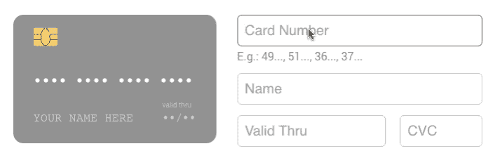
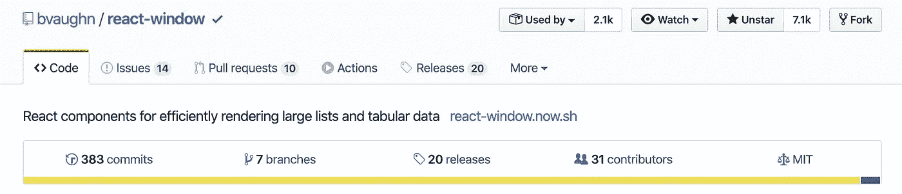
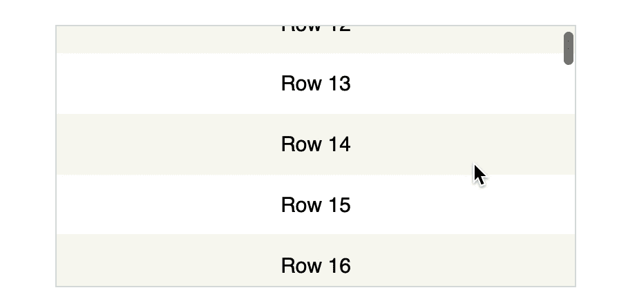
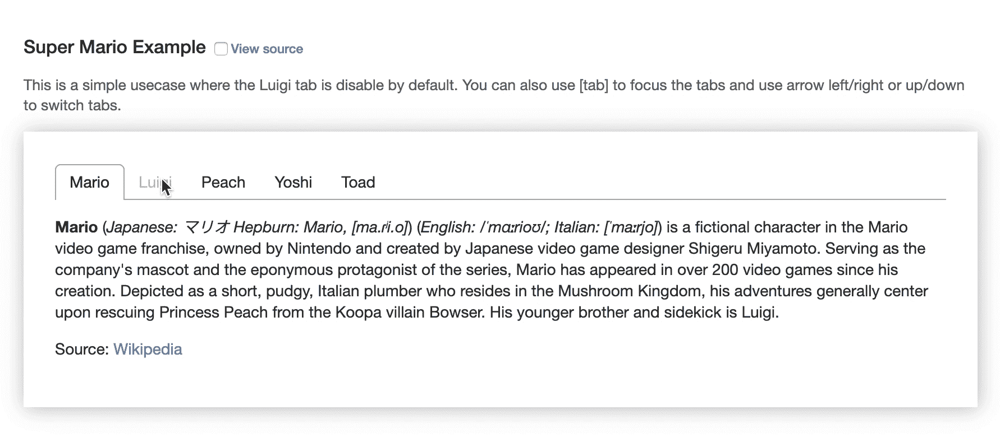
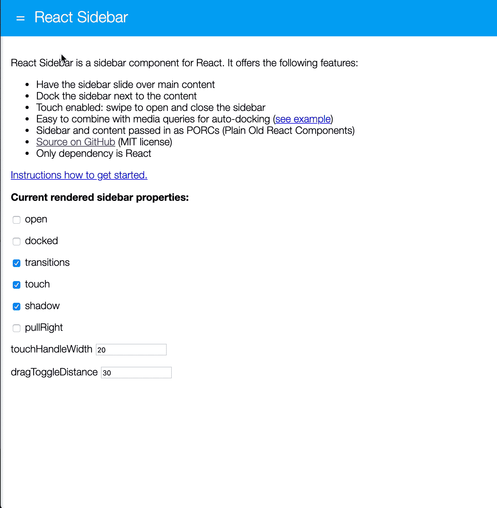
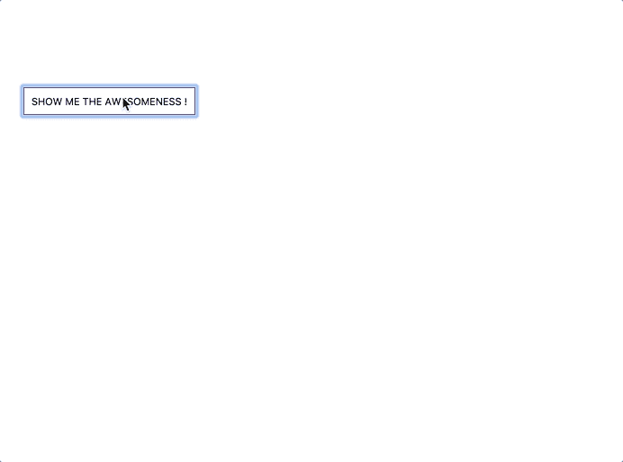
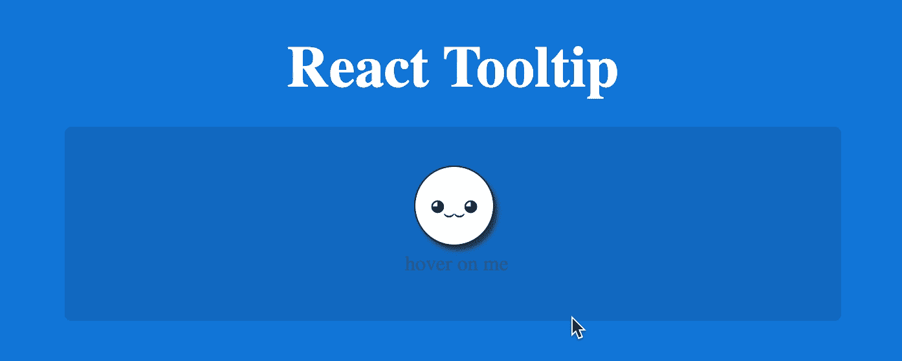

# 以下是 6 个有用的 React 组件

> 原文：<https://betterprogramming.pub/here-are-6-useful-react-components-d0865d1eefb7>

## *信用卡、标签、工具条和更多*


照片由[费边·格罗斯](https://unsplash.com/@grohsfabian?utm_source=medium&utm_medium=referral)在 [Unsplash](https://unsplash.com?utm_source=medium&utm_medium=referral) 拍摄

使用 React 的最大好处之一是它有大量的开源包，可以加速您的开发，让您的生活更加轻松。为什么不利用社区提供的所有软件包来节省时间呢？

事不宜迟，这里列出了我经常使用的一些有用的 React 组件，以节省时间。

# 反应信用卡

[React 信用卡](https://github.com/amarofashion/react-credit-cards)是 React 的一个巧妙的信用卡组件。



[React 信用卡](https://github.com/amarofashion/react-credit-cards)演示

## 安装

```
npm install --save react-credit-cards
```

## 使用

React 信用卡代码示例

不要忘记导入 CSS:

```
import 'react-credit-cards/es/styles-compiled.css';
```

点击了解更多关于`react-credit-cards`组件[的信息。](https://github.com/amarofashion/react-credit-cards)

# 反应窗口



GitHub 上的[反应窗口](https://github.com/bvaughn/react-window)

[react-window](http://react-window.now.sh) 是一个 react 组件，用于高效地呈现大型列表和表格数据。



[反应窗口](http://React-window)演示

react-window 仅渲染大型数据集的一部分(仅够填充视口)。这有助于解决一些常见的性能瓶颈:

1.  它减少了渲染初始视图和处理更新所需的工作量(和时间)。
2.  它通过避免 DOM 节点的过度分配来减少内存占用。

## 安装

```
# Yarn
yarn add react-window# NPM
npm install --save react-window
```

## 使用

反应窗口代码示例

在 [react-window.now.sh](https://react-window.now.sh/) 了解更多信息。

# 反应-标签

[react-tabs](https://github.com/reactjs/react-tabs) 是 ReactJS 的一个可访问且简单的标签组件。



反应-标签演示

## 安装

```
#yarn
yarn add react-tabs#NPM
npm install --save react-tabs
```

## 使用

react-tabs 代码示例

点击此处了解更多关于[反应标签](https://reactcommunity.org/react-tabs/)的信息。

# 反应侧边栏



[React 侧边栏](https://balloob.github.io/react-sidebar/example/)演示

React Sidebar 是 React 0.14+的侧边栏组件。它提供以下功能:

*   侧边栏可以滑过主要内容或停靠在它旁边
*   支持触摸:滑动以打开和关闭侧边栏，就像在原生移动应用程序上一样
*   易于与媒体查询结合，仅在屏幕足够宽时显示侧边栏([参见示例](http://balloob.github.io/react-sidebar/example/responsive_example.html))
*   在左侧和右侧都有效
*   小尺寸:<2.5kB gzipped

## Installation

【

If you use TypeScript, typings are [可用于确定类型的](https://github.com/DefinitelyTyped/DefinitelyTyped/tree/master/types/react-sidebar)并可安装:

`npm install @types/react-sidebar`

## 使用

[React 侧栏](https://github.com/balloob/react-sidebar)基于类的代码示例

如果您感兴趣，[这里是 React 侧边栏组件的完整文档](https://github.com/balloob/react-sidebar)。

# 反应迟钝

[React-Toastify](https://github.com/fkhadra/react-toastify) 允许您轻松地向应用程序添加通知。



[反应-适应](https://github.com/fkhadra/react-toastify)演示

# 反应迟钝的特征

*   易于设置—您可以在不到 30 秒的时间内使其工作
*   易于定制
*   RTL 支持
*   滑动以关闭
*   可以在吐司内部显示一个反应组件
*   有`onOpen`和`onClose`挂钩。两者都可以访问传递给 toast 中呈现的 React 组件的 props。

## 装置

```
$ npm install --save react-toastify
$ yarn add react-toastify
```

## 使用

react-toastify 代码示例

点击了解更多关于 React-to-stify[的信息。](https://github.com/fkhadra/react-toastify)

# 反应工具提示

[React Tooltip](https://github.com/wwayne/react-tooltip) 是一个简单的工具提示包。工具提示有多种用途，尤其是向用户显示额外信息的时候。



[React 工具提示](https://github.com/wwayne/react-tooltip)演示

## 装置

```
npm install react-tooltip
```

## 使用

1.安装后导入`react-tooltip`。

```
import ReactTooltip from '[react-tooltip](https://github.com/wwayne/react-tooltip)'
```

2.给你的元素添加`data-tip = “your placeholder”`。

```
<p data-tip="hello world">Tooltip</p>
```

3.包括`react-tooltip`组件。

```
<ReactTooltip />
```

点击了解更多关于 React 工具提示[的信息。](https://react-tooltip.netlify.com/)

# 结论

感谢您的阅读，我希望您能从这篇文章中获得一些有用的东西。

了解我最新内容的最好方式是通过我的[简讯](https://wholesomedev.substack.com/welcome)。成为第一个得到通知的人。


我的[简讯](https://wholesomedev.substack.com/welcome)。成为第一个得到通知的人。