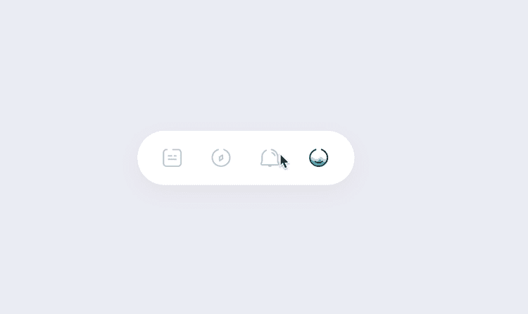
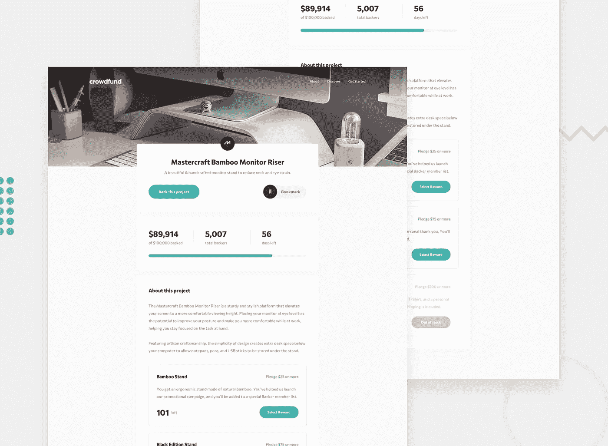
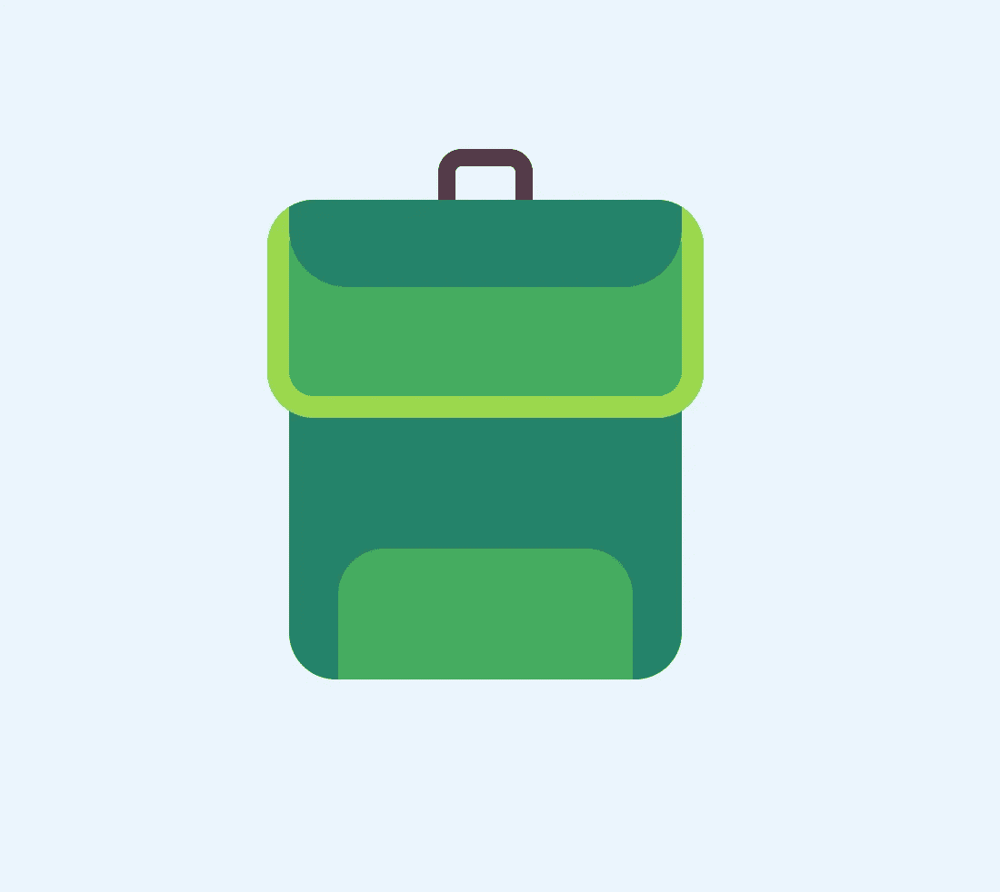
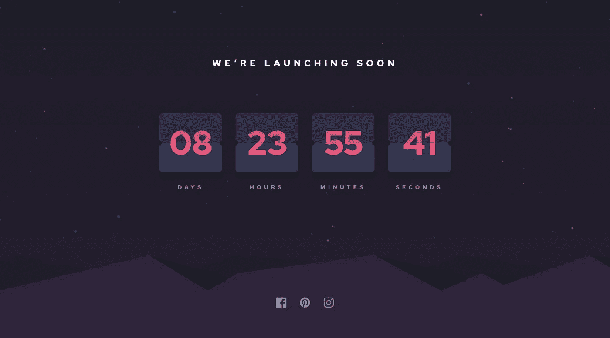
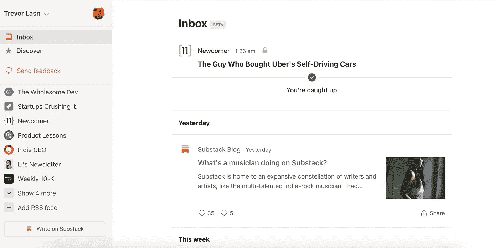
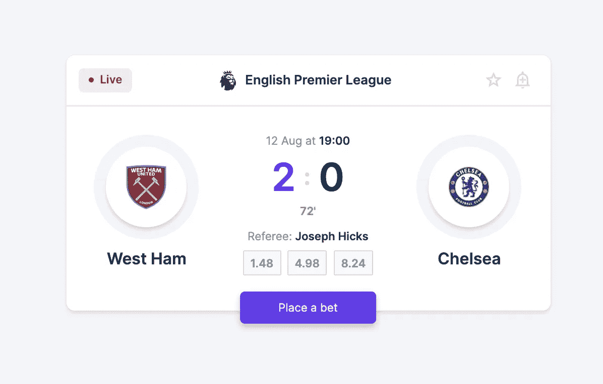
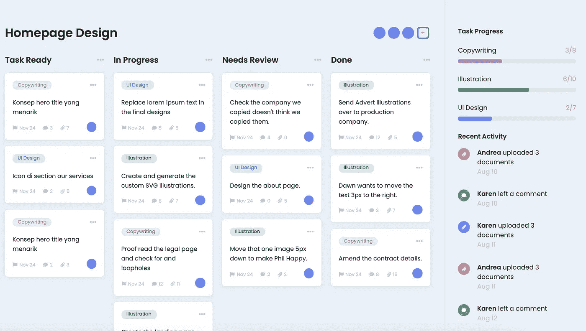

# 7 个有趣但具有挑战性的前端想法，你可以编码

> 原文：<https://betterprogramming.pub/here-are-7-fun-yet-challenging-frontend-ideas-you-can-code-c8b7fd5ea55>

## 获得编码灵感

在 [Unsplash](https://unsplash.com?utm_source=medium&utm_medium=referral) 上由[Nejc sokli](https://unsplash.com/@nejc_soklic?utm_source=medium&utm_medium=referral)拍摄的照片。

编程是一件很难掌握的事情。我发现掌握编程的最好方法之一就是尽可能多地构建。努力工作会有回报——尤其是在编程方面。

如果你不熟悉这些文章，它们或多或少会给你带来灵感。选择一个让你对编码感兴趣的挑战，然后继续构建它。

如果你赶时间，不想用完编码的点子——[我在这里整理了一个超过 100 个挑战的列表。](https://gumroad.com/l/IuqKc)

你可以在挑战中使用任何你喜欢的工具，所以如果你有什么想练习的，可以试一试。

事不宜迟，挑战来了！

# 1.仅用 CSS 构建的 Tabbar 动画

这是一个看起来很漂亮的标签，当你悬停或点击图标时，它会显示图标的动画。特别注意小动画。

[Tabbar 动画——仅 CSS](https://codepen.io/milanraring/pen/qBEPzKB) 由 [Milan Raring](https://codepen.io/milanraring) 制作。

## 通过构建 tabbar 动画，您将学到什么

*   如何使用先进的 CSS 概念，如变换，动画，过渡等。

# 2.众筹产品页面

编写一个众筹产品页面，让它看起来尽可能接近设计。查看[挑战页面](https://www.frontendmentor.io/challenges/crowdfunding-product-page-7uvcZe7ZR)了解更多详情和说明。

[“众筹产品页面”](https://www.frontendmentor.io/challenges/crowdfunding-product-page-7uvcZe7ZR)

## 你将从建立众筹产品页面中学到什么

*   确认认捐后，查看支持者总数增加 1。
*   切换产品是否被书签标记。
*   交互式组件的 CSS 悬停状态。
*   CSS 和 HTML 创建一个如丝般光滑的布局。

# **3。CSS 冒险包**

我们要回学校——也就是编码学校。看看这个仅用 CSS 制作的可怕的冒险包。

由[布雷登·科伊尔](https://codepen.io/braydoncoyer)制作的 [CSS 冒险包](https://codepen.io/braydoncoyer/pen/KKNRaKQ)。

## 你将从构建 CSS 冒险包中学到什么

*   如何使用 HTML 和 CSS 绘制现实生活中的物体？
*   如何使用 CSS 变量？

# 4.发射倒计时定时器

我们都见过倒计时器。为什么不自己造呢？尝试构建倒计时器，让它看起来尽可能接近设计。

[【发射倒计时器】](https://www.frontendmentor.io/challenges/launch-countdown-timer-N0XkGfyz-)

## 你将从建造发射倒计时器中学到什么

*   每秒倒计时的计时器。
*   加分:当一个数字改变时，使卡片从中间翻转。

# 5.子堆栈阅读器克隆

您订阅的任何 Substack 简讯都会自动显示在阅读器中。如果你愿意，你也可以添加第三方 RSS 源。

*注意:挑战在于仅重新创建前端布局。使用任何你认为合适的虚拟数据。*

来源:[https://reader.substack.com/inbox](https://reader.substack.com/inbox)

## 通过构建子堆栈阅读器克隆，您将学到什么

*   如何使用 CSS 和 HTML 重新创建一个现代外观的应用程序？
*   额外的好处:你可以使用任何时事通讯聚合 API 来使其功能化。

# 6.足球比赛记分卡组件

尝试建立一个足球比赛记分卡，并让它看起来尽可能接近设计。不要忽略小细节，比如 CSS 阴影和图标。

[足球(英式足球)比赛比分组件](https://codepen.io/havardob/pen/MWKWZxZ)由[h vard Brynjulfsen](https://codepen.io/havardob)制作。

## 您将从构建足球比赛记分卡组件中学到什么

*   如何协调使用 CSS 和 HTML 来创建一个漂亮的卡片？
*   高级 CSS 功能，如阴影和变量。

# 7.任务管理用户界面

看看这个美女。难道你不希望所有的应用程序看起来都像这个一样可爱吗？在 dribble 上检查工作版本[。](https://dribbble.com/shots/14552329--Exploration-Task-Management-Dashboard)

[任务管理 UI](https://codepen.io/aaronmcg/pen/GRjaRva) 作者 [Aaron McGuire](https://codepen.io/aaronmcg) 。

## 通过构建任务管理 UI，您将学到什么

*   如何用 CSS、HTML 和 JavaScript 制作漂亮的应用程序？

# 结论

感谢阅读。编码快乐！

寻找更多的编码思路？永远不要耗尽编码的想法，永远不要。[在这里获得我的一系列前端挑战。](https://gumroad.com/l/IuqKc)