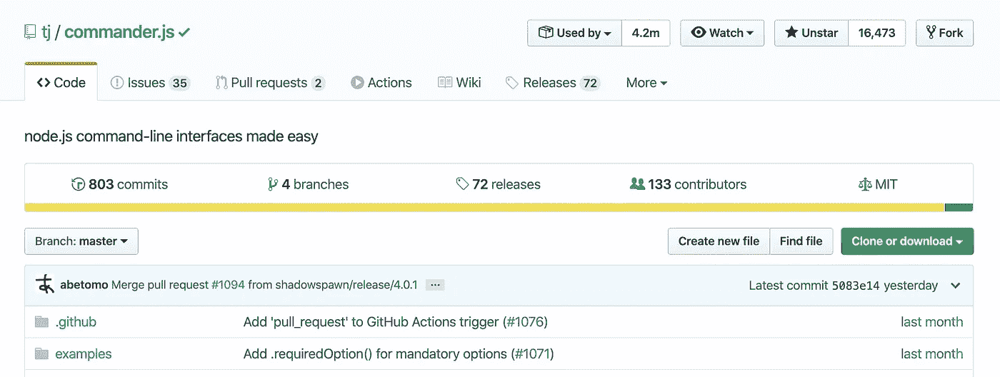
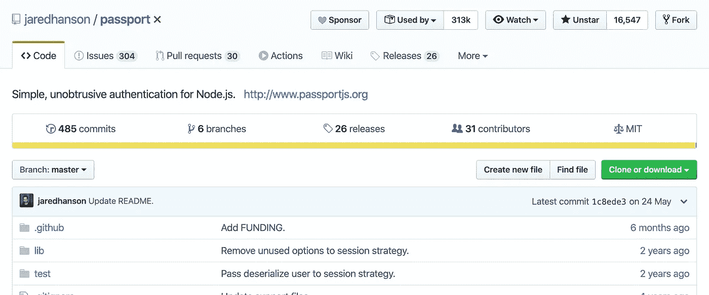
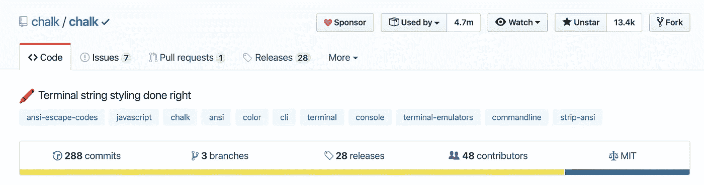
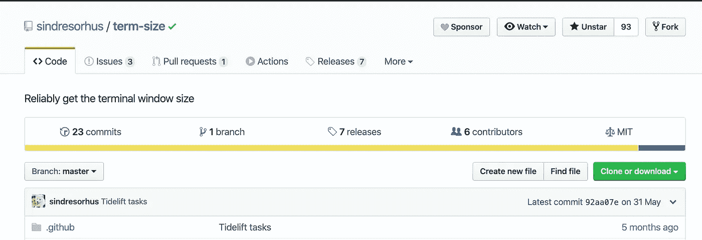
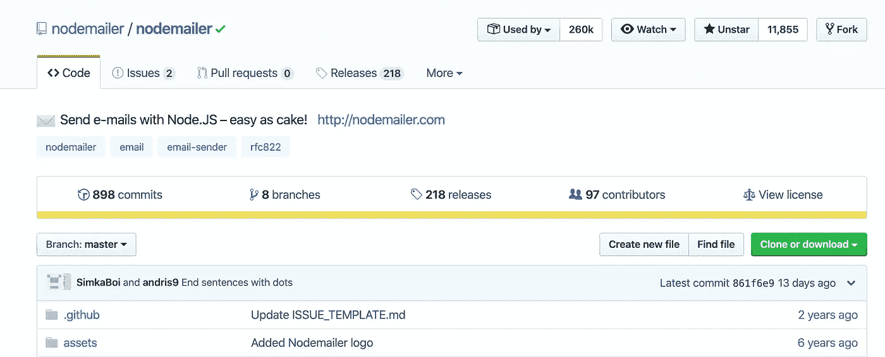
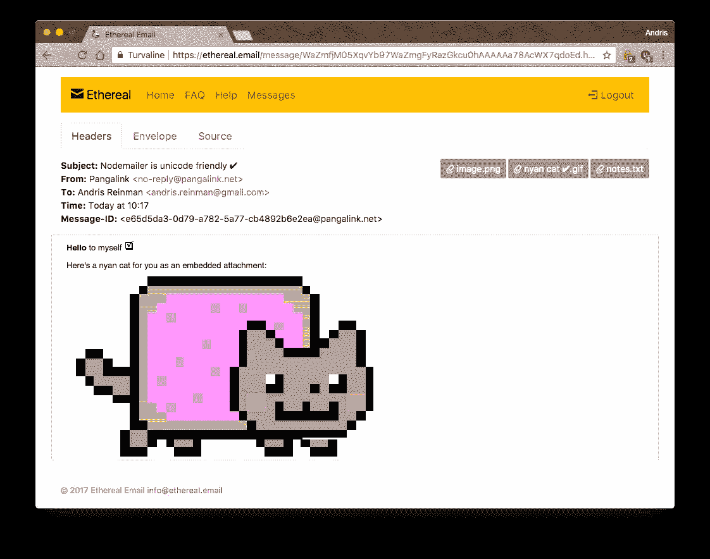
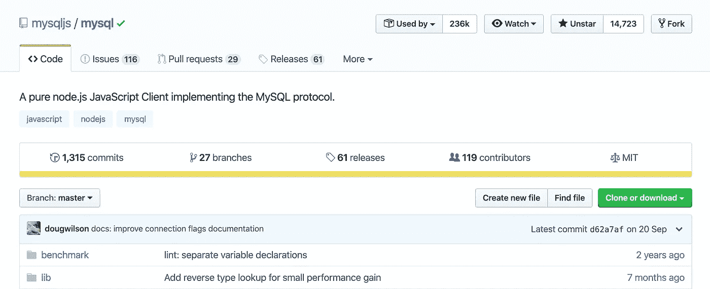
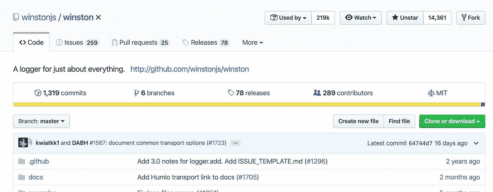

# 下面是 7 个有用的节点包(开源免费使用！)

> 原文：<https://betterprogramming.pub/here-are-7-useful-node-packages-open-source-and-free-to-use-260bd17bc735>

## 利用这些开源包，充分利用活跃的 JavaScript 生态系统和活跃的社区


照片由 [Max Nelson](https://unsplash.com/@maxcodes?utm_source=medium&utm_medium=referral) 在 [Unsplash](https://unsplash.com?utm_source=medium&utm_medium=referral) 上拍摄

JavaScript 的真正力量来自大量可用的开源软件包。JavaScript 生态系统正在蓬勃发展，我们可以免费使用精彩的包——但是，当然，不要忘记偶尔赞助包的创建者和维护者。包作者和人类一样，也交房租，买杂货。

事不宜迟，这里有七个很酷的节点包，您可以从今天开始使用。

# Commander.js

Commander 是*的*完整解决方案，用于 [node.js](http://nodejs.org/) 命令行接口，灵感来自 Ruby 的 [commander](https://github.com/commander-rb/commander) 。



commander.js .来源: [Github](https://github.com/tj/commander.js/)

## 装置

```
npm install commander
```

## 声明程序变量

Commander 导出一个全局对象，这对快速程序很方便。

```
const program = require('[commander](https://github.com/tj/commander.js)');program.version('0.0.1');
```

对于可能以多种方式使用 commander 的大型程序，包括单元测试，最好创建一个本地命令对象来使用。

```
const commander = require('[commander](https://github.com/tj/commander.js)');
const program = new commander.Command();program.version('0.0.1');
```

## 命令

您可以使用`.command`为顶层命令指定(子)命令。有两种方法可以实现它们:使用附加到命令的动作处理程序，或者作为单独的可执行文件(稍后将更详细地描述)。在`.command`的第一个参数中，指定命令名和任何命令参数。自变量可能是`<required>`或`[optional]`，最后一个自变量也可能是`variadic...`。

例如:

```
// Command implemented using action handler (description is supplied separately to `.command`)
// Returns new command for configuring.
program
  .command('clone <source> [destination]')
  .description('clone a repository into a newly created directory')
  .action((source, destination) => {
    console.log('clone command called');
  });// Command implemented using separate executable file (description is second parameter to `.command`)
// Returns top-level command for adding more commands.
program
  .command('start <service>', 'start named service')
  .command('stop [service]', 'stop named service, or all if no name supplied');
```

如果你有兴趣了解更多，请前往官方的[自述文件](https://github.com/tj/commander.js/#commanderjs)。

# 护照

Passport 是 [Node.js](http://nodejs.org/) 的 [Express](http://expressjs.com/) 兼容认证中间件。

Passport 的唯一目的是验证请求，这是通过一组被称为*策略*的可扩展插件来实现的。Passport 不安装路由或假设任何特定的数据库模式，这最大化了灵活性，并允许开发人员做出应用程序级别的决策。API 很简单:您向 Passport 提供一个认证请求，Passport 提供钩子来控制认证成功或失败时发生的事情。



护照。来源: [Github](https://github.com/jaredhanson/passport)

## 安装

```
$ npm install passport
```

## 使用策略

Passport 使用策略的概念来验证请求。策略可以包括使用 [OAuth](http://oauth.net/) 验证用户名和密码凭证委托认证，或者使用 [OpenID](http://openid.net/) 验证联合认证。

在对请求进行身份验证之前，必须配置应用程序使用的策略。

```
passport.use(new LocalStrategy(
  function(username, password, done) {
    User.findOne({ username: username }, function (err, user) {
      if (err) { return done(err); }
      if (!user) { return done(null, false); }
      if (!user.verifyPassword(password)) { return done(null, false); }
      return done(null, user);
    });
  }
));
```

有 480+的策略。在 passportjs.org 找到你想要的。

## 会议

Passport 包将保持持久的登录会话。为了使持久会话能够工作，必须将经过身份验证的用户序列化到会话中，并在发出后续请求时进行反序列化。

Passport 对您的用户记录的存储方式没有任何限制。相反，您向 Passport 提供函数，然后由 Passport 实现必要的序列化和反序列化逻辑。在典型的应用程序中，这就像序列化用户 ID 一样简单，然后在反序列化时通过 ID 找到用户。

```
passport.serializeUser(function(user, done) {
  done(null, user.id);
});passport.deserializeUser(function(id, done) {
  User.findById(id, function (err, user) {
    done(err, user);
  });
});
```

[前往 passport 官方网站](http://www.passportjs.org/)了解更多关于该项目的信息。

# 白垩

Chalk 是一个用于终端样式的节点包。



粉笔。来源: [Github](https://github.com/chalk/chalk)

## 粉笔包括以下内容

*   表达 API
*   高性能
*   嵌套样式的能力
*   [256/真彩色颜色支持](https://github.com/chalk/chalk#256-and-truecolor-color-support)
*   自动检测颜色支持
*   不延伸`String.prototype`
*   干净专注
*   积极维护
*   [截至 2019 年 10 月 1 日，由约 46，000 个包使用](https://www.npmjs.com/browse/depended/chalk)

## 安装

```
$ npm install chalk
```

## 使用

```
const chalk = require('[chalk](https://github.com/chalk/chalk)');console.log(chalk.blue('Hello world!'));
```

Chalk 附带了一个易于使用的可组合 API，您只需链接和嵌套您想要的样式。

```
const chalk = require('[chalk](https://github.com/chalk/chalk)');
const log = console.log;// Combine styled and normal strings
log(chalk.blue('Hello') + ' World' + chalk.red('!'));// Compose multiple styles using the chainable API
log(chalk.blue.bgRed.bold('Hello world!'));// Pass in multiple arguments
log(chalk.blue('Hello', 'World!', 'Foo', 'bar', 'biz', 'baz'));
```

# 期限大小

术语大小 NPM 包将可靠地获得终端窗口大小。



**期限尺寸**包装。来源: [Github](https://github.com/sindresorhus/term-size)

当以非交互方式运行时`[Process.stdout.columns](https://nodejs.org/api/tty.html#tty_writestream_columns)`不存在——例如，在子进程中或管道化时。当所有的电传打字机文件描述符被重定向时，这个模块也能工作！

## 安装

```
$ npm install term-size
```

## 使用

```
const termSize = require('[term-size](https://github.com/sindresorhus/term-size)');termSize();
//=> {columns: 143, rows: 24}
```

## 术语大小有一个简短而甜蜜的 API

`**termSize()**` **—** 返回一个具有`columns`和`rows`属性的`object`。

## **相关**

*   [term-size-cli](https://github.com/sindresorhus/term-size-cli) —本模块的 cli

注意:该软件包已被确认可以在 macOS、Linux 和 Windows 上运行。

# 节点邮件程序

Nodemailer 是 Node.js 应用程序的一个模块，可以轻松发送电子邮件。该项目始于 2010 年，当时没有发送电子邮件的合理选项，今天它是大多数 Node.js 用户默认使用的解决方案。



nodemailer。来源: [Github](https://github.com/nodemailer/nodemailer)

Nodemailer 在 MIT 许可证下获得许可。参见[许可页面](https://nodemailer.com/about/license/)中的许可详情。如果您正在从 Nodemailer v2 或更旧版本升级，那么请参见这里的轻量级迁移指南。

## 入门指南

```
npm install nodemailer
```

## Nodemailer 演示代码

这是一个用纯文本和 HTML 正文发送电子邮件的完整示例。

```
const nodemailer = require('nodemailer');// async..await is not allowed in global scope, must use a wrapper
async function main() {
    // Generate test SMTP service account from ethereal.email
    // Only needed if you don't have a real mail account for testing
    let testAccount = await nodemailer.createTestAccount(); // create reusable transporter object using the default SMTP transport
    let transporter = nodemailer.createTransport({
        host: 'smtp.ethereal.email',
        port: 587,
        secure: false, // true for 465, false for other ports
        auth: {
            user: testAccount.user, // generated ethereal user
            pass: testAccount.pass // generated ethereal password
        }
    }); // send mail with defined transport object
    let info = await transporter.sendMail({
        from: '"Fred Foo 👻" <foo@example.com>', // sender address
        to: 'bar@example.com, baz@example.com', // list of receivers
        subject: 'Hello ✔', // Subject line
        text: 'Hello world?', // plain text body
        html: '<b>Hello world?</b>' // html body
    }); console.log('Message sent: %s', info.messageId);
    // Message sent: <b658f8ca-6296-ccf4-8306-87d57a0b4321@example.com> // Preview only available when sending through an Ethereal account
    console.log('Preview URL: %s', nodemailer.getTestMessageUrl(info));
    // Preview URL: https://ethereal.email/message/WaQKMgKddxQDoou...
}main().catch(console.error);
```

## 例子

*   Nodemailer AMQP 是一个使用 RabbitMQ 管理 Nodemailer 电子邮件消息的例子。[来源](https://github.com/nodemailer/nodemailer-amqp-example)。

[示例脚本](https://github.com/nodemailer/nodemailer/blob/master/examples/full.js)的输出如 [Ethereal](https://ethereal.email/) 邮件捕获服务所示:



使用 Nodemailer 发送邮件

# 节点 MySQL

Node MySQL 是 MySQL 的 node.js 驱动。它是用 JavaScript 编写的，不需要编译，并且是 100% MIT 授权的。



节点 MySQL。来源: [Github](https://github.com/mysqljs/mysql)

## 安装

这是一个 [Node.js](https://nodejs.org/en/) 模块，可以通过 [npm 注册表](https://www.npmjs.com/)获得。

安装前，[下载安装 Node.js](https://nodejs.org/en/download/) 。需要 Node.js 0.6 或更高版本。

使用`[npm install](https://docs.npmjs.com/getting-started/installing-npm-packages-locally)` [命令](https://docs.npmjs.com/getting-started/installing-npm-packages-locally)完成安装:

```
$ npm install mysql
```

有关之前 0.9.x 版本的信息，请访问 [v0.9 分支](https://github.com/mysqljs/mysql/tree/v0.9)。

有时，它可能还会要求你从 Github 安装最新版本，以检查某个 bug 是否正在修复。在这种情况下，请这样做:

```
$ npm install mysqljs/mysql
```

## 建立联系

建立数据库连接的推荐方法如下:

```
var mysql      = require('[mysql](https://github.com/mysqljs/mysql)');
var connection = mysql.createConnection({
  host     : 'example.org',
  user     : 'bob',
  password : 'secret'
});connection.connect(function(err) {
  if (err) {
    console.error('error connecting: ' + err.stack);
    return;
  } console.log('connected as id ' + connection.threadId);
});
```

## 示例代码

下面是一个如何使用该软件包的示例。

```
var mysql      = require('[mysql](https://github.com/mysqljs/mysql)');
var connection = mysql.createConnection({
  host     : 'localhost',
  user     : 'me',
  password : 'secret',
  database : 'my_db'
});connection.connect();connection.query('SELECT 1 + 1 AS solution', function (error, results, fields) {
  if (error) throw error;
  console.log('The solution is: ', results[0].solution);
});connection.end();
```

从这个例子中，您可以了解到以下内容:

*   您在连接上调用的每个方法都被排队并按顺序执行。
*   使用`end()`关闭连接，确保在向 MySQL 服务器发送退出包之前执行所有剩余的查询。

前往[官方 Github 库](https://github.com/mysqljs/mysql)进行深入探究。

# 温斯顿

`winston`是一个简单通用的日志库，支持多种传输方式。传输本质上是日志的存储设备。

每个`winston`记录器可以有多种[运输方式](https://github.com/winstonjs/winston#transports)配置在不同的[层级](https://github.com/winstonjs/winston#logging-levels)。例如，您可能希望将错误日志存储在一个持久的远程位置(如数据库)，但所有日志都输出到控制台或本地文件。



温斯顿。来源: [Github](https://github.com/winstonjs/winston)

`winston`旨在分离日志记录过程的各个部分，使其更加灵活和可扩展。注意支持[日志格式化](https://github.com/winstonjs/winston#formats)和[级别](https://github.com/winstonjs/winston#using-custom-logging-levels)的灵活性，同时确保这些 API 与传输日志记录的实现(即日志是如何[存储/索引](https://github.com/winstonjs/winston#adding-custom-transports)的)相分离，并向程序员公开。

## 装置

```
npm i winston
```

## 使用

使用`winston`的推荐方法是创建自己的日志记录器。最简单的方法是使用`winston.createLogger`:

```
const winston = require('[winston](https://github.com/winstonjs/winston)');const logger = winston.createLogger({
  level: 'info',
  format: winston.format.json(),
  defaultMeta: { service: 'user-service' },
  transports: [
    //
    // - Write to all logs with level `info` and below to `combined.log` 
    // - Write all logs error (and below) to `error.log`.
    //
    new winston.transports.File({ filename: 'error.log', level: 'error' }),
    new winston.transports.File({ filename: 'combined.log' })
  ]
});//
// If we're not in production then log to the `console` with the format:
// `${info.level}: ${info.message} JSON.stringify({ ...rest }) `
// 
if (process.env.NODE_ENV !== 'production') {
  logger.add(new winston.transports.Console({
    format: winston.format.simple()
  }));
}
```

您也可以通过`require('winston')`公开的默认日志记录器直接登录，但是这仅仅是为了方便共享日志记录器，如果您愿意的话，可以在整个应用程序中使用。

更多信息请访问 [API 文档页面](https://github.com/winstonjs/winston#table-of-contents)。

# 结论

我希望您至少找到了一个有用的新节点包，可以用在您现有的或新的项目中。但是，如果我错过了你最喜欢的包，请在下面的回复中分享给大家。

如果你是 JavaScript 新手，想学习这门语言，我建议你从阅读书籍和构建东西开始。从“ [*学习 JavaScript 的更聪明的方法*](https://amzn.to/2LOkzjj) ”这本书和[这里有一个要构建的有趣应用的列表](https://medium.com/better-programming/the-secret-to-being-a-top-developer-is-building-things-heres-a-list-of-fun-apps-to-build-aac61ac0736c)。

注意:不要忘了赞助，给包作者发情书。毕竟，他们几乎是免费工作并回馈世界。让我们回报软件包创建者。