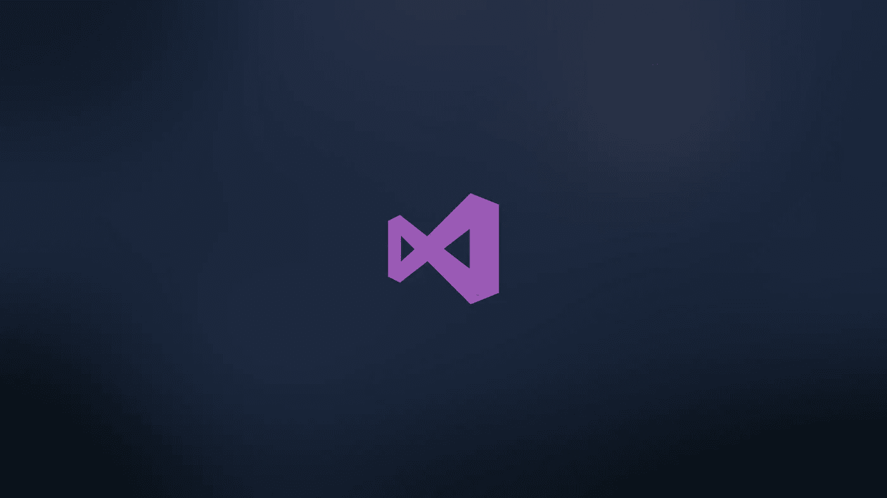
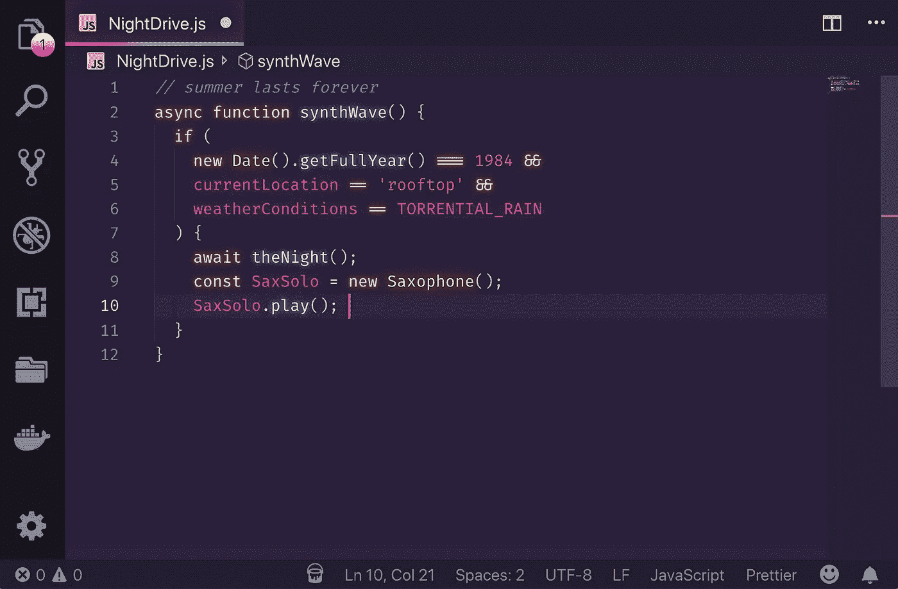
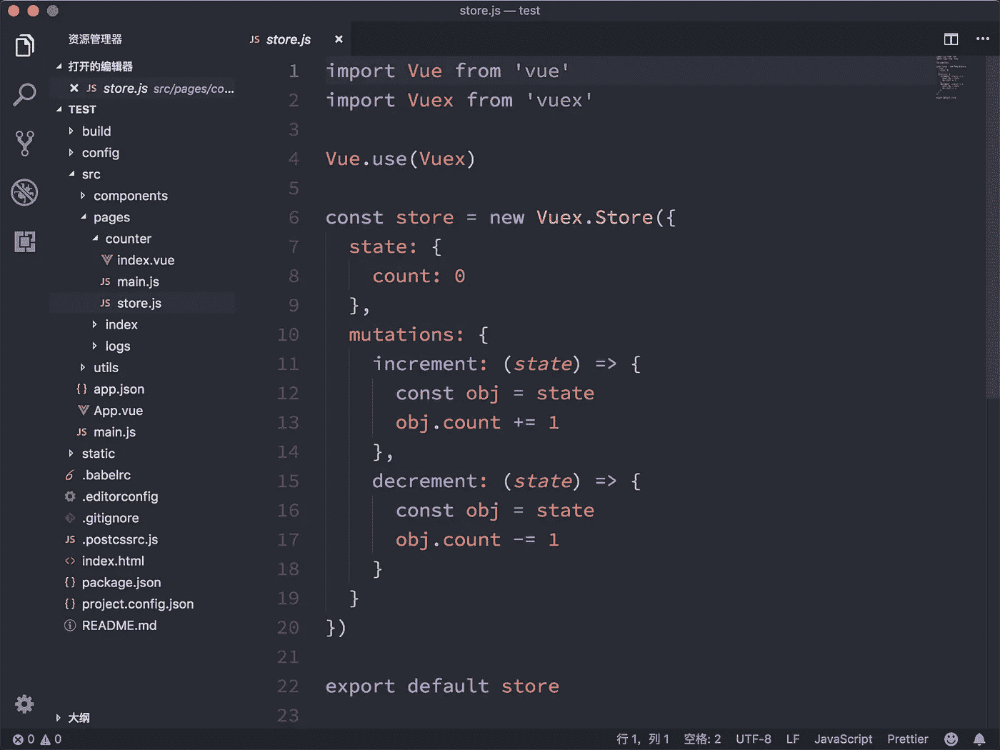
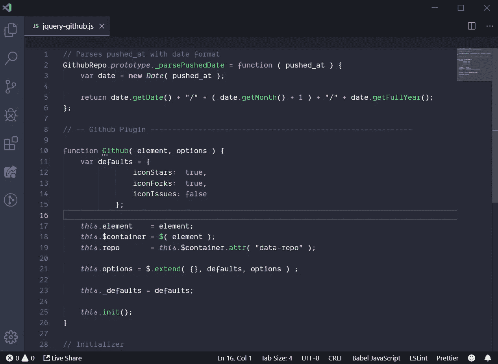
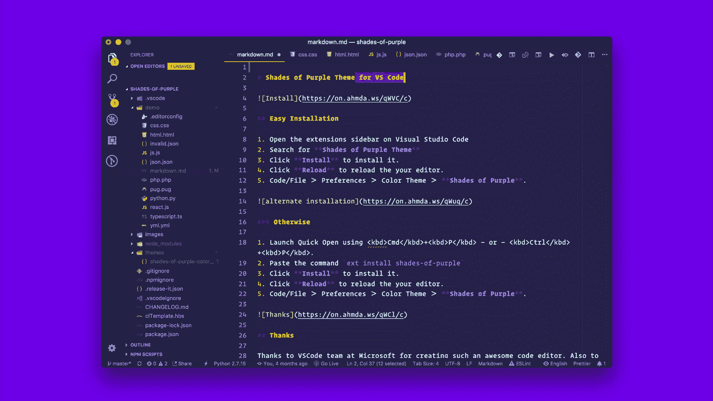
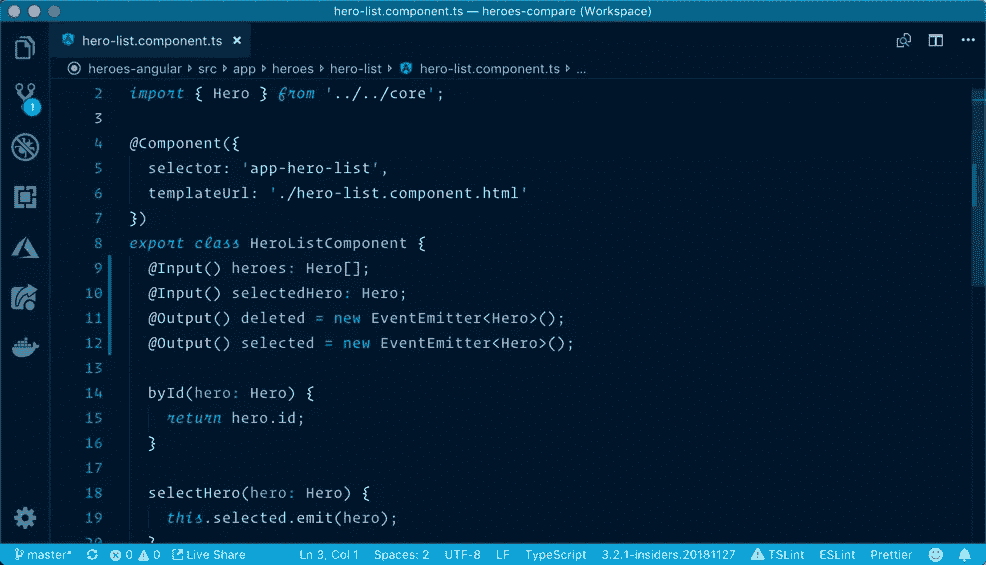
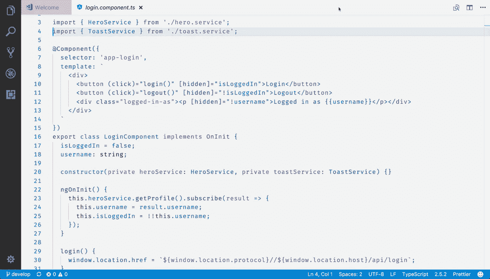
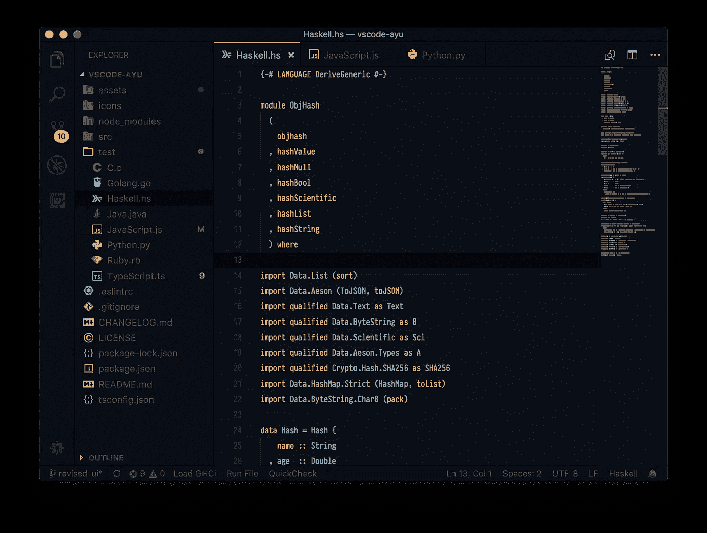
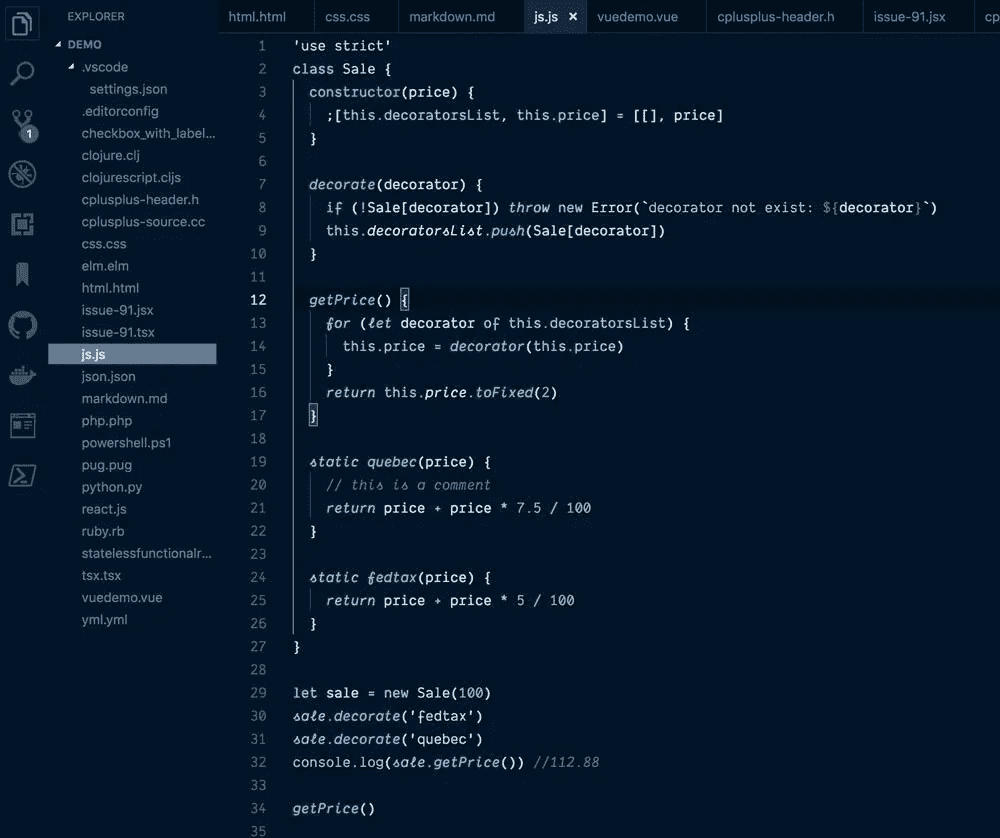

# Visual Studio 代码的 8 个精彩主题

> 原文：<https://betterprogramming.pub/here-are-8-awesome-themes-for-visual-studio-code-1bd173f8b10d>

## 漂亮地编码

Visual Studio 代码壁纸

Visual Studio Code 是微软为 Windows、Linux 和 macOS 开发的代码编辑器。它包括对调试、嵌入式 Git 控件和 GitHub、语法高亮、智能代码完成、代码片段和代码重构的支持

Visual Studio 代码是迄今为止 web、移动和硬件开发人员最流行的代码编辑器之一。VSC 很灵活，你可以按照你喜欢的方式重新安排一切。

您可以安装扩展和主题来改善开发人员的体验和生产力。作为奖励，[这里有一个有用的扩展列表](https://medium.com/better-programming/immensely-upgrade-your-development-environment-with-these-visual-studio-code-extensions-9cd790478530)，你可以从今天开始使用。

事不宜迟，这里有八个很棒的 VSC 主题，你可以从今天开始使用。

[成为媒介会员直接支持我的工作](https://trevorlasn.medium.com/membership)。你也可以在媒体上看到所有的故事。提前感谢！

# 1.84 年合成波

这种配色方案受到了现代 Synthwave 乐队的音乐和封面艺术的影响，如 FM-84、Timecop 1983 和 The Midnight。

这里下载:【https://marketplace.visualstudio.com/items? itemName = rob bowen . synth wave-vs code

# 2.一个黑暗职业

Atom 标志性的黑暗主题，也是 VS 代码中安装最多的[主题之一](https://marketplace.visualstudio.com/search?target=VSCode&category=Themes&sortBy=Installs)。

在这里下载:[https://marketplace.visualstudio.com/items?itemName =庄同发。材料主题](https://marketplace.visualstudio.com/items?itemName=zhuangtongfa.Material-theme)

# 3.德拉库拉

德古拉是 Visual Studio 代码的一个美丽的黑暗主题。还有，德古拉主题有个有趣的起源故事，[看这里](https://draculatheme.com/about)。

在这里下载:[https://marketplace.visualstudio.com/items?itemName =德古拉-主题.主题-德古拉](https://marketplace.visualstudio.com/items?itemName=dracula-theme.theme-dracula)

# 4.紫色的阴影

紫色阴影是一个专业主题，为您的 VS 代码编辑器和终端精心挑选了大胆的紫色阴影。市场上最优秀、下载量最大、评分最高的 VS 代码主题之一。

在这里下载:[https://marketplace.visualstudio.com/items?itemName = Ahmad awais . shades-of-purple](https://marketplace.visualstudio.com/items?itemName=ahmadawais.shades-of-purple)

# 5.冬天来了

这个主题的灵感来自主题 Visual Studio Dark+、Monokai 和[达斯汀·桑德的主题“一个古老的希望”](https://marketplace.visualstudio.com/items?itemName=dustinsanders.an-old-hope-theme-vscode)。受[韦斯博斯](https://twitter.com/wesbos)启发定制 CSS。

黑色主题的蓝色背景受到了[莎拉·德拉斯纳](https://twitter.com/sarah_edo)的[夜猫子主题](https://marketplace.visualstudio.com/items?itemName=sdras.night-owl)的启发。

在这里下载:[https://marketplace.visualstudio.com/items?itemName = John papa . winter iscoming](https://marketplace.visualstudio.com/items?itemName=johnpapa.winteriscoming)

## 冬天来临了

这里下载:[https://marketplace.visualstudio.com/items?itemName = John papa . winter iscoming](https://marketplace.visualstudio.com/items?itemName=johnpapa.winteriscoming)

# 6.阿玉

Ayu 是一个简单的主题，有明亮的颜色，有三种版本——*深色*、*浅色、*和*幻影*，适合全天舒适工作。

在这里下载:[https://marketplace.visualstudio.com/items?itemName=teabyii.ayu](https://marketplace.visualstudio.com/items?itemName=teabyii.ayu)

# 7.夜猫子

夜猫子是为夜猫子设计的 Visual Studio 代码主题。对于我们这些喜欢熬夜编程的人来说，这是很好的选择。

颜色的选择已经考虑到了色盲者和在弱光环境下容易接触到的东西。决定也是基于阅读理解和最佳眼花缭乱的有意义的对比。

在这里下载:[https://marketplace.visualstudio.com/items?夜猫子](https://marketplace.visualstudio.com/items?itemName=sdras.night-owl)

# 8.黑夜

Palenight 是 Visual Studio 代码的一个优雅而有趣的类似素材的主题。

在这里下载:[https://marketplace.visualstudio.com/items?itemName = whizkydee . material-pale night-theme](https://marketplace.visualstudio.com/items?itemName=whizkydee.material-palenight-theme)

# 结论

感谢阅读，我希望你找到了至少一个你喜欢的主题，并能从今天开始使用。编码编辑器不一定很丑，所以根据你的喜好调整它们，让它们变得很棒。

了解我最新内容的最好方式是通过我的[简讯](https://wholesomedev.substack.com/welcome)。成为第一个得到通知的人。

我的[简讯](https://wholesomedev.substack.com/welcome)。成为第一个得到通知的人。