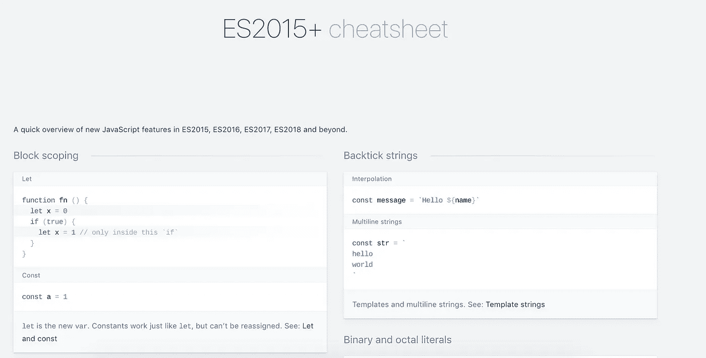
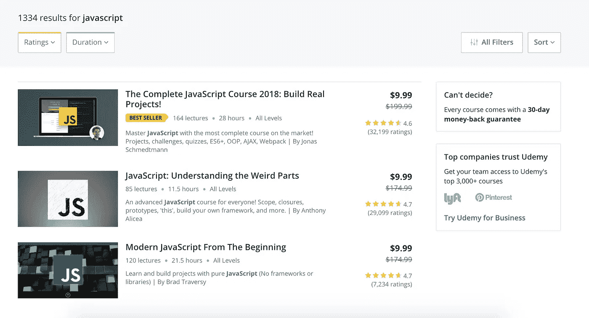
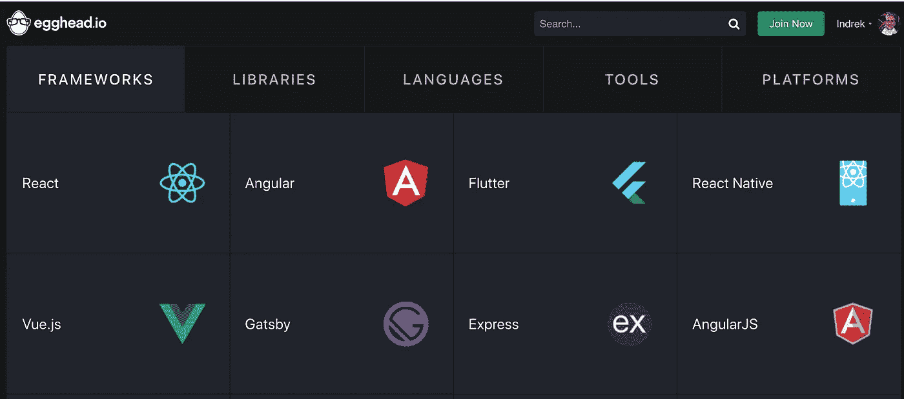
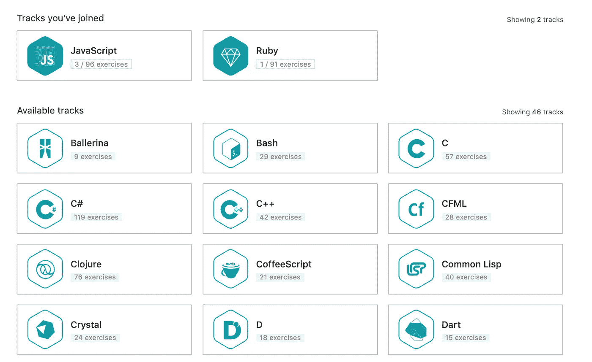
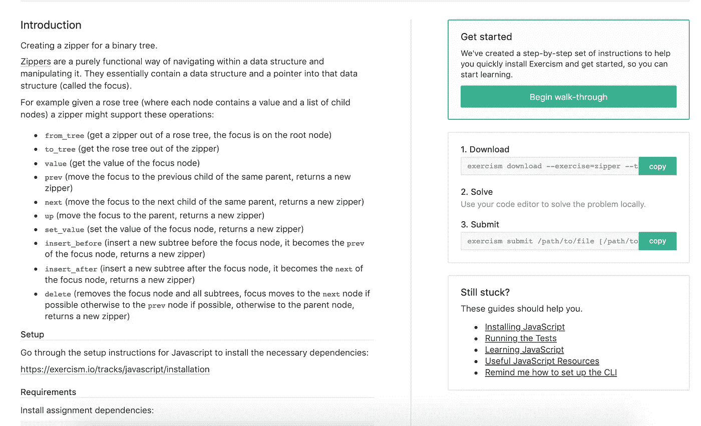
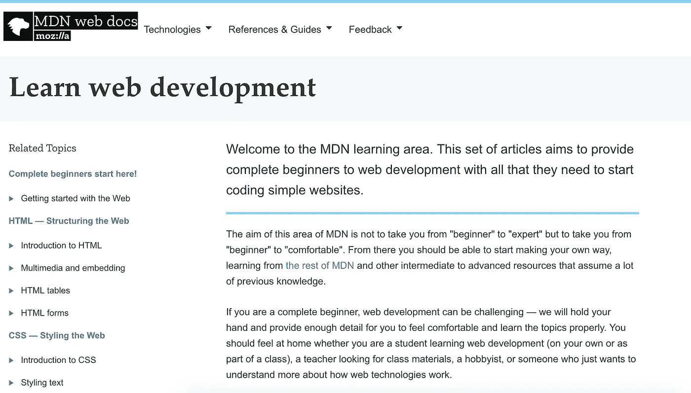
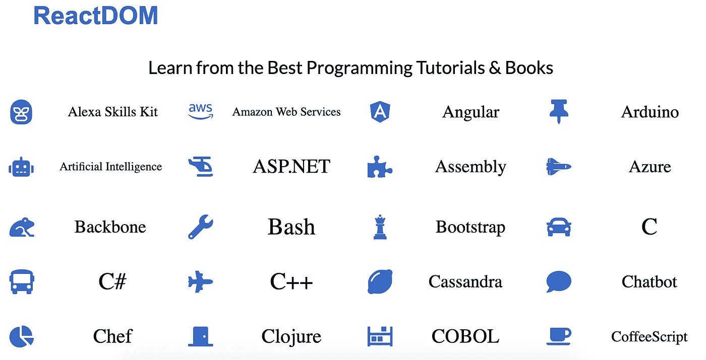
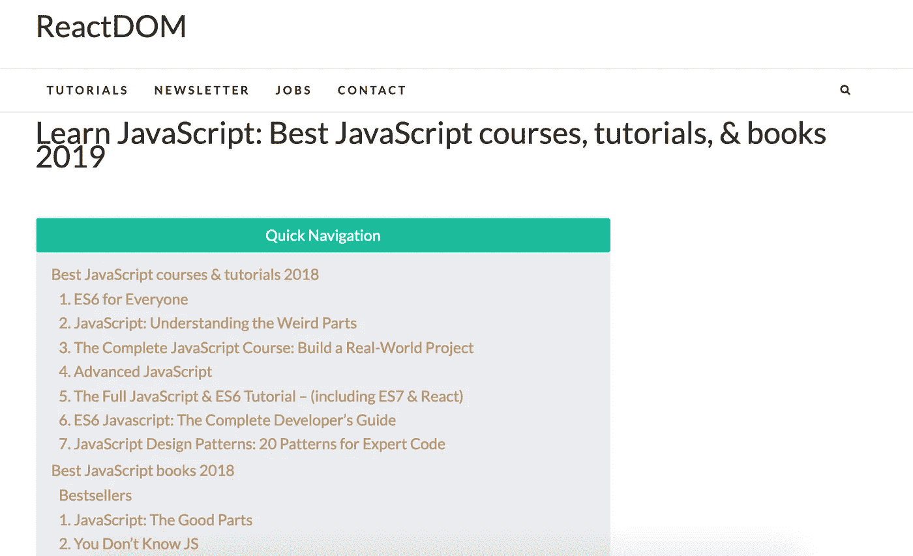
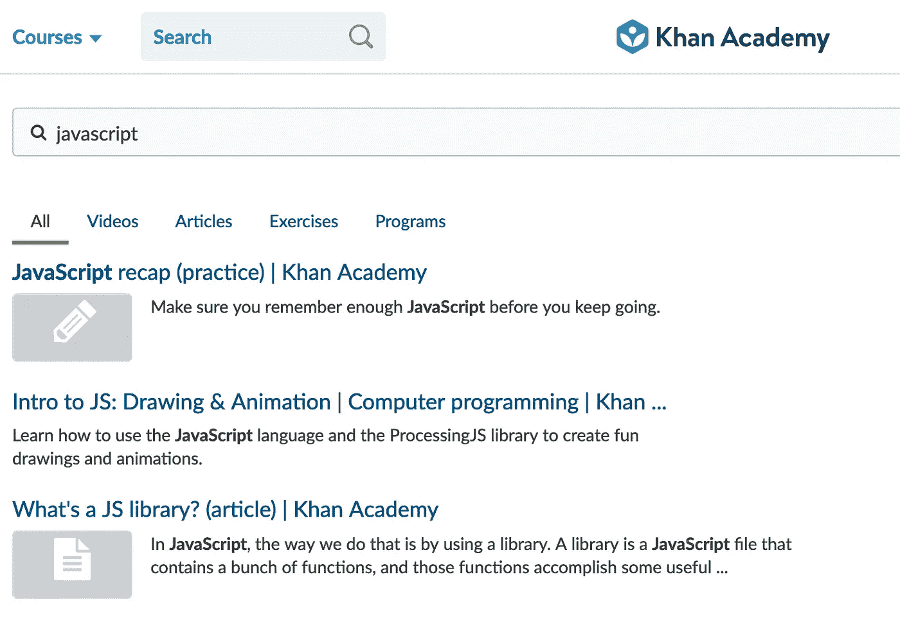
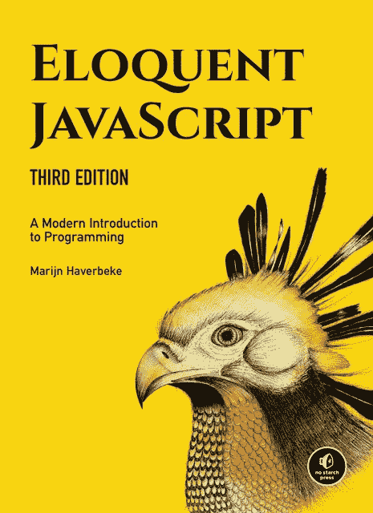

# 这里有一些提高编码技能的最佳资源

> 原文：<https://betterprogramming.pub/here-are-some-of-the-best-resources-to-improve-your-coding-skills-d97aa0e48fdd>

阿什·埃德蒙兹在 [Unsplash](https://unsplash.com?utm_source=medium&utm_medium=referral) 上拍摄的照片

网上有许多高质量的编码教程、书籍和全部资源。我为你收集了其中最好的，并把它们放在一个方便的列表里。事不宜迟，我们开始吧！

# [Devhints](https://devhints.io/)

Devhints 拥有互联网上最大的小抄收藏。这是一个很大的时间节省和熟悉所有概念的好方法。

# [Udemy](https://www.udemy.com/share/100F3uA0oSeF5TQXQ=/?xref=E0ESeFdSRHgJSWUuAAcqP1kSWSRM)

在我看来，Udemy 是迄今为止最受欢迎的学习编码的地方。花 10 美元去学习能带来巨大回报的新技能是显而易见的。

# [书呆子](https://egghead.io/)

[Egghead](https://egghead.io/) 有很多行业领袖做的课程。这绝对是一个顶级的提升，将把你的编码技能提升到一个新的水平。课程既有免费的也有付费的。

# [练习](https://exercism.io)

大多数编程语言都有大量的练习。理解如何处理和解决关键问题是编程中非常有价值的特质。

# [Mozilla 开发者网络(MDN)网络文档](https://developer.mozilla.org/en-US/docs/Learn)

如果你是一个完全的初学者，web 开发可能会很有挑战性。Mozilla 开发者网络提供了一种手把手的方法，提供了足够的细节，让你感觉舒服并正确地学习主题。

无论您是学习 web 开发的学生(自学或作为课堂的一部分)、寻找课程材料的教师、业余爱好者，还是只想更多地了解 web 技术如何工作的人，您都应该有宾至如归的感觉。

# [反应堆](https://reactdom.com/)

[Reactdom](https://reactdom.com/) 提供了一个平台，让你从最好的编程教程&书籍中学习。

# [可汗学院](https://www.khanacademy.org)

[可汗学院](https://www.khanacademy.org/)履行其使命:为任何地方的任何人提供免费的世界级教育。Khan Academy 是一个 501(c)(3)非营利组织，提供各种 web 开发教程。

# [雄辩的 JavaScript](https://eloquentjavascript.net/)

雄辩的 Javascript 是一本关于编程、Javascript 和数字奇迹的书。这里可以免费在线阅读[。](https://eloquentjavascript.net/00_intro.html)

感谢阅读！❤