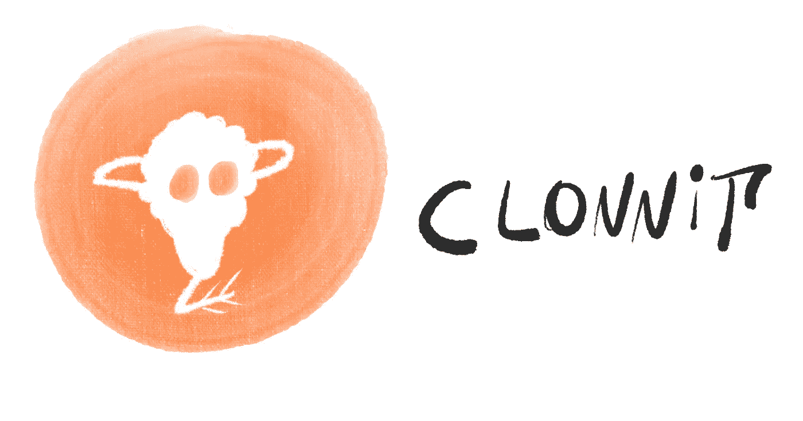
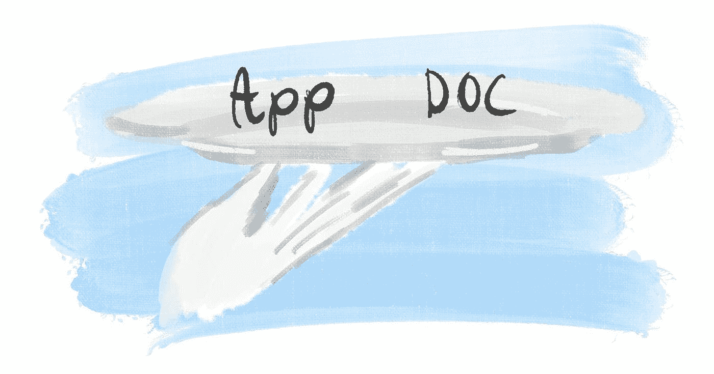
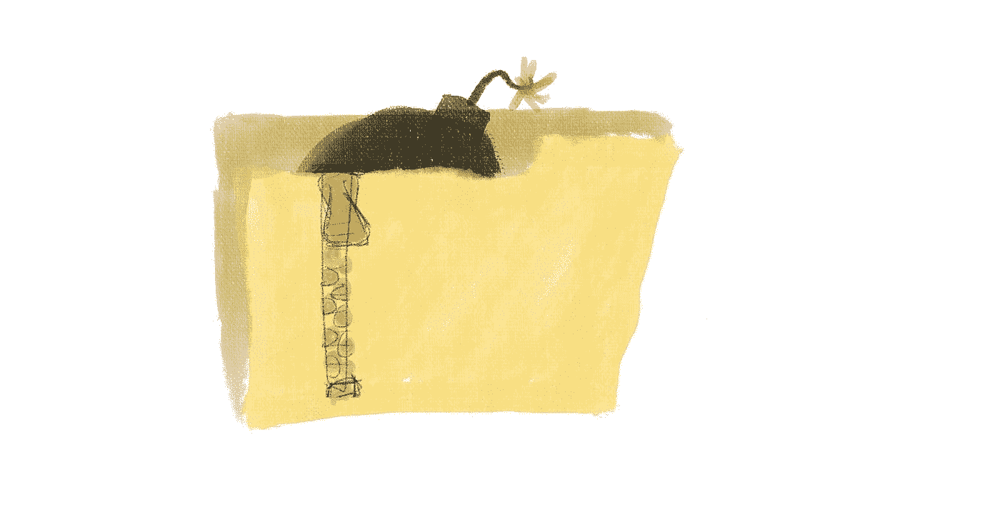
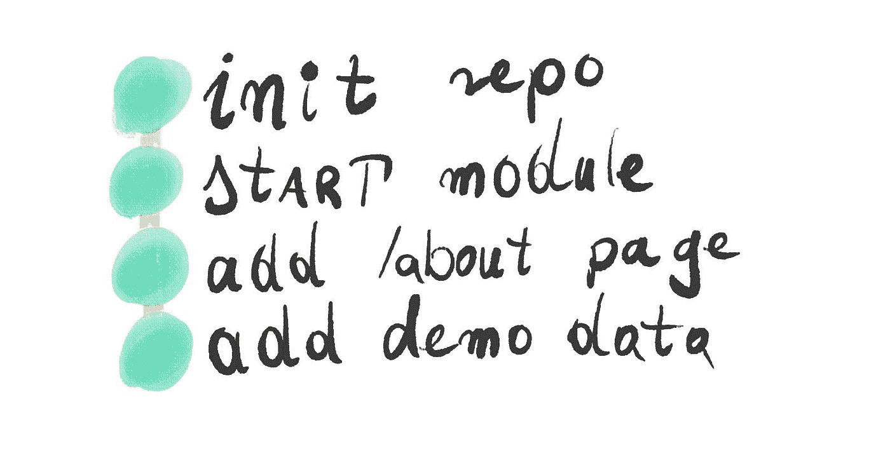

# 这里有一些让你的面试任务给人留下深刻印象的建议

> 原文：<https://betterprogramming.pub/here-are-some-tips-to-make-your-interview-assignment-impressive-6af34442063>

## 快速浏览如何让你的下一个面试任务看起来尽可能的好。

# 坚持你最了解的

在申请工作的同时尝试学习或实践一些新技术，这可能是一石二鸟的诱惑。当然，在某些时候这对我来说很有诱惑力。但是这不是你产生最好代码的方式。最好坚持你最了解的，在不同的项目中学习新的东西。

你知道哪个选项会得到更好的报价。

# 使其易于回顾

确保你交付的东西易于审查。从评审者的角度来看，完美的流程应该是:

*   获取有效链接
*   亲眼看到应用程序按预期工作
*   深入研究代码，看看你是如何做到这些的

在没有看到代码是否工作的情况下审查代码感觉有点没有意义。在看到您的代码按预期运行之前，我不会太在意它的外观。如果不容易看到它工作，我可能永远不会费心给它一个深入的审查。

给他们银盘上的一切

# 传递一些互动的东西

对于前端应用程序，最简单的解决方案是将其部署到您可以使用的免费服务器之一:

# 从不发送 ZIP 文件

发送 ZIP 文件有两个缺点，这两个缺点本身就可能成为交易的破坏者:

*   不方便
*   打开 ZIP 文件有安全风险

可以好玩的开！

# 确保它能工作

它可以在各种浏览器和设备上运行。它不一定要漂亮，但应该是可用的——不管评测者是坐在电脑前，还是在公交车上用手机。

你的任何项目都需要一个`README`，一个面试任务更需要一个。你应该简短地介绍你实现的练习并链接一个可用的应用程序。之后，您可以添加一些高级文档——您使用了什么框架以及如何构建或测试您的代码。

# 展示你的想法

与评审者分享你的思考过程。如果您使用一些模式或最佳实践，那么在文档中明确地引用它们。如果您遇到了一些权衡，请描述它们并解释您为什么选择实现它们的方式。

# 让它发光

如果你想脱颖而出，可以考虑加入以下一些东西。这样做可能会有点超出作业要求的范围，但是这可以表明你知道你每天在工作中要完成的任务。

# 让它引人入胜

向项目中添加几条路线。你可以通过添加额外的页面来吸引评论者的注意力。也许是一个简短的`/about`，这样他们就可以轻松地将*这个*演示应用程序与你的简历匹配起来？

# 单元测试

建立单元测试是展示你是一个注重质量的开发人员的一个很好的例子。您不必以完整的代码测试覆盖为目标:只要几个测试表明您知道它是什么就足够了。

# 设置 lint &更漂亮

许多专业团队使用 linters 和自动化工具来实施他们选择的代码风格。在前端的情况下，这些最有可能是 ESLint & beautiful。如果团队中有任何注重一致性的开发人员，他们肯定会注意到这一点。

# 做出有意义的承诺

Git(或者更一般地说，版本控制)是一个在 it 领域合作项目的重要工具。团队在 Git 存储库上合作，所以好的提交消息是必不可少的。如果你为一个示例项目创造了一个有意义的历史，这是你对公司项目的贡献的一个好迹象。

你呢？你最好的演示项目是什么？

*最初发布于*[*https://how-to . dev*](https://how-to.dev/tips-for-making-your-interview-assignment-impressive)*。*