# 以下是最常见的 JavaScript 算法和数据结构

> 原文：<https://betterprogramming.pub/here-are-the-most-common-javascript-algorithms-and-data-structures-ec3729050169>

## 用这些算法和数据结构提升你的 JavaScript

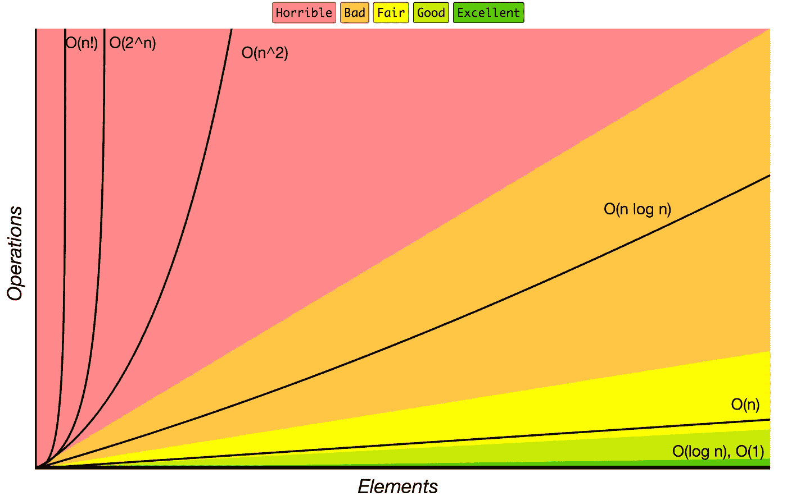

大 O 符号

# 数据结构

数据结构是在计算机中组织和存储数据的一种特殊方式，以便可以有效地访问和修改数据。

更准确地说，数据结构是数据值、数据值之间的关系以及可应用于数据的功能或操作的集合。

这里有一个算法和数据结构的列表，你应该学习来提高你的编码技能。

每种算法和数据结构都有自己单独的`README`以及相关的解释和链接，以供进一步阅读(包括 YouTube 视频)。

JavaScript 算法—[https://github.com/trekhleb/javascript-algorithms](https://github.com/trekhleb/javascript-algorithms)

*感谢*

## [trekhleb/JavaScript-算法](https://medium.com/u/2ef3e91643a1#data-structures)

### [📝用 JavaScript 实现的算法和数据结构，有解释和进一步阅读的链接…](https://medium.com/u/2ef3e91643a1#data-structures)

[github.com](https://medium.com/u/2ef3e91643a1#data-structures)

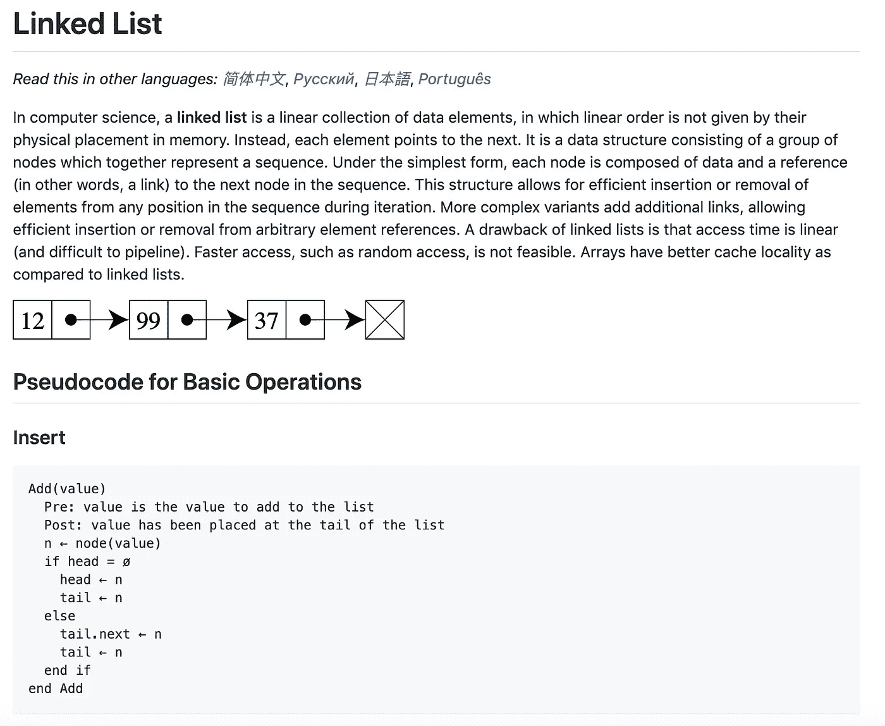

链表—[https://github . com/trek Hleb/JavaScript-algorithms/tree/master/src/data-structures/linked-List](https://github.com/trekhleb/javascript-algorithms/tree/master/src/data-structures/linked-list)

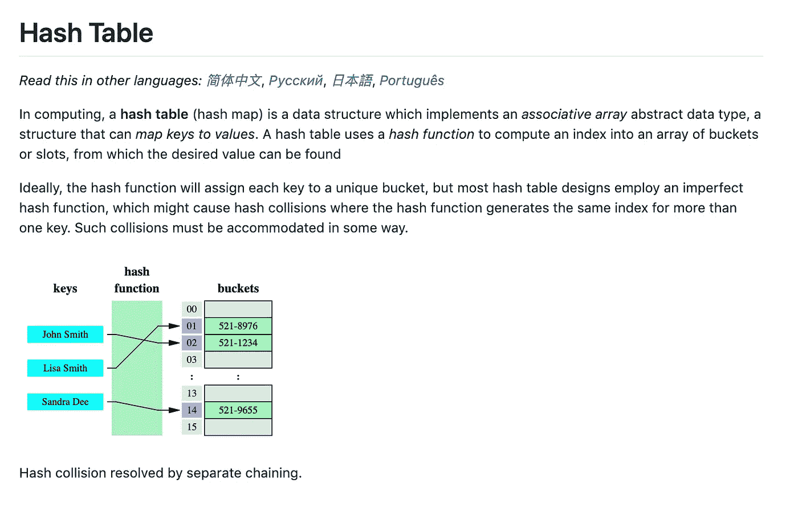

哈希表—[https://github . com/trek Hleb/JavaScript-algorithms/tree/master/src/data-structures/hash-Table](https://github.com/trekhleb/javascript-algorithms/tree/master/src/data-structures/hash-table)

二叉查找树—[https://github . com/trek Hleb/JavaScript-algorithms/tree/master/src/data-structures/tree/binary-search-tree](https://github.com/trekhleb/javascript-algorithms/tree/master/src/data-structures/tree/binary-search-tree)

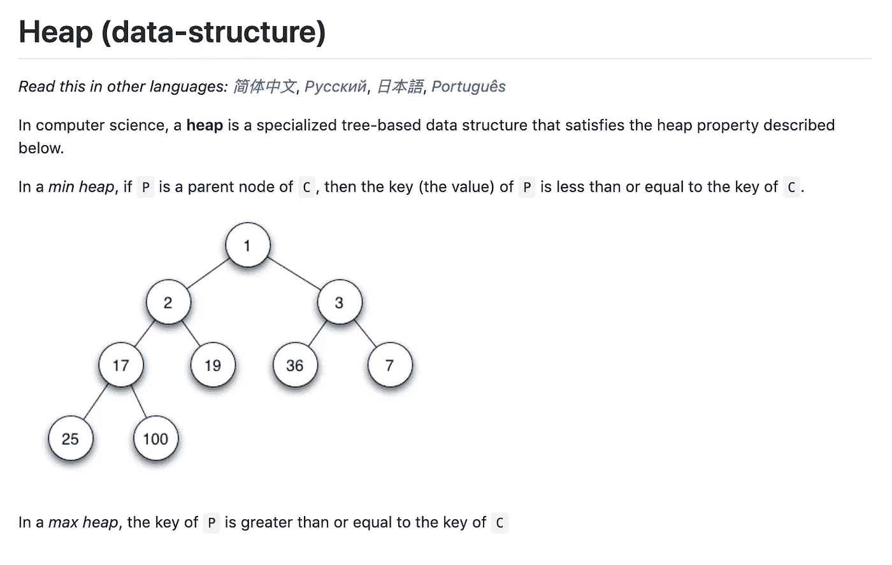

heap—[https://github . com/trek Hleb/JavaScript-algorithms/tree/master/src/data-structures/heap](https://github.com/trekhleb/javascript-algorithms/tree/master/src/data-structures/heap)

## 想要更多吗？查看 Github 存储库中数据结构的完整列表。

 [## trekhleb/JavaScript-算法

### 📝用 JavaScript 实现的算法和数据结构，有解释和进一步阅读的链接…

github.com](https://github.com/trekhleb/javascript-algorithms#data-structures) 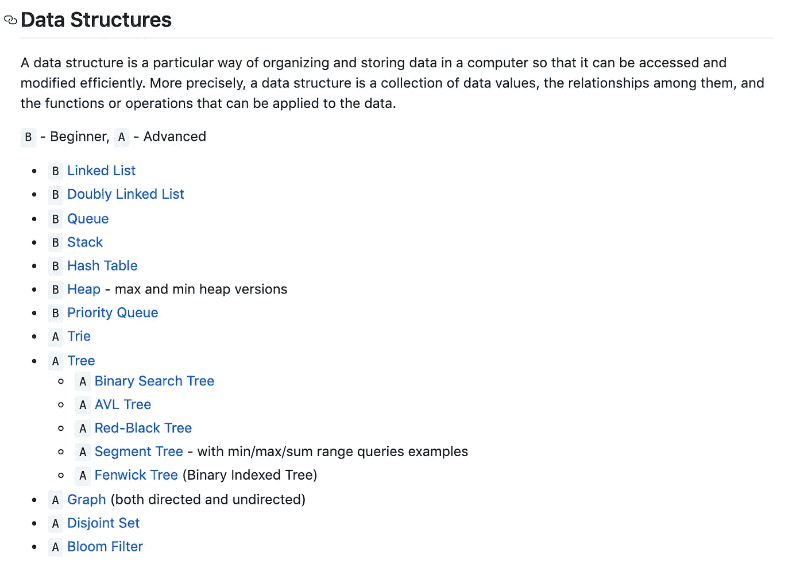

数据结构—[https://github . com/trek Hleb/JavaScript-algorithms #数据结构](https://github.com/trekhleb/javascript-algorithms#data-structures)

# 算法

算法是对如何解决一类问题的明确说明。它是一组精确定义操作顺序的规则。

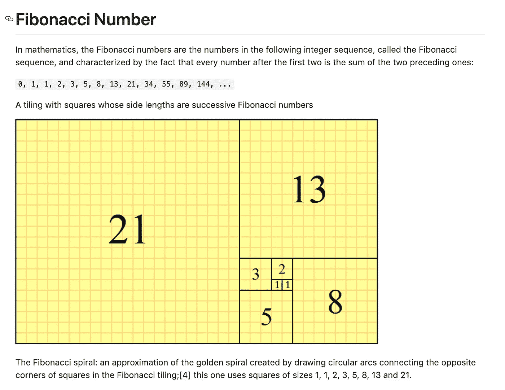

斐波那契数—[https://github . com/trekhleb/JavaScript-algorithms/tree/master/src/algorithms/math/Fibonacci](https://github.com/trekhleb/javascript-algorithms/tree/master/src/algorithms/math/fibonacci)

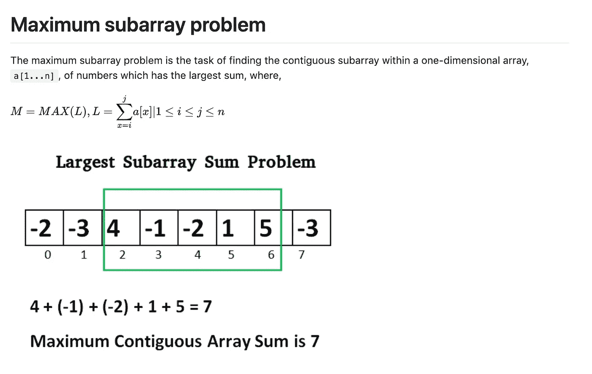

最大子数组问题—[https://github . com/trek Hleb/JavaScript-algorithms/tree/master/src/algorithms/sets/maximum-Subarray](https://github.com/trekhleb/javascript-algorithms/tree/master/src/algorithms/sets/maximum-subarray)

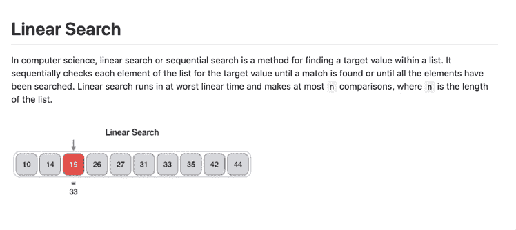

线性搜索[https://github . com/trek Hleb/JavaScript-algorithms/tree/master/src/algorithms/Search/linear-Search](https://github.com/trekhleb/javascript-algorithms/tree/master/src/algorithms/search/linear-search)

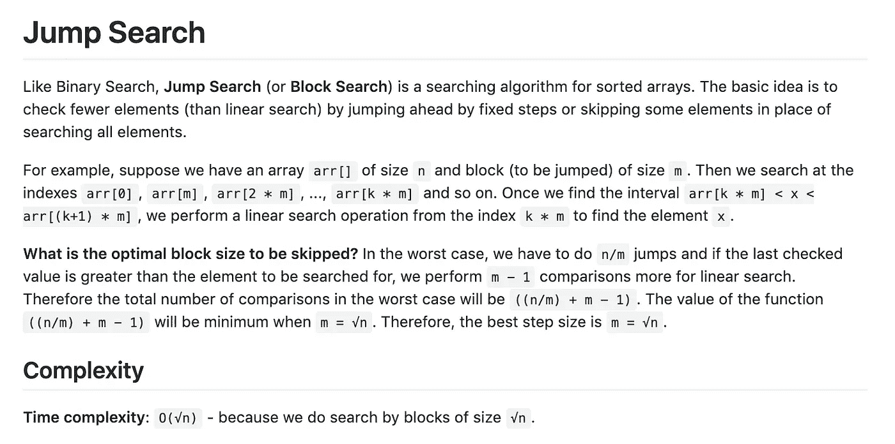

跳转搜索—[https://github . com/trek Hleb/JavaScript-algorithms/tree/master/src/algorithms/Search/jump-Search](https://github.com/trekhleb/javascript-algorithms/tree/master/src/algorithms/search/jump-search)

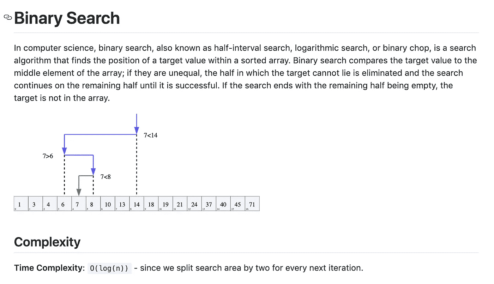

二分搜索法—[https://github . com/trek Hleb/JavaScript-algorithms/tree/master/src/algorithms/search/binary-search](https://github.com/trekhleb/javascript-algorithms/tree/master/src/algorithms/search/binary-search)

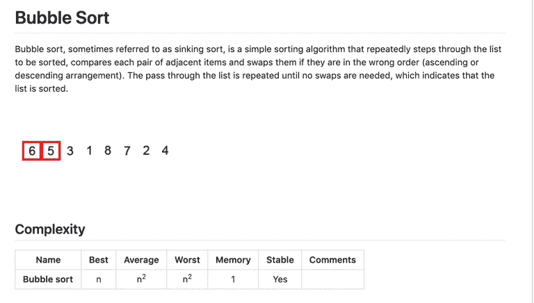

冒泡排序—[https://github . com/trek Hleb/JavaScript-algorithms/tree/master/src/algorithms/sorting/bubble-Sort # bubble-Sort](https://github.com/trekhleb/javascript-algorithms/tree/master/src/algorithms/sorting/bubble-sort#bubble-sort)

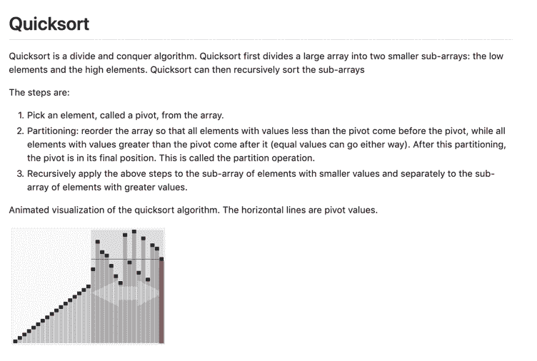

快速排序—[https://github . com/trek Hleb/JavaScript-algorithms/tree/master/src/algorithms/sorting/quick-sort](https://github.com/trekhleb/javascript-algorithms/tree/master/src/algorithms/sorting/quick-sort)

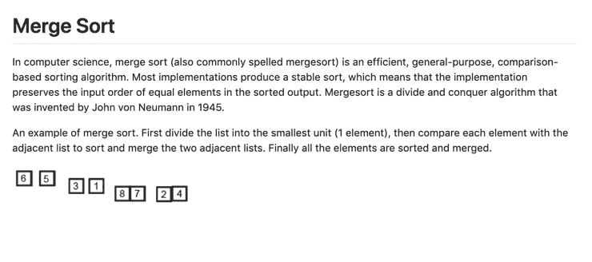

合并排序—[https://github . com/trek Hleb/JavaScript-algorithms/tree/master/src/algorithms/sorting/merge-Sort](https://github.com/trekhleb/javascript-algorithms/tree/master/src/algorithms/sorting/merge-sort)

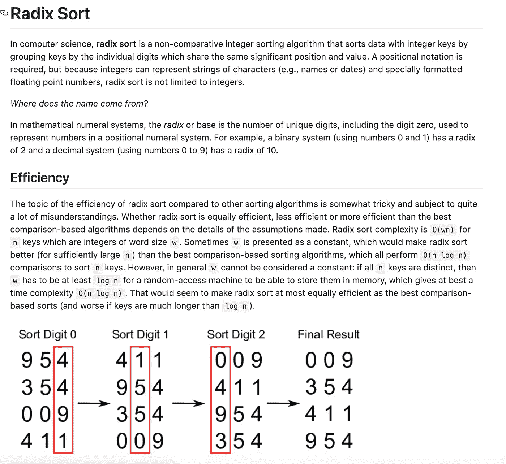

基数排序—[https://github . com/trekhleb/JavaScript-algorithms/tree/master/src/algorithms/sorting/radix-Sort](https://github.com/trekhleb/javascript-algorithms/tree/master/src/algorithms/sorting/radix-sort)

想深入学习算法？我建议从“[算法导论，第三版(麻省理工学院出版社)](https://amzn.to/318lyOZ)”这本书开始。

如果你很想看到算法和数据结构的完整列表，可以看看这个很棒的 [Github 库](https://github.com/trekhleb/javascript-algorithms)。

 [## trekhleb/JavaScript-算法

### 📝用 JavaScript 实现的算法和数据结构，有解释和进一步阅读的链接…

github.com](https://github.com/trekhleb/javascript-algorithms) 

感谢阅读！❤