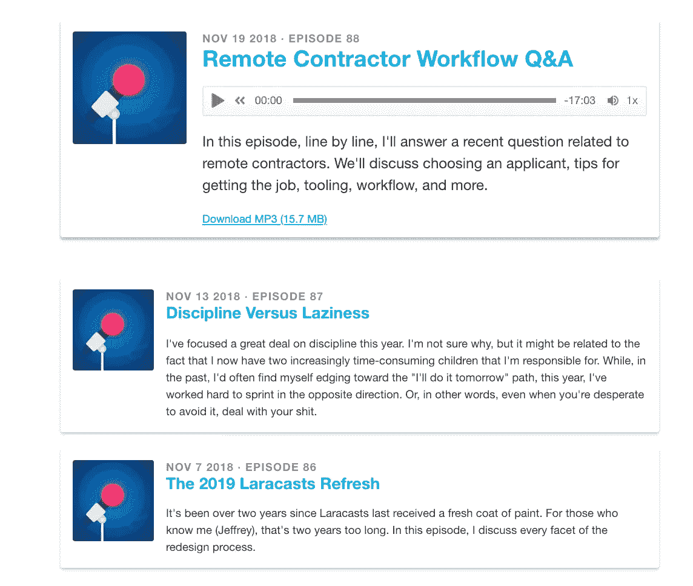
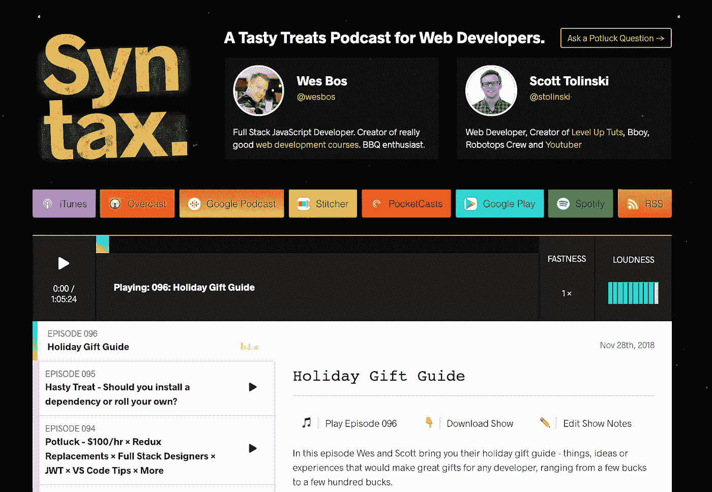
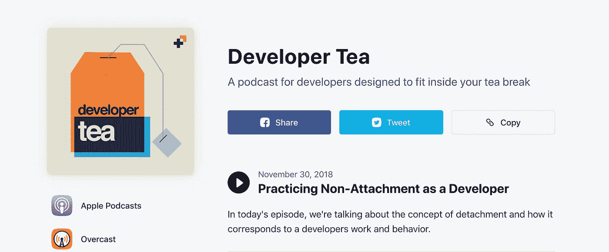
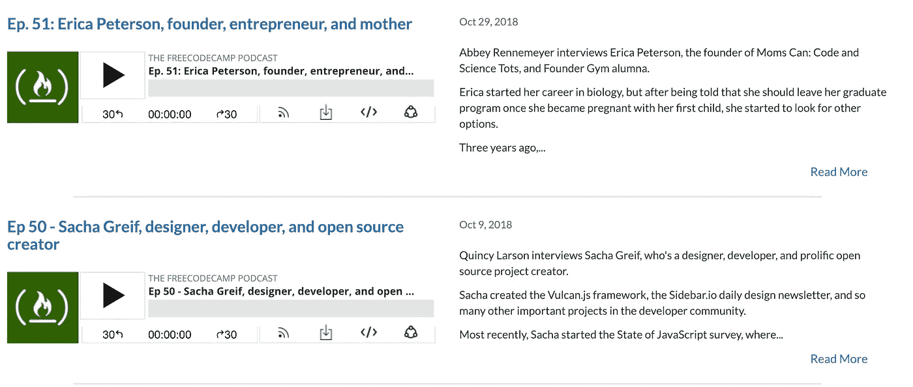
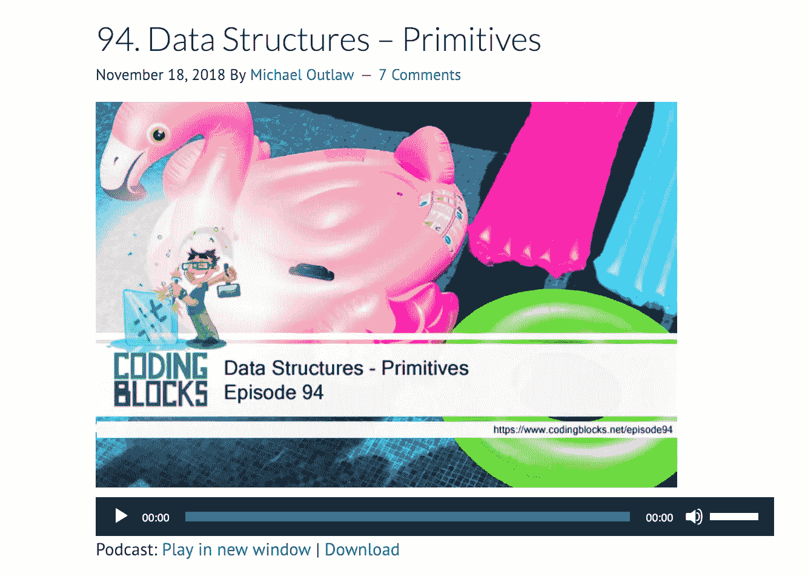
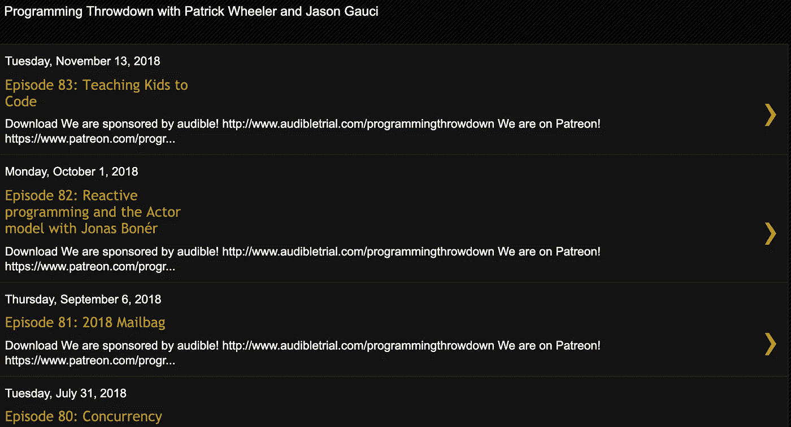
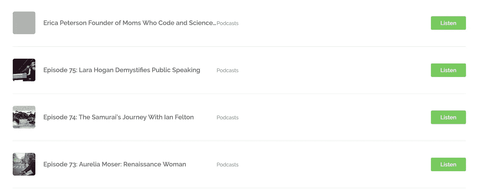
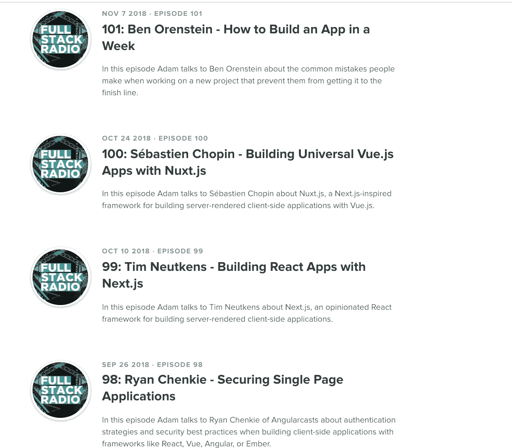

# 以下是最有趣的开发者播客

> 原文：<https://betterprogramming.pub/here-are-the-most-interesting-developer-podcasts-2019-edition-4e43063bf8a4>

马蒂亚斯·瓦格纳在 [Unsplash](https://unsplash.com?utm_source=medium&utm_medium=referral) 上拍摄的照片

谁不爱听同行开发者的意见？坦率地说，我获得的一些最有用的资源来自于倾听不同的观点和想法。我整理了一份我最喜欢的播客的小而全的列表。核心主题围绕编码、幸福、哲学以及如何应对一系列不同的挑战。

我发现自己在洗碗的时候，在飞机上，在开车的时候，或者在通勤的时候都在听播客。我从播客中学到的东西加起来真的很快——有这么多东西要学，时间却这么少——为什么不尝试最大化改进的方法呢？

如果你的不在列表中，请在评论中发布，我会确保检查它！

> “假设你正在听的人可能知道一些你不知道的事情”——乔丹·伯恩特·彼得森

# Laracasts 片段

【https://laracasts.simplecast.fm/ 

> Laracasts 片段，每一集，都提供了一个关于 web 开发某些方面的想法。不多不少。由杰弗里·韦主持。

我真的很喜欢 Jeffrey Way 在保持友好氛围的同时，展示他对网络开发、生活、为人父母、招聘和经营小企业的看法。精彩的播客和精彩的话题——绝对有助于个人成长。

# 句法

[https://syntax.fm/](https://syntax.fm/)

## 面向网络开发者的美味款待播客。

如果你正在寻找如何获得自由职业者的工作，改进你的编码，或者，总的来说，让你的职业生涯更上一层楼——语法就是你的播客。

韦斯·博斯和斯科特·托林斯基都是很棒的老师，表达得非常流利。跟上最新的趋势可能是一件麻烦事。语法帮助我掌握最新的技能。

没有什么比不知道最新潮流更尴尬的了。这对自由职业者来说尤其重要，因为了解最新的工具可以节省大量的时间。

# 显影剂茶

[https://spec.fm/podcasts/developer-tea](https://spec.fm/podcasts/developer-tea)

## 专为开发人员设计的播客，适合您的茶歇时间

> 来自行业专业人士，面向行业专业人士
> 
> 2015 年 1 月，三个人开始了两个独立的播客——设计细节和开发者茶——他们想谈论他们每天所做的工作。在网络社区获得了惊人的反响后，我们合作创建了 Spec 网络，帮助设计人员和开发人员学习、寻找优秀的资源并相互联系。

# freeCodeCamp 播客

[https://freecodecamp.libsyn.com/](https://freecodecamp.libsyn.com/)

> freeCodeCamp 开源社区的官方播客。通过免费的在线课程、编程项目和开发人员工作的面试准备来学习编码。

从如何找到第一份工作，到如何协商薪水，freeCodeCamp 都支持你，还有更多！

# 编码块

https://www.codingblocks.net/category/podcast/

> 我们是几个多年的职业程序员。作为播客的忠实听众和许多代码相关产品的消费者，我们对 listenable 格式中缺乏高质量的节目(pun)感到沮丧。鉴于我们多年的经验和现实世界解决问题的技能，我们认为进入播客的世界并“回馈”一次机会可能是值得的。

# 编程中断

【https://www.programmingthrowdown.com/?m=0 

从教孩子编码到并发性，帕特里克·惠勒和杰森·高西为你讲述。Programming Throwdown 推荐了最好的开发工具、书籍和编码模式。它们从 2010 年开始上市，是一种很好的整体聆听体验。

# 远离键盘

[http://awayfromthekeyboard.com/episodes/](http://awayfromthekeyboard.com/episodes/)

> 远离键盘是一个播客，与技术专家交谈，讲述他们的故事。关于他们如何开始、如何成长、如何学习以及如何放松的故事。它由塞西尔·菲利普和里奇·鲁普主持，新的剧集每周二发布。

# 全栈无线电

[http://www.fullstackradio.com/](http://www.fullstackradio.com/)

> 一个面向对构建优秀软件产品感兴趣的开发者的播客。每一集，Adam Wathan 都有一位嘉宾加入，谈论从产品设计和用户体验到单元测试和系统管理的一切。

这应该会给你一个很好的话题范围来听！

如果你打算推出自己的播客，或者总体上想了解更多关于技术播客的知识，那么从阅读“[傻瓜播客](https://amzn.to/2SUtrEY)”这本书开始吧。

保持敬畏，感谢阅读！❤

这里有一些你可能也会喜欢的文章:

 [## 作为一名新开发人员，以下是您需要了解的内容

### 如果你已经开始学习编程，并决定认真对待——或者你刚从学校毕业，没有工作…

medium.freecodecamp.org](https://medium.freecodecamp.org/survival-guide-for-new-developers-12d9b048bf06)  [## 增强 Node.js 的调试体验

### 你看到这个，你会怎么做？

medium.com](https://medium.com/cleversonder/supercharge-your-debugging-experience-for-node-js-3f0ddfaffbb2)  [## ✨用这些 Visual Studio 代码扩展极大地升级了你的开发环境

### 先说代码——Visual Studio 代码。

medium.freecodecamp.org](https://medium.freecodecamp.org/immensely-upgrade-your-development-environment-with-these-visual-studio-code-extensions-9cd790478530)  [## 如何用 Nodejs、GraphQL、MongoDB、哈比神和 Swagger 建立一个强大的 API

### 将前端和后端分开有很多好处:

medium.freecodecamp.org](https://medium.freecodecamp.org/how-to-setup-a-powerful-api-with-nodejs-graphql-mongodb-hapi-and-swagger-e251ac189649)