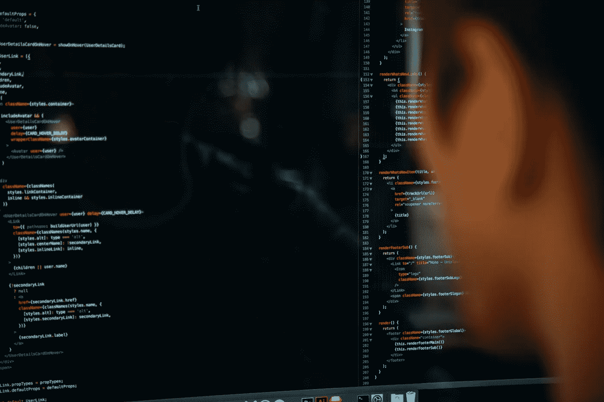

# 优秀程序员的三大美德

> 原文：<https://betterprogramming.pub/here-are-the-three-virtues-of-good-programmers-e561e061ea19>

## 只是不要从字面上理解它们

查尔斯在 [Unsplash](https://unsplash.com/s/photos/programmers?utm_source=unsplash&utm_medium=referral&utm_content=creditCopyText) 上的照片

很久以前，Perl 的创造者拉里·沃尔半开玩笑地命名了程序员的三种美德:****懒惰**和**狂妄**。**

**在你试图学习最新的编程语言和流行的框架来提高你的技能之前，看看这三个“优点”,并尝试将它们融入到你的日常工作中。**

**只是不要从字面上理解它们！**

# **美德 1:懒惰**

**很明显，计算机科学是唯一一个“懒惰”是一个技术术语的领域。**

**程序员有很多工作要做。从逻辑上来说，处理一大堆工作任务的最好方法是去掉那些你并不真正需要做的事情。**

**接下来，试着摆脱任何重复性的任务。如果有什么是我们讨厌的，那就是例行公事。如果可能的话，我们不想重复同样的击键，可以写一个脚本来完成。**

**为什么？因为我们很懒——这是一件好事。懒惰是我们渴望效率的结果。**

**在某些情况下，这可能是一种文化上的误解。有时程序员被评判是因为我们生产了多少代码。对于非技术背景的经理来说，一个非常努力工作以产生大量代码的程序员可能会被视为办公室里最努力的员工。**

**但是一个聪明的程序员知道生产大量代码可能意味着你效率低下。最好是想出一个聪明、省力的解决方案，而不是另起炉灶或过度设计。为什么要花几个小时写你不需要的代码？**

# **美德 2:不耐烦**

**当你遇到交通堵塞时，急躁没有用，但在编程中却很有用。**

**这就是我们构建更快的编译器、浏览器和操作系统的原因。我们希望所有的东西都能快速加载，高效运行，并且界面能够快速响应。一个好的程序员不能容忍缓慢的系统——我们的不耐烦不允许这样！**

**对于程序员来说，没有什么比显著提高性能更令人满意的了。我曾经将一个数据管道的吞吐量提高了 10 倍，在采访中，我仍然把它作为我在那个职位上最美好的时刻。**

**有一些关于节省时间的事情让程序员们兴奋不已！**

# **美德 3:傲慢**

**你是否曾经在试图弄清楚如何用编程语言做一些事情时感到沮丧，并对自己说，“我可以写一种比这更好的语言”？这正是孕育了每一种编程语言的思维过程。**

**抛弃整个编程语言并从头开始编写一种新语言的想法是富有创造性的**狂妄**激励程序员创造新的解决方案。**

**这也是一个想法，我们不仅可以修复一个广泛使用的开源软件，而且实际上*可以编写一个更好的替代品*。如果没有这种冲动，我们将永远被困在旧的专有语言和框架中。开源社区受到良性傲慢的推动。**

# **结论**

**希望你现在对拉里·沃尔的美德有了更好的理解。**

**这些美德实际上是渴望有效工作的不同方面。高效通常意味着**知道什么是正确的工作**，而不仅仅是接受低效或有缺陷的工作方式。**

**我不建议将懒惰、急躁或傲慢融入到你日常生活的每一个方面——比如打扫房间或洗碗——但这是编写更好程序的良好动力！**