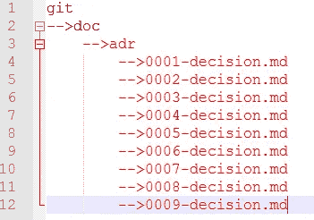
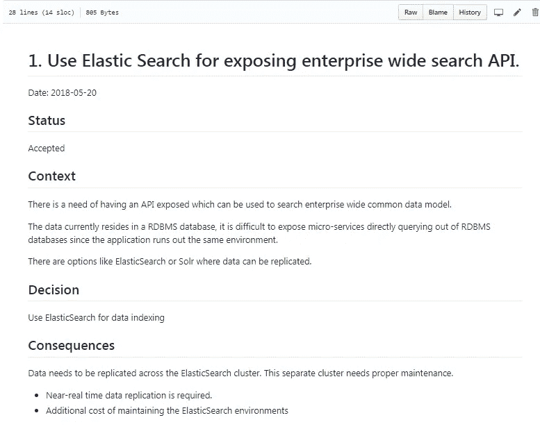

# 一个简单但强大的工具，记录您的架构决策

> 原文：<https://betterprogramming.pub/here-is-a-simple-yet-powerful-tool-to-record-your-architectural-decisions-5fb31367a7da>


布鲁克·卡吉尔在 [Unsplash](https://unsplash.com/search/photos/decision?utm_source=unsplash&utm_medium=referral&utm_content=creditCopyText) 上的照片

从我接手技术架构师的角色开始，我就一直想知道为什么要做出某些决定，而不是其他选择。

[Visio](https://support.office.com/en-us/article/a-beginner-s-guide-to-visio-bc1605de-d9f3-4c3a-970c-19876386047c) 图表很棒，但它们只是图片。他们不会告诉你为什么某些箭头朝某个方向而不是相反的方向。

# 思想工作技术雷达

在试图解决这一困境时，我遇到了最新的 [ThoughtWorks 技术雷达](https://www.thoughtworks.com/radar#)的[版本](https://assets.thoughtworks.com/assets/technology-radar-vol-18-en.pdf)。

> “我们是一家软件公司，是一个由充满激情、目标明确的个人组成的社区。我们以颠覆性的方式提供技术来解决客户最棘手的挑战，同时寻求革新 IT 行业并创造积极的社会变革。”— *ThoughtWorks*

在技术雷达中，ThoughtWorks 发布了关于您应该使用什么、应该继续做什么以及可以尝试什么的新闻。

ThoughtWorks 谈到了各种:

1.  [技巧](https://www.thoughtworks.com/radar/techniques)
2.  [平台](https://www.thoughtworks.com/radar/platforms)
3.  [工具](https://www.thoughtworks.com/radar/tools)
4.  [语言&框架](https://www.thoughtworks.com/radar/languages-and-frameworks)

在阅读技术部分时，我注意到 ThoughtWorks 推荐采用[轻量级架构决策记录(LADR)](https://www.thoughtworks.com/radar/techniques/lightweight-architecture-decision-records) 。

我不知道 LADR，所以我开始研究。

# LADR 历史

在研究 LADR 的时候，我看到了一篇非常有趣的文章，作者是迈克尔·尼加德。这篇文章谈到了将架构文档作为代码本身的一部分嵌入的技术。

从文章中引用:

> 敏捷项目的架构需要不同的描述和定义。不是所有的决策都会立刻做出，也不是所有的决策都会在项目开始时就完成。迈克尔·尼加德

这是真的。[敏捷](https://www.atlassian.com/agile)被广泛使用，需要一个定义好的过程来捕捉所有的架构决策。通常，我们最终会创建大量没有人喜欢阅读的文档。

随着阅读的深入，我发现了一种更好的方法来记录你的决定。

# Git 友好

ADR 可以记录在源代码库中。您可以简单地创建 ADR 作为 Git 存储库的一部分。

例如，您可以创建此文件夹:

```
/doc/adr/
```

并向其中添加决策，如下图所示。



GIT 回购中的 ADR

# ADR 的内容

ADR 的内容可分为以下几个部分:

1.  **标题** —决策记录的标题。
2.  **决定—** 做出的决定。例如，使用 [Elasticsearch](https://www.elastic.co/) 作为企业范围的搜索 API。
3.  **状态—** 状态可以是*建议*、*接受*或*替代*。如果您做出了任何决定，并且您需要在以后更改它们，您可以简单地添加一个具有已更改状态的新记录。
4.  **背景** —这个决策的背景是什么？重要的是要抓住这个决定的全部背景，以便读者知道其背后的原因。
5.  **后果—** 在这一部分，你可以添加如果做出这个决定会发生什么。重要的是列出所有的后果，包括积极的和消极的。

整个文件需要一到两页，不要超过一页。这里的想法是保持光线，这样人们可以阅读它。

开发人员需要一直看到 ADR，因为他们应该知道他们为什么要构建一些东西。

# ADR 样本

这里有一份[ADR](https://github.com/deshpandetanmay/lightweight-architecture-decision-records/blob/master/doc/adr/0001-use-elasticsearch-for-search-api.md)样本，您可以参考使用。



GitHub 有[更多 ADRs](https://github.com/npryce/adr-tools/tree/master/doc/adr) 的例子供你参考。

## ADR 模板

这不是您可以使用的唯一 ADR 模板。许多团队都在使用他们自己的模板。你可以在 GitHub 上找到其他的 ADR 模板集合。

[](https://github.com/joelparkerhenderson/architecture_decision_record) [## joelparkerhenderson/建筑 _ 决策 _ 记录

### 软件规划、IT 领导和模板文档的架构决策记录(ADR)示例…

github.com](https://github.com/joelparkerhenderson/architecture_decision_record) 

# 结论

随着我们越来越倾向于基于敏捷的开发，我们需要采用这样的技术，这样我们在架构文档中也更加高效和敏捷。

感谢阅读！如果您有关于记录架构决策的建议，请留下评论。

# 附加阅读

*   [https://engineering . atspotify . com/when-should-I-write-an-architecture-decision-record/](https://engineering.atspotify.com/when-should-i-write-an-architecture-decision-record/)