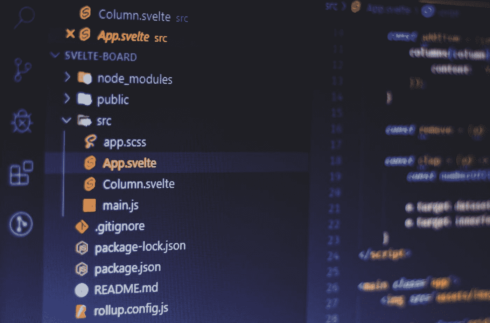
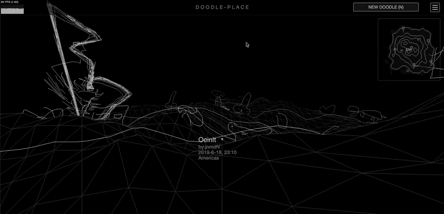
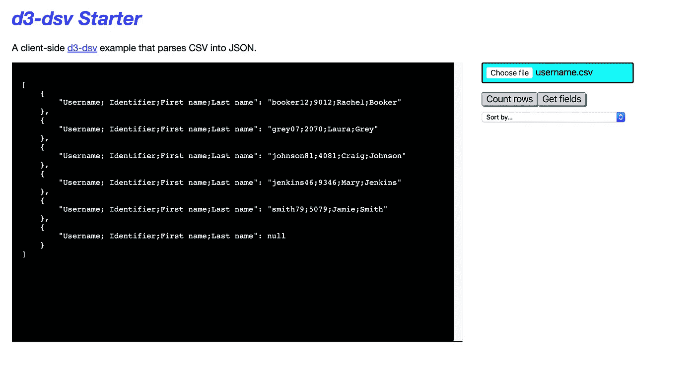
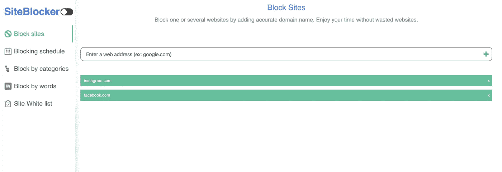
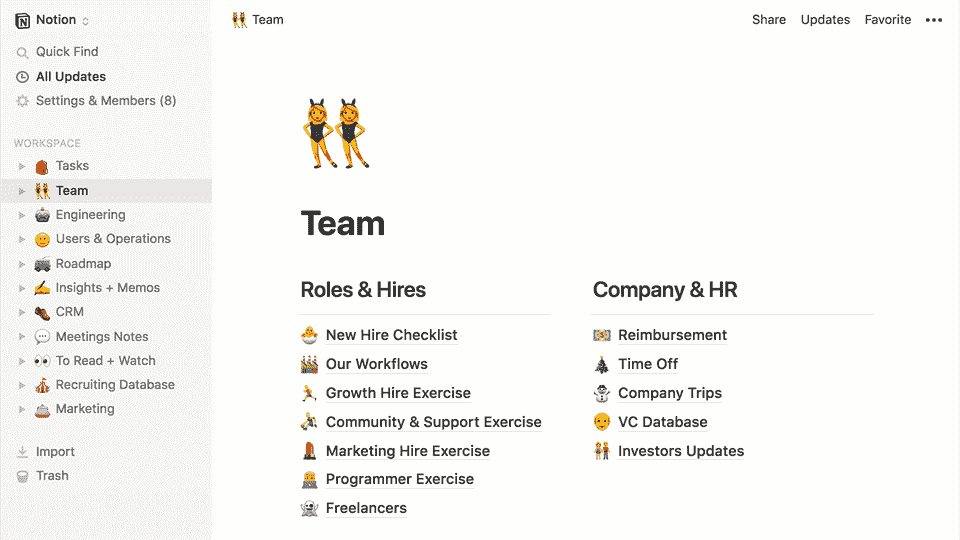
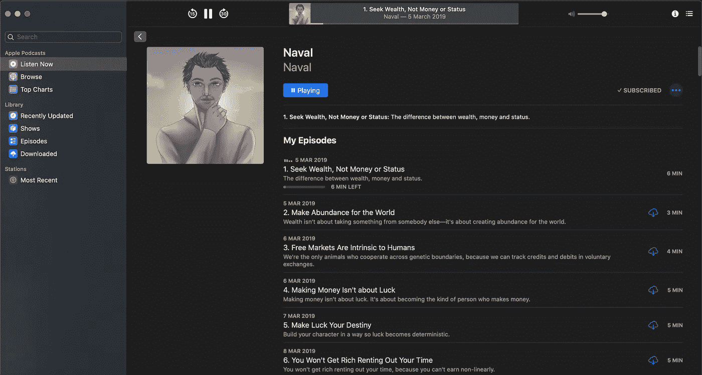

# 一堆很棒的项目想法，你今天就可以开始编码

> 原文：<https://betterprogramming.pub/heres-a-bunch-of-awesome-project-ideasyou-can-start-coding-today-6b5bd98c619f>

## 用这些新鲜而有创意的应用程序想法来练习你的编码技能

照片由[费伦茨·阿尔马西](https://unsplash.com/@flowforfrank?utm_source=medium&utm_medium=referral)在 [Unsplash](https://unsplash.com?utm_source=medium&utm_medium=referral) 拍摄

要获得优秀的编码技能，必须付出努力和时间。为什么不今天就开始呢？从下面的列表中选择一个你觉得有趣的想法，然后开始努力。

事不宜迟，这里有一个创造性的有趣的编码挑战列表，你可以从今天开始编码。

# 涂鸦地点克隆

doodle-place 是一个由动画涂鸦居住的网络世界。你可以四处逛逛，看看世界各地的用户创作的涂鸦，或者贡献你自己的涂鸦。

网址:[https://doodle-place.glitch.me/](https://doodle-place.glitch.me/)

## 你将从构建涂鸦克隆中学到什么

*   如何使用 [JavaScript Canvas API](https://developer.mozilla.org/en-US/docs/Web/API/Canvas_API) 在屏幕上绘制图形，比如涂鸦
*   如何使用 2D 图形和 [WebGL API](https://developer.mozilla.org/en-US/docs/Web/WebGL)
*   处理用户输入，例如绘制涂鸦并将结果保存在数据库中

# 将 CSV 文件解析成 JSON

这个应用程序使用`[d3-dsv](https://github.com/d3/d3-dsv)`(客户端)解析 CSV 文件。`d3-dsv`是一个实用函数，作为 [d3](https://d3js.org/) (一个流行的数据可视化库)的助手，但也可以单独使用，如此处所示。

网址:[https://starter-d3-dsv.glitch.me/](https://starter-d3-dsv.glitch.me/)

## 通过构建 CSV-into-JSON 解析器，您将学到什么

*   如何使用不同的数据源，比如 CSV 和 JSON，以及如何解析每组数据
*   亲身体验`[d3-dsv](https://github.com/d3/d3-dsv)`图书馆。这里是`[d3-dsv](https://github.com/d3/d3-dsv)` [文档](https://github.com/d3/d3-dsv)。

# 阻止站点浏览器扩展克隆

[网站拦截器](https://chrome.google.com/webstore/detail/site-blocker/oohkinmgbkhgcobnipoijafcjgfcogpk?hl=en)是一个网页扩展，允许你通过添加一个准确的域名来拦截一个或多个网站。享受没有干扰的额外时间。

来源:[https://chrome . Google . com/web store/detail/site-blocker/oohkimgbkhgcobnipoijafcjgfcogpk？hl=en](https://chrome.google.com/webstore/detail/site-blocker/oohkinmgbkhgcobnipoijafcjgfcogpk?hl=en)

## 您将从构建站点拦截器克隆中学到什么

*   所有关于如何建立[浏览器扩展](https://developer.mozilla.org/en-US/docs/Mozilla/Add-ons/WebExtensions)
*   用于构建浏览器扩展的 JavaScript、HTML 和 CSS
*   Chrome/Firefox/Safari 浏览器市场如何运作

# 概念克隆

概念是一个轻便、快速、不受干扰的软件，可以用来记笔记等等。我用它来记录我的任务和想法。我喜欢的是对编辑器的降价支持。

没有任何限制；你可以构建桌面版本的概念，以及移动或网络。挑一个你最喜欢的环境或者你最想学习的环境。

观念:[https://www.notion.so/product](https://www.notion.so/product)

## 通过构建概念克隆，您将学到什么

*   如果你想更进一步，使用 [CSS 网格](https://developer.mozilla.org/en-US/docs/Web/CSS/grid)。CSS grid 非常擅长创建布局。
*   使用数据库。你需要将笔记存储在数据库中，以便以后再次获取。
*   DevOps。完成后，将应用程序部署到 web 或应用程序商店。向世界展示你的成就。

# 苹果播客克隆

用于 iOS 和 macOS 的[播客应用](https://itunes.apple.com/us/app/podcasts/id525463029?mt=8)使用应用底部的导航图标，可以轻松访问流行和特色播客。

应用商店:[https://apps.apple.com/us/app/apple-podcasts/id525463029](https://apps.apple.com/us/app/apple-podcasts/id525463029)

## 你将从构建苹果播客克隆中学到什么

*   如何从 API 获取数据？数据是这个应用程序的播客。[使用此 API 获取所有播客](https://www.listennotes.com/api/)。
*   如何构建 mac OS 桌面或 iOS 应用并部署到应用商店。如果你喜欢为网络而建，那也很好！
*   本机布局如何工作，例如，如何在屏幕上呈现内容。

# 包扎

感谢阅读，我希望你至少找到了一个有用的应用程序来编码。编码快乐！

寻找更多的编码想法？永远不要耗尽编码的想法，永远不要。 [**被我弄到这里来挑战一堆前端。**](https://gumroad.com/l/IuqKc)

了解我最新内容的最好方式是通过我的[简讯](https://wholesomedev.substack.com/welcome)。成为第一个得到通知的人。

我的[简讯](https://wholesomedev.substack.com/welcome)。成为第一个得到通知的人。