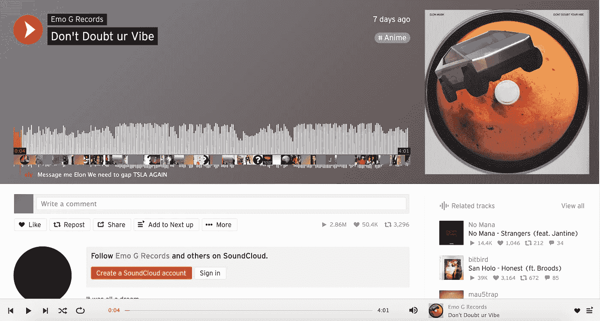
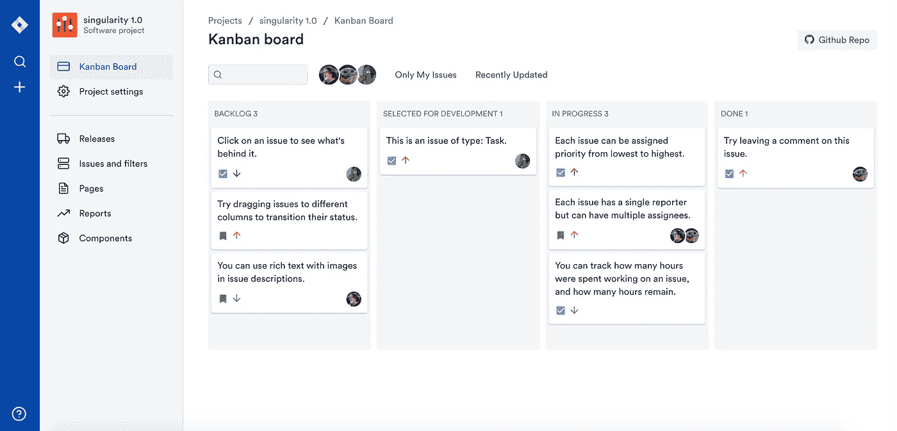
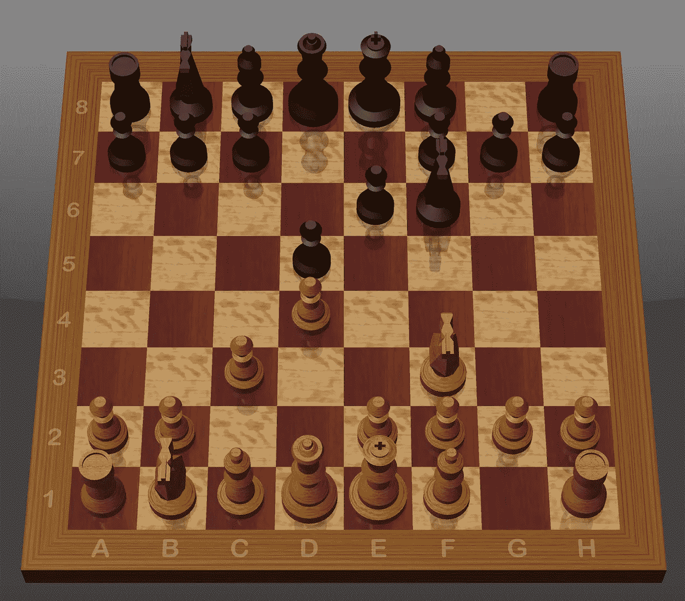
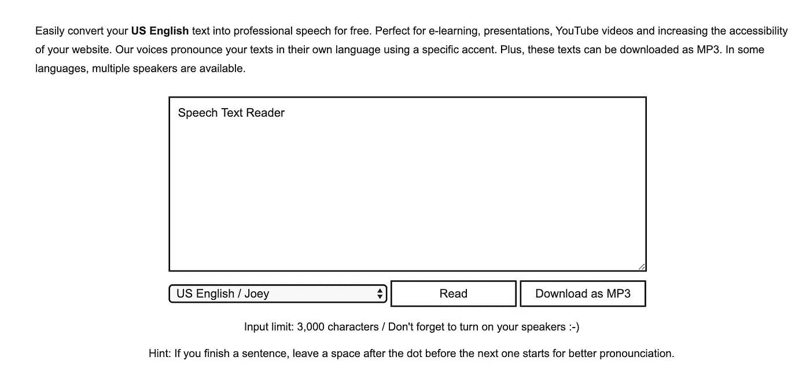
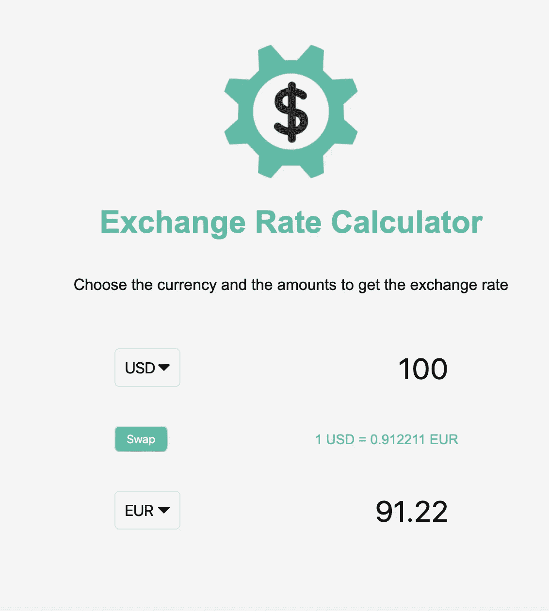

# 这里有一份你可以从今天开始编写应用程序的清单

> 原文：<https://betterprogramming.pub/heres-a-list-of-app-ideas-you-could-start-coding-today-b5f33f94a42e>

## 帮助您提高编码技能的灵感

照片由 [Unsplash](https://unsplash.com?utm_source=medium&utm_medium=referral) 上的 [Fotis Fotopoulos](https://unsplash.com/@ffstop?utm_source=medium&utm_medium=referral) 拍摄。

像其他技能一样，擅长编码需要你付出努力和时间。提高编码水平的最好方法之一是构建尽可能多的各种应用程序。我们程序员面临的困境如下:我们渴望构建，但往往缺乏创造性的想法。使用这个列表作为灵感来建立你的日常编码习惯。

注意:这篇文章假设你熟悉基本的编程概念，并且你正在寻找灵感来锻炼你的编码肌肉。

事不宜迟，这里有一个你今天就可以开始构建的应用列表。从列表中选择一个想法，然后开始构建！

# SoundCloud 克隆

SoundCloud 是一个在线音频分发平台和音乐共享网站。该网站允许你上传、点赞和分享歌曲。

SoundCloud 播放器

## 通过构建 SoundCloud 克隆，您将了解到:

*   如何上传和存储歌曲到数据库。
*   媒体播放器的所有基本功能——如何播放、快进、暂停等。
*   如何与朋友分享曲目？
*   如何绘制显示歌曲持续时间和进度的图形。

# 吉拉克隆

吉拉用于错误跟踪、问题跟踪和项目管理。“吉拉”这个名字实际上来源于日语“Gojira”，意思是“哥斯拉”

https://jira.ivorreic.com/project/board 的吉拉克隆—

## 通过构建吉拉克隆体，您将了解到:

*   [HTML 拖放 API](https://developer.mozilla.org/en-US/docs/Web/API/HTML_Drag_and_Drop_API) 。
*   用户角色和权限。
*   在不同用户之间分配和重新分配任务。
*   将任务标记为完成，归档、删除和编辑各种任务。

# 苹果股票克隆

苹果股票让你轻松跟踪你的股票和市场。在可定制的观察列表中查看报价和每日表现，并轻按任何滚动条来查看交互式图表和关键细节。

苹果股票应用

## 你将从苹果股票克隆中学到什么:

*   如何通过 API 异步获取股票价格？
*   如何创建股票价格图表？
*   设置价格警报。例如，如果一只股票上涨或下跌 10%，发送桌面警报。
*   一份你积极关注的最喜欢的股票清单。

使用这个 [API](https://www.alphavantage.co/documentation/) 获取股票价格。如果你知道一个免费使用的公共股票市场 API，请在下面的评论中发表。

# 象棋克隆

国际象棋是一种双人战略棋盘游戏，在一个有 64 个正方形排列成 8×8 网格的棋盘上进行。

苹果象棋

## 通过构建象棋克隆体，您将了解到:

*   如何渲染一个 8x8 的网格？
*   每一个棋子都有特定的规则来决定它们如何在棋盘上移动。因此，您必须应用游戏关键逻辑，以便游戏遵循传统的国际象棋规则。以下是国际象棋比赛的规则。
*   [HTML 拖拽 API](https://developer.mozilla.org/en-US/docs/Web/API/HTML_Drag_and_Drop_API) 。
*   如何记录分数，如赢、输和平局。如何将结果存储在类似 [PostgreSQL](https://www.postgresql.org/) 的数据库中。

# 语音文本阅读器

一款面向非语言人群的文本转语音应用。文本到语音转换解决方案使您的产品和服务对各种用户群更具吸引力。

免费文本转语音— [演示](https://ttsmp3.com/)

## 通过构建一个语音文本阅读器克隆，您将了解到:

*   如何使用[网络语音 API](https://developer.mozilla.org/en-US/docs/Web/API/Web_Speech_API/Using_the_Web_Speech_API) 。
*   如何创建一个响应式用户界面？
*   如何在不同的声音和口音之间转换？

# 汇率计算器

汇率计算器计算两种或多种货币和外汇汇率之间的差额**。**

汇率计算器— [演示](https://vanillawebprojects.com/projects/exchange-rate/)

## 通过构建一个汇率计算器克隆，您将了解到:

*   如何从 API 获取汇率—使用这个 [API](http://api.exchangerate-api.com) 。
*   如何显示两种货币的值和兑换率。
*   如何根据货币金额的变化实时更新值。

# 不和谐克隆

Discord 是一款面向游戏玩家的一体化语音和文本聊天软件，免费、安全，可在桌面和手机上运行。对于开发人员、游戏玩家和更普通的用户来说，这是一个非常受欢迎的交流选择。

不和谐演示

## 通过构建一个不和谐克隆体，你将会学到什么:

*   [web socket API](https://developer.mozilla.org/en-US/docs/Web/API/WebSockets_API)。聊天室使用网络套接字进行实时交流。
*   不同的用户角色和权限(例如管理员、内容版主和普通用户)。
*   如何激活麦克风并允许语音通信。
*   如何创建多个聊天室并启用多个 WebSockets？

# 结论

感谢阅读。我希望你从这篇文章中获得了新的想法。记住，编码是一项需要不断提高的技能。

寻找更多的编码想法？永远不要耗尽编码的想法，永远不要。 [**被我弄到这里来挑战一堆前端。**](https://gumroad.com/l/IuqKc)

了解我最新内容的最好方式是通过我的[简讯](https://wholesomedev.substack.com/welcome)。成为第一个得到通知的人。

我的[简讯](https://wholesomedev.substack.com/welcome)。成为第一个得到通知的人。