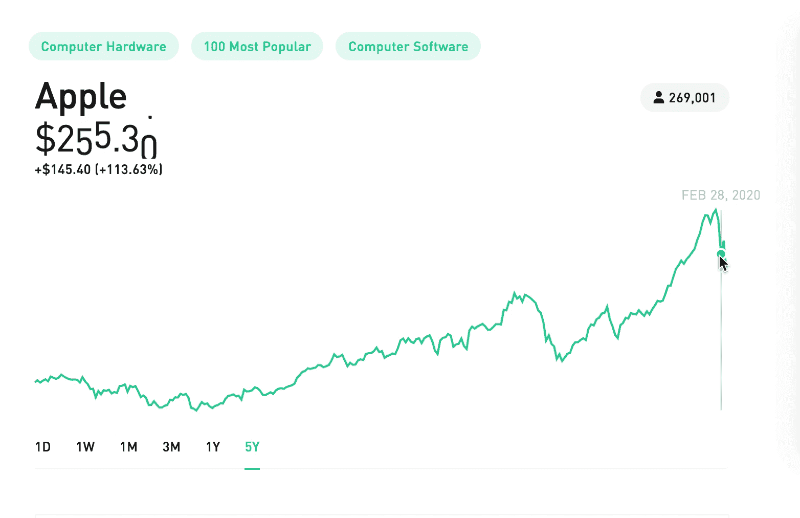
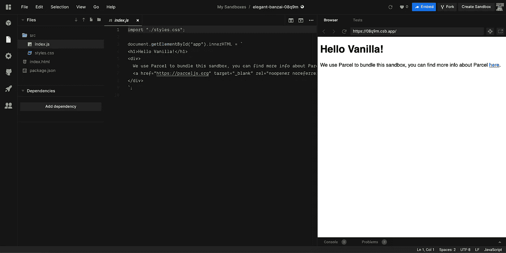
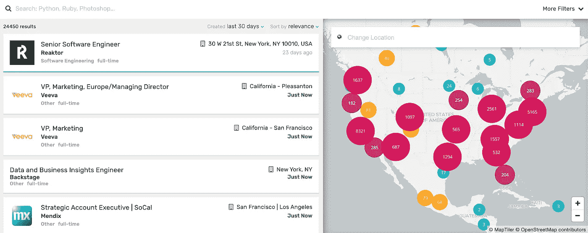
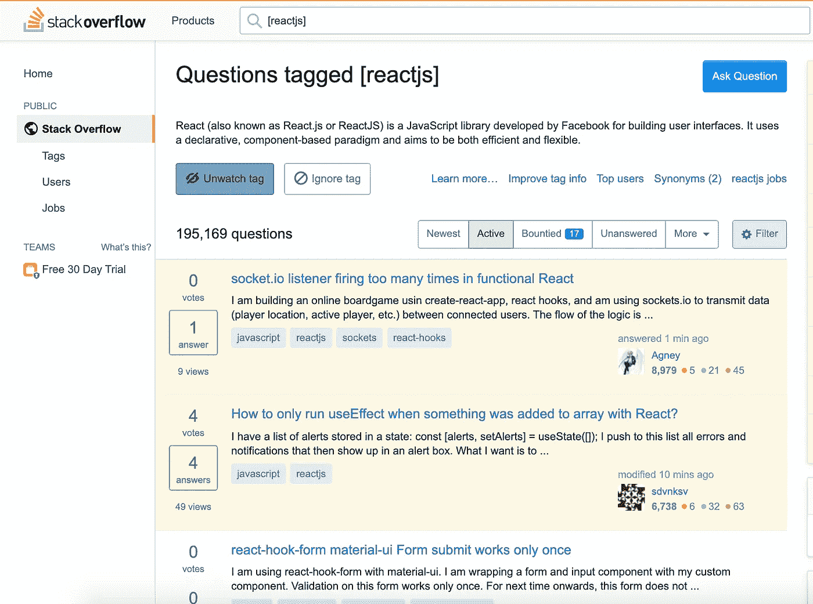
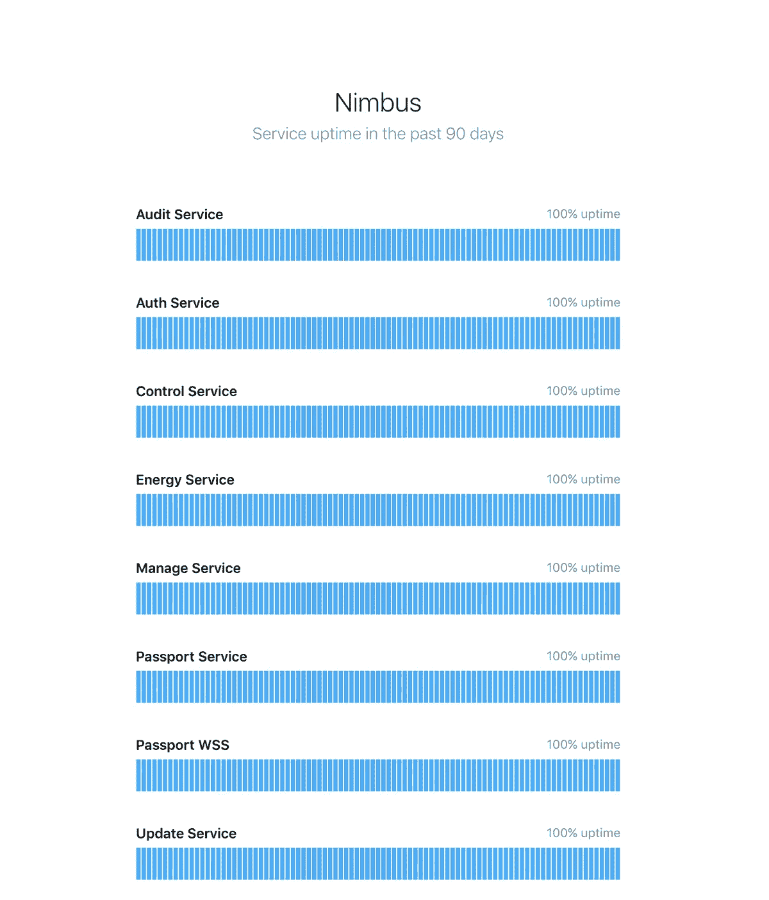
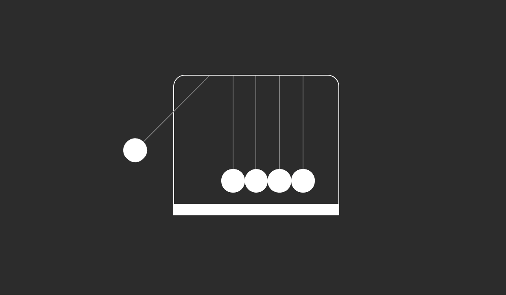

# 您今天就可以开始解决的前端挑战

> 原文：<https://betterprogramming.pub/heres-a-list-of-challenging-frontend-ideas-you-can-start-solving-today-afa0ab3f0fdd>

## 通过完成这些编码挑战，成为更好的前端开发人员

费伦茨·阿尔马西在 [Unsplash](https://unsplash.com?utm_source=medium&utm_medium=referral) 上的照片

作为开发人员，我们有一种强烈的愿望，那就是构建有用的产品供世界使用。但是我们也有缺乏创造性想法的时候。所以，这里有一个清单，可以激励你去锻炼你的编码肌肉，去构建一些东西。

# 罗宾汉股票价格图

Robinhood 有一个漂亮的图表来显示各种股票的价格。当您滑过该时间段时，滚动条会随着滚动的文本动画而变化。如果你对如何制作动画感到好奇，[这个资源库](https://github.com/robinhood/ticker)非常有用。

来源:[https://robinhood.com/stocks/AAPL](https://robinhood.com/stocks/AAPL)

## 通过构建罗宾汉风格的股价图，你会学到什么

*   如何通过 API 获取股票价格数据？
*   如何用不同的时间表绘制图表，例如 3 个月、6 个月、1 年等的过去价格。
*   重新创建价格行情动画。

您可以[将这个 API](https://www.alphavantage.co/documentation/) 用于股票价格。如果你知道一个更好的免费 API，请在下面的评论中发表。

# CodeSandbox 克隆

CodeSandbox 是一个在线代码编辑器和原型制作工具，可以加速 web 应用程序的创建和共享。

来源:[https://codesandbox.io/s/elegant-banzai-08q9m](https://codesandbox.io/s/elegant-banzai-08q9m)

保持简洁，尽量只构建最常用的功能。关注编辑器部分，因为这是最有用的特性。

## 通过构建 CodeSandbox 克隆，您将学到什么

*   如何在浏览器中渲染和运行 HTML、CSS 和 JavaScript？
*   在编辑器和完整预览中实时重新加载。
*   如何生成嵌入的 URL？嵌入使您能够使用 iframe 将沙盒包含在您的文档、博客文章或网站中，或者包含在任何有嵌入支持的地方，如 Medium、Reddit、Trello 和 conception。您可以只显示代码、预览，或者同时显示两者。

# 惊人的克隆

Whoishiring 以地图的形式呈现最相关的工作机会。求职者可以很容易地找到谁在最吸引他们的地方招聘。

来源:[https://whoishiring.io/](https://whoishiring.io/)

## 你将从建造一个惊人的克隆体中学到什么

*   如何使用不同的地图并在地图画布上绘图。
*   使用复杂布局，例如，地图和侧面导航必须同步。
*   使用数据库获取作业。我建议使用虚拟数据，因为它只是一个克隆，目的是提高你的前端技能。

# Stackoverflow 克隆(只有问题和答案部分)

每当开发人员遇到问题时，StackOverflow 是我们首先求助的地方。它是一个聪明的朋友，有我们需要的所有答案！

Stackoverflow 是一个庞大的网站，所以不要试图克隆一切。从问答部分开始。让用户提问和回答问题，并标记东西。

来源:[https://stackoverflow.com/](https://stackoverflow.com/)

## 您将从构建 StackOverflow 克隆中学到什么

*   使用数据库，如 PostgreSQL 或 MongoDB。问题和答案应该保存到数据库中，每当有人打开 StackOverflow 克隆时，就可以从数据库中获取。
*   标记文章和索引搜索。我们想为用户提供一个简洁而全面的搜索。您应该能够使用简单的关键字搜索问题和答案，如`[react]`或`[javascript]`。

# 网站正常运行时间监视器

有许多服务可以让您监控应用程序的性能和正常运行时间。他们很容易建立，所以为什么不建立一个自己的乐趣呢？

来源:[https://apex.sh/ping/](https://apex.sh/ping/)(Apex Ping)

## 您将从构建正常运行时间监控器克隆中学到什么

*   终点站。如何使用命令行并检查网站状态？如果网站返回一个`200`代码，不要做任何事情。如果它返回一个`404`或`500`，通过发送电子邮件通知用户。
*   制图。每个人都想使用感觉直观、看起来新鲜的应用程序。创建漂亮的图表来显示服务器状态。

# CSS 牛顿的摇篮

牛顿摇篮是一个使用一系列摆动球体演示动量和能量守恒的装置。当一端的一个球体被提起并释放时，它会撞击静止的球体，通过静止的球体传递一个力，将最后一个球体向上推。

来源:[https://codepen.io/wagnermoschini/details/RxooKO/](https://codepen.io/wagnermoschini/details/RxooKO/)——作者[瓦格纳·莫斯奇尼](https://codepen.io/wagnermoschini)

## 你将从建造一个牛顿摇篮克隆体中学到什么

*   使用 CSS 关键帧和创建动画。
*   如果您决定使用 JavaScript 画布，那也没问题！

# 包扎

我希望你已经找到了下一个工作项目。

寻找更多的编码想法？永远不要耗尽编码的想法，永远不要。 [**被我弄到这里来挑战一堆前端。**](https://gumroad.com/l/IuqKc)

记住，编码和其他技能一样，都是一种技能——做得更好需要每天的努力，所以充分利用你的时间，从列表中选择一些东西，开始编码吧！

了解我最新内容的最好方式是通过我的[简讯](https://wholesomedev.substack.com/welcome)。成为第一个得到通知的人。

我的[简讯](https://wholesomedev.substack.com/welcome)。成为第一个得到通知的人。