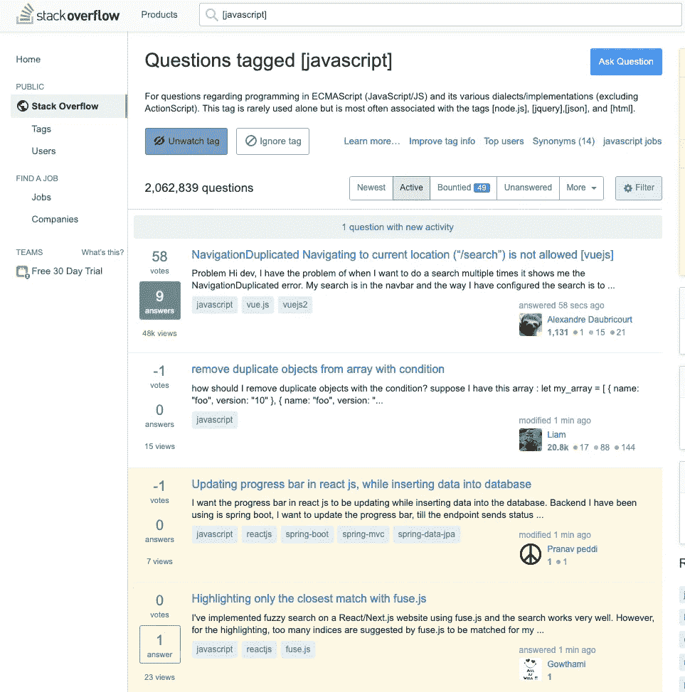
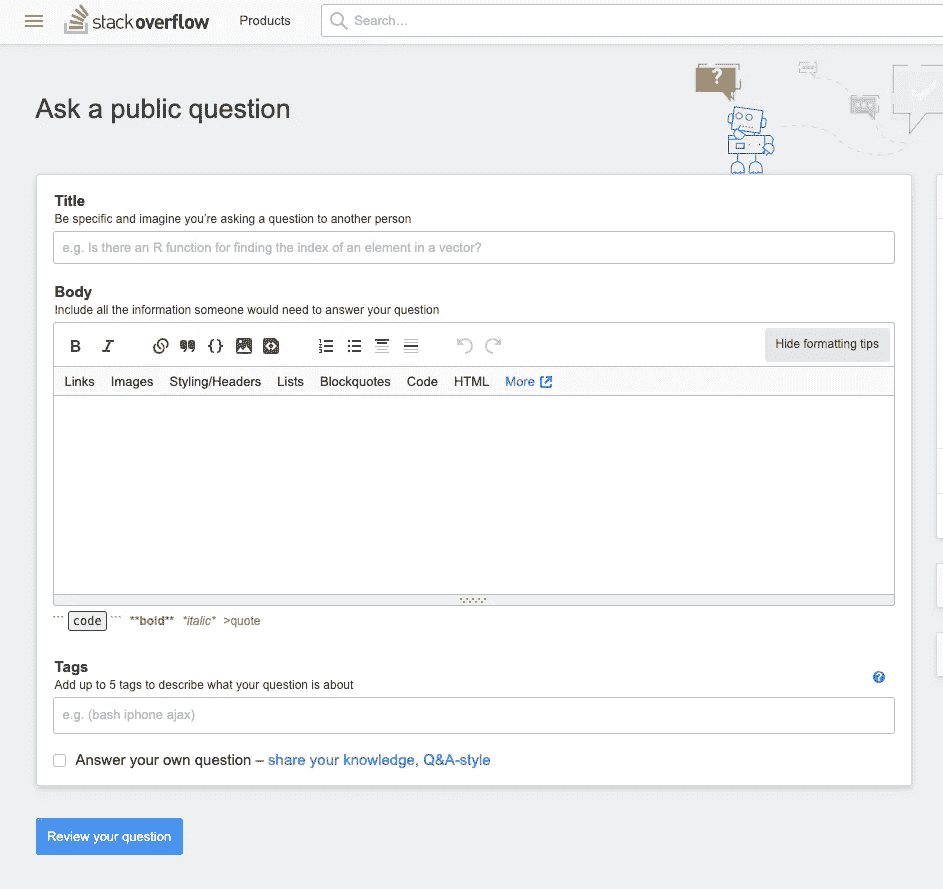
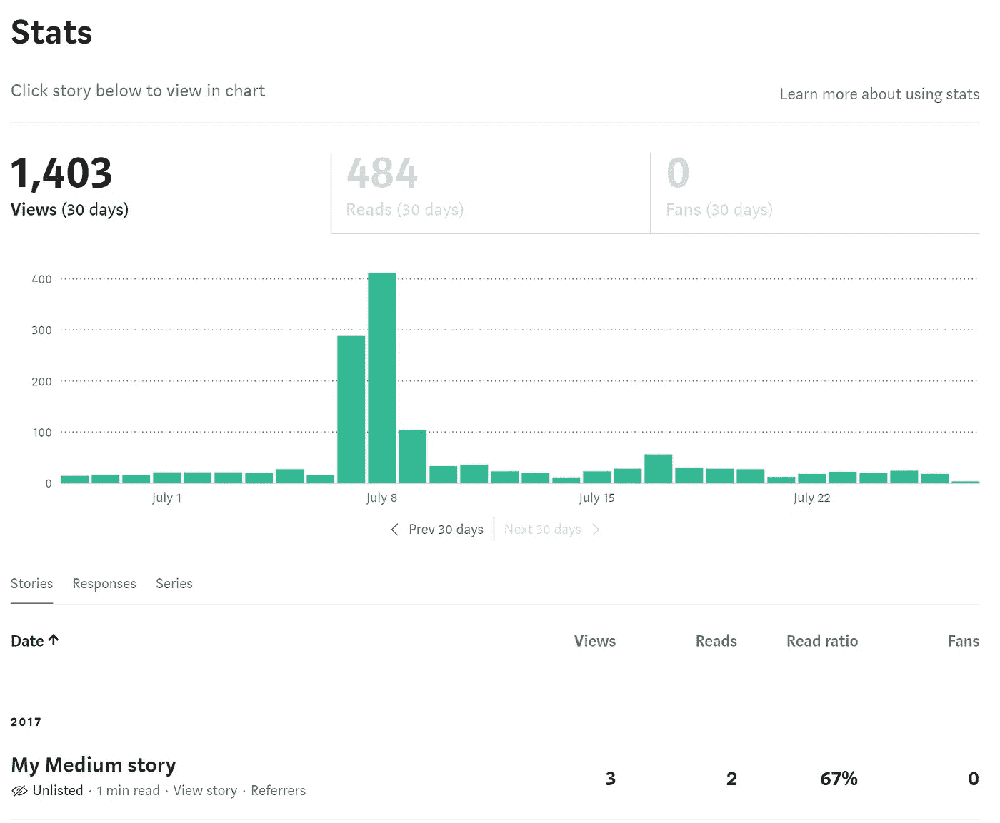
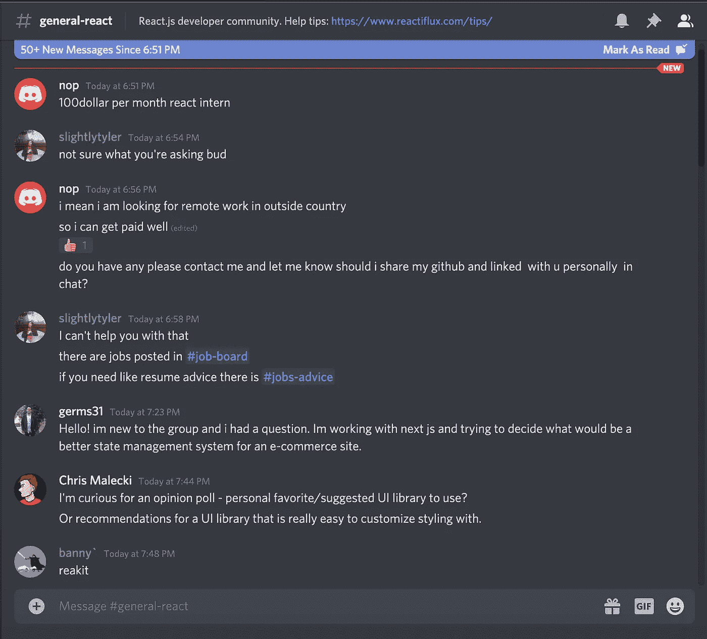
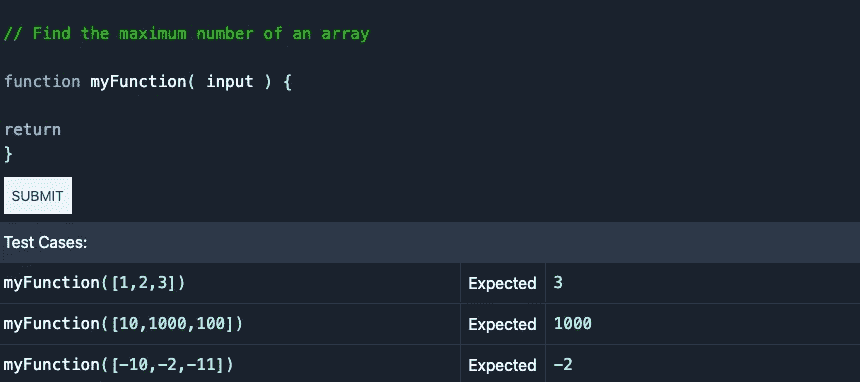

# 这里有一个你今天可以构建的令人兴奋的项目列表

> 原文：<https://betterprogramming.pub/heres-a-list-of-exciting-projects-you-can-build-today-fdddce4fd57c>

## 新项目的灵感帮助你掌握编码技能

马丁·施瑞德在 [Unsplash](https://unsplash.com?utm_source=medium&utm_medium=referral) 上的照片。

掌握编码类似于掌握任何技能——需要许多小时的集中工作和学习。

用这篇文章作为灵感的来源，从下面的列表中抓住一个想法，然后开始编码。你用什么栈不重要。只要完成它，并将其推送到您的 GitHub 个人资料中。这是获得编码经验和精通的秘密。从今天开始。不要推迟你的目标和梦想。

# 堆栈溢出问题克隆

Stack Overflow 是一个面向程序员的问答网站。为什么不通过构建一个堆栈溢出问题克隆来开始一天或晚上的工作呢？会有很多挑战。

JavaScript 相关的[堆栈溢出问题](https://stackoverflow.com/questions/tagged/javascript)。

## 通过构建堆栈溢出问题视图，您将学到以下内容

*   表单输入验证和提交表单。
*   将问题和答案保存到数据库中。你可以使用任何你想要的数据库。
*   将向上投票和向下投票保存到数据库。每个问题都有一个分数，你需要能够保存这个分数。
*   根据分数对问题进行排序。

# 中等统计克隆

您在媒体上发布的故事可获得流量和访客统计数据。

[中等统计页面](https://help.medium.com/hc/en-us/articles/215108608-Stats)。

“在详细信息页面的顶部，您将看到故事到目前为止的表现摘要，包括‘总浏览量’(您的故事的总访问量)和‘阅读率’(对到达您的故事结尾的观众百分比的估计)

条形图代表过去 30 天的流量。你可以回到前 30 天，或者点击某个故事的标题，查看该故事在过去 30 天的流量。”——[中等](https://help.medium.com/hc/en-us/articles/215108608-Your-stats)

## 通过编写中等统计克隆代码，您将学到以下内容

*   用 JavaScript 绘制图表和图形。
*   用 HTML 和 CSS 构建网站。
*   可选:从 API 获取数据。为图表使用虚拟数据。

# 不和谐聊天克隆

“Discord 是一个即时消息和 VoIP 应用程序以及数字分发平台，旨在创建从游戏玩家到教育和商业的社区。Discord 专门在一个聊天频道中进行用户之间的文本、图像、视频和音频交流。”— [不和维基百科](https://en.wikipedia.org/wiki/Discord_(software))

## 下面是您通过编写 Discord 聊天克隆体将学到的东西

*   Websockets 及其工作原理。Websockets 通常用于构建实时聊天室。
*   用户认证和在数据库中安全地存储用户凭证。
*   可选:使用[电子](https://github.com/electron/electron)，构建跨平台桌面应用。知道桌面应用程序是如何开发的是非常棒的。

# 缩放克隆

缩放允许您开始或加入带有视频和音频的会议。缩放是在线会议、研讨会和小组会议特别受欢迎的选择。

图片由[视觉效果](https://unsplash.com/@visuals?utm_source=medium&utm_medium=referral)在 [Unsplash](https://unsplash.com?utm_source=medium&utm_medium=referral) 上拍摄。

## 下面是您将通过编码 Zoom 克隆学到的东西

*   ["WebRTC](https://developer.mozilla.org/en-US/docs/Web/API/WebRTC_API) (Web 实时通信)— WebRTC 是一种技术，它使 Web 应用程序和站点能够捕获和选择性地流式传输音频和/或视频媒体，以及在浏览器之间交换任意数据，而无需中介。— [Mozilla](https://developer.mozilla.org/en-US/docs/Web/API/WebRTC_API)

[查看 GitHub 资源库](https://github.com/WebDevSimplified/Zoom-Clone-With-WebRTC)中如何构建缩放克隆的示例:

 [## WebDevSimplified/Zoom-Clone-With-WebRTC

### 在 GitHub 上创建一个帐户，为 WebDevSimplified/Zoom-Clone-With-WebRTC 开发做贡献。

github.com](https://github.com/WebDevSimplified/Zoom-Clone-With-WebRTC?ref=HackerTabExtension) 

# js 挑战者克隆

JSchallenger 是一个通过解决编码挑战来学习 JavaScript 的工具。

“解决一个挑战相当简单:简单地写一个通过每个给定测试用例的函数。每个测试用例提供一个带有输入参数和预期结果的函数调用。函数调用应该使用给定的参数运行您的函数。返回值应与预期值匹配。–[js challenger](https://www.jschallenger.com/start)

[JSchallenger](https://www.jschallenger.com/start) 。

## 通过编写 JSchallenger 克隆，您将学到以下内容

*   如何评估浏览器内部的 JavaScript 代码？
*   如何编写测试来检查解决方案是否有效？

# 结论

感谢阅读。我希望你为你的下一个编码项目获得了灵感。编码快乐！

寻找更多的编码想法？永远不要耗尽编码的想法，永远不要。 [**被我弄到这里来挑战一堆前端。**](https://gumroad.com/l/IuqKc)

了解我最新内容的最好方式是通过我的[简讯](https://wholesomedev.substack.com/welcome)。成为第一个得到通知的人。