# 这里是顶级 CSS 前端库的列表

> 原文：<https://betterprogramming.pub/heres-a-list-of-top-css-front-end-libraries-eb0330c04148>

## 前端 CSS 库让你快速原型化，因为你不必担心样式

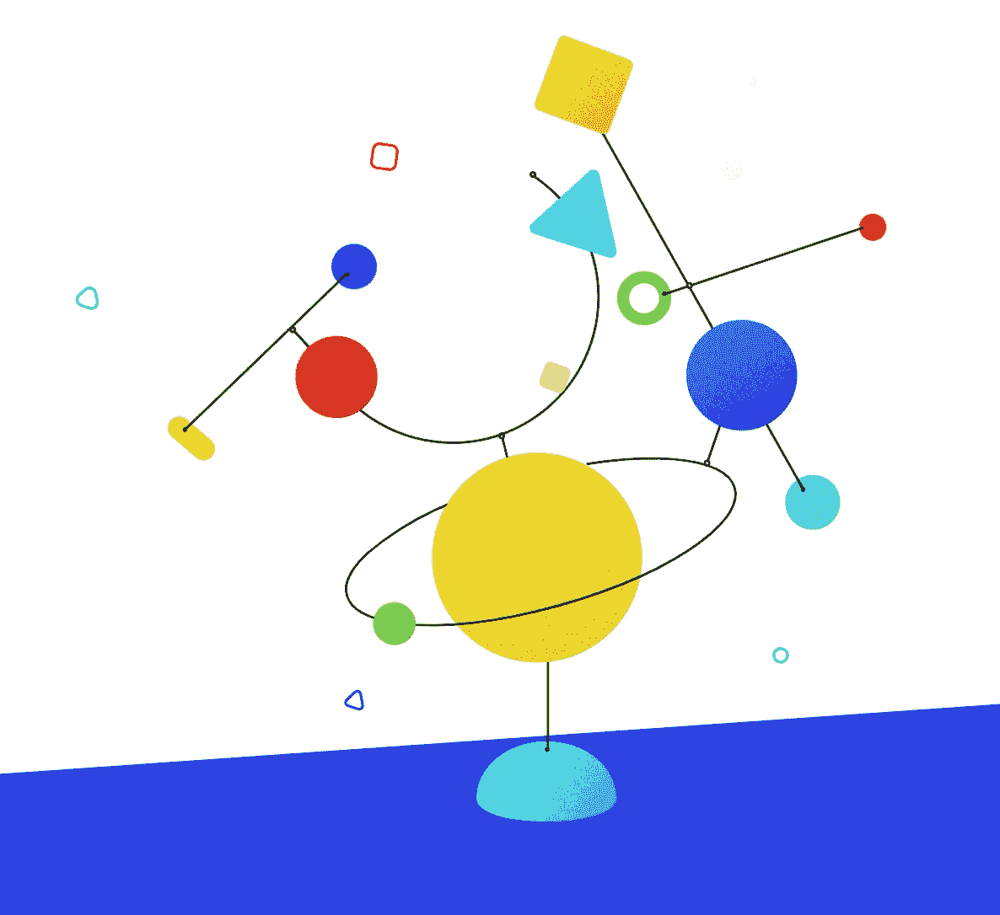

蚂蚁设计的动画

为什么应该使用 CSS 库而不是自定义 CSS？简单地说，时间是有限的资源，所以花时间在样式上构建功能。从头开始构建 CSS 对性能和美观有好处吗？绝对的！但是除非你是一个有丰富 CSS 经验的视觉创意者，否则将这项工作外包给专家可能会更有效率。

同时，框架使得快速原型化一个可展示的、可工作的应用程序变得更加容易。

由于它们的流行，有很多前端框架可用。我在一个列表中收集了所有最流行和最常用的框架。事不宜迟，下面是所有前端 CSS 库的完整列表。

# 蚂蚁设计

**推介:**“Ant Design 让所有项目成员的设计和原型制作变得更加简单和容易，提高了后台应用程序和产品的开发效率。”—通过蚂蚁设计的[网页](https://ant.design/docs/spec/introduce)

插图由[蚂蚁设计](https://ant.design/)

蚂蚁设计，一种用于后台应用的设计语言，是由蚂蚁 UED 团队改进的。他们旨在统一内部后台项目的用户界面规范，降低设计差异和实施的不必要成本，并释放通常用于设计和前端开发的资源。

## 特征

*   用于 web 应用程序的企业级 UI 设计语言
*   一套开箱即用的高质量 React 组件
*   用完整定义类型的 TypeScript 编写
*   整套开发和设计资源和工具

## 环境支持

*   现代浏览器和 Internet Explorer 9+(带 [polyfills](https://ant.design/docs/react/getting-started#Compatibility) )
*   服务器端渲染
*   [电子](http://electron.atom.io/)

# 基础

**推介:**“Foundation 是一系列高级响应前端框架。…快速从原型进入生产，构建可在任何有基础的设备上运行的网站或应用程序。… Foundation 包括一个完全可定制、响应迅速的网格；一个大型的 Sass mixins 库；常用的 JavaScript 插件；和完全的辅助功能支持。”— via 基金会的[网页](https://foundation.zurb.com/)

[基金会插图](https://foundation.zurb.com/)

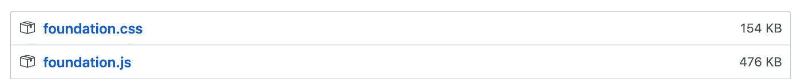

基础版本

## 特征

*   友好的
*   风格简约
*   灵活的 Sass
*   ZURB 入门模板

# 布尔玛

布尔玛是一个 CSS 框架。因此，唯一的输出是一个 CSS 文件: [bulma.css](https://github.com/jgthms/bulma/blob/master/css/bulma.css) 。

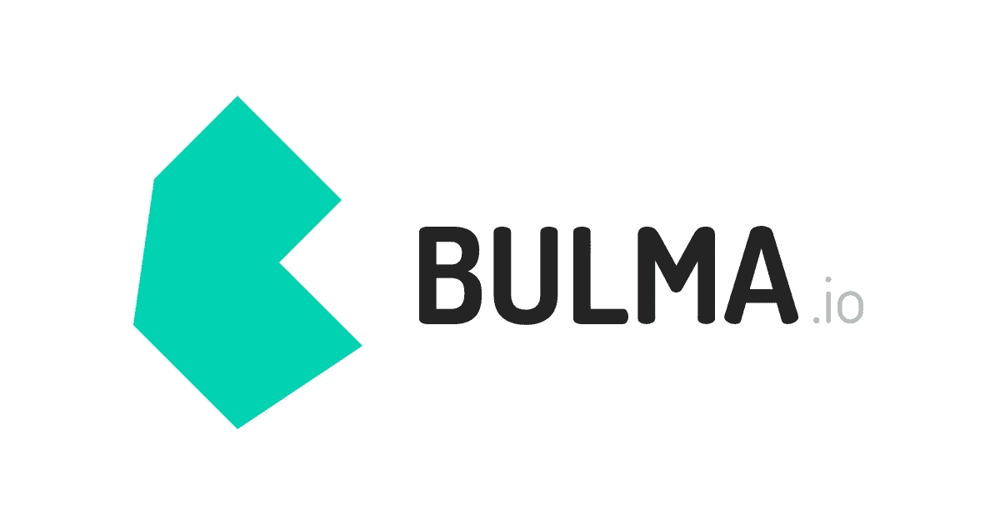

[布尔玛](https://bulma.io/)标志

您可以使用上述现成的文件或下载 Sass 源文件来定制[变量](https://bulma.io/documentation/overview/variables/)。

不包含 JavaScript。人们通常希望使用自己的 JS 实现(并且通常已经有了一个)。布尔玛可以被认为是环境不可知的:它只是逻辑之上的样式层。

## 特征

*   通过使用最新的 CSS3 特性，如 Flexbox，并计划使用 CSS 变量和 CSS 网格，布尔玛处于浏览器技术的前沿
*   简单的网格系统:要构建一个布尔玛网格，你只需要一个单独的`.columns`容器来包装尽可能多的`.column`项
*   易于学习的语法:简单易读的类名(例如`.button`或`.title`)和简单明了的[修饰符](https://bulma.io/documentation/modifiers/syntax/)(例如`.is-primary`或`.is-large`)，很容易在几分钟内学会布尔玛
*   100 多个有用的 CSS 助手
*   还有[多得多的](https://bulma.io/alternative-to-bootstrap/)

# Spectre.css

根据其网站，Spectre.css 是“一个轻量级、响应性强的现代 css 框架，用于更快和可扩展的开发。Spectre 提供了排版和元素的基本样式，一个基于 Flexbox 的响应式布局系统，以及纯 CSS 组件和实用程序。”

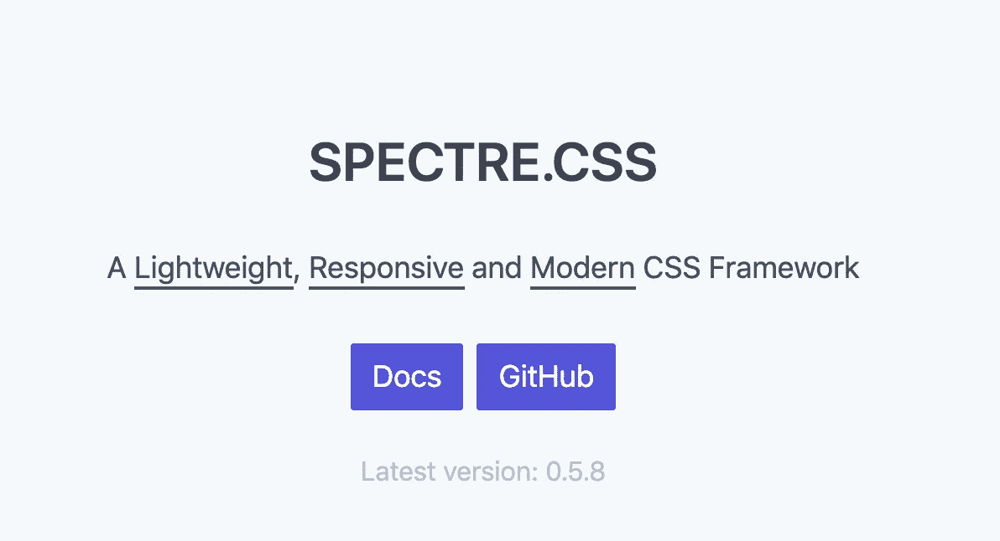

spectre.css

## 特征

*   轻量级(大约 10KB 压缩)
*   美观的组件和调色板
*   直观语法
*   灵活性:不需要 JS

# 顺风 CSS

**推介:**“Tailwind CSS 是一个高度可定制的低级 CSS 框架，它为您提供了构建定制设计所需的所有构件，而没有您必须努力克服的任何恼人的固执己见的风格。”—通过顺风社的[网页](https://tailwindcss.com/)

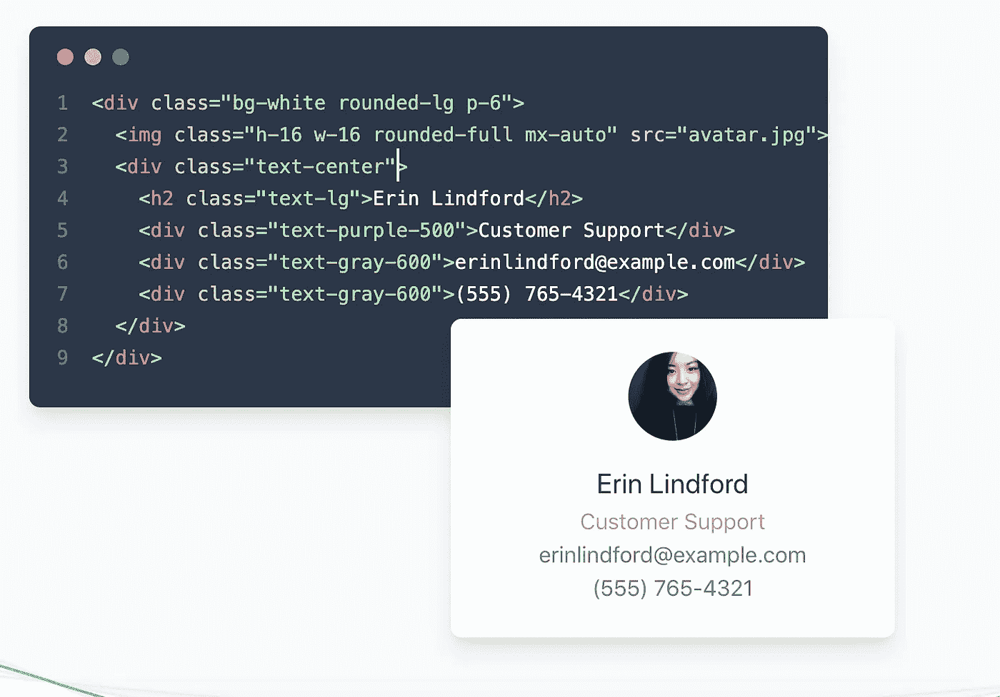

顺风 CSS [主页](https://tailwindcss.com/)截图

## 特征

*   应答的
*   组件友好的
*   可定制的

# 鞋带

**推介:**“The league 鞋带. css 是一个轻量级的、前瞻性的 CSS 库，采用未来的 CSS 语法构建。它易于使用，高度可定制。Bootstrap 用户会发现它很熟悉，但又令人耳目一新。你可以在任何浏览器上使用鞋带。CDN 版本非常适合原型开发，但是为了利用它的所有特性，你应该[从源头](https://www.shoelace.style/docs/installing.html#building-from-source)构建鞋带—通过鞋带的[网页](https://www.shoelace.style)

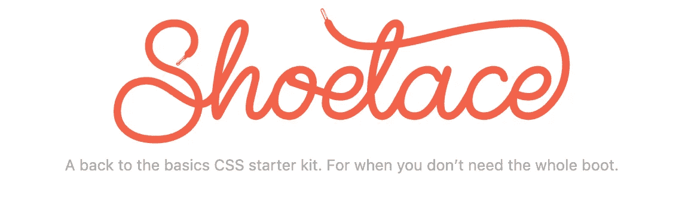

[鞋带](https://www.shoelace.style/)标志

## 特征

*   轻量级，大约 69kB。
*   利用原生 CSS 变量和未来的 CSS 特性
*   易于使用和高度可定制

# 语义用户界面

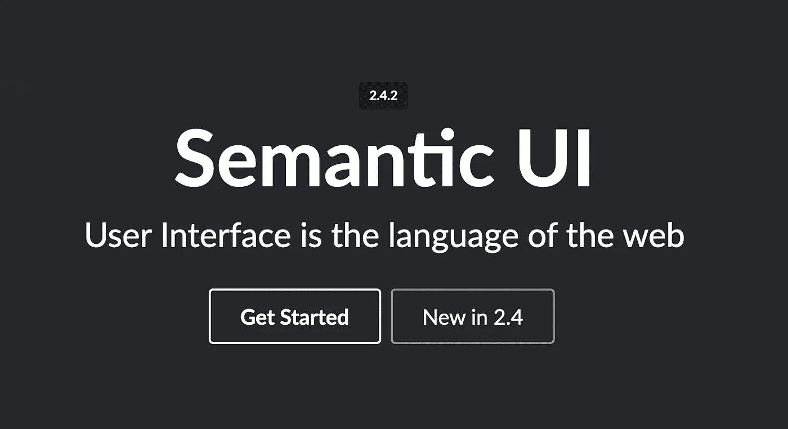

[语义 UI](https://semantic-ui.com) logo

**音高:**“语义 UI 把词和类当作可交换的概念。类使用自然语言的语法，如名词/修饰语关系、词序和复数来直观地链接概念。获得与 [BEM](https://en.bem.info/) 或 [SMACSS](https://smacss.com/) 相同的好处，但没有单调乏味。”—通过语义 UI 的[网页](https://semantic-ui.com/)

## 特征

*   带有可交换单词和类的简洁 HTML

语义 UI HTML 类示例

*   简化调试

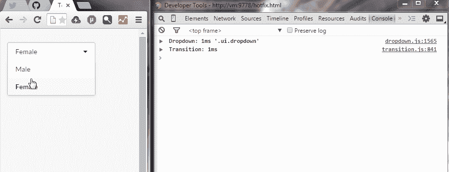

使用语义用户界面调试 CSS

*   主题

# 骨骼

**推介:**“Skeleton 只对一些标准的 HTML 元素进行了样式化，并包含了一个网格，但这对于入门来说已经足够了。如果你正在着手一个较小的项目，或者只是觉得不需要大型框架的所有功能，你应该使用 Skeleton。— via Skeleton 的[网页](http://getskeleton.com/)

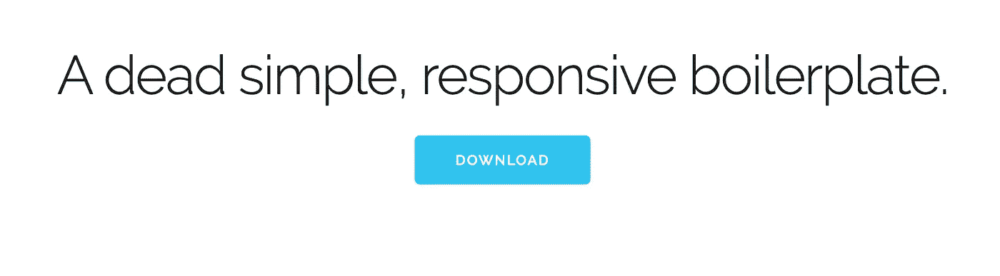

截图来自骷髅[网站](http://getskeleton.com/)

## 特征

*   轻如鸿毛，约 400 行
*   专为移动设备打造
*   样式被设计成一个起点，而不是一个 UI 框架
*   快速启动，无需编译或安装

我喜欢 Skeleton，因为它加快了开发速度，而且设置简单。

# 超光子

**音高:**“超光速粒子是为功能性 CSS 和人类设计的系统。无需编写 CSS 即可快速构建和设计新的 UI。”——通过超光速粒子 [GitHub 页面](https://github.com/tachyons-css/tachyons)

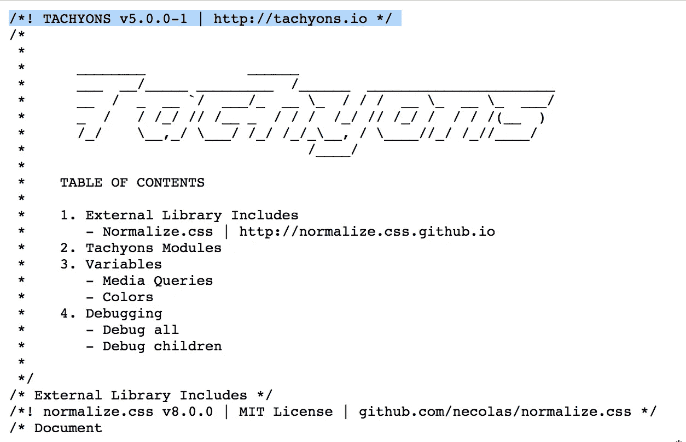

超光子

> “由于引入了新的组件/组件的变体，设计系统在扩展(扩展组织或扩展产品)时会崩溃。那些变体有时(理解为:经常)没有文档记录，导致再次需要(和创建)那个组件/变体时的重复。即使当组件被记录时，有效地记录通常意味着几十/几百个实例来捕获所有的状态/变体。超光速粒子等系统通过记录和限制组件的“属性”来解决这个问题。(我喜欢把这看作是“亚原子”设计。)
> 
> 然后，通过组合亚原子组件(属性)来创建组件。不是创建一个组件和它的变体，你只是有一个全面的“成分”亚原子组件列表。这些亚原子成分可以以数千种方式组合，创造出数百种成分。这些组件的属性很多，但被限制在一组可接受的值内(我们的亚原子组件)。”—丹尼尔·伊登，脸书的设计师

# 特征

*   移动优先的 CSS 架构
*   490 种可访问的颜色组合
*   多个调试工具，以减少布局斗争。
*   轻量级(~14KB)
*   开源组件库
*   与普通的 HTML，React，Ember，Angular，Rails 等等一起工作
*   一个无限嵌套的响应网格系统
*   用 PostCSS 构建

# 材料设计

**推介:**“Material Design 由谷歌创建和设计，是一种将成功设计的经典原则与创新和技术相结合的设计语言。谷歌的目标是开发一个设计系统，允许在任何平台上的所有产品上实现统一的用户体验。”—通过材料设计的[网页](https://materializecss.com/about.html)

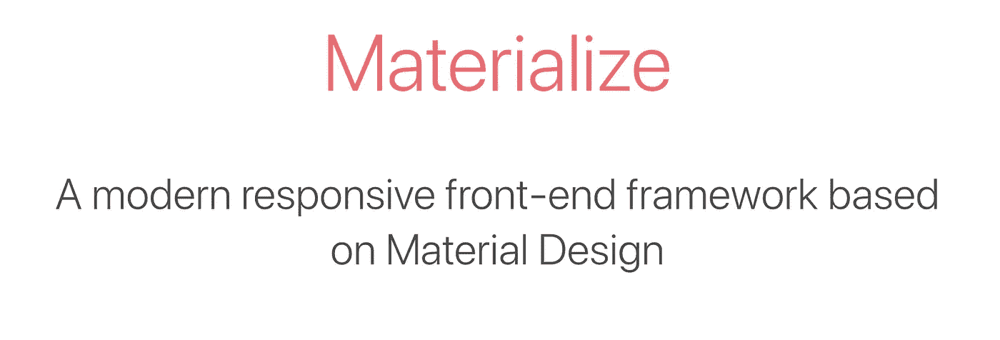

材料设计截图[首页](https://materializecss.com/about.html)

## 特征

*   受到广泛支持
*   启动器[模板](https://materializecss.com/getting-started.html)
*   第三方支持

想分享你的 CSS 库？我是不是搞错了，错过了一个牛逼的图书馆？让我知道！

感谢阅读。保持牛逼！