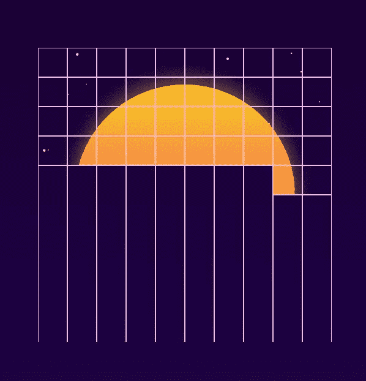
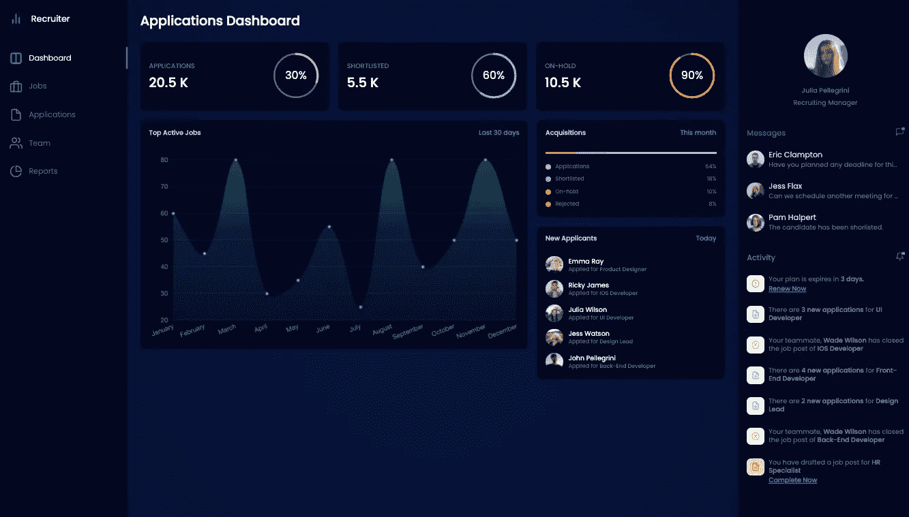
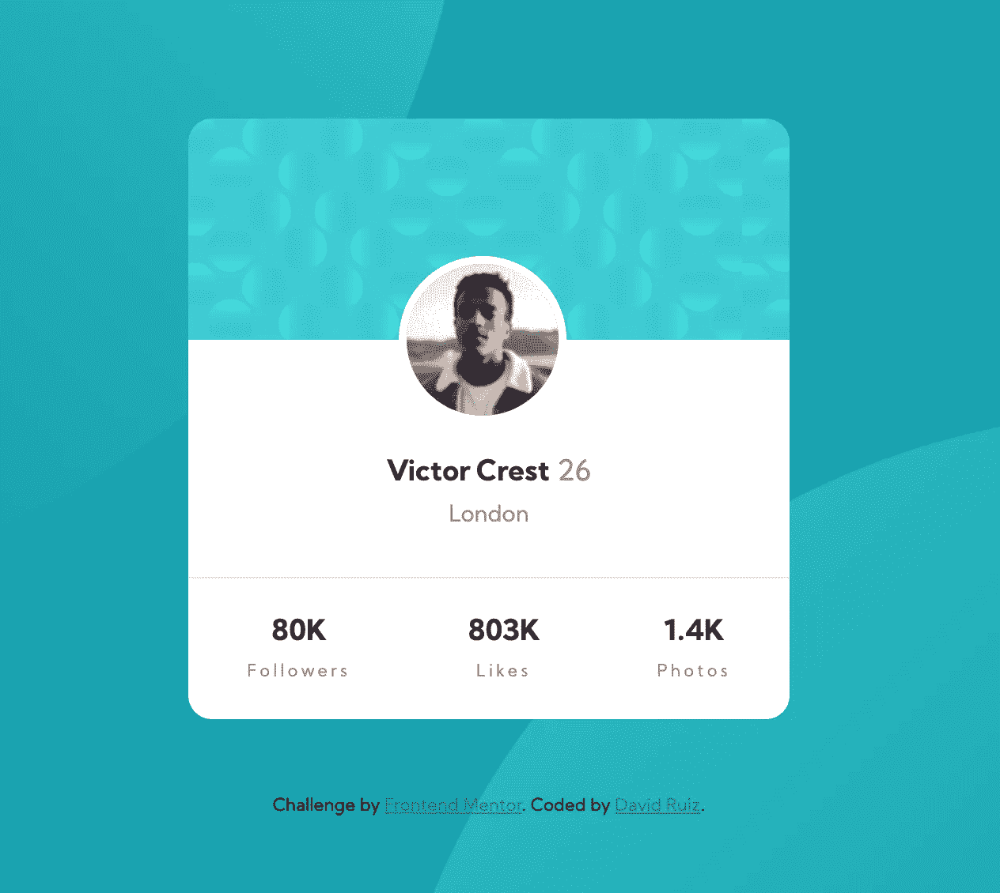
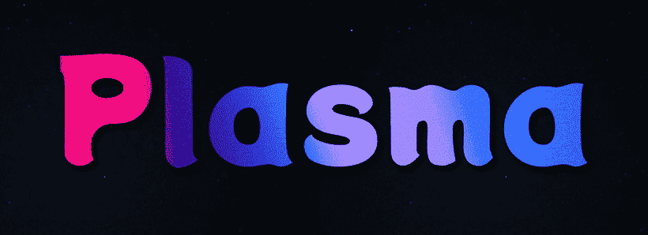
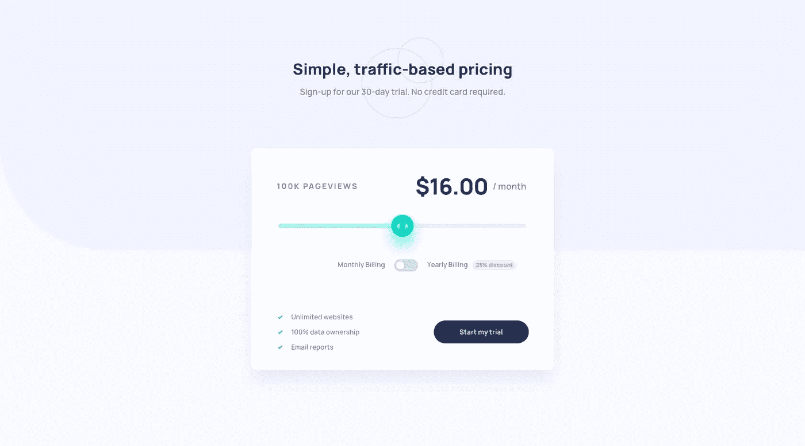
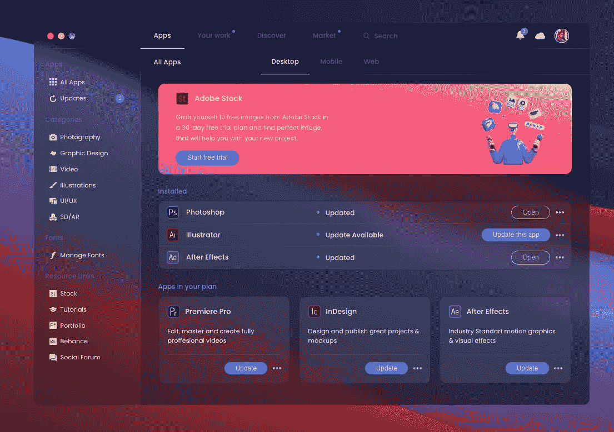
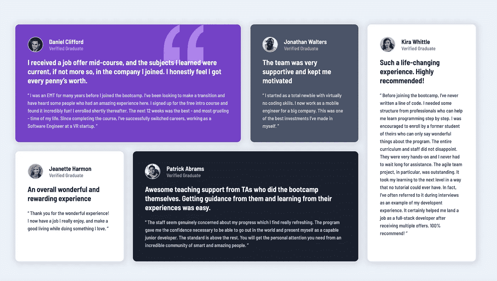

# 这是另一个令人兴奋的前端挑战列表

> 原文：<https://betterprogramming.pub/heres-another-list-of-exciting-frontend-challenges-be3b50a2e059>

## 获得灵感并完成这些前端编码挑战

肖恩·朗斯在 [Unsplash](https://unsplash.com?utm_source=medium&utm_medium=referral) 上拍摄的照片。

我又回来了，带来了各种前端开发人员面临的另一系列激动人心的挑战。

如果你不熟悉这些文章，它们或多或少会给你带来灵感。选择一些让你对编码感兴趣的东西，然后继续构建它。

如果你赶时间，不想耗尽编码的灵感——我在这里 整理了一个超过 100 个挑战 [**的列表。**](https://gumroad.com/l/IuqKc)

事不宜迟，挑战来了。

# **假信号合成波**

Glitchy Synthwave 正是你所希望的:一个 10x10 网格上的“glitchy”synth wave 外观的动画。

乔治·弗朗西斯。

## 您将从构建 Glitchy Synthwave 中学到什么

*   如何画一个 10x10 的网格？尝试使用新的 CSS 网格。
*   如何使用 CSS 变换、过渡和动画。

如果你不确定如何做，可以看看乔治·弗朗西斯的原始代码。

# 招聘人员仪表板 UI

招聘人员仪表盘很漂亮，拥有技术招聘人员可能需要的一切。

[“招聘人员仪表板 UI](https://codepen.io/aybukeceylan/pen/poEqdWZ)”—作者 [Aybüke Ceylan](https://codepen.io/aybukeceylan)

## 通过构建招聘人员仪表板 UI，您将学到什么

*   如何用 JavaScript 和 CSS 创建漂亮的图表？选择你喜欢的图表库。
*   如何从 API 获取数据？每个仪表板都有一些数据要显示。您可以为您的“虚拟数据”使用任何您喜欢的来源
*   如何用 CSS 和 HTML 做一个布局？每个应用程序都需要一个基本布局。

# 带统计信息的卡片配置文件

这是一个简单而现代的个人资料卡，上面有社交媒体统计数据，如关注者、喜欢和照片。您可以使用“虚拟”数据或硬编码数据用于 profile 卡。

来源:[前端导师](https://profile-card-component-main-liart-omega.vercel.app/)

## 你将从建立卡片档案中学到什么

*   如何创建现代外观的社交媒体卡？
*   基本的 HTML 和 CSS。

*前端导师的挑战。代号由* [*大卫瑞兹*](https://www.youtube.com/CodingTube) *。*

# 等离子动画

> “当能量被添加到气体中时，你得到等离子体，电离气体。是宇宙中最常见的物质状态！存在于恒星、星际星云、太阳风、荧光灯、霓虹灯、照明等等！等离子体经常产生的电流和颜色令人敬畏。”— [代码打开](https://codepen.io/challenges/2021/january/4)

来源: [CodePen](https://codepen.io/challenges/2021/january/)

## 通过构建等离子动画，你将学到什么

*   如何用 CSS 或 JavaScript 创建一个“气体”外观的动画？

# 交互式定价组件

一个精巧的滑块，你可以拖动它。价格取决于浏览量。

注意滑块美丽的渐变背景和阴影:

来源:[前端导师](https://www.frontendmentor.io/challenges/interactive-pricing-component-t0m8PIyY8)

## 通过构建交互式定价组件，您将学到什么

*   如何创建自定义滑块？注意滑块也使用了`box-shadows`。
*   如何使用`linear-gradients`创建漂亮且具有现代感的背景。

# Glassmorphism 创意云应用重新设计

有一种新款式越来越受欢迎。根据 [UX 集体](https://uxdesign.cc/glassmorphism-in-user-interfaces-1f39bb1308c9)的说法，玻璃态最具定义性的特征是:

> "-透明度(使用背景模糊的毛玻璃效果)
> 
> -物体漂浮在空间的多层方法
> 
> -鲜艳的颜色突出模糊的透明度
> 
> -半透明物体上的细微浅色边框。"

“[Glassmorphism Creative Cloud App 重新设计](https://codepen.io/TurkAysenur/pen/ZEpxeYm)”——作者 [Aysenur Turk](https://codepen.io/TurkAysenur)

## 通过构建 Glassmorphism Creative Cloud 应用程序重新设计，您将学到什么

*   如何创建 glassmorphismic 风格的背景？
*   用于创建布局的 CSS 和 HTML。

# 带有 CSS 网格的“证明”

我们经常在网站上看到这样的推荐书。推荐是获得用户信任并可能将他们转化为付费用户的一种有趣方式。

[预览](https://determined-pare-f0b511.netlify.app/) —由[文森特·弗兰克](https://www.frontendmentor.io/profile/JakubKepak)编写的代码

## 通过使用 CSS Grid 构建“评价”,您将学到什么

*   如何使用新的 CSS 网格？
*   基本的 HTML 和 CSS。

# 结论

让我知道你是如何应对编码挑战的。也许我可以提供一些帮助或建议。我随时准备在 Twitter 上进行有趣的对话。

寻找更多的编码思路？永远不要耗尽编码的想法，永远不要。 [**被我拿到这里访问一堆前端挑战。**](https://gumroad.com/l/IuqKc)

感谢阅读和快乐编码！