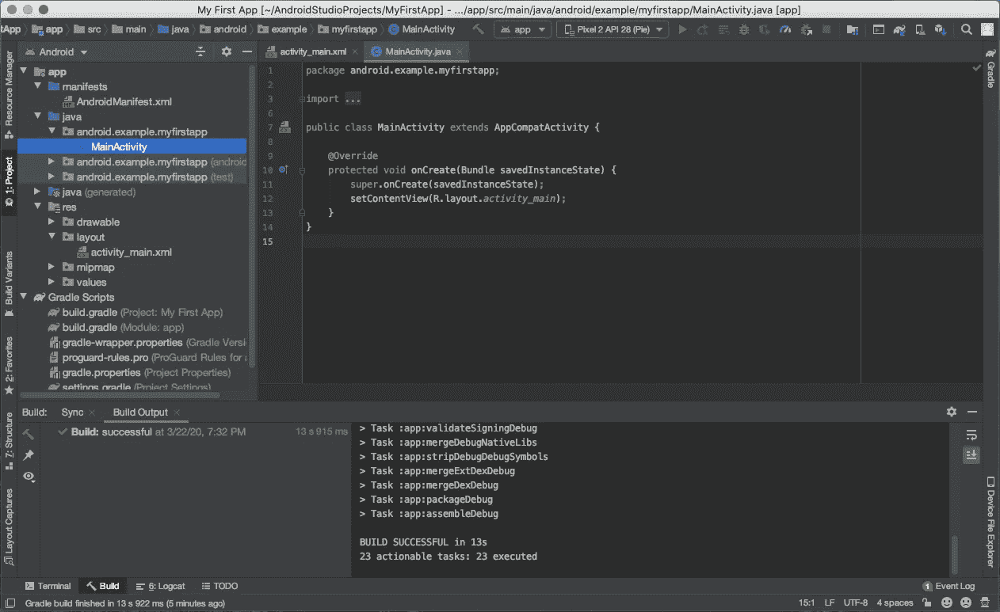

# 以下是一致性如何提高代码的可读性

> 原文：<https://betterprogramming.pub/heres-how-consistency-improves-your-code-s-readability-644d64b142b5>

## 没有什么比始终如一的工程师更有价值了


托拜厄斯·凯勒在 [Unsplash](https://unsplash.com?utm_source=medium&utm_medium=referral) 上的照片

**写代码很难。如果语法错误、参数错误或数据损坏，您的代码将无法运行。有成百上千的事情使你的代码无法执行。**

编写可读的代码更加困难。在学习了语言和相关的框架之后，你终于能够编写一些你的计算机能够理解的代码了。然而，其他人可能看不懂你的代码——即使有你有用的(至少在你心里)注释的帮助。

代码可读性的问题不仅发生在初级开发人员身上，如果他们没有从一开始就学会正确的习惯，也会发生在经验丰富的开发人员身上。在这篇文章中，我想分享一些我用来编写代码的技巧，这些代码是可读的，因此从长期来看是可维护的，只需要遵循一个原则——一致性。

# 1.风格一致性

不同的编程语言可以有自己的风格指南，其中一些甚至是语法的一部分。尊重这些指导方针总是一个好的做法，尽管我可以理解开发人员在他们的代码中可以有某些变化。然而，在任何项目范围内，开发人员都应该采用相同的编码风格。

例如，您需要在项目中声明数组。许多数组都有多个项目。保持样式一致性和更好可读性的一种方法是让这些数组占据多行，每行只有一项，如下所示。如果有时使用单行声明一个长数组，而有时使用多行，可读性会降低。

```
array0 = [
    **"item_long_var0"**,
    **"item_long_var1"**,
    **"item_long_var2"** ]

array1 = [
    **"item_long_var0"**, 
    **"item_long_var1"**, 
    **"item_long_var2"** ]
```

再举一个例子，我们经常需要调用带有多个参数的函数，这会导致调用超出推荐的行宽。一些开发人员可能会采用以下风格。

函数调用

然而，由于各个参数的长度不同，很难看出为不同的函数调用传递了什么参数。相反，下面的样式可读性更好，这在函数涉及多个参数时特别有用。

函数调用—可读性更好

当然，您的代码可以采用许多不同的风格。但我只想重申:保持你的风格一致，使用可读性最好的。

# 2.一致命名

无论您使用哪种编程语言，遵循命名约定都是非常重要的。说到命名，不要多此一举。想想你自己的名字或者你孩子的名字。你可能遵循你的文化习俗，对吗？你不想把你的女儿叫做 David，或者把你的儿子叫做 Jessica——同样的原则也应该适用于你代码中的命名。

具体来说，一致的命名适用于三个方面。

*   首先，按照你的语言习惯，始终如一地使用骆驼格或蛇格。例如，在 camel case 命名中，实例变量通常命名为 varName，而类命名为 ClassName。此外，这些名称应该清楚地反映它们是什么。例如，函数的名字应该表明它们正在执行的工作。类的名字应该显示它们保存的数据。
*   **第二，相关的变量、函数或者做相关事情的类，要有相似的命名，以体现它们之间的密切关系。**例如，假设您正在为一个团队类创建多个实例。将它们称为`t0`、`tm1`、`team2`和`tem3`并不是一个好主意。相反，它们应该被称为`team0`、`team1`、`team2`和`team3`。不要害怕起一个长名字——一个有意义的长名字总比一个不清楚的短名字好。
*   **第三，文件名要命名一致。很明显，文件名应该反映它们的内容。但是除此之外，一致的文件命名使您更容易理解它们是什么。例如，在 Swift 中，我们可以命名一系列子类为`UIViewController`的文件，使它们以`ViewController`结尾，比如`UserProfileViewController`和`UserDashboardViewController`。**

# 3.结构一致性

我们在不同的层次上编写代码。一些底层代码块可以包含函数、循环等等。一些更高的块包括类和模块。对我们来说，以一致的方式编写这些不同层次的代码是很重要的。

我们就用一个写函数的例子。我们都知道，编写好的函数是任何项目中最关键的任务之一。假设我们从下面的函数开始，比如说`getProcessedData`。

功能的结构一致性——原型

一旦我们建立了函数的原型并发现它可以工作，就该重构函数了。一些开发人员可能倾向于创建重构版本，如下所示。

功能中的结构一致性—重构

您可能会注意到，这个版本将一堆代码转移到具有适当名称的独立函数中，以表明它们的预期用途。大概是因为格式化的长度较短，与格式化相关的代码仍然是`getProcessedData`函数的一部分。然而，这种重构并没有遵循结构一致性原则——这些代码行处于不同的抽象层次。**为了创造更好的可读性，我们应该考虑在相同的抽象层次上编写代码，而不管抽象组件的长度**，如下所示。

功能中的结构一致性—重构得更好

除了函数之外，同样的结构一致性应该适用于您正在创建的类。相关的考虑包括应该如何对实例和类变量进行排序，如何对实例和类函数进行排序，等等。计算属性怎么样？通过应用结构一致性原则，你和你的读者会更容易找到东西。

# 4.目录/文件布局一致性

随着项目范围的扩大，您在工作项目中创建了越来越多的文件和文件夹。如果你不管理这些文件，你的项目会被认为是一团糟。当你向你的同事展示你的作品时，每个人都会很头疼，可能包括你自己，试图弄清楚这些文件是什么，在哪些文件中你可以找到你需要的。

例如，当你在 Android Studio 中启动一个项目时，你会有一个自动生成的目录树，如下所示。



Android 项目文件结构(来源: [Android 官网](https://developer.android.com/training/basics/firstapp/creating-project))

很明显，模板不仅仅使用一个什么都有的文件夹。相反，它有不同的文件夹和各自的作业。例如，你的资源相关文件应该放在`res`文件夹中，而你的代码应该放在`java`文件夹中。更重要的是，当你的应用程序很复杂时，你应该在`java`文件夹中有子目录，例如，你可以有一个数据模型文件夹，或者你可能有一个视图文件夹，等等。

我不认为有一个放之四海而皆准的解决方案，但是你应该用一个有意义的组织来开发你的文件结构，并始终如一地使用它，这是提高你整个项目的可读性和可维护性的关键。

# 结论

同样，编写可读的代码并不简单——对于初学者来说很难，对于经验丰富的程序员来说也很难。在我看来，对于每个程序员来说，提高代码的可读性都是一个终身学习的过程。我只是分享了我从十多年的编码工作中学到的技巧。请随意分享你对代码可读性的看法，这样我们可以一起提高。

感谢您阅读这篇文章。