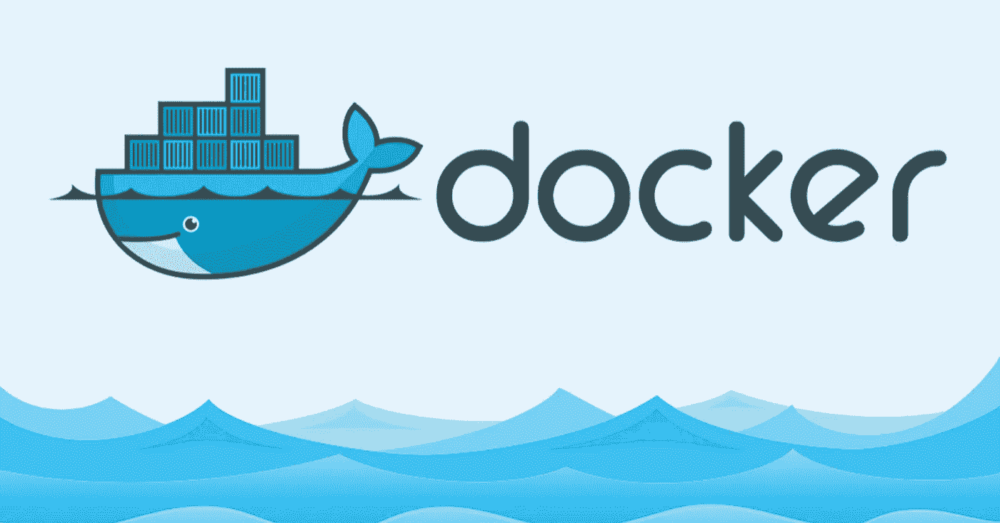
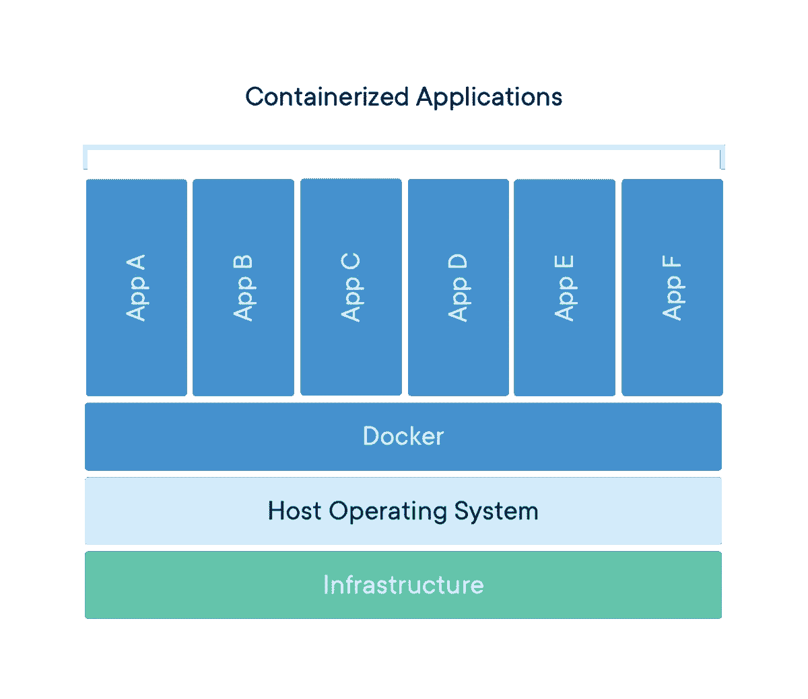
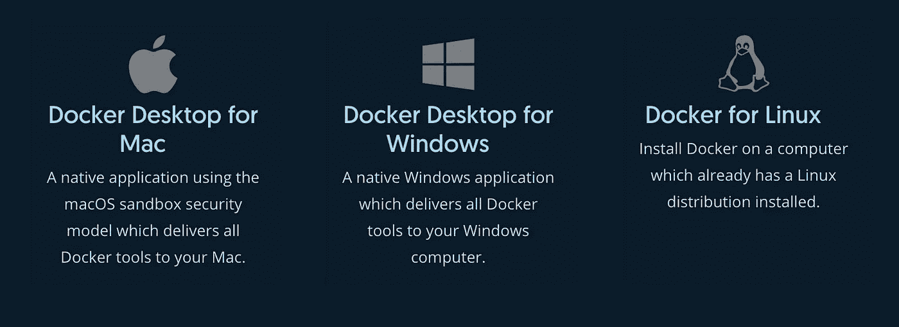
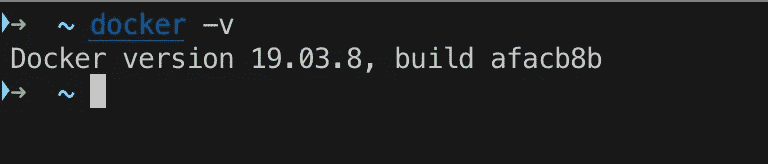
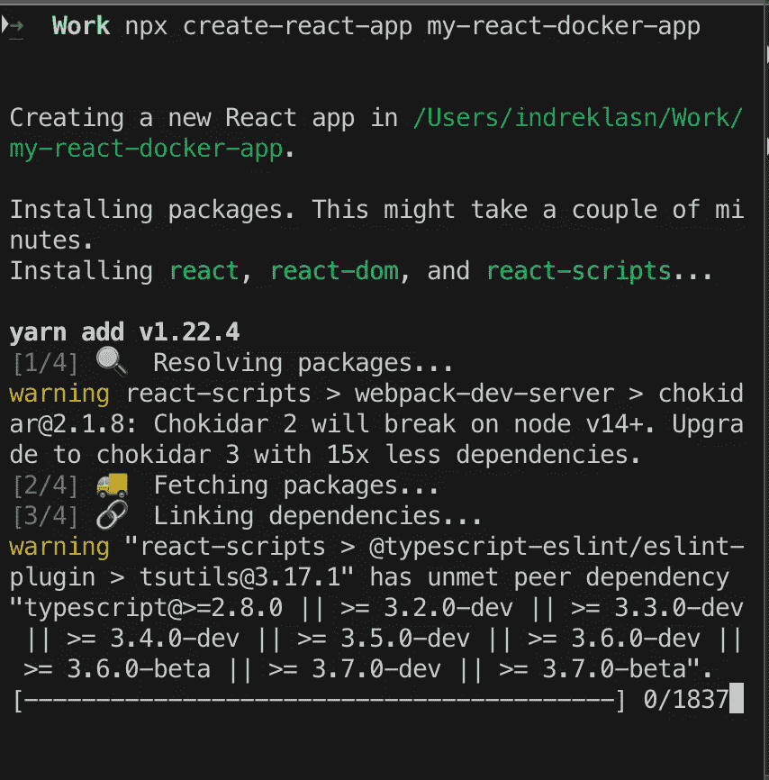
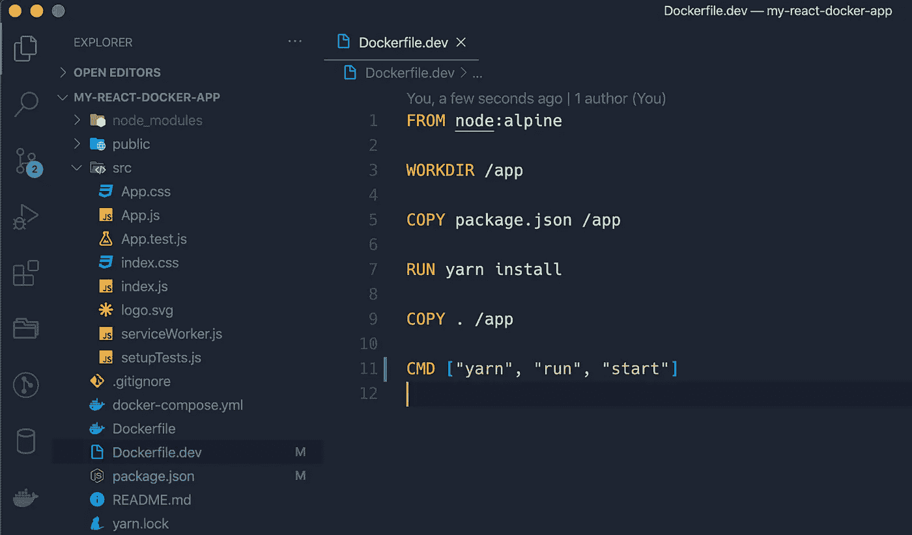
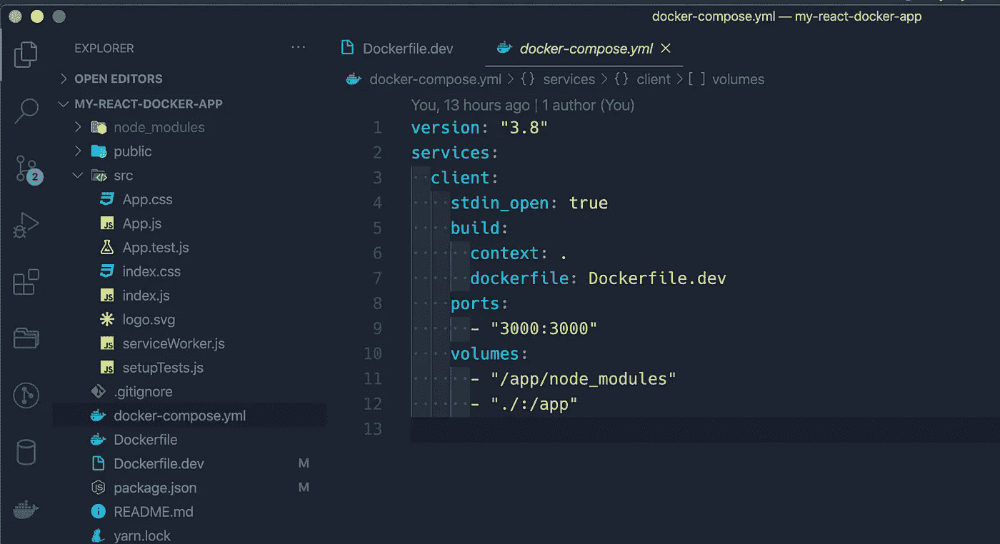
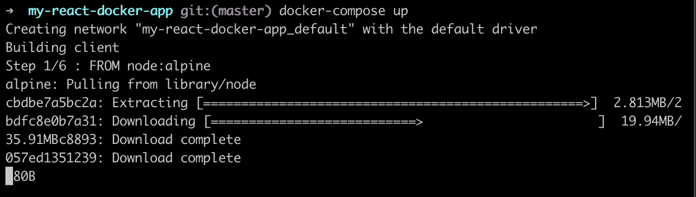
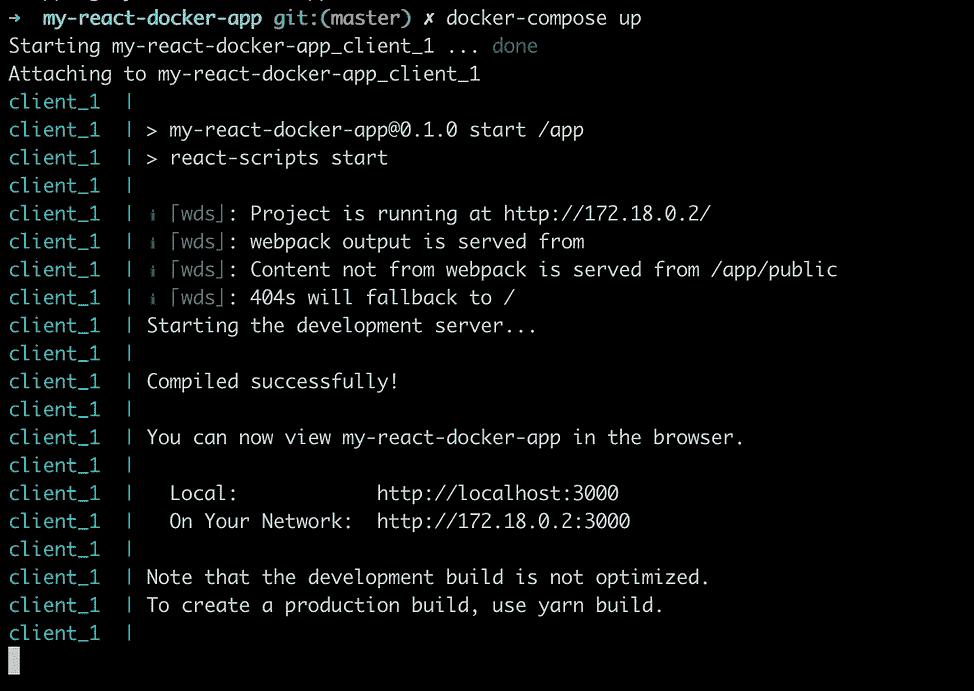
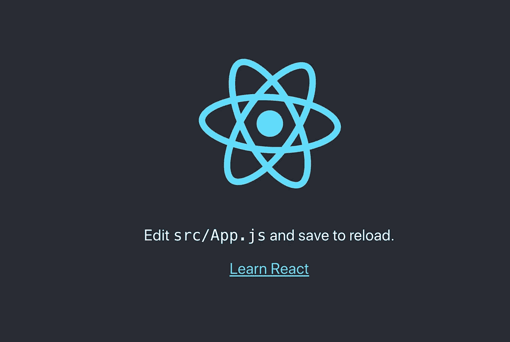

# 以下是如何使用 Docker 和 React 的方法

> 原文：<https://betterprogramming.pub/heres-how-you-can-use-docker-with-create-react-app-3ee3a972b04e>

## 如何将 Docker 和 React 应用程序结合起来

图片来自 [Docker](https://www.docker.com/)

Docker 可能是将所有服务放在一个容器中运行的最流行的解决方案。容器允许我们在同一个环境中运行和开发应用程序，不管你在什么机器上。

容器是一个标准化的软件单元，它允许开发人员将他们的应用程序从环境中隔离出来，解决了“它在我的机器上工作”的头痛问题。

什么是 Docker 容器？—来源:【Docker.com 

容器是应用程序层的抽象，它将代码和依赖项打包在一起。多个容器可以在同一台机器上运行，并与其他容器共享 OS 内核。

当您部署应用程序时，您必须在主机系统上安装所有的依赖项(MySQL、Node、Redis)。使用 Docker，您只需指定一个列出项目所有依赖项的 Docker 文件，而不是管理主机系统。

Docker 从所有这些依赖关系中构建了一个映像，我们可以在多台计算机上重用它。Docker 用户可以将图像存储在私有或公共的[存储库中](http://hub.docker.com/)，然后从那里部署容器、测试图像并共享它们。

可以把 Docker 应用程序想象成微型容器，它们有自己的文件系统和专用 RAM，但与主机操作系统共享一个内核。

# 以下是你应该考虑使用 Docker 的几个原因

*   Docker 有助于提高运输环境的可预测性。
*   解决了“在我的机器上工作”的问题。
*   您可以在项目和团队之间共享和重用 Docker 容器。

# 安装 Docker

您可以在多个平台上下载并安装 Docker。请参考以下部分，并选择最适合您的安装路径。点击此 [**链接下载 Docker**](https://docs.docker.com/get-docker/) 。

安装 Docker —来源:[https://docs.docker.com/get-docker/](https://docs.docker.com/get-docker/)

# Docker 安装确认

在机器上安装 Docker 后，打开终端并键入以下内容。您应该在控制台中看到一个 docker 版本。但是，如果您没有看到版本，请重新安装或重新启动您的机器。

作者提供的截图。

# 创建 React 项目

创建 React 应用程序不处理后端逻辑或数据库；它只是创建了一个前端构建管道，因此您可以将它用于任何后端。在引擎盖下，它使用 [Babel](https://babeljs.io/) 和 [webpack](https://webpack.js.org/) 。

注意:`npx`不是错别字，是 npm 5.2+ 自带的[包运行器工具。](https://medium.com/@maybekatz/introducing-npx-an-npm-package-runner-55f7d4bd282b)

用 [CRA](https://github.com/facebook/create-react-app) 创建一个新的 React 项目

# 将 React 应用程序归档

接下来，用您最喜欢的文本编辑器或 IDE 打开 React 项目。我们需要为 Docker 创建以下三个文件:

*   `Dockerfile`:一个`Dockerfile`是一组用于构建图像的指令。在这个文件中，我们声明了我们希望在项目中使用的软件。例如，对于 React 项目，我们需要 Node.js. Dockerfile 通常用于生产目的。
*   `Dockerfile.dev`:与上述`Dockerfile`概念相同，a `Dockerfile`与`Dockerfile.dev`的主要区别是前者用于生产环境，后者用于本地开发环境。
*   `docker-compose.yml` : Compose 是一个定义和运行多容器 Docker 应用的工具。使用 Compose，您可以使用 YAML 文件来配置应用程序的服务。然后，只需一个命令，您就可以从您的配置中创建并启动所有服务。要了解更多关于 Compose 的所有特性，请参见[特性列表](https://docs.docker.com/compose/#features)。

# 编码 docker 文件

当我们开始一个新的 Docker 项目时，Docker 对 React、Node 或项目一无所知。我们需要明确地告诉 Docker 我们需要什么软件来运行我们的项目。例如，我们知道对于一个 React 项目，我们肯定会使用 Node.js 和 NPM 或 Yarn。

# Dockerfile.dev

接下来，打开`Dockerfile.dev`并编写以下内容。

Dockerfile.dev —我们用于开发目的的 docker 文件。

## 下面是正在发生的事情:

*   我们告诉 Docker 获取 Node 的副本，并将它的 Linux 发行版指定为 Alpine。Docker 默认使用 [Alpine Linux](https://alpinelinux.org/) 发行版。为什么是阿尔卑斯山？Alpine Linux 比大多数发行版基础映像要小得多(大约 5MB)，因此一般来说映像也要小得多。
*   接下来，我们用`WORKDIR`命令为 Docker 容器设置工作目录。一旦我们声明了一个工作目录，任何`CMD`、`RUN`、`ADD`、`COPY`命令都将在指定的工作目录中执行。
*   将 React 项目中的`package.json`复制到 Docker 容器中。
*   安装依赖项，并将应用程序的其余部分复制到 Docker 容器中。
*   最后，运行开发脚本。对于 CRA 来说，现在是启动开发服务器的`yarn run start`。

Dockerfile.dev

# 设置 docker-compose.yml

记住， [Compose](https://docs.docker.com/compose/) 是一个将所有 docker 命令和服务链接在一起的有用工具。让我们创建一个名为`client`的服务，并指定它应该做什么。

docker-compose . yml——我们在这里创建服务于 React 应用程序的客户端服务。

## 以下是 docker-compose.yml 文件中发生的情况

*   我们为 Compose 指定一个版本。确保 Compose 与 Docker 兼容，[这里是所有版本的完整列表](https://docs.docker.com/compose/compose-file/compose-versioning/)。在写这篇文章的时候，版本`3.8`是最新的版本，所以我们将使用它。
*   定义`client`服务，这样我们就可以在隔离的环境中运行它。
*   `client`服务需要指定一个 docker 文件。对于开发，我们将使用`Dockerfile.dev`文件。
*   接下来，我们将端口`3000`映射到 Docker。React 应用程序运行在端口`3000`上，因此我们需要告诉 Docker 为我们的应用程序公开哪个端口。

# 使用撰写

一旦我们完成了配置的编写，我们只需运行`docker-compose up`命令，Docker 就会为我们构建好一切。

首次运行 docker-compose up

您应该看到我们在 Dockerfile.dev 中声明的所有命令都被执行了。一旦 Compose 完成了它的工作，我们就可以在`[http://localhost:3000/](http://localhost:3000/)`打开 React 应用程序。

在 [http://localhost:3000/](http://localhost:3000/) 运行 docker-compose up 和 React 应用程序

好了，现在我们准备开发我们的 React 应用程序。如果您遇到了任何问题，请查看本文的 [GitHub 库](https://github.com/indreklasn/my-react-docker-app)。

[看看第 2 部分](https://medium.com/better-programming/production-ready-react-with-docker-and-travis-ci-8e2ae559f26c)，我们将在这里讨论如何使用 Docker 进行生产和持续集成。

 [## 与 Docker 和 Travis CI 进行生产就绪型互动

### 与 React、Docker 和 Travis CI 一起从零到生产英雄

medium.com](https://medium.com/better-programming/production-ready-react-with-docker-and-travis-ci-8e2ae559f26c) 

**附言:寻找编码创意/挑战？永远不要耗尽编码的想法，永远不要。** [**在这里获取权限，来一堆被我挑战的前端。**](https://gumroad.com/l/IuqKc)

了解我最新内容的最好方式是通过我的[时事通讯](https://wholesomedev.substack.com/welcome)。成为第一个得到通知的人。

我的[简讯](https://wholesomedev.substack.com/welcome)。成为第一个得到通知的人。