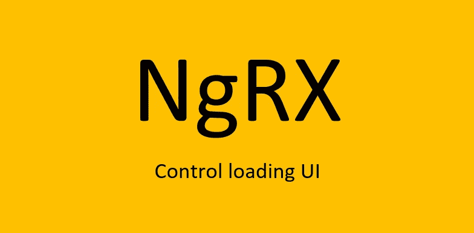

# 这里有一个 NgRx 模式来控制你的角度加载动画

> 原文：<https://betterprogramming.pub/heres-one-ngrx-pattern-to-control-your-angular-loading-animations-f15bc3c4a1dd>

## 控制从 NgRx 效果加载屏幕

作者图片

如果您使用 NgRx 进行状态管理，那么没有比 NgRx Effects 更好的地方来管理您的加载 UI 了。

当制作数据库 CRUDs 或执行用 NgRx Effects 实现的异步任务时，不要在组件中摆弄加载屏幕，而是尝试在 Effects 中使用这个简单的模式来控制 UI。这种模式干净、简单，并且可以轻松地扩展成你想要的任何数量的 UI 动画。你可以很容易地修改任何现有的效果，你必须使用这种模式。

本文假设您已经熟悉 NgRx 和效果。它不包括如何设置和使用 NgRx 的基础知识。

# 这种模式是如何工作的

这种模式使用 NgRx 存储中的一个`ui`对象来切换在`app.component.html`或任何其他组件中加载动画。

首先，在一个动作文件中创建一个动作。您还可以创建一个新的动作文件来专门处理您的 UI。创建一个专门处理 UI 加载的文件可能是明智的，因为你必须将你的动作导入到许多不同的效果文件中来处理你所有的 UI 需求，如果你不需要，你不希望将不必要的数据导入到一个效果中。让我们把这个新文件叫做`ui.actions.ts`。

下面是`ui.actions.ts` *的代码。*

接下来，创建一个名为`ui.reducer.ts`的减速器。对于每个异步检索数据的效果，您需要在`ui`对象(第 9 行)中有三个属性以及它们的默认值。

在我们的例子中是:`gettingDocError: null, gettingDocSuccess: false, gettingDoc: false`。为了从其他效果中控制 UI，您为该效果添加了三个不同的属性，比如`someOtherAsyncError: null, someOtherAsyncSuccess: false, gettingSomeOtherAsync: false`。`ui.reducer.ts` 文件应该是这样的:

继续效果:所有的控制都发生在这里，如下面的代码块所示，它显示了文件`some.effects.ts`。这是打开和关闭加载/成功/错误屏幕的地方。您可以将`ui.actions`导入到任何想要控制加载 UI 的效果文件中。我在下面的代码中的第 8 行导入了`ui.actions`。

在效果`GetDocFromFirebase$`(第 20 行)中，有三个`ui`对象属性被切换——一个表示错误，一个表示成功，还有一个向用户表明正在获取数据。这些是:`gettingDocError`、`gettingDocSuccess`和`gettingDoc`。

一旦效果被调度，在调用异步数据之前，这些变量应该被设置为新值，如第 24 行所示。`gettingDocError`和`gettingDocSuccess`应重置为默认值，因为它们在`ui.reducer.ts` *中。*

要切换这些属性，使用`tap`操作符来分派包含对象`{ gettingDocError: null, gettingDocSuccess: false, gettingDoc: true }`的`new uiActions.Ui({})`。注意，`gettingDoc`属性被打开，从而导致`app.component.ts`中的加载 UI 屏幕被显示给用户(这将在后面描述)。

缩减器`ui.reducer.ts` 将接收该对象，并将存储对象`ui`设置为这些值。

在第 30 行，在数据从后端返回后，属性`gettingDoc`被设置为`false`，这将取消在获取数据时显示给用户的`app.component.ts`中的加载 UI 屏幕。同时,`gettingDocSuccess`属性切换到`true`,向用户显示成功屏幕。

在第 32 行，`gettingDocSuccess`属性被切换到`false`，因此成功屏幕被关闭。为此，在`tap`操作器中使用了`2s`中的`setTimeout`。这意味着用户将会看到两秒钟的成功屏幕。

最后，你需要考虑到错误。如果在检索数据时出现错误，这将被底部的`catchError`操作符捕获(如果在第 26 行出现错误，第 27 行和第 36 行之间的所有其他操作符将被跳过，只有`catchError`将运行)。

用`return of(new uiActions.Ui({ gettingDocError: err, gettingDoc: false })`设置`gettingDocError`属性(第 39 行)。这将打开错误屏幕，以便用户可以看到有错误并采取行动。

注意，`gettingDoc`属性同时也被设置为`false`。这是因为当动作开始时，`gettingDoc`属性被设置为`true`，向用户显示加载屏幕，现在加载屏幕必须关闭。

在第 41 行，`gettingDocError`属性在四秒钟后使用`setTimeout`被重置回 null。这意味着用户将会看到 4 秒钟的错误屏幕。这就完成了异步获取数据的一个动作的加载屏幕的处理周期。

现在是简单的部分——向用户显示加载屏幕。在`app.component.ts`中，添加类级变量:
`ui$ = this.store.pipe(select(fromAuth.ui));`(第 11 行)

在`app.component.html`中，使用`| async`订阅`ui$`，并使用`*ngIf="(ui$ | async)?.gettingDocError !== null"`打开和关闭错误`div`。请注意，在上述`some.effects.ts`中的效果`GetDocFromFirebase$`中，错误是用错误消息字符串设置的，而不仅仅是`true`或`false`，因此现在可以向用户显示该错误消息。

对`gettingDocSuccess`和`gettingDoc`进行同样的操作。你可以像我一样为每个装载场景创建特殊的组件——例如，`<app-ui-error>`、`<app-ui-success>`和`<app-ui-gettingDoc>`。在这些定制组件中，您可以拥有您想要的任何东西，比如 gif、CSS loaders、SVG 或图片。

您不必只使用`app.component.ts`中的加载动画。您可以订阅任何组件中的`ui`对象，并使用`| async`控制该组件模板中动画的加载。

# 结论

在为`ui`对象设置了初始动作和 reducer 之后，这种模式是高度可伸缩的。现在，所有对数据库的异步调用都可以干净、轻松地触发 UI 动画。

感谢阅读。如果你喜欢这篇文章，可以考虑[在这里](https://craftedwebpages.medium.com/membership)订阅中级会员，以获得数以千计的其他文章。

以后我会发更多 Angular，RxJS，NgRx，通用编程的文章。