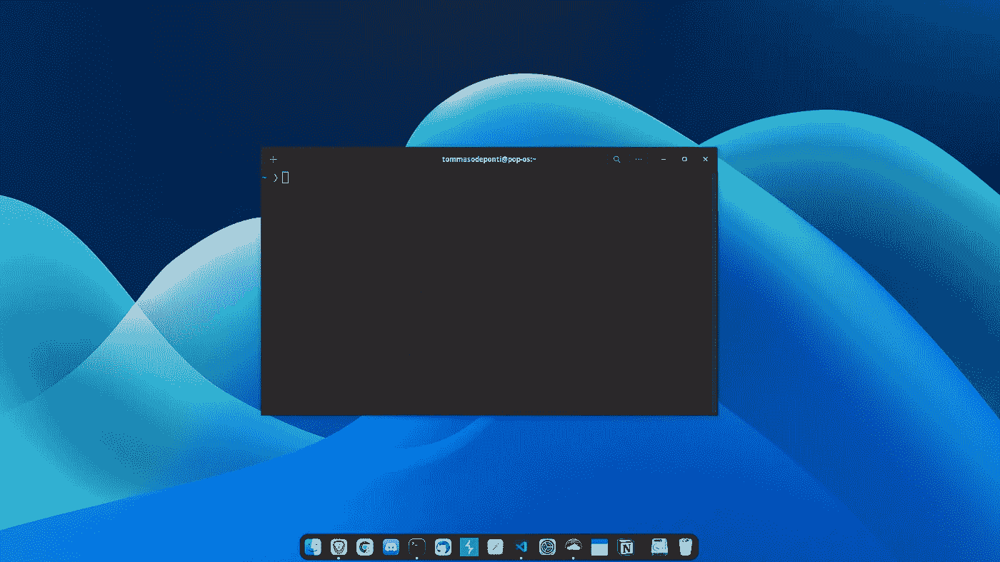

# 这是改变你的操作系统设计的 CSS

> 原文：<https://betterprogramming.pub/heres-the-css-to-change-your-operating-system-s-design-2d493b89bc96>

## [GNOME]做你自己的设计，如你所愿


由 [Neven Krcmarek](https://unsplash.com/@nevenkrcmarek?utm_source=medium&utm_medium=referral) 在 [Unsplash](https://unsplash.com?utm_source=medium&utm_medium=referral) 上拍摄的照片

我刚开始流行音乐的时候！_OS 在我的全新电脑上(实际上是我的第一台台式电脑)大约一年半前，快速看了一眼它的极简界面，让我从一开始就欣赏到了它的设计。这是我尝试过的最干净的 Linux 发行版之一，但是在过去的 3 年里我一直使用 MacBook air，与 macOS 的设计相比，它缺少了一些东西。

在过去的一年里，爸爸！_OS 不断改进其设计，其中最重要的变化无疑是宇宙码头。这是多么流行！_OS 在我的第二个屏幕上默认显示(带有 macOS 图标):



这样的设计，连苹果团队都开始担心了。但还有:你不喜欢什么？随时可以改！

*请注意，这篇文章是为 GNOME 用户写的(部分是为所有使用 GTK 的用户写的)，如果你正在使用 KDE，你会找到其他资源来达到同样的效果。如果你用的是 Windows 或者 macOS，建议你创建一个 Pop！_OS 虚拟机来尝试一下(也许你最终会把它作为主要的操作系统)。*

上面的图片是我的第二个屏幕的原因是:它只显示了 dock。没有顶栏，没有应用切换弹出窗口(cmd+tab)，没有工作区切换对话框，没有应用搜索输入，等等。所有这些东西(包括你的窗口的外观)都可以按照你的喜好修改成 CSS 代码。这是可能的，因为 gnome(不仅仅是 Gnome)支持自定义主题。

在这篇短文中，我将向您展示如何获得您必须更改操作系统外观的 CSS 代码，以及一些如何导航这些代码的提示，因为这并不容易。

# 主题

如果您使用 Linux 已经有一段时间了，您可能会在某个地方注意到您的主目录中有一个`.themes`文件夹，如果您还没有，那么现在是时候了。

我们要做的基本上是克隆操作系统的默认主题(或者你正在使用的主题)，并根据我们的喜好修改它的 CSS 代码。

让我们从克隆主题目录中的默认主题开始:

```
cd ~/.themes
git clone [https://github.com/heytdep/Custom-Pop-_OS-Dark.git](https://github.com/heytdep/Custom-Pop-_OS-Dark.git)
```

我还建议安装 GNOME 调整工具，以便在命令行之外改变主题:`sudo apt install gnome-tweaks`。

你将主要只处理你新创建的`Custom-Pop-_OS-Dark`主题的两个文件:`Custom-Pop-_OS-Dark/gnome-shell/gnome-shell.css`和`Custom-Pop-_OS-Dark/gtk-3.0/gtk.css`。第一个将允许你修改你的操作系统的整体外观:顶部栏，工作区切换器，应用切换器，搜索框，顶部栏菜单，日历，应用搜索等。另一方面，gtk CSS 文件可以修改应用程序的外观:动作栏、最小化、最大化和关闭按钮等。

我个人并没有对最初的设计进行太多的调整，因为我已经非常喜欢它了，但我确实改变了一些东西:

*   栏顶横木
*   顶栏菜单
*   应用角落
*   应用切换器

## 栏顶横木

翻到`gnome-shell.css`文件，搜索`/* Top Bar */`评论。`#panel`里面的 CSS 代码会告诉 GNOME 你的顶栏应该是什么样子。我在这里做的是:改变背景和文字颜色，改变高度(使其变小)。我还在工具栏的按钮上添加了一个悬停属性，这样当鼠标悬停在按钮上时，按钮就会高亮显示:

```
#panel .panel-button:hover {
   background-color: rgba(43, 43, 43, 0.281);
   box-shadow: none;
}
```

## 顶部栏菜单

改变了顶栏的颜色，我也改变了顶栏菜单弹出窗口的颜色，同样一个简单的`background-color:`和`color:`就可以了。当你阅读顶部的 CSS 代码时，你会发现正确的选择器。

## 应用切换器

与顶部栏类似，在`gnome-shell.css`中搜索`/* App Switcher */`将会找到应用切换器的选择器。当在切换器中选择或勾画应用程序时，您可以从那里修改其属性:

```
.switcher-list **.item-box:outlined** {    background-color: rgba(246, 246, 246, 0.3); }  
.switcher-list **.item-box:selected** {    background-color: rgba(246, 246, 246, 0.3);    color: #F6F6F6; }
```

如果除了应用程序框之外，你还想改变切换器的设计，你需要搜索`.switcher-list`类，它是在第 31 行和其他元素一起被选中的。如果您希望单独更新切换器而不影响其他元件，只需从`.workspace-switcher-container, **.switcher-list**, .resize-popup, .osd-window`(第 31 行)中移除`.switcher-list` ，并单独选择它:

```
.switcher-list {  color: #F6F6F6;  background-color: rgba(44, 44, 44, 0.7);  border-radius: 12px;  padding: 12px; }
```

## 改变应用的角落

我喜欢我的应用程序的角比默认设置更圆，如果你打开了`Custom-Pop-_OS-Dark/gtk-3.0/gtk.css`文件，找到下面的代码片段:

```
.background .titlebar:backdrop, .background .titlebar {  border-top-left-radius: 4px;  border-top-right-radius: 4px; }
```

并通过修改两个边框半径属性来随意更改圆度。

# 做出改变

打开“gnome tweaks”应用程序，打开外观，然后在“Shell”和“Applications”下拉列表中选择“Custom-Pop-OS-Dark”。

或者，您可以使用`gsettings`命令行工具，例如，要更新 shell 主题，您将使用以下命令:

```
gsettings set org.gnome.shell.extensions.user-theme name 'Custom-Pop-OS-Dark'
```

# 外卖食品

这里最重要的收获是学会浏览这些大型 CSS 文件，对我帮助最大的是:

*   了解窗口设计术语的基础，如标题栏、顶栏、切换器、菜单等等，以便快速搜索到所需的选择器，而不是通读整个文本。
*   有时搜索值而不是键，例如，如果您想要更改某个项目的颜色，但找不到选择器，请截屏颜色并使用工具来查找该颜色的准确十六进制或 RGB 值，这样您就可以在 CSS 文件中搜索它。

我希望你觉得我的文章有用，感谢阅读！