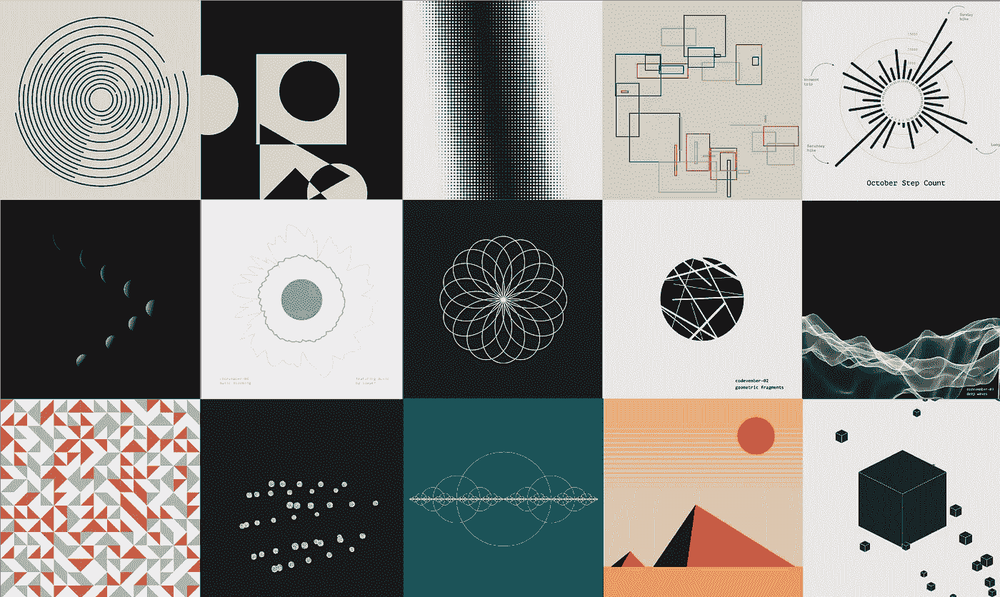
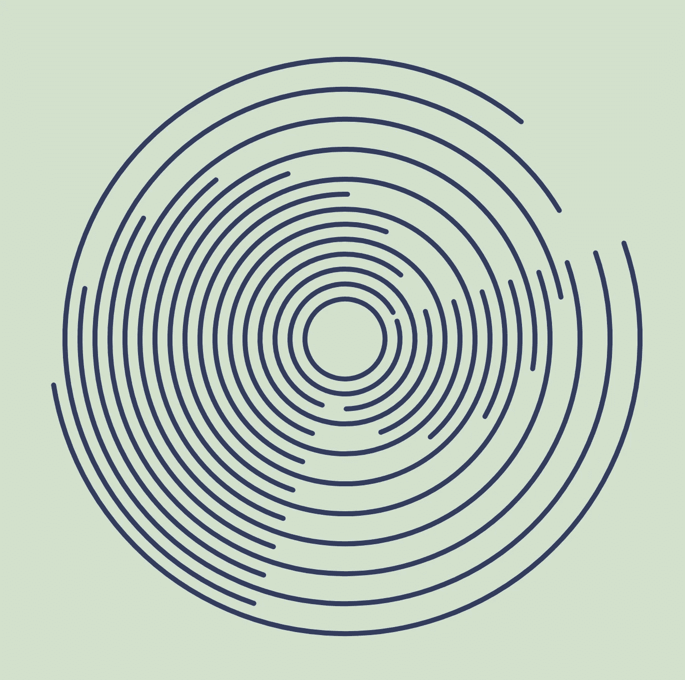
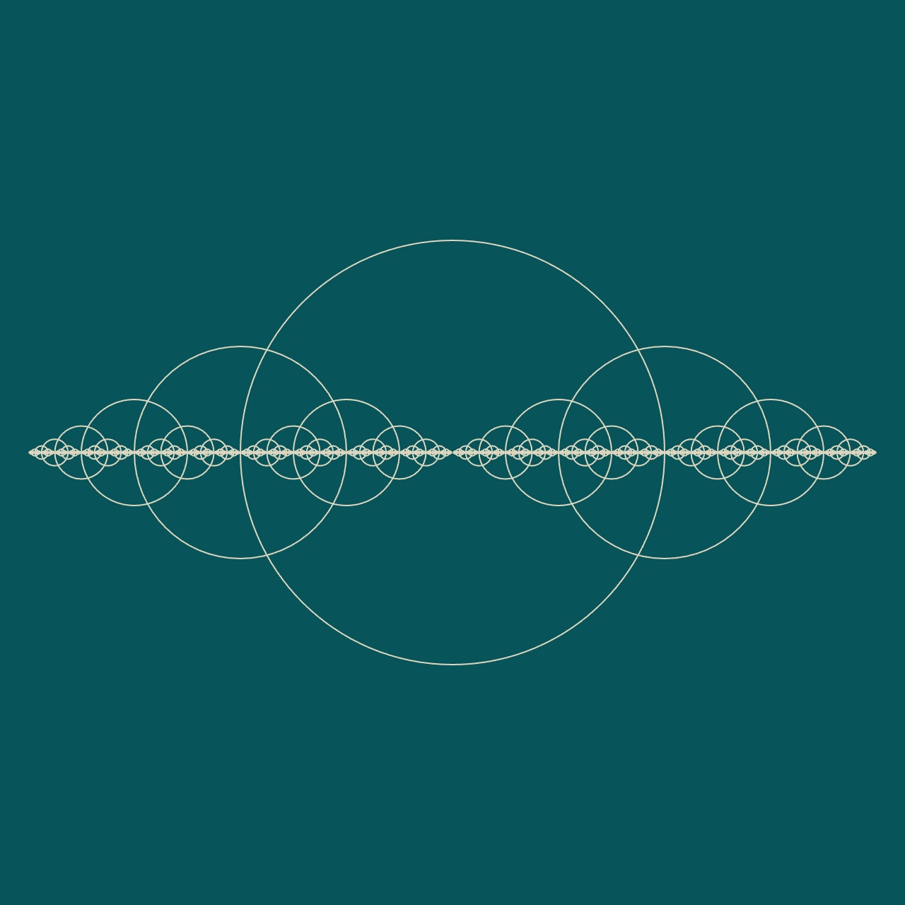

# 以下是我从 30 天创造性编码(11 月份代码回顾)中学到的东西

> 原文：<https://betterprogramming.pub/heres-what-i-learned-from-30-days-of-creative-coding-a-codevember-retrospective-8c05a8497d24>

## 对自己宽容点。尝试新的东西。公开学习

在我长达一个月的创造性编码之旅中，我最喜欢的一些草图。你可以在 GitHub 上查看所有 30 张草图。

大约两个月前，我决定参加一个实验:在 30 天的时间里，我将只使用基于一个单词提示的代码来编写一个新的创意草图。每一天。

你们中的一些人现在可能已经很熟悉了，但是我要说的是一年一度的[# 11 月号](http://codevember.xyz/)挑战赛。我第一次发现这个挑战是在 2018 年，但我没有勇气真正参与进来(瘫痪的[新开发者冒名顶替综合症](https://www.codingdojo.com/blog/programmer-imposter-syndrome))。但 2019 年是我的时间。有一段时间，我一直潜伏在 [p5.js](https://p5js.org/) 社区的阴影下，所以我认为这将是最终更好地学习这个 JavaScript 库的好机会。我也想:

*   更好地掌握 JavaScript
*   从数据 viz(我的日常工作)中休息一下，玩玩创造性的编码
*   每天创造一些新的东西来摆脱我感觉到的创造性的老路

第 28 天:重复弧线

11 月结束时是令人疲惫、刺激、挑战和鼓舞的一个月。我在很短的时间内学到了这么多，几乎多到无法合理吸收和保留。所以现在，比预期的晚了一点，我花了一些时间回顾过去。以下是我学到的。

# 11 月份的经验教训

## 我们都站在代码巨人的肩膀上

我一个月看的代码教程比我三年看的都多。我浏览了无数开源 Javascript 包的 GitHub 仓库。我在 Twitter 和 Instagram 上搜索，寻找其他有创造力的程序员来从中汲取灵感。

事情是这样的:如果没有开源创造者，互联网就不会有今天。

一次又一次，我被那些构建有创意的开源包并免费分发的人所震惊。起初，我为采用其他代码并对其进行调整以开始我的草图而感到内疚。但后来我了解到，我们现在是这样建造东西的:我们找到启发我们的项目，从别人建造的东西中学习，然后建造我们自己的新东西。

我从许多人和软件包维护者那里学到了东西，但是我觉得有必要为一些人大声疾呼:

*   [P5.js](https://p5js.org/) (还有[加工基金会](https://processingfoundation.org/)):我绝对爱上了这个图书馆。它向新的人口统计数据开放编码，并真正让你沉浸在创造性的体验中。和我一起在[从财政上支持这个开源项目](https://processing.org/download/support.html)，这样它就能保持令人敬畏。
*   丹尼尔·希夫曼:男人，神话，传奇。《编码列车》系列成了我黑暗时期的慰藉。当我缺乏灵感或者想不出如何编程某个东西的时候，他把我从深渊中提了出来。视频结束时，我似乎总是在微笑。真的，编程界的罗杰斯先生。
*   Matt DesLauriers :我在 11 月前几个月发现了 Matt 的作品，并立即将他加入了我的书签。他的[创造性编码报告简介](https://github.com/mattdesl/workshop-p5-intro/blob/master/README.md)和[故障页面](https://p5-demos.glitch.me/)成为我最常参考的资料之一，因为我学习了 p5.js 中编码的来龙去脉。他还使用纯 js 和 [Canvas](https://www.w3schools.com/html/html5_canvas.asp) 编写了几个[开源包](https://github.com/mattdesl/pack-spheres)，看起来很棒。

## 如果你想学习新的东西，开始一个与工作相关的项目

我真的很纠结于技术和编程领域普遍存在的旁门左道文化。感觉好像每个人都在兼职开发一个应用程序，或者在我的领域里，当他们下班回家或者在周末的时候，创建大量很酷的数据可视化。但是我每天花六个小时或者更多的时间做数据可视化。大多数时候我喜欢它，但是回家做同样的事情让我感到疲惫。我想超越我的工作。

第三天:深浪。我使用了一个柏林噪声发生器来创建伪随机线路径。(网站有动画版！).

所以对我来说，做一些不是专门的数据可视化的事情真的很重要。这就是为什么我喜欢术语*工作邻近*——学习如何用代码绘图需要我在日常工作中使用的一些技能(JavaScript、设计、调试等)。)但是有了全新的自由，让我的思想自由驰骋。没有数据集来约束我的设计。我可以探索像随机性和生成伪随机算法这样的抽象事物。我可以创造东西只是为了好玩。

我有 90%的把握，如果我为 11 月的每一天做数据，我就不会完成。我会很快筋疲力尽。所以，如果你心中有一个项目，也许可以先问几个问题:这会不会感觉太像工作了？如果答案是肯定的，深呼吸，卸下一些你给自己的压力。也许是时候做一些有趣的事情了，或者是创造性的事情，而不是通过旁敲侧击来推进你的职业生涯。

## **每天做一些可怕又发泄的事情**

当你每天试图想出一个新的想法时，奇怪的事情就发生了。起初，你沉迷于细节，试图使每一个草图比上一个更好。然后你落后了几天，因为你拒绝发表最后一个草图，因为它“仍然需要一些东西”然后你落后了几天，不知道如何才能赶上，感觉像个失败者。

但最终，你会给自己一个机会。你不再那么关心了。你在工作完美之前就把它放在那里。现在，新的想法开始更快地流过你的身体，在你有机会粉碎它们之前，从你的手中逃脱，去呼吸生命。

第 30 天:分配幸福。不是最优雅的草图，但我喜欢最终的结果。随机多边形是基于函数生成的，然后放置在页面上，具有遮罩效果。

即使不完美，你也做得很好。你做得越多，学到的也就越多。

编程应该是有趣的，尤其是创造性的编程。所以对自己宽容点。犯错误。把一些东西放到这个世界上，然后一旦你给了它一个呼吸的机会，就回去修理它。多做几次就好了。

## **感觉像个骗子没关系。每个人都这样**

大多数时候，我觉得自己像是一个修改了别人代码的骗子。但是我会打开 Twitter，看到很多其他开发者表达他们的感受，好像他们对 JavaScript、Python 或者他们正在使用的任何东西都不够了解。

第十天:古老的金字塔。代码方面没有什么复杂的。只是一张纯粹由多边形组成的漂亮图片

如果你用代码创建任何东西，你可能需要继续学习新的技能。它从未停止。技术在发展，包在变化，新的工具在出现。即使是最有经验的开发人员和艺术家也必须花时间学习。他们和其他人使用同样的资源。

## **数学很美。数学是每个人的**

有时候你需要想象一些东西来理解它。我从来不认为自己是一个数学专家。从历史上看，我更倾向于创意的艺术/设计方面。数学是为数据科学家、工程师、天文学家等服务的。我只是用图片帮助他们的作品变得生动。

第 16 天:数学冥想。这张草图形象化了递归的概念。每个函数调用自己，直到达到预定义的值。

假的。如果# code 11 月为我做了什么，那就是把我变成了一个巨大的数学呆子。尽管我仍然不理解该领域的大部分内容，但在 p5.js 中可视化方程和算法揭示了数字背后的错综复杂和美丽。我习惯于用静态数据集创建图像，但将形状和颜色与不断演变的随机数据联系起来，为我打开了一个全新的世界。

不要被一个你不了解的领域吓倒。数学不仅仅是数学家的事。艺术不仅仅属于艺术家。

四处看看，涉足让你兴奋的事情，去做一些漂亮的东西。

# 资源

*   [我的 11 月草图](https://bendoesdata.github.io/experiments/codevember/index.html):这是一个包含了我这个月所有 30 个草图的页面
*   [OpenProcessing](https://www.openprocessing.org/browse/#) :在 p5.js 或 Processing 中发现并编写代码的网站(这里是[我的简介](https://www.openprocessing.org/user/186233)
*   如果你对创造性编码感兴趣，我强烈建议从这里开始。文档很棒，例子会让你马上开始！
*   Matt DesLauriers 的这份[创造性编码报告](https://github.com/mattdesl/workshop-p5-intro/blob/master/README.md)是一份令人惊奇的入门资源。
*   大量链接到创造性编码工具和资源的回购。