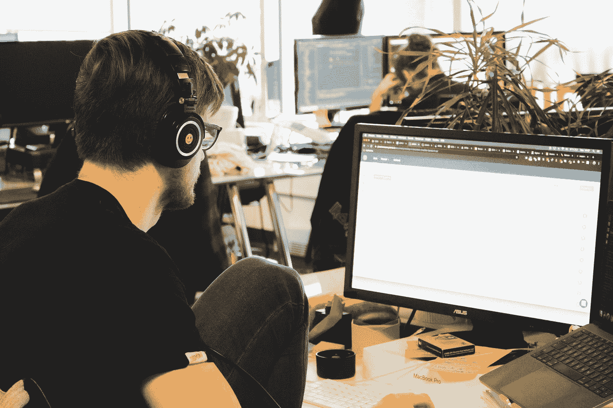

# 这就是为什么每个程序员都应该定义他们的“为什么”

> 原文：<https://betterprogramming.pub/heres-why-every-programmer-should-define-their-why-11c9c0f8d09e>

## **入门前想清楚自己为什么要做程序员**

[西格蒙德](https://unsplash.com/@sigmund?utm_source=medium&utm_medium=referral)在 [Unsplash](https://unsplash.com?utm_source=medium&utm_medium=referral) 上拍照

2018 年 11 月，我参加了加利福尼亚州弗里蒙特的 42 所学校 Piscine。对于那些不知道的人来说，Piscine 是 42 对编程世界的艰苦的 30 天介绍。那次经历，再加上之前自学的尝试，引发了我对奇妙的代码世界的最初兴趣。

从那以后，我一直在努力完成正规的计算机科学教育。至少可以说，计算机科学课程令人着迷。每天，我都被带入数据结构、离散数学、算法过程、计算理论以及渗透到学科范围的其他挑战性主题的空灵世界。

然而，当我艰难地走过每一堂迷人的课时，我发现自己又回到了一个核心问题:

这些有什么关系呢？我当初为什么要做程序员？

出于某种不为人知的原因，我的脑海里一遍又一遍地回想起这个问题。也许是因为对大多数人来说，计算机编程就像古代埃及学一样深奥(这是一门真正的学科，你应该去查一下！).

> 可能只是因为好奇到底是什么让我好奇吧。

不管怎样，在过去的几年里，我发现有必要定义——并重新定义——我追求程序员职业和学习计算机科学的主要原因。在接下来的内容中，我希望你能找到一个与你自己产生共鸣的简单理由。或者，最起码，我希望你会在一些小的方面受到鼓励，来定义你自己的为什么。

# 定义“为什么”

每当我学习一门新学科时，最困难的任务是找到一种方法将这门学科放入某种概念背景中。我发现，在我对一个主题的“如何”感兴趣之前，我总是需要知道“为什么”我不喜欢在真空中处理任何事情。需要有某种更大的故事，我可以把手头的主题放进去，解释为什么这个特定的主题很重要，以及这个主题如何与其他相关概念相互作用。

那么，为什么要做程序员呢？

在参加 42 学校鱼之前，我真的没有答案。是的，我有一套肤浅的“为什么”:主要是渴望一个好的挑战，当然，还有比以前每小时 15 美元的工作赚更多钱的机会。这不是我要问的“为什么”的问题。

真正要问的问题是，为什么*编程本身*很重要？

这个问题看起来很简单，但答案真的很重要。像其他事情一样，计算机编程的艺术不是一门可以在真空中学习的学科。在我们今天认为理所当然的花哨框架和软件栈下面，有高级编程语言。在这些高级编程语言之下，还有更低级的编程语言。在低级语言的下面，是汇编语言和机器码。在那之下，有计算机架构，甚至更低，有物理硬件。你明白了。

关键是，编程学科——以及更广泛的计算机科学——是一个更大框架的一部分，这个框架涵盖了从运行代码的机器的物理约束到产生机器本身的计算理论的一切。你不能解决“为什么编程”的问题而没有考虑到这个更大的背景。只有在这个更大的背景下，为什么的问题才变得有意义。

那么，在这种情况下，为什么呢？

我相信编程是重要的，因为它和被编程的机器一样，是让我们将解决问题的方法制度化的基本工具。在过去的一个世纪里，编程语言被用来解决以前无法想象的挑战。它们使得创造比人类所能获得的计算能力更强的机器成为可能。它们使星际旅行成为可能，并使整个世界的知识掌握在我们的手中。我知道这些都是很浮夸的术语，但是现实是我们经常低估现代编程语言的能力。

真正的编程实践者——真正的程序员——不会犯这种错误。正如我们所知，计算机科学的创始人，像乔恩·冯·诺依曼和艾伦·图灵这样的数学家，知道他们所开发的东西的重要性。他们知道他们试图解决的问题有多大。他们知道他们的解决方案无异于改变世界，事实也的确如此。他们致力于解决极其复杂的问题，结果，他们的工作产生了不可否认的原创解决方案——这些解决方案为下一个世纪计算机科学的发展奠定了基础。他们的焦点总是放在解决问题上。他们明白编程从根本上来说只是一种工具；真正的意义在于解决问题。

在他们的带领下，显然我们都应该这样做，我开始明白编程的真正“为什么”总是在于解决问题。编程只有在用于解决真正有意义的挑战时才有意义。

# 整理绒毛

在参加 Piscine 的时候，我努力与我的一些同学的思维方式产生共鸣。我遇到了很多同行，他们没完没了地谈论他们想要的开发人员工作类型或他们刚刚掌握的新潮新技术。有很多无意义的话题，比如“Angular vs. React”或“Javascript vs. Python”我当时不太清楚为什么，但每当这些对话开始时，我的眼睛就会变得呆滞，大脑中的脑细胞开始变慢。这些话题似乎并不重要。我现在知道原因是这些话题远没有我们通常认为的那么重要。

哪种技术比另一种更时尚并不重要。当我们把注意力集中在流行或不流行的东西上时，我们错过了谈话的真正精华是那些技术如何被用来解决困难的问题。解决问题一直是——也将继续是——重点。

# 结论

我不是从小就在电脑上编程长大的；几年前，我开始接触编程的艺术，寻找一些对我的生活有意义的事情。再过几年，我仍然坚信解决复杂问题的技能是有意义的。编程和计算恰好是选择的工具。

像诺伊曼和图灵这样的问题解决者明白这一点。他们是理解编程“为什么”的人。对我来说，我只是希望在他们巨大的阴影下，努力成为一个问题解决者——而不仅仅是一个“开发者”只有当我接受这种理解时，编程才是值得追求的。

正如我第一个承认的那样，我对这门学科的复杂性仍然非常天真。也许随着我获得经验，我的“为什么”会改变。事实上，我相信会的。

但是，现在，随着我在计算机科学的学习中不断前进，作为一名程序员我的能力也在不断提高，我开始了这个简单的，尽管有些理想化的目标陈述。

我希望这篇简单的文章对你有所启发或有所帮助。如果你有一套不同的“为什么”，请随时告诉我你的！