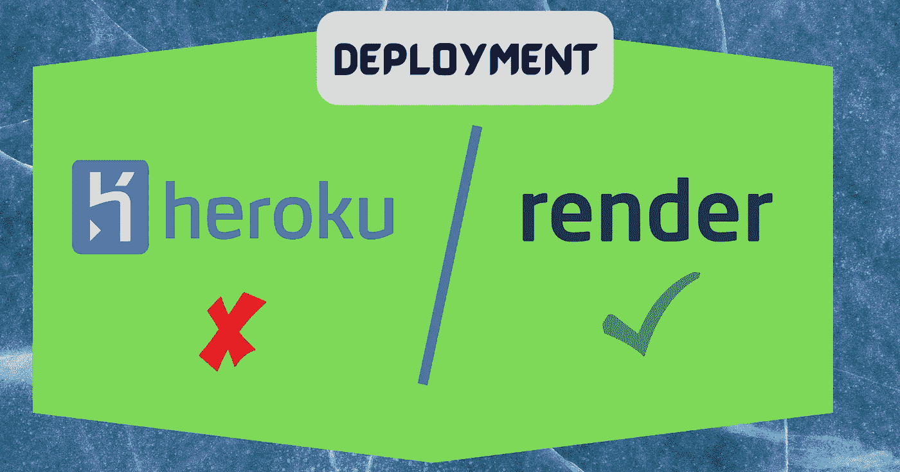
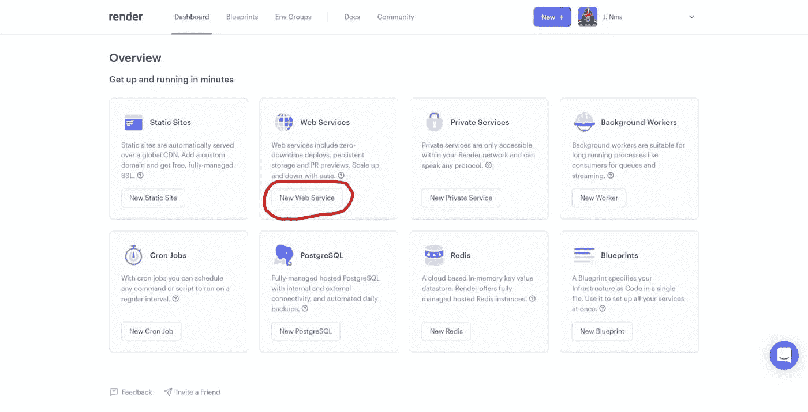
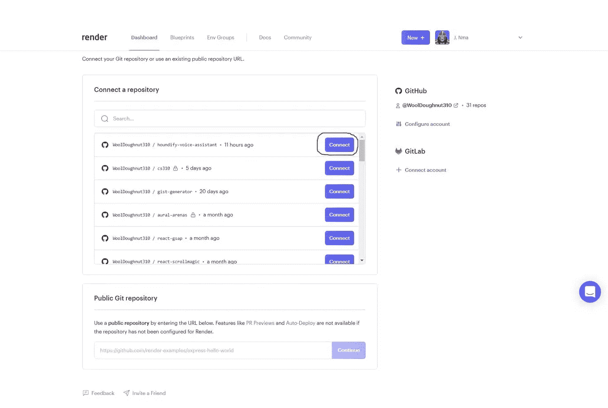
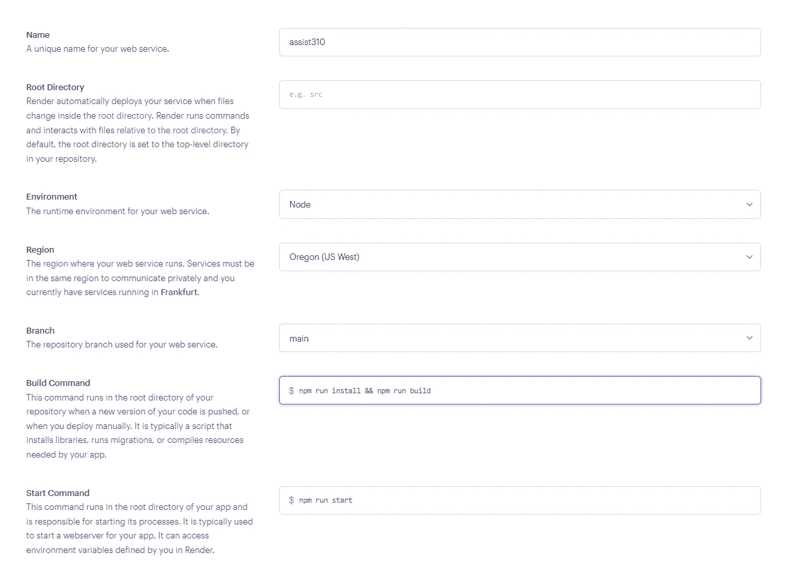
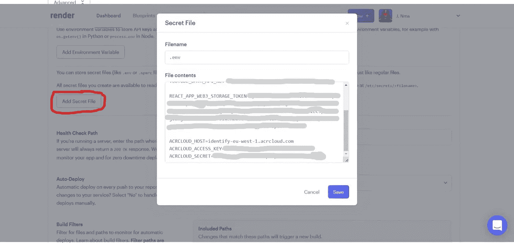

# Heroku 正在结束它的自由层。以下是如何使用 Render 部署应用程序

> 原文：<https://betterprogramming.pub/heroku-is-ending-its-free-tier-heres-how-to-deploy-apps-using-render-112e6a15a29b>

## 看看免费的 Heroku 替代品！



作者图片

11 月 28 日，Heroku 的免费等级将不再提供。对于大多数想要轻松部署服务器而不需要额外成本的人来说，这可能有点烦人。免费等级的取消迫使我们要么搬到别处，要么屈服于他们的付费计划。

在这篇文章中，我将向您展示一个即将到来的替代品，渲染。Render 提供了与 Heroku 相同的功能，但有所改进和额外的功能。

# 安装

为了将我们的应用程序部署到 Heroku 强大的继任者，你需要同时拥有 [Render](https://render.com/) 和 [GitHub](https://github.com/) 的账户。还需要一个 app 来部署。你可以在这里找到 AI 助手系列[的最终代码。](https://github.com/WoolDoughnut310/houndify-voice-assistant)

# 向 GitHub 添加代码

首先，创建一个新的[GitHub 库。现在，运行以下命令将我们的代码推送到 repo。](https://github.com/new)

```
git initgit add .
git commit -m "first commit"
git branch -M maingit remote add origin git@github.com:USERNAME/REPO.gitgit push -u origin main
```

现在我们的代码在 GitHub 上了，我们可以部署它来渲染。

# 渲染时部署

注册后，单击仪表板页面上的 Web 服务创建应用程序。



使用渲染面板

接下来，配置您的 GitHub 帐户，以便 Render 可以访问您的 repo。然后单击存储库名称旁边的连接。



连接 GitHub 存储库

现在填写表格中的细节。如果您推送的代码是正确的，那么环境应该已经设置为“Node”



配置 Web 服务

注意，我们必须在运行构建之前安装我们的 NPM 包。

*   向下滚动到标有“高级”的按钮，然后单击
*   现在点击添加秘密文件打开一个模态对话框
*   将文件名设置为"。env ”,并用以前文章中的`.env`文件的内容填充内容



添加机密文件

最后，单击 Create Web Service。几分钟后，Render 应该已经部署了您的应用程序。他们甚至提供了一个域来测试它。

# 与 Heroku 比较

如果你已经是 Heroku 的习惯用户，切换到 Render 是无缝的。即使你是 Heroku 的付费用户，我现在也要对它们做一个简单的比较:

*   定价——Heroku 的定价方案要宽松得多，只有三种方案。Render 有八种不同的方案，可以根据您的使用情况提供更大的灵活性。
*   磁盘存储—渲染支持磁盘存储来存储部署之间的数据。Heroku 不提供这个。
*   HTTP 版本—通过 HTTP/2 向服务器呈现您的应用程序，这提供了更好的速度和效率。Heroku 仍然使用 HTTP/1.1。
*   运行状况检查-使用 Render，用户可以提供运行状况检查的路径，因此如果出现问题，您的应用程序可以重新启动。健康检查允许渲染没有停机时间。Heroku 应用程序每 24 小时重启一次，这可能会导致停机。避免这种情况的唯一方法是从免费层升级。
*   DDoS 保护— Render 为您的所有应用程序提供高级 DDoS 保护。然而，Heroku 提供了更多的基本方法。他们甚至建议使用专门的服务来应对更强的攻击。
*   TLS 证书— Render 为自定义域上的应用程序提供免费的自动 TLS 证书。Heroku 没有。
*   docker——使用 Render，您可以在存储库中包含一个`Dockerfile`。然后他们会识别它并自动构建它。Heroku 的 [Docker 部署](https://devcenter.heroku.com/articles/container-registry-and-runtime)的过程就繁琐多了。
*   机密-机密文件可以导入到渲染中。Heroku 只支持配置变量(env 变量)，这是有限的。
*   Postgres-Render 已管理 Postgres 实例。Render 提供 90 天的免费层。Render 的自由层实例具有比 Heroku 更高的连接限制(97 比 20)。他们的数据库实例都有 IP 访问控制，不像 Heroku 的 Postgres 插件。Render 对所有 Postgres 实例进行每日备份，并将它们保留一周。Heroku 在其空闲层上最多只保留 2 个备份。
*   Redis-Render 也有一个免费层管理 Redis 存储。这个免费层是无限可用的。Render 的 Redis 实例允许的连接限制是 Heroku 的 Redis 插件的 2.5 倍(50 对 20)。但是，如果您想将数据保存到磁盘，这两个平台都需要升级。与 Heroku 不同，Render 中的实例也允许 IP 访问控制。

# 结论

您现在知道了如何初始化 Git 存储库，将它推送到 GitHub，并部署它来免费呈现。

如果你从头到尾读完了整个系列，那么恭喜你。我真的很感激。

如果你喜欢这个系列，请随时关注我以获取更多内容并与他人分享。谢谢大家！

# 资源

[Heroku 的下一章](https://blog.heroku.com/next-chapter)

[https://render.com/docs/web-services](https://render.com/docs/web-services)

[https://render.com/render-vs-heroku-comparison](https://render.com/render-vs-heroku-comparison)

[HTTP/2 —维基百科](https://en.wikipedia.org/wiki/HTTP/2)