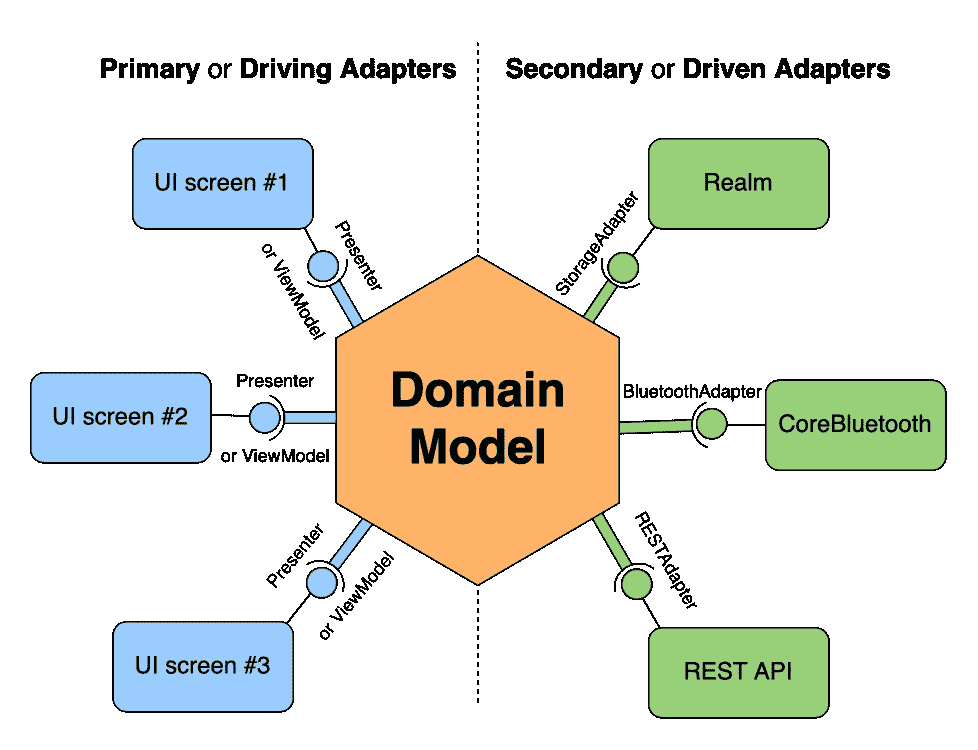
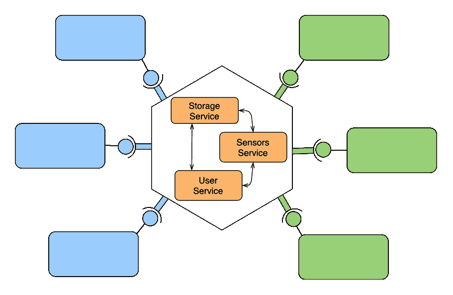

# iOS 的六边形架构

> 原文：<https://betterprogramming.pub/hexagonal-architecture-for-ios-part-1-600441c186b7>

## 专注于应用程序内部和外部的逻辑部分的架构模式

安托万·梅鲁尔在 [Unsplash](https://unsplash.com/s/photos/hexagon?utm_source=unsplash&utm_medium=referral&utm_content=creditCopyText) 上拍摄的照片

*这是 iOS 开发采用的六边形架构模式系列的第一部分。它主要包括理论方面。下一部分将涵盖实践方面，以及一个示例项目。*

当我们谈论 iOS 应用的架构时，我们通常指的是 UI，一种架构方法，如 MVC、MVVM、VIPER 等。但是一个 app 架构不仅仅是 UI。每个这样的模式都有一个简称为模型或实体的部分，负责领域或业务逻辑、第三方依赖集成、系统和框架交互等。这就是六边形建筑可能有助于使事情变得清楚的地方。

最初，由于主要组件的命名，这种架构被阿利斯泰尔考克伯恩解释为端口。术语*六边形架构*变得流行起来，因为它用示意图表示了组件是如何连接的。

六边形架构是一种架构风格，它将开发人员的注意力从概念层转移到应用程序内部和外部之间的区别。里面的部分是*域*或*业务逻辑*。外面的部分是 UI、网络、传感器、数据存储等。应用程序内部和外部之间的连接是通过*端口*和它们的对应实现来实现的，称为*适配器*。

# 定义

## **领域模型**

领域模型是一个概念模型，一个需要在软件中实现的有意义的逻辑的表示。它本质上是应用程序的业务逻辑与数据模型的结合。

## 港口

端口是消费者不可知的进出域模型的入口和出口点。它是访问业务逻辑的媒介。在 Swift 中，端口是与应用中的用例相对应的协议。端口由适配器使用。

## 适配器

适配器是域模型和应用程序所需服务之间的桥梁。它们充当一个层，其目的是以一种两者都保持独立的方式在各种外部参与者和业务逻辑之间执行通信。

在六边形体系结构中，所有外部参与者都通过适配器与端口进行交互。一个适配器可以是负责与核心蓝牙 iOS 框架交互的 BLE 服务。另一个可能是与远程存储交互的类似控制器的功能。

# 端口和适配器的类型

*   **主**或**驱动适配器**是在域模型上开始一些动作的适配器。在 MVP 中，表示器将是这样一个适配器，它与域模型，即应用程序的业务逻辑进行交互。在 MVVM，这是一个视图模型；在蝰蛇或肋骨，相互作用者。在这种情况下，端口扮演的角色是核心域模型类的协议。换句话说，这些适配器不是直接与它交互，而是通过一个协议。
*   **二级**或**驱动适配器**代表与后端工具的连接，如数据库、网络 API、传感器等。它们直接与本地或特定的 API 交互，并由域模型通过适当的端口调用。辅助端口的一个例子是存储模型对象的接口。该接口简单地声明了从存储中检索、更新和删除对象的方法。它没有告诉你这些对象的存储方式。

六边形架构方案表示

如您所见，六边形架构通过将逻辑封装在应用程序的不同层中来促进关注点的分离。这使得对特定领域代码的隔离、可测试性和控制达到了更高的水平。应用程序的每一层都有一套严格的职责和要求。这为某些功能应该在哪里以及这些层应该如何相互交互创建了清晰的边界。

事实上，域模型可能不只是一个类，而是一组类，每个类负责自己的应用程序功能。这些类通常是单例的，可以直接或通过应用程序协调器相互连接，应用程序协调器的目标是实例化和保存引用，并协调它们。

域模型详细信息

# 好处

*   **外部服务独立性**。你可以在考虑使用什么类型的数据存储之前开发一个应用程序的内核。通过为您的存储定义端口和适配器，您可以自由地使用任何技术实现。
*   **关注点分离**。外层通常比业务逻辑变化更频繁。例如，UI 或第三方 API 通常比应用程序的业务规则发展得更快。这种分离使您能够快速迭代外层，而不触及必须保持一致的内层。
*   用单元测试覆盖业务逻辑的能力。现在，当封装业务逻辑的应用程序域模型不知道外部依赖关系时，通过模仿其适配器来测试它会容易得多。
*   **适配器可更换**。适配器的目的是抽象外部服务和依赖的实际实现。这种抽象允许应用程序接收请求并向各种外部技术发送响应，而不必知道实际的实现。它使得用符合相同接口的不同实现替换适配器成为可能。
*   **良好维修性等级**。可维护性是指没有技术债务，也就是说，一个应用程序某个方面的变化不会直接影响到其他方面。添加特性不需要对代码进行大的改动。上面提到的好处共同提供了高水平的可维护性。

# 缺点是

*   在我看来，唯一的缺点是在项目中实现这种架构需要定义大量的实体，比如类和协议。显然，在非架构方法中，视图控制器可以直接与 Realm、Firebase 或 Core Bluetooth 交互。然而，这种设计没有上面提到的任何好处。

持怀疑态度的读者可能会说，演示者、视图模型或交互者实际上是应用程序业务逻辑的地方。这部分是对的，但通常一个好的工程师不会把与第三方或本地框架的直接交互放在那里。人们宁愿把它放在另一个层次，某种服务上，以便重用它的功能，如 API 服务、Firebase 服务、蓝牙服务等。然后这些服务取代了域模型，而它和视图之间的中间层变成了适配器。为了用单元测试覆盖这一层，需要模拟这些服务，从而通过一个协议(即端口)与它们连接。

这些服务可以直接与外层交互，但是如果这些连接没有被抽象和模仿，它们也变得不可测试。最后，在这方面添加端口和适配器将我们带到了这个故事的主题。

作为结论，我想引用 Robert C. Martin 在他的书" [Clean Architecture](https://www.amazon.com/Clean-Architecture-Craftsmans-Software-Structure/dp/0134494164) "中对架构的定义:

> “软件系统的架构是构建者赋予该系统的形状。该形状的形式在于将该系统划分为多个组件，这些组件的排列，以及这些组件相互通信的方式。”

# 参考

*   [从后端开发的角度很好地解释了六边形架构](https://herbertograca.com/2017/09/14/ports-adapters-architecture/)。