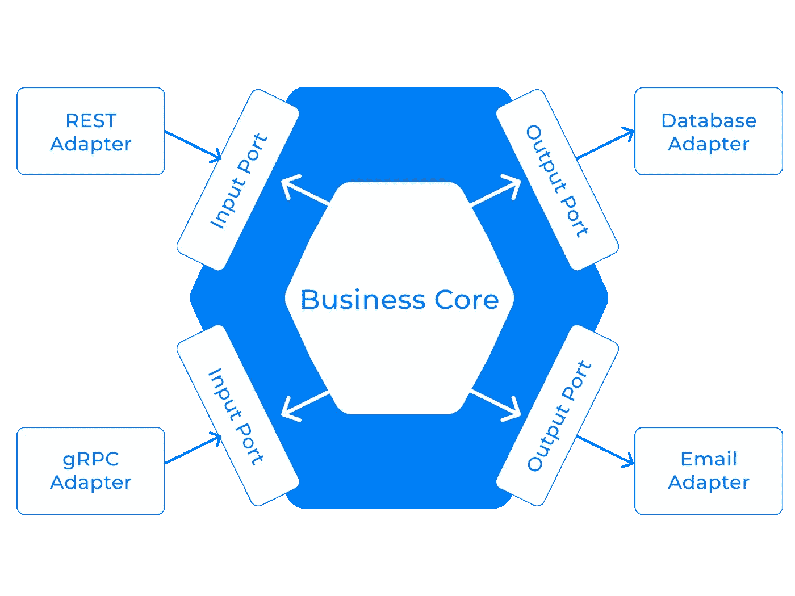

# 弹簧上的六角形建筑

> 原文：<https://betterprogramming.pub/hexagonal-architecture-on-spring-a76c5be5039b>

## 六边形建筑正在取代分层风格，原因如下

[照片](https://stocksnap.io/photo/geometric-industrial-QTP6YBOO6T)由[爆料](https://stocksnap.io/author/burstshopify)上[抓拍](https://stocksnap.io/)

六边形架构是一种用于设计软件应用程序的架构模式。近年来，它越来越受欢迎，因为它是传统分层体系结构的替代方案。在本文中，我解释了为什么六边形架构正在取代分层架构。

# 分层架构有什么问题？

这种架构模式应用 SoC ( *关注点分离*)原则将我们的组件分解成层，每一层都有不同的职责。通常有 3 层:

1.  **表示层**，包含用户界面。
2.  **业务层或领域层**，包含业务逻辑。
3.  **持久层**，处理数据库操作。

在应用这种架构模式时，我们面临着层与层之间的依赖，也就是说，每一层都依赖于紧接着的下一层。

该模型未能表明我们可以与多个数据库交互，或者根本不与任何数据库交互。此外，表示层没有考虑到用户与应用程序交互的方式可能不止一种。

# 六边形架构如何克服分层架构的弊端？

该模型将所有业务逻辑置于应用程序的核心，抽象出任何类型的外部依赖。这种隔离使得逻辑更容易测试和维护。

应用程序现在有一个或多个处理用户请求的输入适配器，而不是表示层。类似地，代替持久层，现在我们有一个或多个调用外部应用程序或服务的输出适配器，比如亚马逊 S3 的文件存储、SendGrid 之类的电子邮件服务，或者更常见的是数据库。

图片作者[作者](https://manerajona.medium.com)

业务核心有一个或多个端口。端口定义了一组操作，允许内核与适配器进行交互，从而与应用程序外部的内容进行交互。正如我们有两种类型的适配器，输入和输出，有一个输入端口和一个输出端口。输入端口是由核心公开的 API，供外部应用程序访问，而输出端口是允许核心使用外部服务的接口。

输入适配器通过调用输入端口来处理来自外界的请求。这方面的一个例子是实现 REST API 或 gRPC 服务器的 Spring 控制器。

输出适配器通过调用外部应用程序或服务来实现处理来自业务核心的请求的输出端口。一些例子是执行数据库操作的 DAO(数据访问对象)类，或者使用电子邮件服务的 Spring 组件。

# 我们如何在 Spring 上处理这种建筑风格呢？

到目前为止，我们已经看到了六边形建筑的相关概念。现在，让我们将理论付诸实践，并使用 Kotlin 构建一个 Spring 应用程序。

首先，我个人喜欢将项目分为三个主要部分:

*   “`core`”包，包含与核心业务相关的组件。
*   “`ports`”包，包含将业务核心与外界交流的输入和输出组件。
*   “`config`”包，用于启动应用程序和处理其内部行为所需的所有配置。

## 构建核心

这里是我们的`Article`实体。请注意，它是用普通的 Kotlin(或 Java)编写的，但是完美地代表了业务实体。

这里是`ArticleRepository`接口，它允许业务核心与外部服务进行通信。

这里是`ArticleService`接口，它允许外部应用程序与业务核心通信。

在`usecase` 包*，*中的`ArticleServiceImpl` 类扩展了`ArticleService`并包含了实际的业务逻辑。

## 数据库适配器的输出端口

`ports/output/jpa`包包含将数据保存到数据库中的组件。

这里是基于核心实体的`ArticleJpa`类。

下面是从 Spring JPA 库中扩展了`JpaRepository`的`ArticleJpaRepository`类。

在这里，`ArticleDao`类扩展了`ArticleRepository`，允许业务核心获取和保存数据。

## REST 适配器的输入端口

最后，`ports/inputs/rs` 包包含 Rest 控制器，这些控制器公开了供外部应用程序使用的端点。

# 为什么建筑很重要？

当工程软件时，存在一组基本需求，称为服务质量需求。这些需求定义了我们在构建高质量软件的过程中必须解决的一些权衡，例如可伸缩性、可靠性、可维护性、可测试性和可部署性。

架构很重要，因为如果我们在选择时足够明智，为我们的项目选择正确的架构模式将有助于我们的软件达到预期的质量，也许还会让我们少一些头痛。

感谢阅读。我希望这有所帮助！

示例代码可在 [GitHub](https://github.com/manerajona/spring-hexagonal-kt) 上获得。