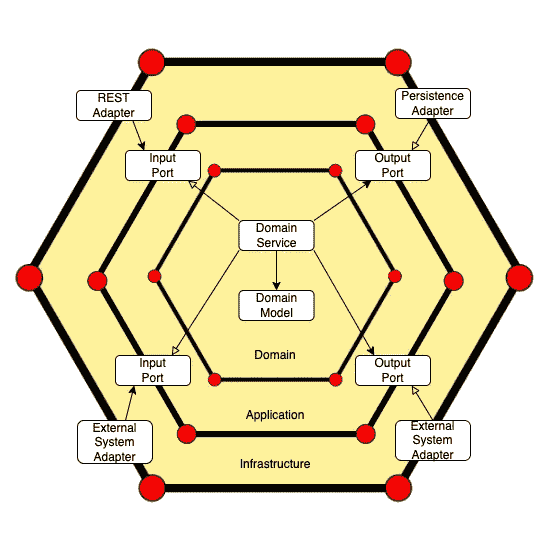
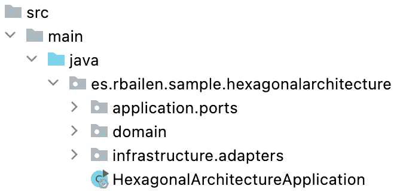
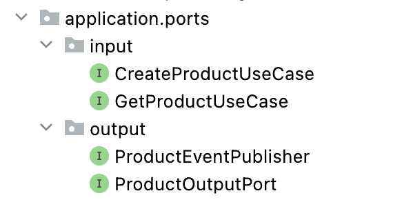
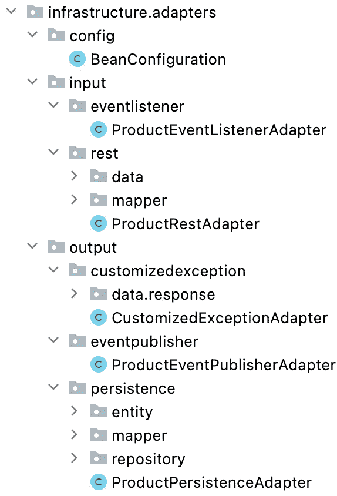
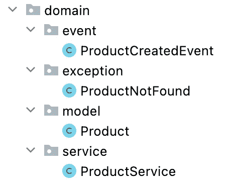

# 用 Spring Boot 实现理解六边形架构

> 原文：<https://betterprogramming.pub/hexagonal-architecture-with-spring-boot-74e93030eba3>

## 一个使用 Spring Boot 详细说明应用程序不同层的例子


唐尼·姜在 [Unsplash](https://unsplash.com?utm_source=medium&utm_medium=referral) 上的照片

六角形建筑是由阿利斯泰尔·考克伯恩在 2005 年提出的。

这种架构背后的主要思想是在设计软件应用程序时将领域逻辑与外部组件隔离开来。

通过端口和适配器可以从外部访问域逻辑。



端口只是一个由适配器实现的接口。有两种类型的端口:输入和输出。我们在领域层实现第一个，而基础设施模块将包含第二个的实现。

使用这种方法，您将拥有定义良好的接口来在域层内外进行通信，而不依赖于实现细节。

# **示例**

让我们考虑一个简单的 Product REST 服务来理解这个架构。产品服务的资源有:

*   创造产品
*   通过 Id 获取产品

我们开始创建三层:`application`、`infrastructure`和`domain`。



## ***申请***

应用层将包含端口，这些端口是允许入站或出站流量的接口。



我们在`input`包中创建了用例，定义了用户希望在应用程序中做什么。在我们的示例中，创建新产品并通过 Id 获取它们。

另一方面，我们使用`output`包来连接一些外部组件。

在我们的示例中，`ProductOutputPort`将从数据库中获取数据，而`ProductEventPublisher`将在创建产品时发布一个事件。

## ***基础设施***

基础设施层通过适配器表示六边形体系结构的外部。

适配器仅通过使用入站和出站端口与核心应用程序进行交互。

我们将`infrastructure.adapters`包分成三个新包:

1.  `config`:包含应用程序的 beans
2.  `input`:通过调用相应的用例(输入端口)来驱动应用程序
3.  `output`:它提供了输出端口的实现，如数据库或消息队列



## ***域***

领域层是系统的中心。它处理业务逻辑并代表应用程序核心。



域层与应用程序和基础设施层完全分离，因此其他层的变化不会影响到`Product`域对象，除非业务需求发生了变化。

`ProductService`是域内的关键组件，因为它实现输入端口，并使用输出适配器实现的输出接口将结果返回给输入适配器:

域异常在这一层抛出，在基础设施层进行管理(`CustomizedExceptionAdapter`)。

# **结论**

在本文中，我们通过一个实例看到了如何将与我们的应用程序相关的逻辑分成三个特定的层:`domain`、`application`和`infrastructure`。

我推荐使用一个映射库，比如`MapStruct`，在不同层之间转换对象。

没有两个六边形架构是相同的，因为您可以找到不同的层名称和构建应用程序的方式。所有可能的解决方案都应该使应用程序更容易测试，这才是真正的目标。

这个例子的代码可以在 [GitHub](https://github.com/rbailen/Hexagonal-Architecture) 上找到。

```
**Want to Connect?**Connect with me on [LinkedIn](https://www.linkedin.com/in/ramonbailensanchez) or follow me on [Twitter](https://twitter.com/ramromanoficial).
```