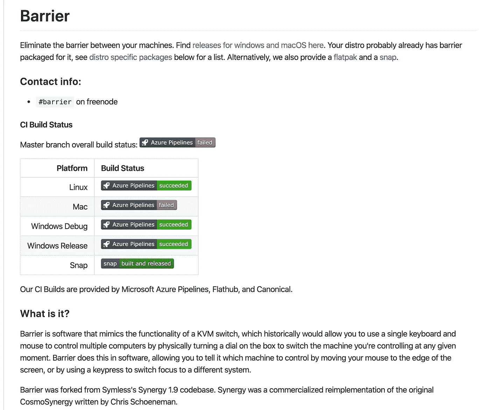
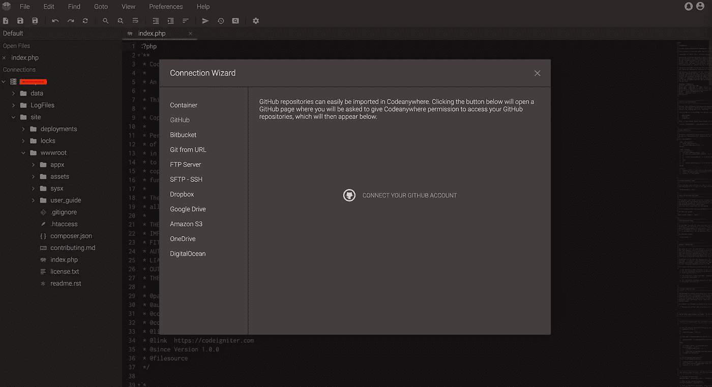
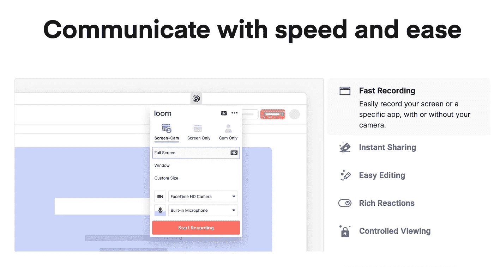
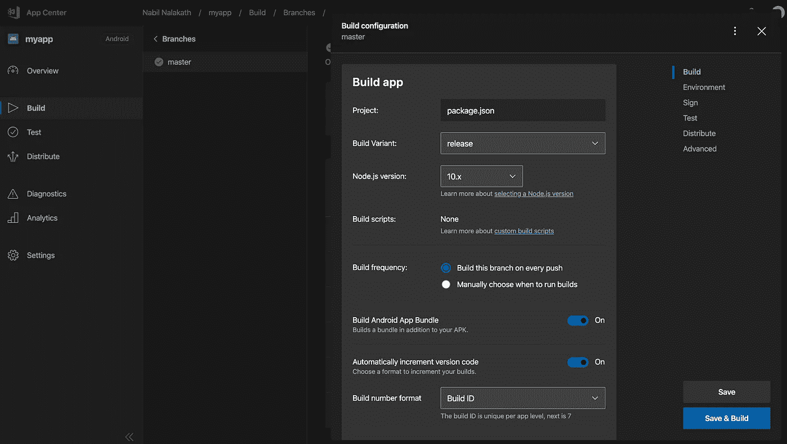
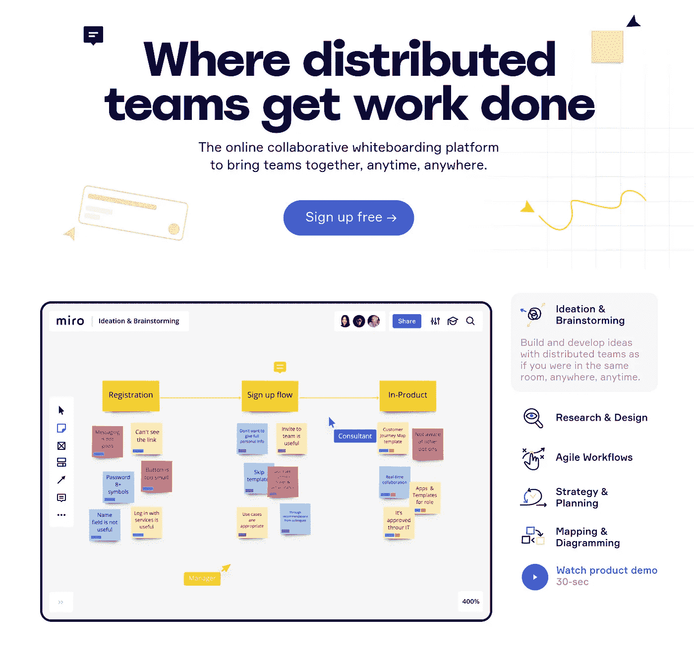
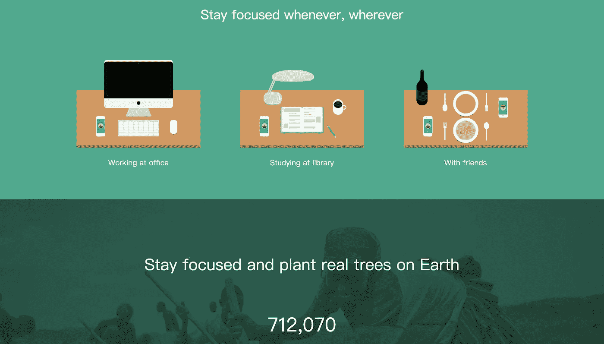
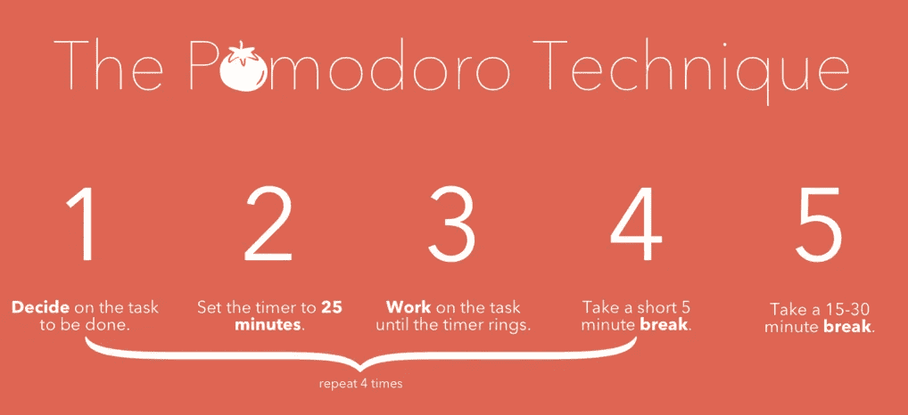
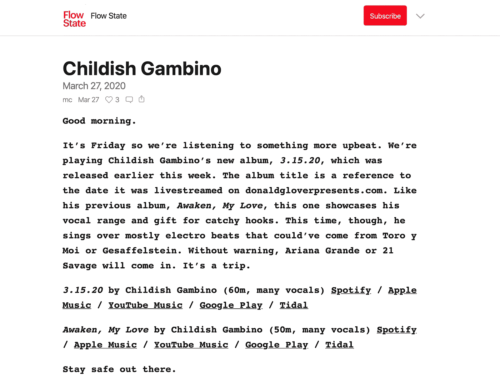

# 远程工作时帮助您的 7 大工具

> 原文：<https://betterprogramming.pub/hidden-gems-among-tools-to-help-you-while-working-remotely-a7c975d379a5>

## 障碍、森林和更多工具，可以帮助您在远程工作时完成任务。

伊莎贝拉·艾奇逊在 [Unsplash](https://unsplash.com/s/photos/home-office?utm_source=unsplash&utm_medium=referral&utm_content=creditCopyText) 上拍摄的照片

随着受影响人数与日俱增，新冠肺炎危机在美国和世界大部分地区只会越来越严重。大多数需要员工亲自到场的企业已经关闭，或者正在减少班次。

然而，大多数在工作场所使用计算机工作的员工已经将工作带回家，继续支持他们的客户并远程运营业务。

对于许多公司来说，宽松的在家工作政策已经到位，或者只是在紧急情况下，有些人根本不允许在家工作。

考虑到当前的需要，每个人都很快适应了这场危机，并正在寻找新的方式继续工作，同时呆在自己舒适的家中。

而现在有很多流行的主流工具，比如 [Slack](http://slack.com) 、 [Zoom](https://zoom.us/) 、 [Teams](https://teams.microsoft.com/) 等。在这种情况下，有一堆工具并不经常被提及，它们在网上是值得的。

因此，这里列出了一些“不太受欢迎”的工具，它们在我们度过这个疫情时非常有用。

# 1.屏障

在家工作时，我们怀念的一件事是办公室里那些很酷的工作站设置。没有那些我们认为理所当然的显示器、无线键盘和鼠标，有时很难跟上办公室的工作节奏。

尤其是如果你有不同的系统，如 Mac 和 Windows 笔记本电脑，并且你想连接你的一个键盘或鼠标跨越设备。

[Barrier](https://github.com/debauchee/barrier/wiki) 是流行的授权工具 [Synergy](https://symless.com/synergy) 的一个分支，它可以让你做到这一点，在你所有的电脑上使用一个键盘和一个鼠标。它是开源的，可以免费使用。这里是[安装指南](https://www.rauchland.com/articles/using-barrier-to-control-multiple-pcs-with-one-keyboard-and-mouse/)。

GitHub 上的屏障

# 2.Codeanywhere

这是当前最重要的需求。人们在一千个不同的地方工作意味着人们应该能够在任何地方任何设备上进行编码。

它可以在你卧室的笔记本电脑上，在客厅的 iPad 上，甚至在你排队买杂货的时候在你的手机上。

超过 1，500，000 名开发人员组成的社区正在使用 [codeanywhere](https://codeanywhere.com/) 允许开发人员在任何地方打开他们的 IDE 并轻松编辑他们的代码。这是一个基于云的工具，当你没有足够强大的设备来运行你常用的 IDE 时，它会非常方便。

它拥有代码编辑器所需要的所有功能，有着光滑的用户界面。你也可以通过所有流行的 Git 平台同步你的代码，比如 GitHub、 [Bitbucket](https://bitbucket.org/product) ，或者一个定制的 Git 服务器和其他选项，比如 FTP 服务器、 [S3](https://aws.amazon.com/s3/) 、[数字海洋](https://www.digitalocean.com/)等。

它还有一个内置的终端控制台，可以让你做任何事情，就像一个正常的离线编辑器。

带连接选项的 Codeanywhere ide

# 3.织布机

现在，这是一个允许你“用视频说出来”的工具，在意识到它有助于避免的事情之一后，我为它想出了一个花哨的缩写——*许多被高估的会议*。

[Loom](https://www.loom.com/) 试图利用分享信息的一个最基本的原则，我们记得我们看过的东西的 95%,而我们读过的东西只有 10%。

使用 Loom，您可以捕捉您的屏幕、声音和面部，并立即共享您的视频，所用时间比键入一封电子邮件还少。

您可以在工作中的几乎所有部门使用 Loom，如代码审查、产品演示、文档、招聘拓展、入职以及许多其他领域。

绝缘线束特征

# 4.应用中心

如果您的团队正在开发一些移动应用程序，那么签署一个发布版本并部署到相应的商店是您在每个发布版本中都必须做的事情。通常只有少数几个人能够访问开发人员控制台或者使用发布证书(尤其是客户端证书)签署构建。如果那个人正在喝咖啡休息或者生病了会怎么样。现在你可能会想，这可能发生在危机之前，也可能发生在危机之后。是的，它可以，所以现在是你自动化这个过程的时候了。

这就是微软的工具 [appcenter](https://appcenter.ms/) 可以帮助你的地方。它提供了一个端到端的解决方案来构建、测试和直接发布您的应用到商店，只需推动您的代码回购。它是最简单和最便宜的移动应用 CI/CD 平台之一，定价从 40 美元起，无限构建时间，如果总构建时间少于 240 小时，则免费。该工具最好的一点是，它不需要任何 DevOps 知识就可以设置，任何移动开发人员都可以在 10 分钟内完成。它为原生应用程序以及 [React-native](https://reactnative.dev/) 、 [Xamarin](https://dotnet.microsoft.com/apps/xamarin) 、Unity 甚至 [Flutter](https://flutter.dev/) 提供支持，只需稍加调整。

在 appcenter 上配置构建

# 5.弥洛松

Miro 是一个在线白板，可以在你的远程会议中发挥神奇的作用。它提供了几乎所有你可以在物理白板上做的事情，比如便笺，多人同时在同一块板上工作，添加评论和回复他人的评论。

它还有其他有趣的功能，如模板、思维导图，以及与所有流行工具的集成，如 [G Suite](https://gsuite.google.com/) 、[吉拉](https://www.atlassian.com/software/jira)、Slack 和 [Sketch](https://www.sketch.com/) 。免费计划可以让你免费使用 Miro，最多三个可编辑的电路板和无限的团队成员，付费计划从每个用户每月 8 美元开始。

Mirro 应用

# 6.森林

种一棵树怎么样，看着它成长作为保持专注的奖励？ [Forest](https://www.forestapp.cc/) 是一款应用，利用这一独特的概念，帮助你专注于手头的任务。根据他们的网站，这个想法很简单:

> “每当你想保持专注时，就种一棵树。当你专注于工作时，你的树会成长。中途离开应用程序会导致你的树死亡。”

白天继续保持专注，看着土地长成美丽的森林。如果你认为这一切都是虚拟的，没有真正的树，它们也是独一无二的。

*森林应用与真正的植树组织*未来之树合作，在地球上种植真正的树*。*谁知道呢，拯救地球可能是我们一直在等待的保持工作专注的动力。

森林应用

# 7.Pomodoneapp

你听说过番茄工作法吗？如果没有，现在是时候去看看这个由弗朗西斯科·西里洛在 20 世纪 80 年代末发明的时间管理方法了。

根据维基百科，“这项技术使用计时器将工作分成间隔，传统上长度为 25 分钟，由短时间的休息分开，每个间隔被称为*番茄。”*

该技术有五个步骤:

来源:Flickr

[番茄工作法](https://pomodoneapp.com/)是一个简单的工具，可以帮助你使用番茄工作法跟踪你的工作流程。

您可以直接在应用程序中创建任务，并使用自定义会话长度等功能来跟踪它们，自动从焦点时段切换到休息时间，如果您使用的是 Mac 应用程序，还可以在后台看到菜单栏中的计时器。

它还提供了与所有流行的任务管理工具的集成，如 Trello、吉拉、 [Todoist](https://todoist.com/) 等。导入现有任务并更新它们。

嗯，列表上还有一个，它不是一个工具，而是一个非常相关和有用的音乐出版物，你可以订阅。

# 流动状态

让我们承认，当我们在家工作时(有 100 种可能分散注意力的方式)，最难的事情之一就是专注于你的工作。

我们大多数人认为自己是多任务专家，但我们都需要独处的时间，我们可以在办公室预订单人隔离室。

[Flowstate](https://flowstate.substack.com/) 是一份关于 [Substack](https://substack.com/) 的出版物，它会发出两个小时的音乐，非常适合工作。你可以在各大流媒体平台上直接听这些音乐，包括 Spotify、Apple Music、YouTube Music、Google Play 和 Tidal。

你可以免费订阅这项服务，获得他们的公开帖子，或者每月支付 5 美元或每年支付 30 美元，每天获得一些高质量的优质内容。

Flowstate 每日收听曲目

目前就这些。感谢阅读。

各位，待在家里，注意安全。