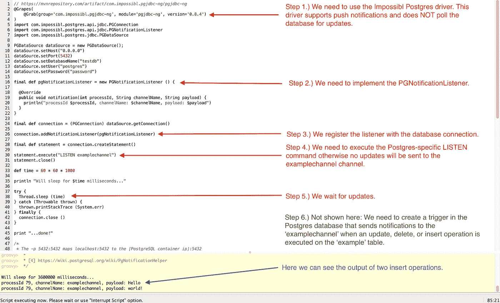
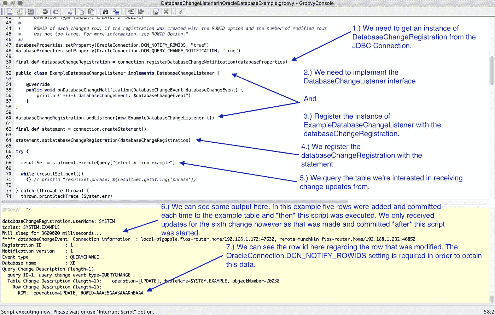
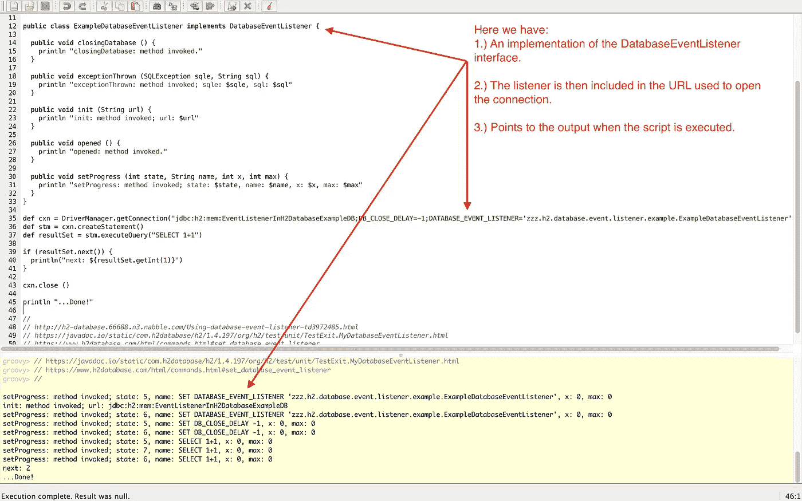

# 隐藏的宝石:关系数据库中事件驱动的变更通知

> 原文：<https://betterprogramming.pub/hidden-gems-event-driven-change-notifications-in-relational-databases-a87a7bdb02ad>

## 开发人员应该知道的一个强大的非标准特性

看啊！一颗 500 克拉的钻石躺在沙滩上！(图片来自[克里斯·科](https://unsplash.com/@justchris87))。

# 介绍

如果我们可以在数据直接从数据库更改时接收事件驱动的更改通知(EDCN ),而不必轮询更新，这不是很好吗？

事实上，这个特性在一些关系数据库中是可用的，但是*不是全部，*因为它是非标准功能，不是任何 SQL 规范的一部分。

在本文涉及的三个例子中，这个功能是通过一个接口的实现来表达的，然后这个接口直接注册到 JDBC 驱动程序中。这打开了无数潜在用例的大门，这些用例可以在不需要投票的情况下表达，也不需要开发人员编写基础结构代码来处理数据变化和通知相关方。相反，我们可以直接与驱动程序交互，监听变化，当变化发生时，以事件驱动的方式执行我们的任何工作流。这可能有所帮助的几个例子包括:

*   缓存(当我们讨论 PostgreSQL 的时候会有更多关于它的内容，也可以参见[CQN](https://docs.oracle.com/database/121/ADFNS/adfns_cqn.htm#ADFNS1015)的优秀候选者)
*   [蜜罐](https://hackernoon.com/poison-records-acra-eli5-d78250ef94f)用于数据库表——参见[毒物记录](https://hackernoon.com/poison-records-acra-eli5-d78250ef94f)
*   调试问题
*   记录更改
*   分析和报告

当然，依赖这种功能会有一些后果。最明显的暗示是，它是一个将应用程序直接绑定到数据库的非标准特性。

我在 LinkedIn[上与](https://www.linkedin.com/posts/thomasfuller_code-postgres-database-activity-6689162224210075648-N4Ah) [Michael Dürgner](https://www.linkedin.com/in/duergner/) 讨论了一个与 PostgreSQL 相关的示例实现，并且[他评论说](https://www.linkedin.com/feed/update/urn:li:activity:6689162224210075648/?commentUrn=urn%3Ali%3Acomment%3A%28activity%3A6689162224210075648%2C6692526639311527936%29):

> “虽然这绝对是一个很好的方法，但它的一个大缺点是你将应用程序逻辑移到了 RDBMS 中。这并不是说你不应该这样做，而是要确保你的员工对你使用的 RDBMS 有深刻的理解，因为一般的软件不太可能解决问题。这种方法的另一个巨大挑战是连续交付，因为您的 RDBMS 需要与您的交付渠道深度集成。”

我同意 Michael 的观点，将业务逻辑排除在数据库之外是一种很好的做法。

当开发人员需要在可能属于应用程序本身的数据库层中添加逻辑时，依赖于对象关系映射(ORM)工具(如 [Java Persistence API](https://docs.oracle.com/javaee/6/tutorial/doc/bnbpz.html) (JPA)直接从一个或多个对象模型生成数据库模式的项目会立即失去可移植性和简洁性。如果开发人员不小心，他们最终将不得不使用与生产中相同的数据库进行测试，这很容易导致痛苦和遗憾。

我向任何考虑通过 JDBC 驱动程序使用 EDCNs 的工程师提出以下问题:如果不包含您正在构建的依赖于此功能的任何东西，应用程序还能按预期运行吗？如果答案是“是”，那么你正在做的事情很可能是好的；相反，如果答案是“否”，那么这是反对使用氯化萘的一次罢工，可能需要考虑替代品。

最后，这个特性本身并不能替代精心设计的[面向消息的中间件](https://en.wikipedia.org/wiki/Message-oriented_middleware) (MOM)，后者通常提供现成的解决方案来保证交付、消息持久性、[至少一次/恰好一次交付](https://doc.akka.io/docs/akka/current/general/message-delivery-reliability.html?language=scala)、通过队列和主题的交付、流控制策略(另请参见:[背压](https://medium.com/@jayphelps/backpressure-explained-the-flow-of-data-through-software-2350b3e77ce7))，并解决容错和可伸缩性问题。这些要求的存在可能是一个强有力的指标，表明需要重新考虑依赖 EDCNs 的方法。

下面我们来探究一下存在于 [PostgreSQL](https://www.postgresql.org/) 、 [Oracle](https://docs.oracle.com/en/database/oracle/oracle-database/index.html) 和 [H2](http://www.h2database.com/) 数据库中的这种功能；我们还包括一些关于 MySQL 和它的分支 [MariaDB](https://mariadb.org/) 的一般性评论。

在本文中，我们依赖于 Java 13.0.2 和 Groovy。3.0.4 和包含 GitHub 上各种脚本的链接，这些链接包含关于如何设置所需的依赖项和运行示例所需的任何其他先决条件的额外注释。

# 一种数据库系统

PostgreSQL (Postgres)数据库是我们要研究的第一个例子。

Postgres API 包括 [PGNotificationListener](https://impossibl.github.io/pgjdbc-ng/apidocs/0.7/com/impossibl/postgres/api/jdbc/PGNotificationListener.html) 接口，必须实现该接口，然后向数据库连接注册。注意，这里有两个可用的实现:Postgres[默认] JDBC 驱动程序 T13 和不可能的 JDBC 驱动程序 T15 实现。我们不想使用 Postgres 驱动程序，因为该实现将轮询数据库的更改。相反，我们将依赖 Impossibl 实现，它提供真正的事件驱动通知。

我有机会与[Heimdall Data](https://www.linkedin.com/in/erikbrandsberg/)的首席技术官 Erik brands Berg[就此进行了交谈，Erik 表示:](https://www.linkedin.com/in/erikbrandsberg/)

> “与其他数据库相比，PG notify 界面是 PG 中隐藏的瑰宝之一。我们可以使用它来提供代理之间的缓存失效消息，而不是使用 Redis 上的独特发布/订阅接口。”

Heimdall Data 为使用[亚马逊关系数据库服务](https://aws.amazon.com/rds/)(亚马逊 RDS)和其他数据库的应用程序提供了一个复杂的缓存解决方案，这是一个真实的使用案例，展示了该功能的重要性。

在下面的例子中，[触发器](https://www.postgresql.org/docs/9.6/plpgsql-trigger.html)和[函数](https://www.postgresql.org/docs/9.6/sql-createfunction.html)脚本必须在 Postgres 内部执行，这是运行 Groovy 脚本的先决条件。 *notify_change* 函数将向任何注册的[侦听器](https://en.wikipedia.org/wiki/Event_(computing))发送事件，这些侦听器正在侦听*example channel*[channel](https://en.wikipedia.org/wiki/Channel_(programming))——请特别注意下面的警告，因为通道名称区分大小写。

接下来是使用 PostgreSQL 数据库的[com . impossibl . postgres . API . JDBC . PGNotificationListener](https://impossibl.github.io/pgjdbc-ng/apidocs/0.7/com/impossibl/postgres/api/jdbc/PGNotificationListener.html)的[工作示例](https://github.com/thospfuller/GroovyExamples/blob/master/event-driven-jdbc/PGNotificationListenerInPostGreSQLDatabaseExample.groovy)实现。 *PGNotificationListener* 接口要求开发者只实现一个方法:

`void notification(int processId, String channelName, String payload)`

我们可以在下面的第 18 行看到这一点。

我们可以看到一个正在执行的脚本示例，以及出现在下图中的 [GroovyConsole](http://www.groovy-lang.org/groovyconsole.html) 中的解释和输出。

对在 Groovy 控制台中运行的 PostgreSQL 示例的解释。

我们将讨论的下一个例子包括事件驱动的变更通知功能，因为它适用于 [Oracle 数据库](https://en.wikipedia.org/wiki/Oracle_Database)。

# 神谕

我们将在本文中讨论的下一个例子将集中在 Oracle 数据库上。下面，我们将详细介绍通过 JDBC 驱动程序配置事件驱动的变更通知所需的步骤，以及运行该示例所需的前提条件。

下面两个要点是这个例子的先决条件。值得注意的是，Docker 运行在另一台机器上，在这种情况下，它使用的是 Ubuntu 操作系统。参见[databasechangelistenerinoracledatabaseexample . groovy](https://github.com/thospfuller/GroovyExamples/blob/master/event-driven-jdbc/DatabaseChangeListenerInOracleDatabaseExample.groovy)脚本中关于在 Docker 本地运行 Oracle 的警告，了解完整的细节。

在 SQL*Plus 中，我们现在可以运行以下配置脚本。请记住，一旦创建了示例表(参见第 8 行),就可以启动下一节中的 Groovy 脚本，对目标表的任何插入、更新或删除操作都会导致事件被发送到 Groovy 脚本，然后打印到控制台输出。

这里我们有一个完整的[databasechangelistenerinoracledatabaseexample . groovy](https://github.com/thospfuller/GroovyExamples/blob/master/event-driven-jdbc/DatabaseChangeListenerInOracleDatabaseExample.groovy)脚本的例子。请注意，开发人员必须实现一种方法:

`void onDatabaseChangeNotification(DatabaseChangeEvent databaseChangeEvent)`

我们可以在下面的第 55 行看到这个实现。

下图更深入地介绍了每个步骤的作用，并附有一些解释输出的注释。

对与 Oracle 数据库相关的示例脚本所做工作的更深入的解释，包括解释输出的注释。

最后，下图演示了当我们在一行中执行五次插入，然后提交更改时，只发出一个事件，包括这五次插入。只有当提交成功返回时，才会发出事件。

在 SQL*Plus 中执行了五次插入，然后是一次提交，我们可以看到该事件包括这五次插入操作。

我们将在本文中讨论的最后一个例子包括 [H2 数据库](https://www.h2database.com/html/main.html)。

# H2 数据库

H2 数据库是一个完全用 Java 编写的开源、轻量级、非常强大的关系数据库。它支持一长串特性，并且[作为一个 2.2mb 的 jar 文件](https://mvnrepository.com/artifact/com.h2database/h2)发布。在测试 Java 应用程序时经常使用 H2，它作为嵌入式数据库工作得很好，并且可以与[对象关系映射工具一起使用，例如 Java 持久性 API (JPA)](https://docs.oracle.com/javaee/6/tutorial/doc/bnbpz.html) 。H2 也被嵌入到 JBoss Wildfly 应用服务器中，并且已经作为嵌入式数据库在 JBoss 中使用了很长时间。

H2 通过[org . H2 . API . databaseeventlistener](http://www.h2database.com/javadoc/org/h2/api/DatabaseEventListener.html)接口传递事件通知。与前面介绍的 Postgres 和 Oracle 监听器规范相比，DatabaseEventListener 接口提供的功能有限。实现接口所需的方法有:

`void closingDatabase ()
void exceptionThrown(SQLException sqlException, String sql)
void init (String url)
void opened ()
void setProgress (String state, String name, int x, int max)`

使用 h2 数据库[的](https://github.com/thospfuller/GroovyExamples/blob/master/event-driven-jdbc/H2EventListenerExample.groovy)[org . H2 . API . databaseeventlistener](http://www.h2database.com/javadoc/org/h2/api/DatabaseEventListener.html)的一个工作示例实现可以在 GitHub 上找到，也包含在下面的要点中，后面是一张带有指针的图片，解释了这是如何工作的。

在这个例子中，H2 运行在嵌入式模式下——也就是说，H2 完全运行在运行 Groovy 脚本的同一个虚拟机的内存中。

在下图中，我们可以看到这个脚本的执行示例，以及 GroovyConsole 中的输出。

一个在 Groovy 控制台中运行的 H2 DatabaseEventListener 的例子，包括输出。

有点令人失望的是，H2 DatabaseEventListener 没有提供与 PostgreSQL 接口类似的功能。因此，我在 GitHub 的 H2 数据库上提交了一个新的特性请求，如果时间允许的话，我会尝试自己实现它。

# MySQL/MariaDB

MySQL 或 MariaDB 数据库似乎都不支持通过 JDBC 驱动程序的事件驱动的变更通知，因此如果需要此功能，工程师将不得不考虑替代解决方案。

我们将不讨论触发器和用户定义的函数(UDF ),因为它们与 MySQL 和 MariaDB 调用 web 服务端点有关，这是一种替代方法。对这个主题的简短研究表明，触发器和 UDF 可以用来实现这一点；但是，在采用这种方法时，必须考虑它们潜在的重大安全和性能影响。

如果您在 MySQL 和/或 MariaDB 中使用了触发器和 UDF 或其他解决方案来完成这一任务，请在评论中详细说明您需要做什么、您采用的方法以及效果如何。最后，如果 MySQL 和 MariaDB 中有更好的解决方案，请进一步解释。

# 结论

在您参与的项目中，您在关系数据库中使用过事件驱动的变更通知吗？如果是这样，我鼓励你在评论中讨论以下任何一个问题:

*   它有什么用？
*   使用了什么数据库？
*   该解决方案是用什么语言编写的？
*   你能用微软的 SQL 服务器或者这里没有提到的其他数据库来做这件事吗？
*   遇到问题了吗，如何解决的？
*   该选项是否经过研究并确定为*而非*解决当前问题的合适方案？
*   您是否被迫使用替代方案，如果是，实现看起来像什么，为什么？
*   你可能有的任何其他想法，包括我可能遗漏在这里的任何问题。

虽然 EDCNs 在受支持的关系数据库中提供了强大的功能，但是我们希望，除了提供一些工作示例之外，还应该清楚依赖这一特性是有代价的，并且在使用它之前必须给予适当的考虑。

编码快乐！