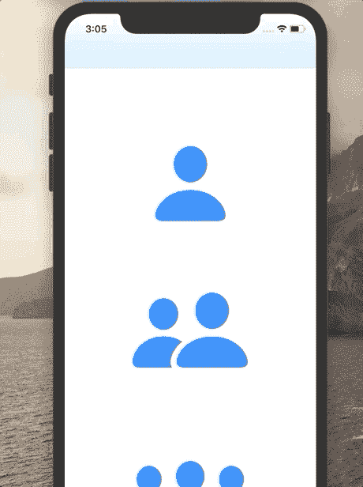
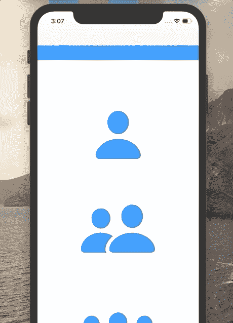
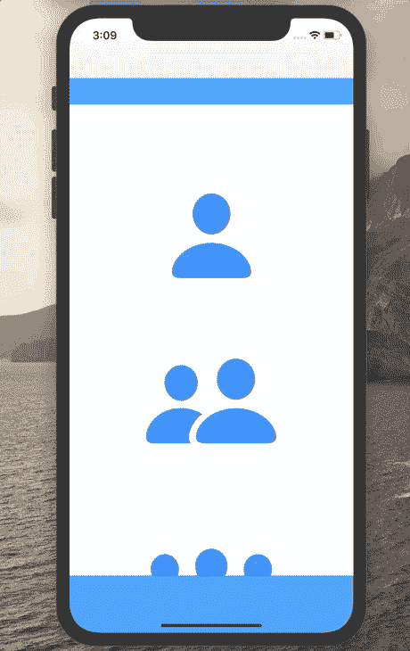

# 隐藏和显示 Swift 中的导航栏和选项卡栏

> 原文：<https://betterprogramming.pub/hide-and-show-the-navigation-bar-and-tab-bar-in-swift-a771550ed364>

## 使用开源库 HidingNavigationBar


Vojtech Bruzek 在 [Unsplash](https://unsplash.com?utm_source=medium&utm_medium=referral) 上拍摄的照片。

由于每个人都希望他们的应用程序看起来整洁、有吸引力、迷人，非标准的 UI 元素和动画变得非常流行。 [HidingNavigationBar](https://github.com/tristanhimmelman/HidingNavigationBar) 就是这样一个框架。它有助于在滚动时隐藏导航工具，并在停止时取消隐藏。

在本文中，我将解释如何使用该框架，以及为什么它似乎是最佳选择。

# 我们开始吧

根据[文档](https://github.com/tristanhimmelman/HidingNavigationBar):

> " HidingNavigationBar 支持隐藏/显示下列视图元素:
> 
> - UINavigationBar
> 
> - UINavigationBar 和一个扩展 UIView
> 
> - UINavigationBar 和一个 UIToolbar
> 
> - UINavigationBar 和一个 UITabBar "

*注意:HidingNavigationBar 仅适用于半透明设置为* `*true*` *的 UINavigationBars。*

## 装置

基本上，有两种安装 HidingNavigationBar 的方法:

1.  与[同步蛇](https://github.com/CocoaPods/CocoaPods)
2.  与[迦太基](https://github.com/Carthage/Carthage)

使用哪个依赖项管理器完全由您决定。你可以在本文中了解更多关于依赖管理器的信息。

集成 HidingNavigationBar 后，您可能会面临一些问题。请随意直接向下滚动到问题解决部分。

# 使用

HidingNavigationBar 的主要特点是应该链接到有滚动效果的东西上。它可以是`UITableView`也可以是`UIScrollView`。你以后会明白的，所以不要担心。

第一，`import HidingNavigationBar`到`UIViewController`。

其次，在你的`UIViewController`子类中声明一个`HidingNavigationBarManager`类型的成员变量。

第三，使用三种生命周期方法使`hidingNavBarManager`工作:

在特殊情况下使用的另外两种方法:



这就是你在滚动时隐藏/取消隐藏导航条所需要的一切！

## 向 UINavigationBar 添加扩展视图



## 将工具栏/TabBar 添加到 UINavigationBar



# 助手

## 当应用前景化时隐藏/显示/不做任何事情

## 膨胀阻力

如文件中的[所示:](https://github.com/tristanhimmelman/HidingNavigationBar)

> “当导航条被隐藏时，你可以(添加)一些‘阻力’，这在导航条滚动时开始扩展之前添加了一个延迟。阻力值是导航条开始扩展前用户需要滚动的距离。”

```
hidingNavBarManager?.expansionResistance = 250
```

## UIRefreshControl

如果您在滚动视图中使用`UIRefreshControl`，让`HidingNavigationBarManager`知道这一点很重要:

```
hidingNavBarManager?.refreshControl = refreshControl
```

# 您可能面临的问题

自从 Swift 3 以来，`HidingNavigationBar`似乎没有更新过。因此，有一些小的语言变化问题。幸运的是，Xcode 很聪明，所有问题都可以通过点击编辑器右侧的红色错误信息来解决。所有问题都可以解决，除了一个:

这是出现问题的那段代码。你所要做的就是把`NSNotification.Name.UIApplication.didBecomeActiveNotification`改成`UIApplication.didBecomeActiveNotification`。

# 什么时候应该使用 HidingNavigationBar？

`HidingNavigationBar`非常容易使用，几乎不需要学习。然而，我发现如果你使用`UIScrollView`，约束和整个框架可能会有一些问题。过一会儿，它停止显示/隐藏导航项目。虽然效果很好。

所以如果你需要一个快速简单的框架来链接到`UITableView`，这是正确的选择。

# 包扎

这就是你应该知道的 HidingNavigationBar。我希望你觉得有趣！

看看我创建的相关项目:

[](https://github.com/AbboskhonShukurullaev/HidingNavigationBar-review) [## abboshonshukurulaev/HidingNavigationBar-评论

### 在 GitHub 上创建一个帐户，为 abboshonshukurulaev/HidingNavigationBar-review development 投稿。

github.com](https://github.com/AbboskhonShukurullaev/HidingNavigationBar-review) 

如果你想了解更多，可以查看一下[框架的 GitHub repo](https://github.com/tristanhimmelman/HidingNavigationBar) 。

如果你有任何批评、问题或建议，欢迎在下面的评论区发表！

感谢阅读。