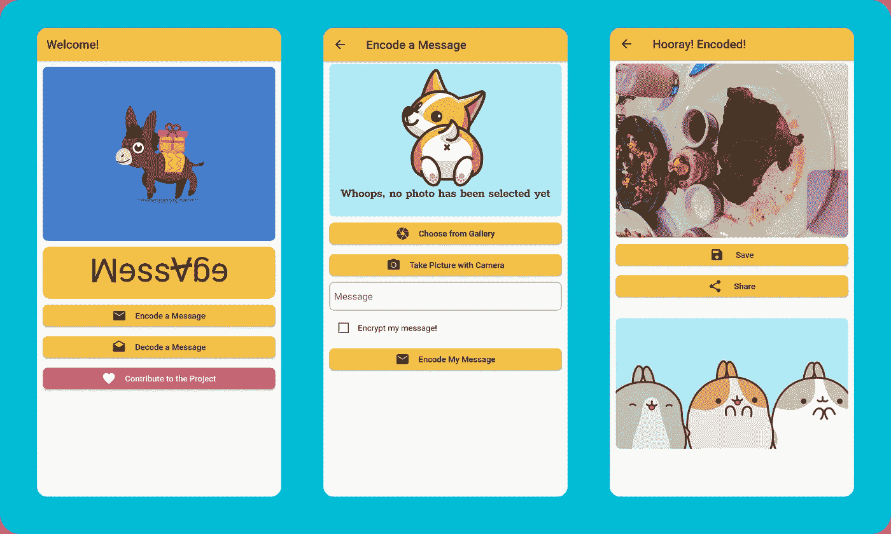
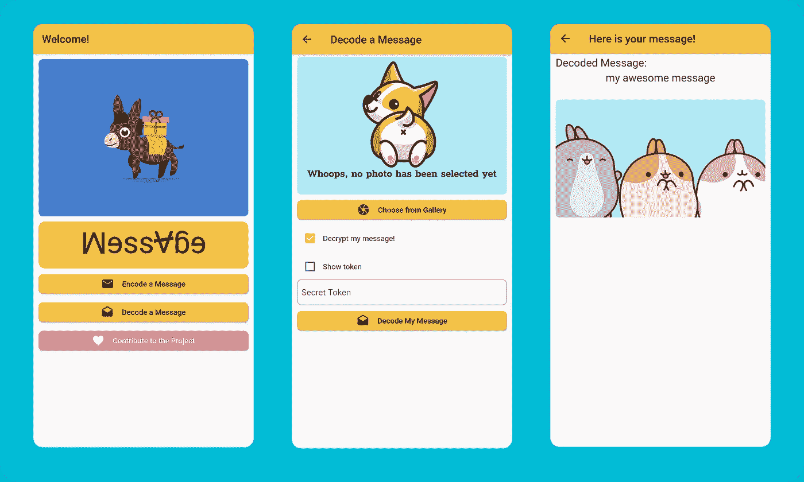
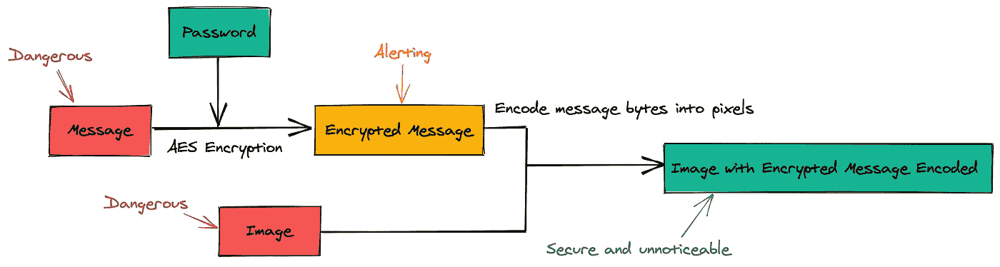
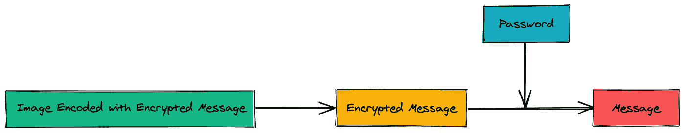

# 隐藏图像中的数据—使用 Flutter 加密隐写术

> 原文：<https://betterprogramming.pub/hide-data-in-images-encrypted-steganography-with-flutter-43b76ed5241f>

## 下一步:我加密我的信息，并假装它们是公开的


照片由 [Kristina Flour](https://unsplash.com/@tinaflour?utm_source=unsplash&utm_medium=referral&utm_content=creditCopyText) 在 [Unsplash](https://unsplash.com/s/photos/secret?utm_source=unsplash&utm_medium=referral&utm_content=creditCopyText) 上拍摄。

隐写术是在其他类型的媒体(如图像、视频或文件)中隐藏消息(如文本、原始字节或图像)的做法。例如，在图像中隐藏一段文本。

# 隐写术有助于减少解密尝试和审查

随着社交媒体越来越深入我们的日常交流，隐私问题引起了人们的关注。常见的做法是加密消息，但加密的消息很容易被识别。尽管 SHA-256 加密几乎不可能被破解，但通过社会工程学，密码仍然可能被破解。此外，信息服务容易受到审查。

更好的方法是用隐写术隐藏加密的信息。如果没有消息，或者至少看起来没有消息，就不会有任何攻击/阻止的尝试。

让我们用 Flutter 一步步实现加密隐写。

# 这个想法是秘密地将字节编码到图像中

我们知道，图像是由像素组成的，每个像素通常由三个八位整数组成。

为了将信息隐藏到像素中，我们必须至少改变一位。

为了使其不明显，我们选择修改最低有效位，保留像素值的主要部分。

例如，如果一个像素的值是 173(二进制形式是`0b10101101`)，而我们想要隐藏在这个像素中的位是`0b0`，我们只需用`0b0`替换最低有效位。这就产生了一个新的像素值`0b10101100`，它的十进制值是 172(与原始值 173 相差不远)。

使用这种方法，带有信息的图像对于人眼来说是不可区分的(或者如果原始图像很复杂，对于机器来说是不可区分的)。

在开始之前，让我们先来先睹为快完成的应用程序:

# 步骤 1:初始化应用程序

用命令`flutter create awesome_encrypted_steganography_app`初始化一个 Flutter 应用程序很简单。应用程序初始化后，我们可以将以下内容作为依赖项添加到`pubspec.yml`中:

```
image_picker: ^0.6.3+1              # Used to upload images
image_gallery_saver: ^1.2.2         # Used to output images
esys_flutter_share: ^1.0.2          # Used to share images
image:                              # Used for image manipulation
permission_handler: ^4.2.0+hotfix.3 # Used to handle permissions
encrypt: ^4.0.0                     # Used to do AES encryption
provider: ^4.0.4                    # Used to provide services
```

# 步骤 2:画出屏幕草图

总而言之，我们需要五个屏幕来构建一个端到端的加密隐写应用程序:

*   一个主屏幕，用户可以选择将消息编码到图像中，或者从图像中解码消息。
*   一个支持编码流的屏幕，用户可以在其中上传图像并输入消息和加密令牌。
*   输出编码图像并让用户下载/共享结果的屏幕。
*   一个支持解码流程的屏幕，用户可以上传图像并输入解密令牌。
*   显示解码和解密消息的屏幕。

注意:由于 UI 不是本文的重点，如果感兴趣，请查看[库](https://github.com/tianhaoz95/photochat)了解实现细节。

让我们跳到完整的用户界面，了解一下这个应用程序是如何工作的。

## 从消息到图像的流程



## 图像到消息的流程



# 步骤 3:将消息加密并编码成图像

下图显示了简化的实现:



## 加密邮件

这里，我们将使用 AES 进行对称加密，因为接收方需要解密原始消息(SHA256 哈希不可恢复):

## 将加密的消息转换为比特

然后，我们需要通过右移和屏蔽最后一位八次，将`String`消息转换为位:

## 将每一位编码成一个像素

如上所述，我们将通过替换每个像素值的最低有效位来将位编码到图像中:

# 步骤 4:从图像中恢复消息



## 从图像像素中恢复比特

为了从像素中提取位，我们需要屏蔽每个像素的最低有效位:

## 从 bits 中恢复加密消息

要从位组装字节，我们可以简单地将八位连接在一起:

## 解密消息

加密/解密对称加密的代码也是标准和对称的，因此解密代码看起来与加密代码非常相似:

# 第五步:喝杯咖啡

万岁！现在，您已经从头开始学习了如何实现加密隐写术应用程序。祝黑客快乐，让我们保护我们的隐私！