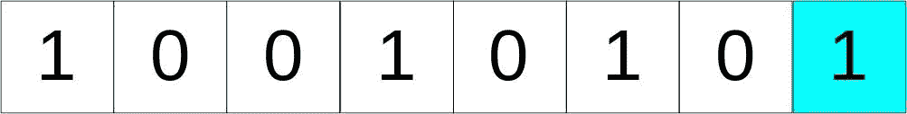
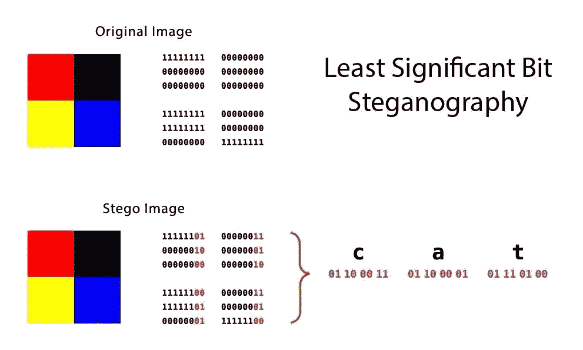
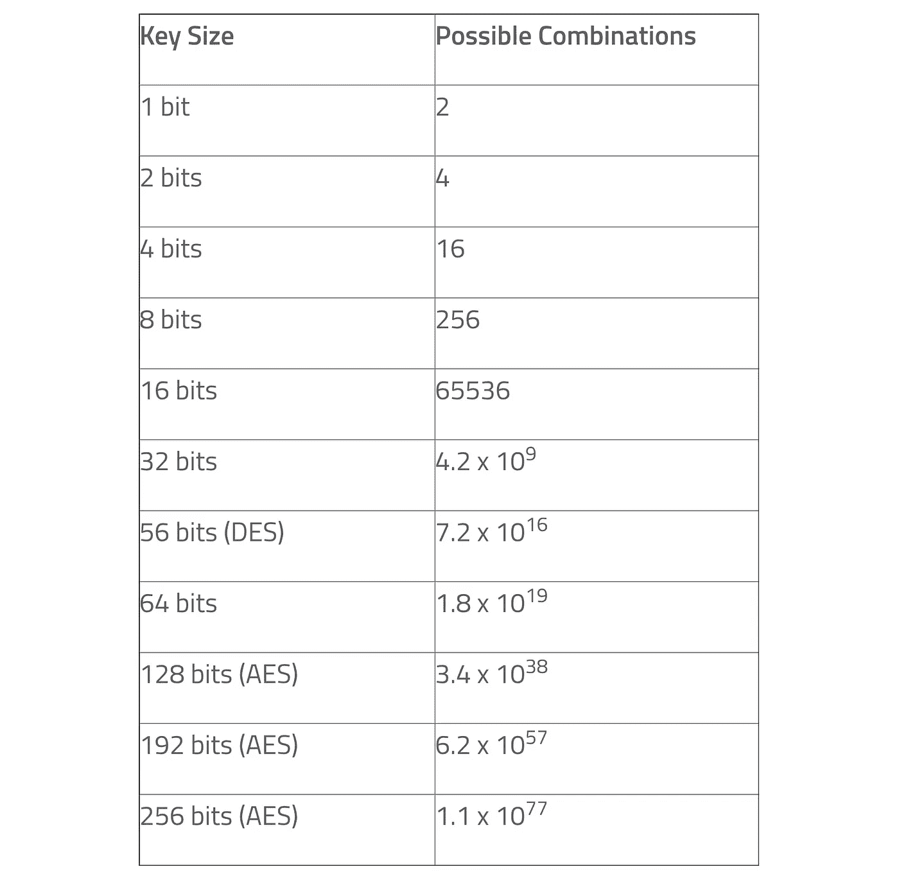
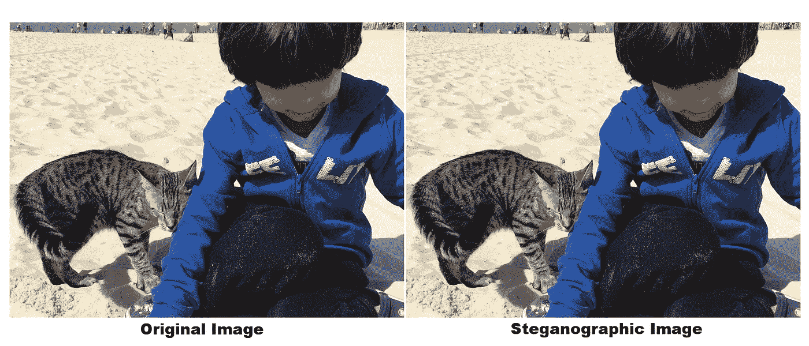

# 如何在图像中隐藏数据

> 原文：<https://betterprogramming.pub/hide-data-within-an-image-507f571aab89>

## 有时候，分享敏感信息的最佳方式是藏在显眼的地方

这就是隐写术的目的。


我的 GitHub 个人资料图片，里面隐藏了加密数据

# 什么是隐写术？

*隐写术*是一种将信息嵌入和隐藏在媒体中的艺术和科学。它与密码学相关，也一样古老。例如，[古希腊人用它来隐藏关于军队调动的信息](https://www.jstor.org/stable/3101474?seq=1)，将信息纹在某人的头上，然后让此人长出头发。

隐写术一词来自新拉丁语 *steganographia* ，它结合了希腊语 *steganós、*意为“覆盖或隐藏”，以及 *-graphia* 意为“书写”

在计算机科学的上下文中，介质是普通的文件，通常是图像。秘密数据随后可以在目的地提取。

# 为什么要隐写？

与传统加密不同，在传统加密中，信息被隐藏是显而易见的，隐写术的目的是将信息隐藏在众目睽睽之下，没有人会注意到。

隐写术的用途和通信本身的用途一样多种多样。在发送加密信息可能会引起怀疑的情况下，例如在言论自由受到压制的国家，这种方法会很有用。当图像或音频文件被盗时，它也经常被用作数字水印。还有，为了好玩。

既然你的电脑上可能有大量的图像，为什么不用它们来隐藏数据而不影响图像和引起怀疑呢？

# 隐写术是如何实现的？

隐写术只需要一个 *covertext* ，它是隐藏数据的媒介，一个由数据组成的*消息*，一个决定如何隐藏和检索数据的*算法*，以及一个可选的*密钥*，它将用于随机化数据的放置，甚至可能对数据进行加密。

有几种不同的技术可以隐藏普通文件中的数据。最常讨论的隐写术是嵌入图像。这也是研究最多的一种形式。虽然算法有很多种，但最常见的三种是 [LSB](https://ieeexplore.ieee.org/abstract/document/4221886?section=abstract) 、 [DCT](https://en.wikipedia.org/wiki/Discrete_cosine_transform) 和[追加类型](https://ieeexplore.ieee.org/document/8280584)。

LSB 代表*最低有效位，*使用最广泛。这种技术改变一个字节中的最后几个比特来编码一个消息，这在像图像这样的东西中特别有用，其中每个像素的红色、绿色和蓝色值由八个比特(一个字节)表示，范围从十进制的 0 到 255 或二进制的 00000000 到 1111111。



8 位数字中突出显示的 LSB 示例。致谢:[维基共享资源](https://en.wikipedia.org/wiki/Bit_numbering#mediaviewer/File:Least_significant_bit.svg)。

将完全红色像素中的后两位从 111111111 更改为 11111101 只会将红色值从 255 更改为 253，这对肉眼来说，会产生几乎察觉不到的颜色变化，但仍允许我们对图片内部的数据进行编码。



该图以彩色和二进制值显示了两个四像素图像。每个二进制块代表相应像素的值。学分:[技术基础](https://technical-foundation.blogspot.com/2017/11/steganography-hide-data-in-images-with.html)

LSB 技术适用于媒体文件，稍微改变字节值只会产生细微的不可察觉的变化，但像 ASCII 文本这样的东西就不太好了，其中一个不合适的位就会完全改变字符。

此外，因为它对颜色的数量有影响，即使非常小，用隐藏数据中的一个位替换这个位对图片的影响也是最小的。替换的位越多，可用的位*深度*就越多，图像越大，照片中可以存储的数据就越多。然而，被替换的位越多，统计检查[和目视检查](https://books.google.com.br/books?id=j4ujDgAAQBAJ&lpg=PA230&ots=aK84tNwEsn&dq=statistical%20inspection%20and%20a%20visual%20inspection%2Bsteganography%20LSB%20discover&pg=PA230#v=onepage&q&f=false)出现的变化就越明显。

出于这个原因，有许多其他隐写术技术，每一种都有自己的优点和缺点。

另一种不太容易检测到的技术叫做[离散余弦变换(DCT)系数技术](https://users.cs.cf.ac.uk/Dave.Marshall/Multimedia/node231.html)，它稍微改变了用于重建 JPEG 图像的余弦波的权重(系数)。它的工作原理是计算图像的频率，然后替换其中的一部分。DCT 算法处理照片的方式更加微妙，因此更难被发现。请注意，更大的转换(由于更多的嵌入数据)将使操作更加明显。

这些算法中最糟糕的是[追加算法](https://www.researchgate.net/project/File-Encryption-and-Hiding-using-AES-and-Append-Insertion-Steganography)。它不是通过处理图片来隐藏照片中的数据，而是将数据作为填充附加到文件的末尾。以这种方式，数据是隐藏的，决不会被任何照片显示程序读取。这些算法的唯一优点是算法编程简单，并且它们不受图片视觉检查的影响。

# 有效使用隐写术

默认情况下，隐写术是一种隐蔽的安全措施，因为它只隐藏数据，而不加密。在嵌入数据之前对其进行加密增加了一层额外的安全性。

这是[隐写术](https://github.com/computationalcore/cryptosteganography)的主要目标，这是一个 Python 隐写术模块，用于在图像中存储消息——或其他受加密保护的文件。

该模块通过数据加密增强了隐写术的安全性。隐藏的数据使用 [AES](https://en.wikipedia.org/wiki/Advanced_Encryption_Standard) -256 加密进行加密，这是一种用于对称密钥加密的流行算法。AES 已被美国政府采用，现在在全球范围内使用。

AES-256 的密钥长度为 256 位，其暴力破解需要比 128 位密钥多 2128 倍的计算能力。50 台每秒能检查 10 亿(10^18) AES 密钥的超级计算机(如果能制造出这样的设备的话)理论上需要 3×1051 年才能用完 256 位密钥空间。

下表显示了可能的键组合随着键的大小呈指数增长。



通过强力攻击破解的密钥大小和相应的可能组合。来源: [EE 次](https://www.eetimes.com/document.asp?doc_id=1279619#)。

# 在图像中嵌入隐藏数据

使用[隐写术](https://github.com/computationalcore/cryptosteganography)非常容易。该模块可以用作 Python 程序中的库，也可以用作 shell 命令行程序。

您需要安装 [pip](https://pip.pypa.io/en/stable/) ，Python 包安装程序，这可以按照这些[指令](https://www.makeuseof.com/tag/install-pip-for-python/)来完成。请注意，在大多数现代 Linux 系统上，Python 和 pip 是默认随操作系统一起安装的。

之后，运行下面的命令从终端安装[隐写术](https://github.com/computationalcore/cryptosteganography):

```
pip3 install cryptosteganography
```

一旦安装完毕，您可以通过传递`-h`或`— help`参数来检查如何使用它。

```
$ cryptosteganography -h
usage: cryptosteganography [-h] {save,retrieve} ...

A python steganography script that save/retrieve a text/file (AES 256
encrypted) inside an image.

positional arguments:
  {save,retrieve}  sub-command help
    save           save help
    retrieve       retrieve help

optional arguments:
  -h, --help       show this help message and exitThe arguments are broken down as follows:
```

例如，为了在图像中嵌入数据，请键入以下命令。

```
$ cryptosteganography save -i vin-and-orion.png -m "My secret message..." -o output.png
Enter the key password:
```

输入用于生成加密密钥的密码后，就会生成隐写图像。

要从隐写图像中检索隐藏数据，您可以运行…

```
$ cryptosteganography retrieve -i output.png
Enter the key password:
My secret message...
```

…并输入相同的密码。

该库还允许您在图像中存储其他文件，但文件大小必须小于原始图像。您可以查看更多 CLI 选项，以及如何在另一个 Python 程序[中将其用作库。](https://github.com/computationalcore/cryptosteganography)



原始图像和隐写图像的并排比较

# 好奇的口气

几年前，当我发布这个 Python 库时，我向我的同事和研究小组提出了一个小难题。最初的线索分散在[库的源代码库中、](https://github.com/computationalcore/cryptosteganography/blob/master/README.rst)我在 GitHub 上的简介的[图片中、](https://avatars3.githubusercontent.com/u/4824157)以及[我的个人网站](https://computationalcore.github.io/vinbusquet/)上。

这个谜仍未解开。

**注**:GitHub 等服务通常会在用户上传后对原始图像进行压缩和/或转码，这可能会使隐藏信息被破坏且不可恢复。在这个特别的例子中，我发现如果你上传一张图片，并且图片的大小和编码标准与 GitHub 对原始图片使用的完全相同(图片没有任何 URL 查询参数，如`s`、`u`和`v`)，系统会保存图片，不做任何修改。这就是为什么拼图中的图像仍然有加密的信息。

# 参考

*   [模块 URL](https://pypi.org/project/cryptosteganography/)
*   [源代码](https://github.com/computationalcore/cryptosteganography)