# 扑应用，隐藏你的密码

> 原文：<https://betterprogramming.pub/hide-your-passwords-e9154bbb8db4>

## *不要在你的 Flutter 应用中存储密码——远程存储密码*

在本文中，我将回顾我编写的实用程序类`RemoteConfig`，用于访问提供给所有 Firebase 项目的远程配置云服务。`RemoteConfig` *i* 是一个与插件`[firebase_remote_config](https://pub.dev/packages/firebase_remote_config)`协同工作的包装类，该插件反过来使用 [Firebase 远程配置 API](https://firebase.google.com/products/remote-config/) 与远程配置云服务进行通信。当然，您可以保留这个实用程序类的副本，因为它被存储为一个要点:`[remote_config.dart](https://gist.github.com/Andrious/51ab198ad6128b55a70d6b1bc32f8136#file-remote_config-dart)`。正如您从我过去的文章中所知道的，我通常用一个实际的或众所周知的例子来演示如何使用这样一个类。在本文中，我将用一个有点争议的例子来尝试这样的演示 Flutter 应用程序密码的远程存储。

众所周知，现在手机应用程序的一个常见功能是在用户登录时使用脸书、谷歌或 Twitter 来验证用户身份。碰巧的是，用于使用 twitter 登录的流行插件 [flutter_twitter](https://pub.dev/packages/flutter_twitter) 要求您提供一个公钥和一个字符串形式的秘密令牌。然而，这一事实带来了潜在的危险。下面是这个插件的截图，突出显示了两个必需的字符串。

[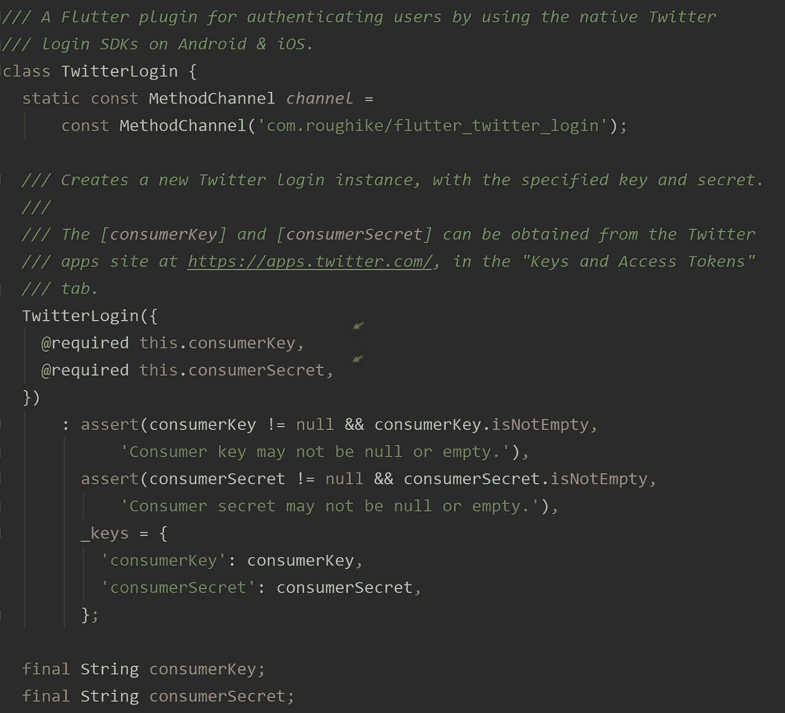](https://github.com/roughike/flutter_twitter_login/blob/c7ee95184dc1e8fbcdd1c19fef9b695a3afd84b4/lib/flutter_twitter_login.dart#L6)

[flutter _ Twitter _ log in . dart](https://github.com/roughike/flutter_twitter_login/blob/c7ee95184dc1e8fbcdd1c19fef9b695a3afd84b4/lib/flutter_twitter_login.dart#L6)

当你把你的应用程序发布到产品中时，毫无疑问它会被下载，并且它的代码会被搜索到每一个`String`出现的地方。坏人会寻找密码，这是不可避免的。当你发布你的应用程序时，关键是你要使用[混淆](https://flutter.dev/docs/deployment/obfuscate)，这样许多函数名和变量名就变成了不可读的术语——所有这些都是为了让你的代码很难破译。混淆工具也会执行一些`String`文字的转换，但是最好不要在你的 Flutter 应用中存储敏感的字符串。换句话说，当你的 Flutter 应用程序启动时，最好远程获取你的秘密令牌甚至你的公钥。一种方法是使用 Firebase 的远程配置服务。

# 仅限截图。点击查看要点。

和往常一样，我更喜欢用截图而不是 gists 来展示我的文章中的代码。我发现它们更容易使用，也更容易阅读。然而，你可以点击它们来查看 gist 或 Github 中的代码。讽刺的是，这篇关于移动开发的文章，在电脑上看比在手机上看更好。此外，我们大多在电脑上编程；我们的手机上没有。暂时如此。

我们开始吧。

# 远程登录

下面是一个特定 Firebase 项目的远程配置屏幕截图。传统上，远程配置用于存储服务器端默认值，以控制应用程序的行为和外观，尽管谷歌不建议这样做，但另一个选择是在那里存储更敏感的信息。两个这样的值在下面的截图中间用红色箭头突出显示。在这个例子中，Twitter 登录的公钥和秘密令牌存储在远程配置云服务中，并使用字段值`com`和`andrioussolutions`进行检索，而不是存储在 Flutter 应用程序中。

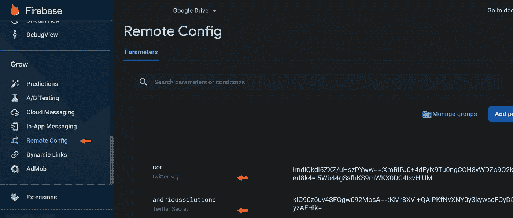

下面的例程是我正在进行的项目之一的截图。它调用插件`[flutter_twitter](https://pub.dev/packages/flutter_twitter)`，但不是在访问项目的远程配置并提供两个必需的字符串值之前。你可以看到我没有在代码中以字符串的形式提供太多的信息。相反，这个例程提取应用程序的包名，并使用前两部分`com`和`andrioussolutions`来检索这些特定的远程配置值。

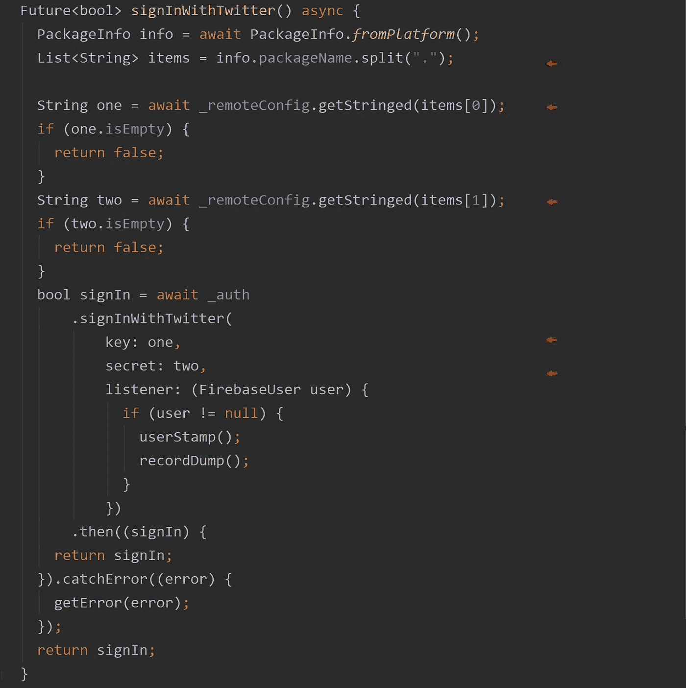

注意，上面第一个红色箭头突出显示的是带有句点的单独字符串。不可否认，将该字符串赋给全局变量或类属性会更好。你看，坏人总是在你的代码中寻找单引号和双引号(或者他们混淆的等价物)。目前，它在被使用的同一个例程中被发现，我不应该把它放在那里。我是说，为什么要让他们更容易？

我在这个实用程序类中做的另一件事是在这个过程中引入加密。函数`getStringed()`将会引起特别的兴趣。它从远程配置返回字符串值，但不是在解密检索到的值之前。正如您可以在下面的屏幕截图中看到的那样，这个函数是为公钥和秘密令牌而调用的。因此，回到上面那个特定 Firebase 项目的远程配置屏幕截图，那里存储的值实际上是公钥和秘密令牌的加密版本。再说一次，为什么要让他们更容易呢？

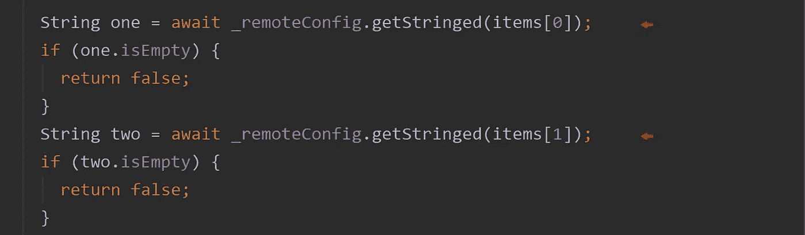

瞥一眼类库`RemoteConfig`，我们可以看到该函数调用其常规的`getString()`函数，用于从 Firebase 的远程配置中检索字符串值，但随后它将该值传递给一个名为`de()`的异步函数。

[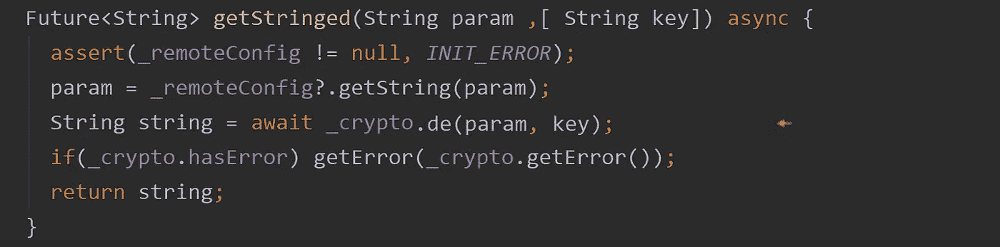](https://gist.github.com/Andrious/51ab198ad6128b55a70d6b1bc32f8136#file-remote_config-dart-L117)

[remote_config.dart](https://gist.github.com/Andrious/51ab198ad6128b55a70d6b1bc32f8136#file-remote_config-dart-L117)

这是函数`**decrypt()**`的缩写形式，该函数调用另一个函数来执行实际的解密。这些功能的屏幕截图如下所示。再次强调，不建议你将如此敏感的信息存储在谷歌的云服务中，但是如果你必须这样做，加密将会降低风险——哪怕只是一点点。将这些值存储在您自己的远程平台中是一个更好的选择，但这是另一个故事了。

[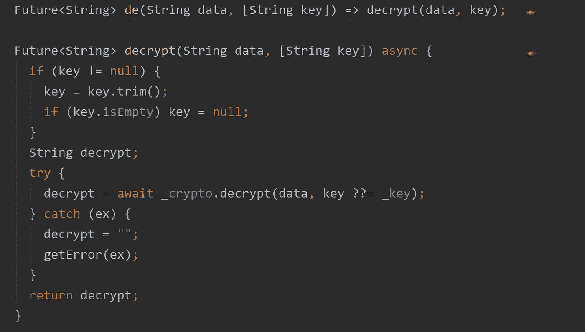](https://gist.github.com/Andrious/428ebe7374c1f617d631c5802c87751a#file-string_encryption-dart-L39)

[string_encryption.dart](https://gist.github.com/Andrious/428ebe7374c1f617d631c5802c87751a#file-string_encryption-dart-L39)

# 远程配置程序

让我们浏览一下在库文件`[remote_config.dart](https://gist.github.com/Andrious/51ab198ad6128b55a70d6b1bc32f8136#file-remote_config-dart)`中找到的`RemoteConfig`类，并解释它的作用。下面有一个截图显示了这门课的开始。同样，它与知道如何与 Firebase 的远程配置对话的插件一起工作，在下面的截图中，你可以看到它是以前缀`r`导入的。但是，请注意，它也从插件文件中导出特定的类。这就是为什么当使用库例程时，你不需要导入插件文件，你只需要导入这个文件:

`import remote_config.dart`

而不是:

`import package:firebase_remote_config/firebase_remote_config.dart`

`import remote_config.dart`

在构造函数中还要注意的是，如果参数被赋值为 null，我会显式地测试这些参数。对于普通大众使用的这样一个实用程序类，空值可能会被意外或以其他方式传入。此外，被包含的插件使用的命名参数`defaults`和`expiration` 确保被赋予有效值。最后，该类不将参数值存储在实例变量中。这些值被传递给私有变量。它们不需要作为公共类属性再次被访问。这是一种安全预防措施——这种实用程序类的另一个特征。

[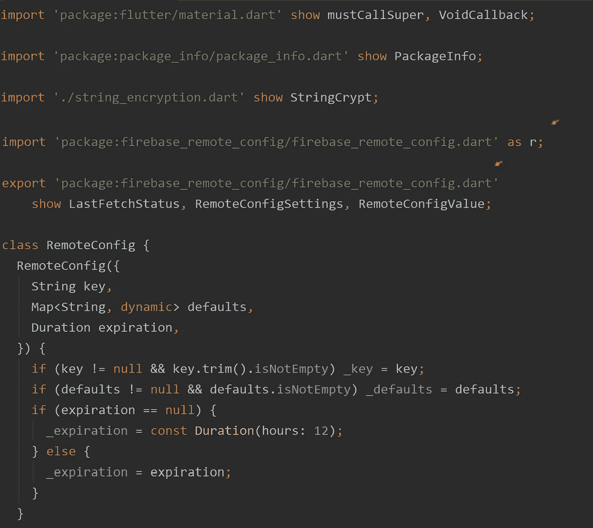](https://gist.github.com/Andrious/51ab198ad6128b55a70d6b1bc32f8136#file-remote_config-dart-L1)

[remote_config.dart](https://gist.github.com/Andrious/51ab198ad6128b55a70d6b1bc32f8136#file-remote_config-dart-L1)

下一段代码列出了这个例程中使用的私有变量和 getters。值得注意的是，getter、`instance`、*、*是对`RemoteConfig`插件本身的引用。你可能不需要它，但它是一种选择。如果你看过我过去的文章，你就知道我喜欢期权！

[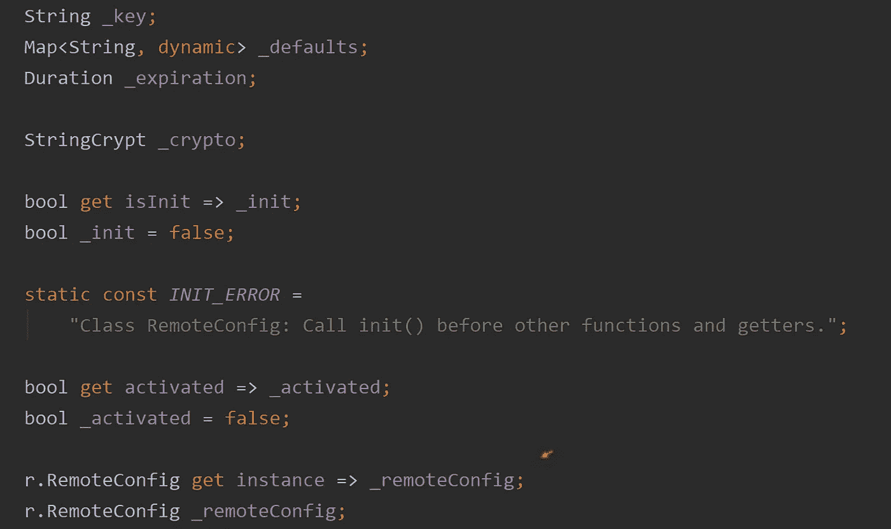](http://remote_config.dart)

[remote_config.dart](https://gist.github.com/Andrious/51ab198ad6128b55a70d6b1bc32f8136#file-remote_config-dart-L26)

# 初始化你的遥控器

下一段代码是`init()`函数。我决定在这个例程中有一个单独的`init()`函数，以提醒任何使用这个类的开发人员，不仅要调用`init()`函数来初始化，还要调用相应的`dispose()`函数来“清理”在下面的`init()`函数的截图中，你可以看到远程配置插件实际上是在这里初始化的。此外，传递给例程的任何默认值都会被分配给插件。最后，在那里调用插件的`fetch()`函数来‘获取’存储在`RemoteConfig`中的参数值。

您会注意到在`init()`函数中也设计了一个加密密钥。如果这个键没有被显式地传递给这个函数，那么你的应用程序的包名将被用来在`RemoteConfig`中查找一个可能的键——sneaky！

[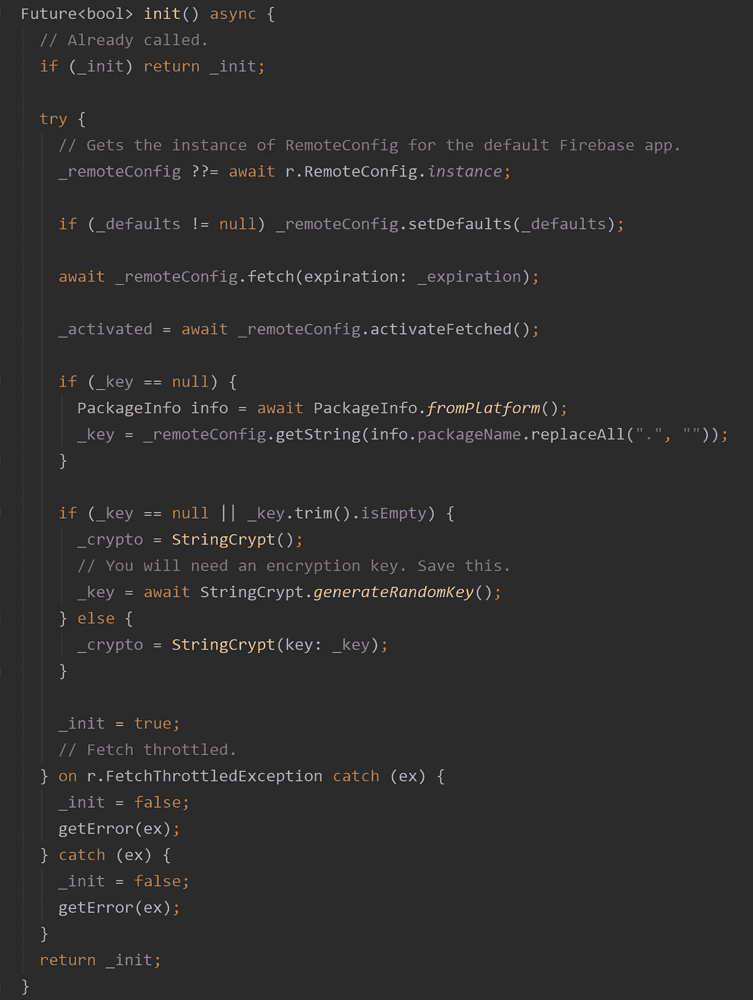](https://gist.github.com/Andrious/51ab198ad6128b55a70d6b1bc32f8136#file-remote_config-dart-L44)

[remote_config.dart](https://gist.github.com/Andrious/51ab198ad6128b55a70d6b1bc32f8136#file-remote_config-dart-L44)

进一步注意:`init()`函数中的整个操作都包含在一个 try-catch 语句中，任何异常都会被记录下来。任何这样的实用程序类都应该记录所有的异常。最后，如果一切顺利，将返回布尔值 true。

下一段代码将反映插件本身的属性和功能。同样，作为一个公共使用的实用程序类，您必须确保该例程被正确使用。在这种情况下，`init()`函数必须在您可以做任何其他事情之前被调用，这就是您在下面看到的一系列`assert()`函数的用途。如果开发人员忘记调用`init()`函数，如果他们试图进一步处理这个例程，他们就会知道。

[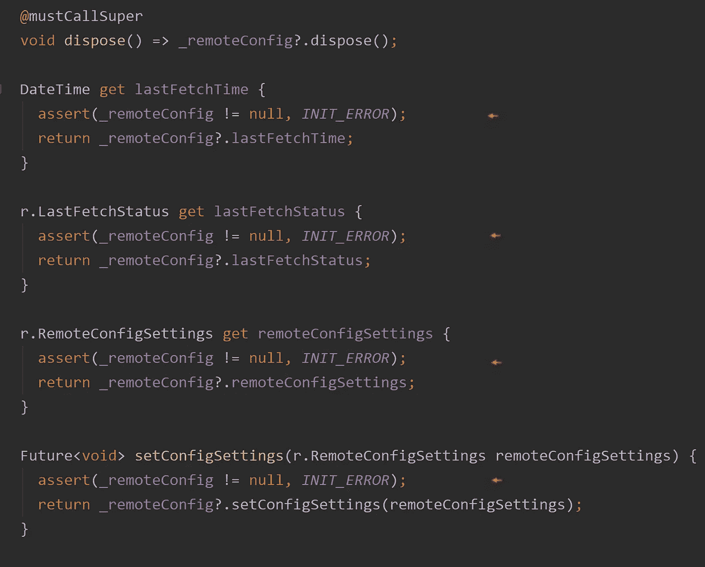](http://remote_config.dart)

[remote_config.dart](https://gist.github.com/Andrious/51ab198ad6128b55a70d6b1bc32f8136#file-remote_config-dart-L83)

接下来的代码是你最常使用的。您将提供适当的键值，并使用以下函数从 Firebase 的远程配置中检索参数值。这里有`getStringed()`功能。和往常一样，如果解密出现异常，它会被记录在这个实用程序类中。

[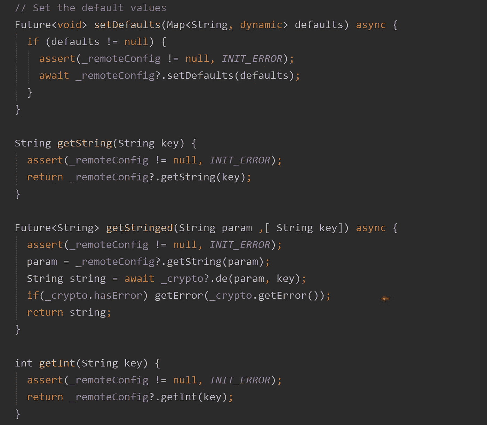](https://gist.github.com/Andrious/51ab198ad6128b55a70d6b1bc32f8136#file-remote_config-dart-L106)

[remote_config.dart](https://gist.github.com/Andrious/51ab198ad6128b55a70d6b1bc32f8136#file-remote_config-dart-L106)

下面剩余的代码继续反映插件本身可用的功能。你甚至可以添加监听器来引入函数，每当一个`RemoteConfig`值在应用程序执行过程中可能改变时，这些函数就会触发。

[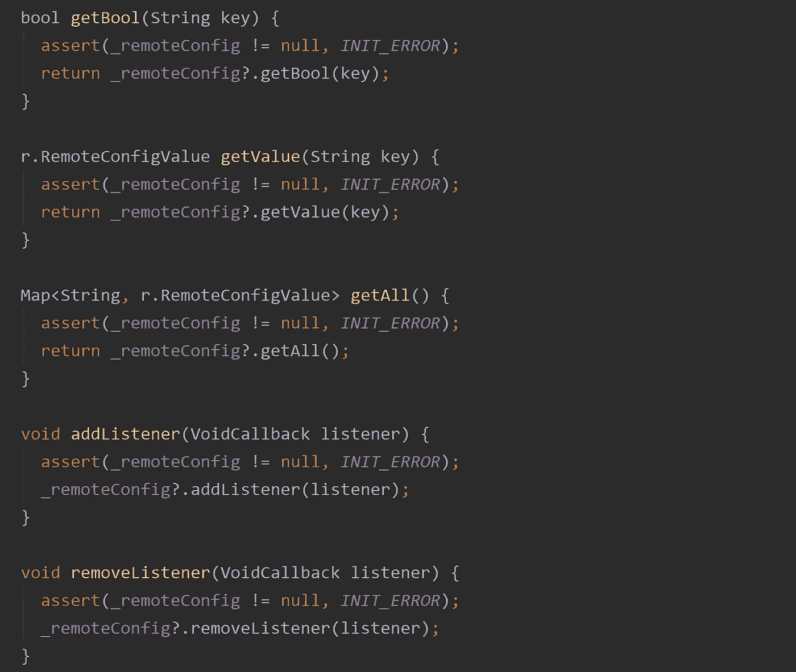](https://gist.github.com/Andrious/51ab198ad6128b55a70d6b1bc32f8136#file-remote_config-dart-L137)

[remote_config.dart](https://gist.github.com/Andrious/51ab198ad6128b55a70d6b1bc32f8136#file-remote_config-dart-L137)

# 远程错误

最后，在这个`RemoteConfig`包装器类中，有记录任何异常的代码。如果出现问题，有两个 getters，您可以在应用程序中使用它们来测试包装类是否以任何方式失败。例如，如果`_remoteConfig.hasError`或`_remoteConfig.inError`被设置为真，则存在异常。

正如你现在所知道的，在整个类中，伴随着每个 try-catch 语句，函数`getError()`被调用来记录任何异常。那么，您的应用程序也可以不带参数地调用`getError()`来检索已经发生的实际异常并相应地采取行动。不错！

[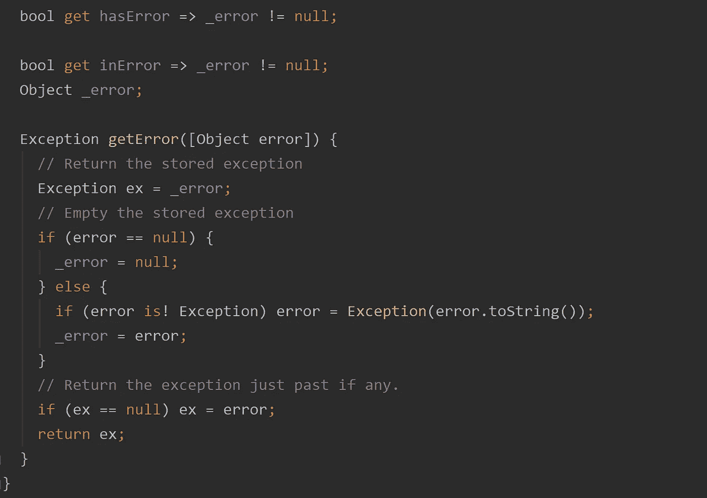](https://gist.github.com/Andrious/51ab198ad6128b55a70d6b1bc32f8136#file-remote_config-dart-L162)

[remote_config.dart](https://gist.github.com/Andrious/51ab198ad6128b55a70d6b1bc32f8136#file-remote_config-dart-L162)

# 解密加密的

像远程配置程序一样，我需要一个加密程序。碰巧的是，`getStringed()`函数需要解密`RemoteConfig`值的方法。当然，使用您最喜欢的 IDE 和断点，您必须首先加密这些值，并首先将它们存储在那里。`StringCrypt`类为您完成所有这些工作，如下所示。它使用类`[PlatformStringCryptor](https://github.com/sroddy/flutter_string_encryption/blob/1fa478d59842931f5959e288880c384077d52bb7/lib/flutter_string_encryption.dart#L31)()`与另一个流行的插件`[flutter_string_encryption.dart](https://pub.dev/packages/flutter_string_encryption)`一起工作。

同样，像`RemoteConfig`例程一样，这个类不将它的三个参数存储在类属性中，而是将它们放入私有变量中。你也可以看到它的插件是在构造函数中初始化的。最后，您可以提供一个密码和`salt`来生成密钥，而不是显式地为插件提供一个密钥参数。生成加密需要这样的密钥。

`salt`参数是一个附加字符串，在生成加密和解密的密钥时伴随着密码。这是一个额外的安全措施，以防密码被泄露——如果坏人想要访问它，还需要一个组件。这意味着它必须存放在远离密码的地方。事实上，这个想法是密码不存储在任何地方——它由用户记忆，并在你的 Flutter 应用程序启动时输入。反正那是后话了。

[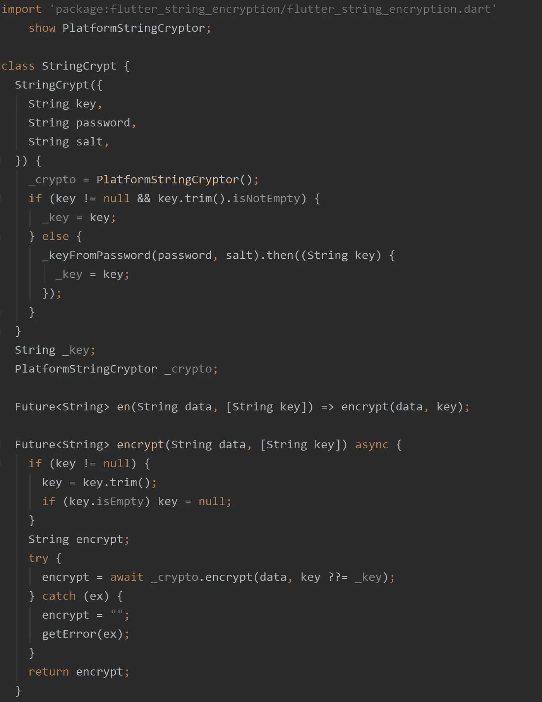](https://gist.github.com/Andrious/428ebe7374c1f617d631c5802c87751a#file-string_encryption-dart-L1)

[string_encryption.dart](https://gist.github.com/Andrious/428ebe7374c1f617d631c5802c87751a#file-string_encryption-dart-L1)

下面，你现在看到了由`RemoteConfig`类使用的`decrypt`例程。此外，您可以看到一些函数，例如，您可以使用这些函数首先生成一个密钥，然后存储在`RemoteConfig`上。

[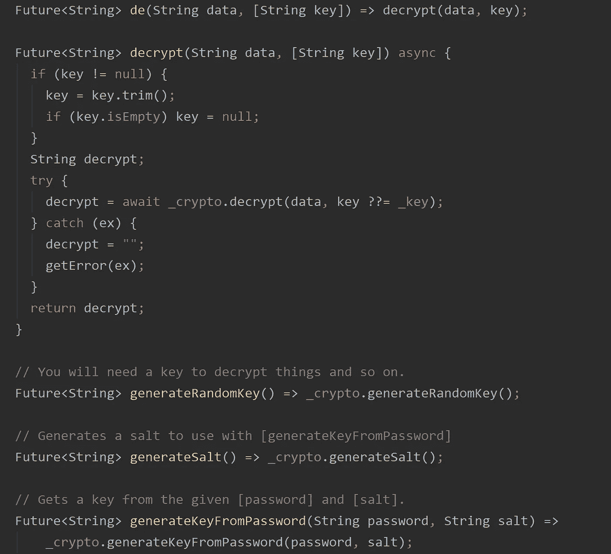](https://gist.github.com/Andrious/428ebe7374c1f617d631c5802c87751a#file-string_encryption-dart-L39)

[string_encryption.dart](https://gist.github.com/Andrious/428ebe7374c1f617d631c5802c87751a#file-string_encryption-dart-L39)

私有函数`_keyFromPassword()`非常简单明了。如果提供了密码和 salt，它会在构造函数中调用 back up，并为私有变量`_key`分配一个密钥。

最后，你会发现在这个类的最后一段代码。同样，这样一个实用程序类应该捕获所有异常，并保存它，以便开发人员可以选择检索并相应地采取行动。下面列出了该代码。

[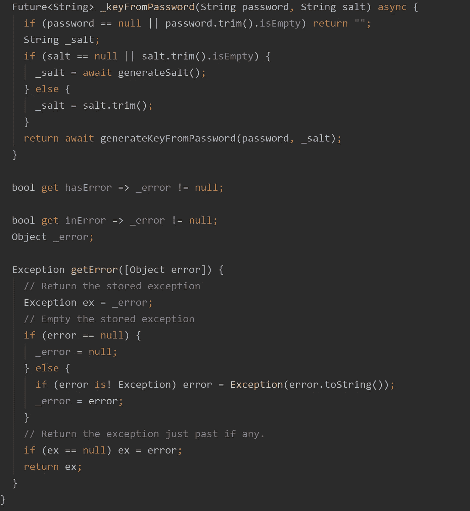](https://gist.github.com/Andrious/428ebe7374c1f617d631c5802c87751a#file-string_encryption-dart-L66)

[string_encryption.dart](https://gist.github.com/Andrious/428ebe7374c1f617d631c5802c87751a#file-string_encryption-dart-L66)

这个实用程序类`[RemoteConfig](https://gist.github.com/Andrious/51ab198ad6128b55a70d6b1bc32f8136#file-remote_config-dart)`是出于需要而编写的——我需要使用 Firebase 的远程配置服务。我已经将这个类和`[StringCrypt](https://gist.github.com/Andrious/428ebe7374c1f617d631c5802c87751a#file-string_encryption-dart)`类提供给我们羽翼未丰的 Flutter 社区使用、更改和增强。希望你能分享任何改变。当然，我用来存储密码的例子可能不会阻止最坚定的攻击者，但这比在你的 Flutter 应用程序中存储这样的密码要好。没有吗？

干杯！