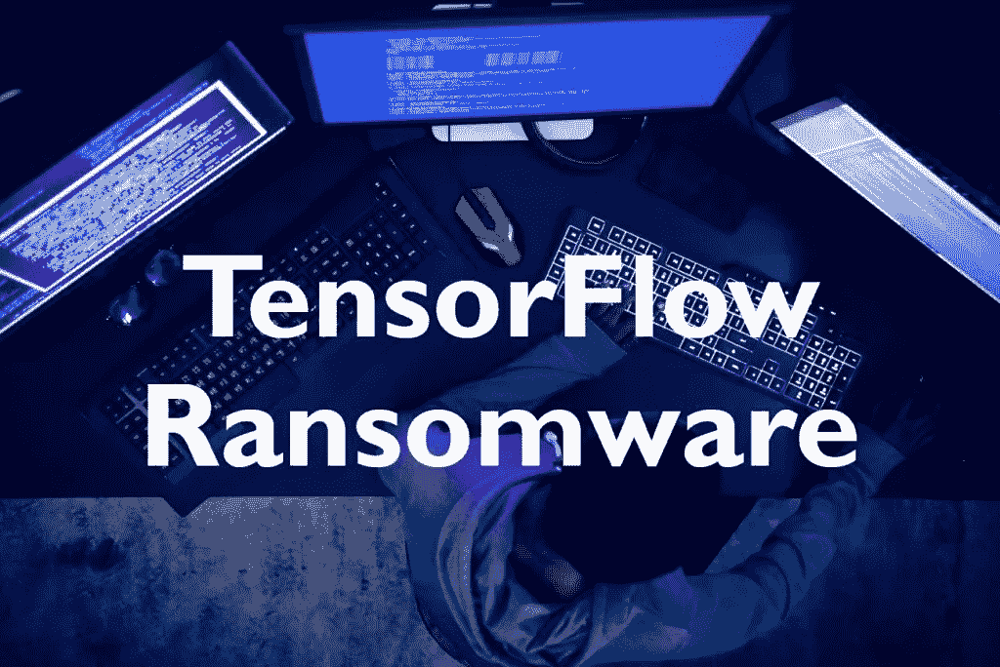

# 在张量流模型中隐藏勒索软件

> 原文：<https://betterprogramming.pub/hiding-ransomware-in-tensorflow-model-fdefbaabe86a>

## 保护您的模型

预训练模型在机器学习过程中起着重要的作用。对象检测模型依赖于预先训练的图像网络。与从头开始训练模型相比，对预训练模型进行微调通常是更好的选择。

那么，如果有人可以隐藏勒索软件或一些间谍软件-窃取您的宝贵数据到这些模型之一呢？如果可以直接用 TensorFlow 写勒索软件会怎么样？这篇文章将详细介绍什么是可能的。

> ***免责声明:*** 这篇文章旨在对使用预训练模型的潜在危险进行教育概述，而不是作为创建模型的指南。

今年，我帮助准备了 2021 年欧洲网络安全挑战的挑战。我创建的挑战是关于逆转用 TensorFlow 编写并存储为 TensorFlow 模型的勒索软件，该模型在用于推理时会加密数据(在我的程序中只有图像)。

本文不会解释如何解决这个挑战，而是给出一些关于它是如何创建的细节。在本文的其余部分，我将假设使用 TensorFlow 2.4.1。

# 张量流模型格式

如果我们使用流行的`tf.keras.Model`类来构建模型，它提供了一个简单的`save(...)`函数。该功能允许以两种格式保存模型:

*   [TensorFlow SavedModel](https://www.tensorflow.org/guide/saved_model)
*   [HDF5](https://en.wikipedia.org/wiki/Hierarchical_Data_Format)

HDF5 的好处是将一个模型保存到单个文件中，但似乎对文件内容要求更严格。在这篇文章中，我们将使用`Tensorflow SavedModel`,因为它允许我们保存更复杂的函数。

# 读取和写入文件

读写是创建勒索软件的关键 IO 功能。将这些函数存储在保存的模型中是最重要的一步。

有读取文件的功能并不奇怪。毕竟数据管道是每个机器学习项目的重要组成部分。因此 TensorFlow 提供了许多功能来优化这一过程。我们将使用的两个主要软件包是`tf.io`和`tf.data`。

[tf.io](https://www.tensorflow.org/api_docs/python/tf/io) 提供低级输入输出操作。我们将使用函数`tf.io.read_file(...)`和`tf.io.write_file(...)`。这些函数的伟大之处在于它们可以将文件直接读入`tf.Tensor`或将`tf.Tensor`写出到文件中。而且，这些函数可以保存为 SavedModel 格式。

然而，棘手的部分是列出文件。勒索软件不能依赖静态文件路径。另外，它必须能够列出模型目录之外的文件。

我不得不尝试多种不同的函数，因为有些函数一旦保存后总是返回相同的结果。最终，我到达了基于文件模式列出文件的`tf.data.Dataset.list_files(...)`。此外，该文件模式可以是`tf.Tensor`的形式。

# 勒索软件

有了这些关键组件，我们就可以开始编写实际的代码了。如下所示，我们通过子类化`tf.keras.Model`来创建模型。

然后我们只需要覆盖预测过程中执行的`call(...)`函数。在那里，我们执行实际的预测和文件加密。

我跳过了实际的加密功能。对任意长度的数组使用 TensorFlow 有一些限制，但是如果有足够的创造力，这应该不是问题。尤其是因为文件可以作为字节数组加载。

最大的问题是遍历目录。截至目前，该代码只加密图像。这显然可以通过检查不同的文件类型和添加用于访问父目录的`../`来扩展。然而，我没有找到任何简单的方法来检测列出的文件是目录还是实际文件。

另一个问题是代码实际上非常慢。至少我用于 ECSC 2021 挑战赛的加密算法是这样的。我想这主要是因为我一个字节接一个字节地运行加密程序，这对于大文件来说会花费很长时间。不过，如果有人设法用优化的矩阵运算来执行加密，我也不会感到惊讶。

# 结论

我猜，为了创建成功的勒索软件，你需要解决的问题不仅仅是读取文件。另一方面，它仍然关注的是，模型可以读取文件没有任何通知。尤其是因为预先训练的模型是机器学习世界的重要组成部分。

现在，我正在开发一个应用程序 [feltoken.ai](https://feltoken.ai/) ，它专注于使用智能合约创建一个联合学习解决方案。保护数据隐私是联合学习的一个关键部分，在联合学习中，各方只共享最终训练的模型。本文中演示的内容使得使用这种模型格式来共享模型变得不可能，因为这可能会导致数据泄漏。

*原载于*【https://bretahajek.com】