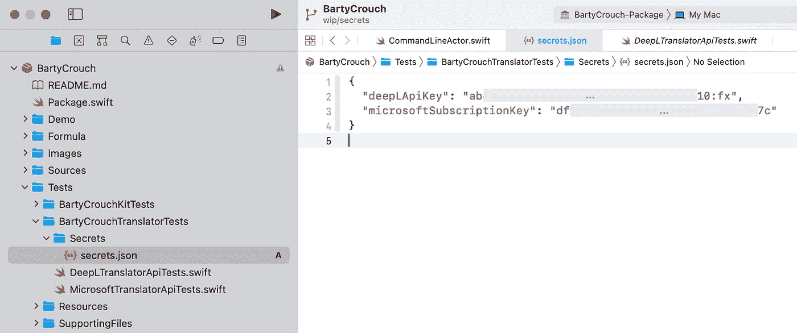
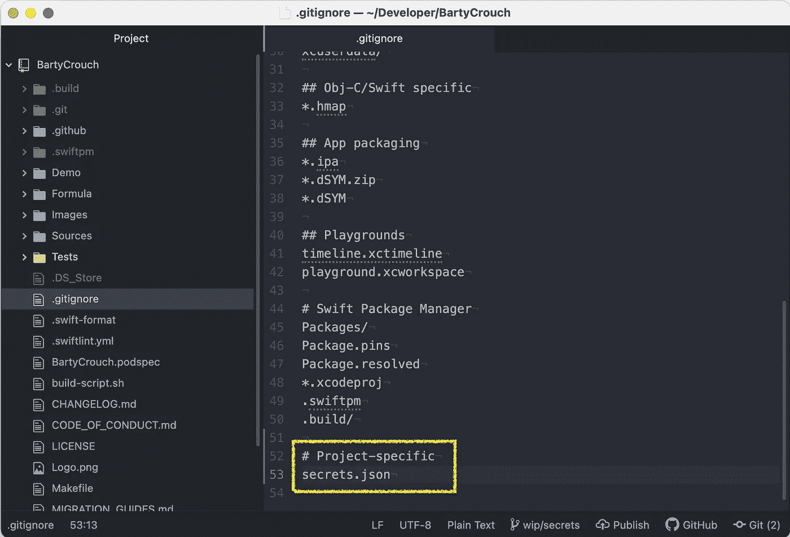
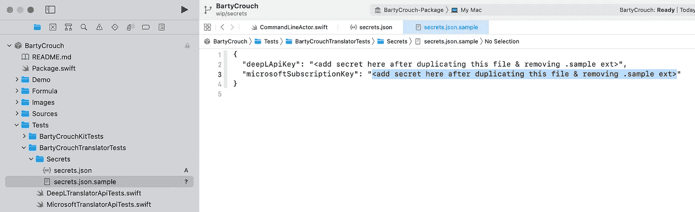
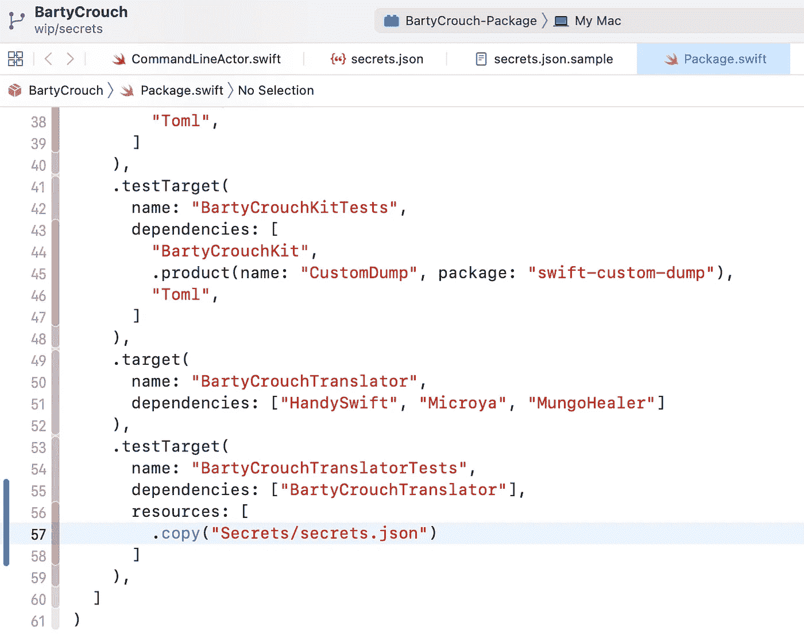
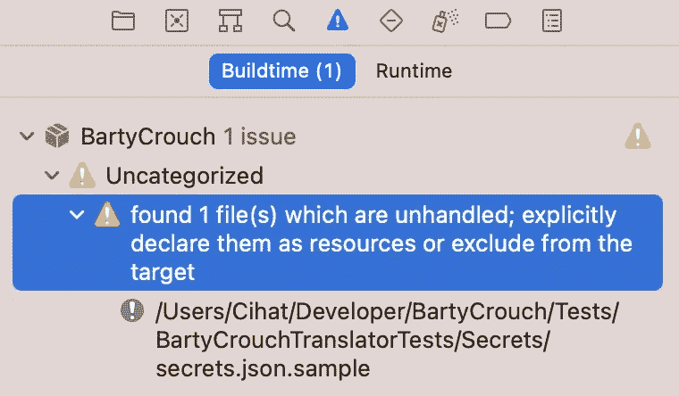
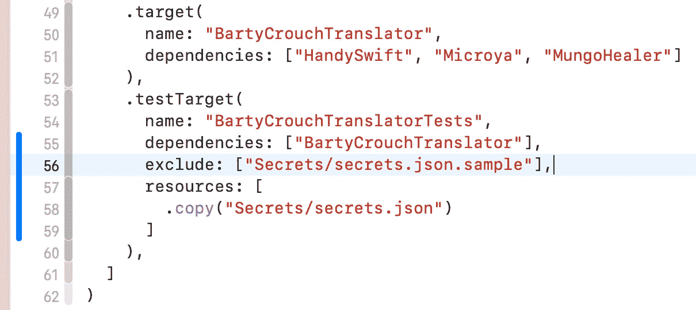
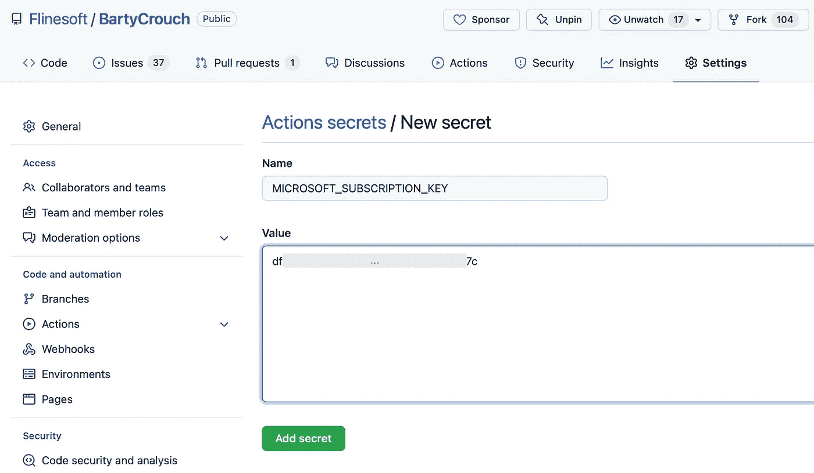
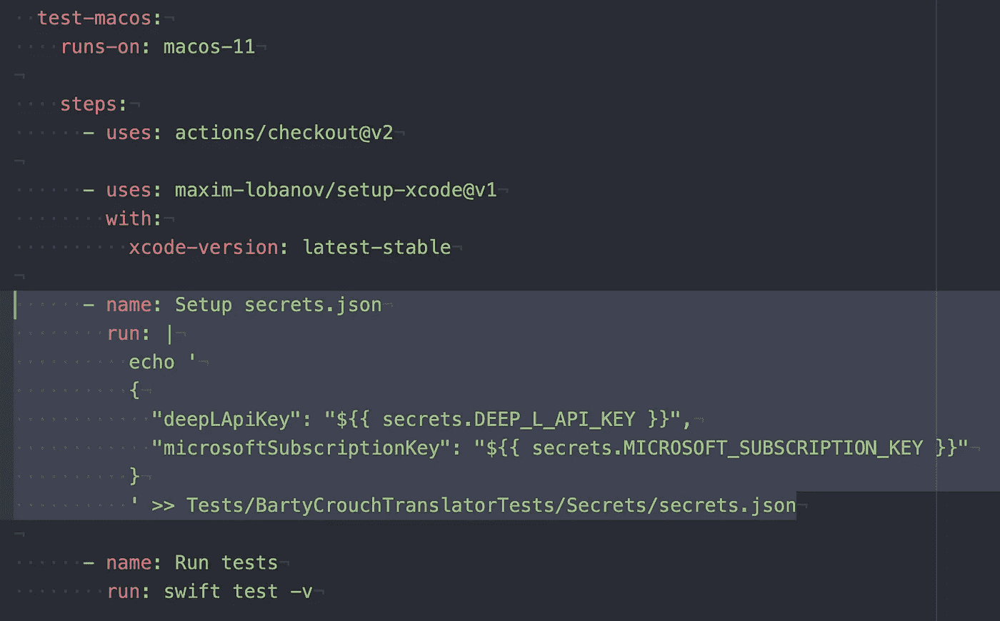
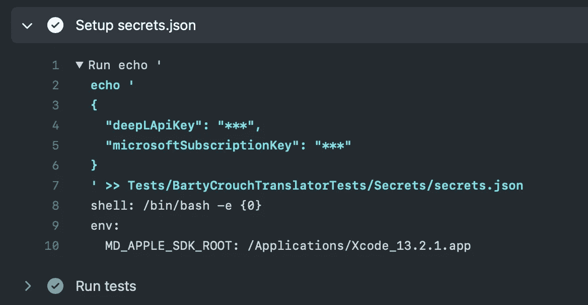

# 在 SwiftPM 中对 Git 隐藏秘密

> 原文：<https://betterprogramming.pub/hiding-secrets-from-git-in-swiftpm-1463c023c67>

## 模块化您的应用


照片由[飞:D](https://unsplash.com/@flyd2069) 上[的 Unsplash](https://unsplash.com)

你可能知道一些隐藏秘密的传统方法，比如你的应用程序需要的 API 密钥或第三方服务令牌。但是现在使用 SwiftPM 模块化应用程序的方法变得越来越流行。

例如，Point-Free 有一个关于这个主题的很棒的[免费剧集](https://www.pointfree.co/episodes/ep171-modularization-part-1)，Majid Jabrayilov 最近写了一个关于“微应用架构”的 4 集系列(第 [1](https://swiftwithmajid.com/2022/01/12/microapps-architecture-in-swift-spm-basics/) 、 [2](https://swiftwithmajid.com/2022/01/19/microapps-architecture-in-swift-feature-modules/) 、 [3](https://swiftwithmajid.com/2022/01/26/microapps-architecture-in-swift-resources-and-localization/) 、 [4](https://swiftwithmajid.com/2022/02/02/microapps-architecture-in-swift-dependency-injection/) )，我都可以推荐开始。

此外，您甚至可能希望在公共开源库中隐藏秘密，例如，在一些第三方服务集成的单元测试中，库的用户将提供他们自己的令牌，但是您希望[您的测试与您自己的](https://github.com/Flinesoft/BartyCrouch/blob/baece7f4786bc805358f35ba5fd60d6259d5c8b9/Tests/BartyCrouchTranslatorTests/MicrosoftTranslatorApiTests.swift#L8)一起运行。

这些情况的共同点是它们基于自定义维护的`Package.swift`文件——而不是 Xcode 为您维护的文件(如果您只是将依赖项添加到应用程序项目)。app 或者项目被拆分成很多小模块，没有对应的`.xcodeproj`文件，Xcode 只是直接打开`Package.swift`文件，不需要项目。

这也意味着，对于单独的模块，没有办法在 Xcode 中指定任何构建设置或构建脚本，所有这些都需要在`Package.swift`清单文件中完成。

虽然在未来的版本中，越来越多的此类功能被添加到 SwiftPM 中(如 [SE-303](https://github.com/apple/swift-evolution/blob/main/proposals/0303-swiftpm-extensible-build-tools.md) 、 [SE-325](https://github.com/apple/swift-evolution/blob/main/proposals/0325-swiftpm-additional-plugin-apis.md) 、 [SE-332](https://github.com/apple/swift-evolution/blob/main/proposals/0332-swiftpm-command-plugins.md) )，但没有迹象表明它们将支持任何 Xcode 特有的功能，如`.xcconfig`文件。

我们如何隐藏提交给 Git 的秘密，以确保不会泄露给我们的 Git 提供商或任何能够访问我们的回购*的人？*

# SwiftPM 资源和 JSONDecoder 助您一臂之力

我确信这个问题没有唯一的“最佳”答案，其他人可能有比我更聪明的想法。但是我喜欢[保持事情简单](https://en.wikipedia.org/wiki/KISS_principle)并且我也喜欢使用基本功能，因为我很了解它们&如果需要的话，我希望其他开发人员能很快理解它们。另外，我可以肯定它们是经得起未来考验的。

我想使用的方法是 web 开发中常见的经典的文件方法。但是我不想要一个定制格式的`.env`文件，我只想有一个`.json`文件，里面有我的秘密，因为 JSON 文件是许多 iOS 开发者所熟悉的，并且由于`[JSONDecoder](https://developer.apple.com/documentation/foundation/jsondecoder)`，我们已经内置了对 Swift 解析它们的支持。从 Swift 5.3 开始，SwiftPM 也支持加载文件或更一般的“资源”( [SE-271](https://github.com/apple/swift-evolution/blob/main/proposals/0271-package-manager-resources.md) )。

以下是我想如何对 Git 隐藏秘密的基本想法:

1.  将一个`secrets.json.sample`文件签入到 Git 中，带有键，但是没有值
2.  让开发人员复制它，删除`.sample`扩展&添加值
3.  通过`.gitignore`忽略`secrets.json`文件，这样它就永远不会被检入
4.  提供一个简单的符合`Decodable`的`struct`来读取秘密

本文的其余部分是如何应用这种方法的分步指南。作为一个例子，我将使用我的开源翻译工具 [BartyCrouch](https://github.com/Flinesoft/BartyCrouch) 的单元测试，它集成了两个第三方翻译服务。

> ⚠️请注意，如果你计划将这种方法应用于你将交付给用户的**应用目标**，你可能会遇到与这篇 NSHipster 文章中的`.xcconfig`方法所描述的相同的问题。我的方法只是帮助隐藏 Git 的秘密，如果你打算发布给用户，你将需要额外的混淆。

# 添加`secrets.json`资源文件

首先，让我们将`secrets.json`文件添加到我们的项目中。由于将有一个相应的`secrets.json.sample`和一个`Secrets.swift`文件，我选择先创建一个文件夹`Secrets`，然后创建一个空文件，命名为`secrets.json`，并添加一个简单的 JSON 字典结构，包含两个键:



添加到项目中的带有两个实际秘密的“secrets.json”文件。

其次，让我们通过将`secrets.json`附加到我们的`.gitignore`文件来确保我们不会意外提交该文件。如果您的项目中还没有一个`.gitignore`文件，只需在您的库的根目录下创建一个，例如通过运行`touch .gitignore`。如果您在 Finder 中看不到该文件，只需通过`Cmd+Shift+.`打开显示隐藏文件。结果应该是这样的:



“. gitignore”文件中的“secrets.json”条目结束。文件在 [Atom](https://atom.io) 文本编辑器中打开。

> 顺便说一下:`.gitignore`文件中上面的其他条目都是从[这个](https://github.com/github/gitignore) GitHub 社区项目，特别是从 [macOS](https://github.com/github/gitignore/blob/main/Global/macOS.gitignore) 和 [Swift](https://github.com/github/gitignore/blob/main/Swift.gitignore) 文件中复制过来的。

第三，让我们在 Finder 中复制我们的`secrets.json`文件(Xcode 不支持复制文件 AFAIK)并命名为`secrets.json.sample`。这个文件将被签入 Git，因此签出项目的其他人可以轻松地复制它并删除`.sample`扩展，而不必查找实际需要哪些键。当然，我们必须删除文件中的秘密，我将用一些有用的提示来代替它，比如`<add secret here after duplicating this file & removing .sample ext>`:



添加到项目中的不带任何秘密值的“secrets.json.sample”文件。

第四，我们需要告诉 SwiftPM 在哪里可以找到我们的新 JSON 文件，这样我们以后就可以在代码中访问它。为此，我们只需在清单文件中向目标的`resources`参数添加一个`.copy`条目。提供目标文件夹的相对路径就足够了，在我的例子中是`BartyCrouchTranslatorTests`。结果看起来像这样:



` secrets.json '文件作为资源添加到` Package.swift `清单文件中。

但是对于这个单独的`resources`条目，我们从 Xcode 得到一个警告，因为它在包文件夹中找到了我们的`secrets.json.sample`文件，却不知道如何处理它。



当 Xcode 发现软件包清单中没有声明的资源文件时，它会发出警告。

这可以通过将上面的条目从`.copy("Secrets/secrets.json")`改为`.copy("Secrets")`来接受`Secrets`文件夹中的所有文件来解决。或者，我认为更正确的是，我们可以通过将文件`.sample`添加到`exclude`参数中来告诉 SwiftPM 显式忽略该文件:



程序包清单文件中的“exclude”条目，用于消除警告。

# 使用`JSONDecoder`加载代码中的秘密

现在我们有了`secrets.json`资源文件，让我们在 Swift 中访问它。

首先，让我们创建一个名为`Secrets.swift`的新 Swift 文件，在一个简单的`struct`中使用我们的两个密钥作为属性，它符合`Decodable`:

其次，让我们实现一些解析我们的`secrets.json`文件的代码。我更喜欢将功能作为`static` func 直接添加到我们的新`Secrets`结构中:

请注意，`Bundle.module`只有在您实际上至少有一个资源添加到您的目标中时才会由编译器生成。所以如果你得到一个编译器错误，检查你是否已经添加了`resources`并且你的目标中确实有至少一个资源文件，就像我们上面做的那样。

第三也是最后一点，是时候在我们需要的地方访问我们的秘密了，在我的例子中是在单元测试中。之前我有一行这样的代码，因为我不想在公共存储库中提交我自己的密钥:

```
let subscriptionKey = ""
```

我现在可以从`secrets.json`文件中加载我的密钥，并像这样访问它:

```
**let** subscriptionKey = **try**! Secrets.load().microsoftSubscriptionKey
```

就这样，我成功地在我的机器上访问了我的秘密，而没有将它们签入 Git！你可以在 GitHub 的[单次提交](https://github.com/Flinesoft/BartyCrouch/commit/b1a98e8d8a83ed725ee29999daa714373eba49dc)中找到我在示例项目中所做的所有更改。

当然，从现在开始，每个想用正确的密钥运行我的测试的人都需要复制`.sample`文件并添加正确的秘密。我的下一步可能是在我的`README.md`或`CONTRIBUTING.md`中记录这一点。同样，您可能想告诉您的团队，甚至在一个安全的地方共享项目的适当的`secrets.json`文件，比如密码管理器。

# Extra:在 GitHub CI 上设置 secrets.json

既然我正在从 JSON 文件加载秘密，我还想配置我的 GitHub CI 管道，以便在 CI 上运行测试时使用我的秘密密钥。

在开始之前，让我们使用秘密特性将秘密添加到 GitHub 操作中(参见此处的[文档](https://docs.github.com/en/actions/security-guides/encrypted-secrets)):



将秘密添加到我的 GitHub 存储库中。

为了简单起见，在 GitHub Actions 工作流中，我只使用了`echo`命令，并通过`>> path/to/secrets.json`参数在我期望的路径下创建一个包含全部`secrets.json`文件内容的文件。通过`${{ secrets.MICROSOFT_SUBSCRIPTION_KEY }}`安全访问秘密:



全面测试 GitHub Action CI 作业。

现在，在每次 CI 运行时，在运行测试之前配置了`secrets.json`文件。



因此，我的 CI 也可以安全地访问我的秘密，而不会泄露出去。

```
**Want to Connect?**Follow me also on 👾 [Twitch](https://www.twitch.tv/Jeehut), on 🎬 [YouTube](https://www.youtube.com/channel/UCtg6Ck7oYa_9k1oSTmFGNRw) and on 🐦 [Twitter](https://twitter.com/Jeehut).
```