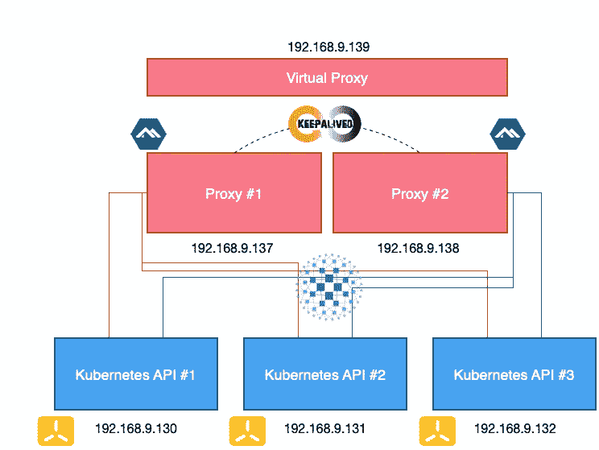

# Kubernetes API 的纯软件高可用性和负载平衡

> 原文：<https://betterprogramming.pub/high-availability-ha-load-balancing-lb-kubernetes-k8s-api-alpine-keepalived-haproxy-fe577e40c80>

## 使用 Alpine Linux、HAProxy 和 keepalived


由[薇琪·西姆](https://unsplash.com/@vicky49?utm_source=medium&utm_medium=referral)在 [Unsplash](https://unsplash.com?utm_source=medium&utm_medium=referral) 上拍摄的照片

因此，您已经使用了您最喜欢的 Kubernetes 发行版，并且刚刚完成了集群的设置。现在是时候使用`kubectl`远程访问它了，但是您应该访问哪个 API 服务器呢？如果您在 kube 配置中配置了其中的一个，而它碰巧关闭了，该怎么办呢？

在接下来的几节中，我将向您展示如何快速建立对 Kubernetes API 的高可用性和负载平衡的访问，只需使用软件组件。

在这个实验中，我使用了部署在 k3OS 上的 k3s，使用三个服务器节点组成了一个具有嵌入式 DB 的高可用性 Kubernetes 集群 T10。

# 软件工具

该设置将包含以下软件工具:

*   [Alpine Linux](https://alpinelinux.org) (Alpine)，是一个基于 musl 和 BusyBox 的 Linux 发行版，为安全性、简单性和资源效率而设计。它使用 OpenRC 作为其 init 系统，并将所有用户空间的二进制文件编译为具有堆栈粉碎保护的位置独立的可执行文件。将用于将要创建的虚拟机的 Alpine 分布基于来自[https://alpinelinux.org/downloads](https://alpinelinux.org/downloads/)的*虚拟*映像。
*   HAProxy 是一款免费的开源软件，它为基于 TCP 和 HTTP 的应用程序提供了高可用性负载平衡器和反向代理，可将请求分散到多个服务器上。它是用 C 语言编写的，以快速高效著称。HAProxy 将使用 Alpine 的内置包管理器`apk`安装在 Alpine 虚拟机中。
*   [keepalived](https://github.com/acassen/keepalived) ，为 Linux 系统和基于 Linux 的基础设施提供简单而强大的负载平衡和高可用性设施。负载平衡框架依赖于众所周知且广泛使用的 Linux 虚拟服务器(IPVS)内核模块，提供第 4 层负载平衡。keepalived 将使用 Alpine 的内置软件包管理器`apk`安装在 Alpine 虚拟机中。

# 基础设施布局

这就是我们将要建造的:



三个 Kubernetes API 节点对应于 k3s 服务器虚拟机。如果你想阅读如何使用 k3OS 和 k3s 快速设置你的 Kubernetes 集群，我以前在这里写过:

[](/k3s-k3os-kubernetes-docker-containers-installation-setup-cluster-ee9ccfd51a4d) [## 使用 k3OS 安装 Kubernetes 五分钟

### 使用 Rancher 以 Kubernetes 为中心的操作系统快速启动和运行

better 编程. pub](/k3s-k3os-kubernetes-docker-containers-installation-setup-cluster-ee9ccfd51a4d) 

这两个代理节点是 Alpine Linux 虚拟机。

虚拟代理是一个虚拟节点(即没有为其创建虚拟机)，由 keepalived 管理。

# 它是如何工作的

HAProxy 负责监控 Kubernetes API 节点，查看它们是否可用。HAProxy 提供了各种内置检查，在这种情况下，使用 HTTPS 检查。如果一个 Kubernetes API 节点回复了 HAProxy 的检查请求，HAProxy 就认为这个节点是活动的，并继续向它转发流量。如果在预定义的超时时间内没有获得回复，HAProxy 会将该节点从其分发目标中驱逐出去，直到该节点再次回复未来的请求。

`keepalived`负责监控代理节点并维护它们之间的浮动 IP 地址。每个代理节点继续拥有绑定到其物理网络接口的专用 IP 地址，但是，`keepalived`会创建一个在节点之间共享的虚拟 IP 地址。在任何给定的时间，只有一个由`keepalived`监控的节点回复对该地址的请求，并且当一个节点关闭时`keepalived`选择一个新的节点，该 IP 地址将被转移到该节点。

# 设置程序

让我们现在把理论付诸实践。在您使用下面的脚本之前，请检查它们，调整它们以匹配您自己的基础设施。

## **在 Alpine Linux 中安装软件包**

第一步是在两个 Alpine 虚拟机中安装 HAProxy 和`keepalived`:

```
apk update
apk add haproxy keepalived
```

注意，您可能需要启用 Alpine 中的社区存储库，以便能够找到上述包。您可以通过编辑`/etc/apk/repositories`文件并取消注释相应的行来实现。

## **配置 HAProxy**

以下配置应放在`/etc/haproxy/haproxy.cfg`中:

```
defaults
    maxconn 20000
    mode    tcp
    option  dontlognull
    timeout http-request 10s
    timeout queue        1m
    timeout connect      10s
    timeout client       86400s
    timeout server       86400s
    timeout tunnel       86400s
frontend k8s-api
    bind :::6443 v4v6
    mode tcp
    default_backend k8s-api
backend k8s-api
    balance roundrobin
    mode tcp
    option tcp-check
    default-server inter 10s downinter 5s rise 2 fall 2 slowstart 60s maxconn 250 maxqueue 256 weight 100
    server k8s-1 192.168.9.130:6443 check
    server k8s-2 192.168.9.131:6443 check
    server k8s-3 192.168.9.132:6443 check
```

请注意，由于 Kubernetes API 受到保护，并且上面没有提供身份验证机制，因此预期的 HTTP 状态被更改为 401 以反映这一点。

完全相同的配置也应该放在代理节点 2 上。

下一步是启动 HAProxy，让它自动随系统启动:

```
/etc/init.d/haproxy start
rc-update add haproxy
```

## **配置 keepalive**

以下配置应放在`/etc/keepalived/keepalived.conf`中:

```
global_defs {
   notification_email {
     [m](mailto:nassosmichas@me.com)yemail@email.server.com
   }
   notification_email_from [m](mailto:nassosmichas@me.com)yemail@email.server.com
   smtp_server mail.server.com
   smtp_connect_timeout 30
}vrrp_script chk_haproxy {
  script "killall -0 haproxy"
  interval 2
  weight 2
}vrrp_instance VI_1 {
  interface eth0
  state MASTER
  virtual_router_id 51
  priority 101
  virtual_ipaddress {
    192.168.9.139
  }
  track_script {
    chk_haproxy
  }
}
```

在节点 2 上复制上述配置时，您需要执行以下更改:

*   将`state MASTER`改为`state BACKUP`。
*   将`priority 101`改为`priority 100`。

下一步是启动`keepalived`，使其自动随系统启动:

```
/etc/init.d/keepalived start
rc-update add keepalived
```

给你。现在，您的 Kubernetes API 已经负载平衡，并且高度可用。为了测试它，更改您的`kubectl`的配置以指向您在上面创建的虚拟 IP。然后，您可以尝试关闭一个代理节点或一个 Kubernetes API，您的`kubectl`将继续工作。