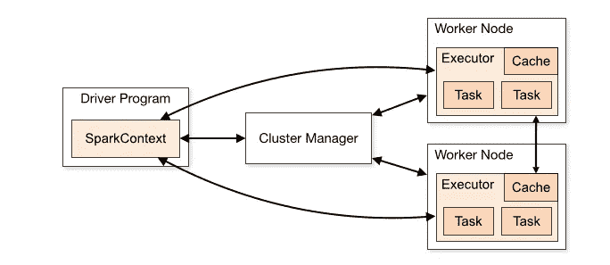
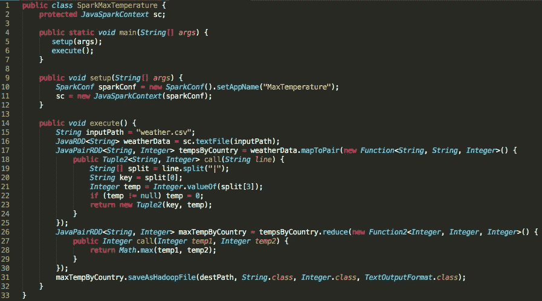
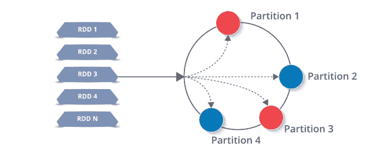

# Apache Spark 的高级概述

> 原文：<https://betterprogramming.pub/high-level-overview-of-apache-spark-c225a0a162e9>

## 什么是火花？让我们看看引擎盖下面


在我的上一篇文章中，我们介绍了一个问题:大量的、永无止境的数据流，以及它的解决方案: [Apache Spark](https://spark.apache.org/) 。在第二部分中，我们将关注 Spark 的内部架构和数据结构。

> *在拓荒时代，他们用牛来拉重物，当一头牛拉不动一根木头时，他们就不去养一头更大的牛。我们不应该尝试更大的计算机，而是更多的计算机系统——格蕾丝·赫柏*

随着数据规模以惊人的速度快速增长，我们需要一种方法来快速处理潜在的数 Pb 数据，而我们根本无法让一台计算机以合理的速度处理这么多数据。这个问题可以通过创建一个机器集群来为您执行工作来解决，但是这些机器如何协同工作来解决常见的问题呢？

# 遇见火花


照片由 [Unsplash](https://unsplash.com?utm_source=medium&utm_medium=referral) 上的 [Jez Timms](https://unsplash.com/@jeztimms?utm_source=medium&utm_medium=referral) 拍摄

Spark 是用于大规模数据处理的集群计算框架。Spark 为其统一计算引擎提供了一套三种语言的库( [Java](https://www.java.com/) 、 [Scala](https://www.scala-lang.org/) 、 [Python](http://python.org) )。这个定义实际上意味着什么？

**统一** —有了 Spark，就不需要从多个 API 或系统中拼凑出一个应用。Spark 为您提供了足够的内置 API 来完成这项工作。

**计算引擎** — Spark 处理来自各种文件系统的数据加载，并在其上运行计算，但不会永久存储任何数据本身。Spark 完全在内存中运行，提供无与伦比的性能和速度。

**库** — Spark 由一系列为数据科学任务构建的库组成。Spark 包括用于 SQL ( [Spark SQL](https://spark.apache.org/sql/) )、机器学习( [MLlib](https://spark.apache.org/mllib/) )、流处理(Spark 流和结构化流)和图形分析( [GraphX](https://spark.apache.org/graphx/) )的库。

# Spark 应用程序

每个 Spark 应用程序都由一个**驱动程序**和一组分布式工作进程(**执行器**)组成。

# 火花驱动器

驱动程序运行我们的应用程序的`main()`方法，并且在那里创建`SparkContext`。火花驱动器有以下职责:

*   在集群中的一个节点上运行，或者在一个客户机上运行，并使用集群管理器调度作业执行。
*   响应用户的程序或输入。
*   在执行者之间分析、安排和分配工作。
*   存储关于正在运行的应用程序的元数据，并方便地在 webUI 中公开它。

# 火花执行者

执行器是负责任务执行的分布式进程。每个 Spark 应用程序都有自己的执行器集，这些执行器在单个 Spark 应用程序的生命周期中保持活动状态。

*   执行器执行 Spark 作业的所有数据处理。
*   将结果存储在内存中，仅在驱动程序特别指示时才保存到磁盘。
*   完成后将结果返回给驱动程序。
*   每个节点可以有从每个节点一个执行器到每个内核一个执行器的任意位置



# Spark 的应用工作流程

当您向 Spark 提交一个任务进行处理时，会有很多工作在幕后进行。

1.  我们的独立应用程序被启动，并初始化它的`SparkContext`。一个 app 只有有了`SparkContext`才能被称为驱动。
2.  我们的驱动程序向集群管理器请求资源来启动它的执行器。
3.  集群管理器启动执行器。
4.  我们的司机运行我们实际的火花代码。
5.  执行器运行任务，并将结果发送回驱动程序。
6.  `SparkContext`被停止，所有执行器被关闭，将资源返回集群。

# 最高温度，重新审视

让我们更深入地看看我们在[第一部分](https://hackernoon.com/why-we-need-apache-spark-51c8a57aa57a)中写的 Spark job，找出各个国家的最高温度。这个抽象隐藏了很多设置代码，包括我们的`SparkContext`的初始化。让我们填补空白:



最高温度火花设置

记住 Spark 是一个框架，在这里是用 Java 实现的。直到第 16 行，Spark 才需要做任何工作。当然，我们初始化了我们的`SparkContext`，但是将数据加载到 RDD 是需要发送给我们的执行器的第一部分代码。

到现在为止，你可能已经多次看到“RDD”这个词，是时候给它下定义了。

# Spark 架构概述

Spark 有一个定义良好的分层架构，具有松散耦合的组件，基于两个主要的抽象:

*   弹性分布式数据集
*   有向无环图

# 弹性分布式数据集

rdd 本质上是 Spark 的构建模块——一切都是由它们组成的。甚至 Sparks 更高级别的 API(数据帧、数据集)也是由幕后的 rdd 组成的。弹性分布式数据集意味着什么？

*   弹性——由于 Spark 运行在一个机器集群上，硬件故障导致的数据丢失是一个非常现实的问题，因此 rdd 具有容错能力，可以在出现故障时重建自身
*   分布式—单个 RDD 存储在集群中的一系列不同节点上，不属于单个源(也不存在单点故障)。这样，我们的集群可以在我们的 RDD 上并行运行。
*   数据集—值的集合(您可能已经知道了)。

我们在 Spark 中使用的所有数据都将存储在某种形式的 RDD 中——因此完全理解它们是非常必要的。

Spark 提供了一系列构建在 rdd 之上的“高级”API，旨在抽象掉复杂性，即数据帧和数据集。Scala 和 Python 中的 spark-submit 和 Spark shell 侧重于读取-评估-打印循环(REPLs ),面向经常希望对数据集进行重复分析的数据科学家。RDD 仍然需要理解，因为它是 Spark 中所有数据的底层结构。

RDD 通俗地等同于“分布式数据结构”。一个`JavaRDD<String>`实际上就是一个`List<String>`,分布在我们集群中的每个节点上，每个节点获得我们列表中的几个不同的块。有了 Spark，我们需要始终在分布式环境中思考。

rdd 的工作方式是将数据分成一系列分区，存储在每个执行器节点上。然后，每个节点将只在自己的分区上执行工作。这就是 Spark 如此强大的原因——如果一个执行程序死亡，或者一个任务失败，Spark 可以从原始源代码中重建它需要的分区，并重新提交任务来完成。



星火 RDD 在遗嘱执行人之间分配

# RDD 行动

rdd 是不可变的，这意味着一旦它们被创建，就不能以任何方式被修改；他们只能被改造。转变 rdd 的概念是 Spark 的核心，Spark 作业可以被认为是这些步骤的任意组合:

*   将数据加载到 RDD。
*   改造 RDD。
*   在 RDD 上执行操作。

事实上，我编写的每一个 Spark 作业都完全由这些类型的任务组成，带有香草味的 Java。

Spark 定义了一组使用 rdd 的 API，这些 API 可以分为两大类——转换和动作。

*   转换从现有的 RDD 创建一个新的。
*   在对驱动程序的 RDD 运行计算后，操作会向驱动程序返回一个或多个值。

例如，映射函数`weatherData.map()`，是一个通过函数传递 RDD 的每个元素的转换。

“Reduce”是一个 RDD 动作，它使用某个函数聚合 RDD 的所有元素，并将最终结果返回给驱动程序。

# 懒惰评估

> “我选择一个懒惰的人去做艰苦的工作。因为一个懒惰的人会找到一个简单的方法去做。——比尔·盖茨”

Spark 中的所有转换都是懒惰的。这意味着，当我们告诉 Spark 通过现有 RDD 的转换创建一个 RDD 时，它不会生成该数据集，直到对它或它的一个子对象执行特定的操作。Spark 将执行转换和触发转换的动作。这使得 Spark 的运行效率大大提高。

让我们重新检查前面 Spark 例子中的函数声明，以确定哪些函数是动作，哪些是转换:

```
16: JavaRDD<String> weatherData = sc.textFile(inputPath);
```

第 16 行既不是动作也不是转换——它是我们的`JavaSparkContext`的`sc`的函数。

```
17: JavaPairRDD<String, Integer> tempsByCountry = weatherData.mapToPair(new Func.....
```

17 号线是对`weatherData` RDD 的改造。在其中，我们将`weatherData`的每一行映射到一对由(城市，温度)组成的行。

```
26: JavaPairRDD<String, Integer> maxTempByCountry = tempsByCountry.reduce(new Func....
```

第 26 行也是一个转换，因为我们正在迭代键值对。这是`tempsByCountry`的一个转变，我们将每个城市的温度降低到有记录以来的最高温度。

```
31: maxTempByCountry.saveAsHadoopFile(destPath, String.class, Integer.class, TextOutputFormat.class);
```

最后，在第 31 行，我们触发了一个火花动作；将 RDD 保存到我们的文件系统中。因为 Spark 订阅了惰性执行模型，所以直到这一行 Spark 才生成`weatherData`、`tempsByCountry`和`maxTempsByCountry`，最后保存我们的结果。

# 有向无环图

每当在 RDD 上执行一个动作时，Spark 都会创建一个 DAG——一个没有有向循环的有限有向图(否则我们的作业将永远运行下去)。

请记住，一个图只不过是一系列相连的顶点和边，这个图也不例外。DAG 中的每个顶点是火花函数；在 RDD 上执行的一些操作(`map`、`mapToPair`、`reduceByKey`等)。

在`MapReduce`中，DAG 由两个顶点组成:Map → Reduce。

在我们上面的`MaxTemperatureByCountry`示例中，DAG 稍微复杂一些:

`parallelize → map → mapToPair → reduce → saveAsHadoopFile`

DAG 允许 Spark 优化其执行计划，并最大限度地减少洗牌。我们将在后面的帖子中更深入地讨论 DAG，因为它超出了 Spark 概述的范围。

# 评估循环

用我们的新词汇，让我们重新检查我在[第一部分](https://hackernoon.com/why-we-need-apache-spark-51c8a57aa57a)中定义的`MapReduce`的问题，引用如下:

> MapReduce 擅长批量数据处理，但是在重复分析和小反馈循环方面就落后了。在计算之间重复使用数据的唯一方法是将其写入外部存储系统(类似 HDFS)

在计算之间重复使用数据？听起来像一个 RDD，可以在上面执行多种操作！假设我们有一个文件`data.txt`，想要完成两个计算:

*   文件中所有行的总长度。
*   文件中最长一行的长度。

在`MapReduce`中，每个任务都需要一个单独的任务或者一个奇特的`MulitpleOutputFormat`实现。Spark 只需简单的四个步骤即可轻松实现:

1.  将`data.txt` 的内容加载到一个 RDD 中。

```
JavaRDD<String> lines = sc.textFile("data.txt");
```

2.将每一行都映射到它的长度(为了简洁起见，使用了 [Lambda](https://aws.amazon.com/lambda/) 函数)。

```
JavaRDD<Integer> lineLengths = lines.map(s -> s.length());
```

3.要求解总长度:减少`lineLengths` 以找到总的线长度总和，在这种情况下是 RDD 中每个元素的总和。

```
int totalLength = lineLengths.reduce((a, b) -> a + b);
```

4.求解最大长度:减少`lineLengths` 以找到最大的线长度。

```
int maxLength = lineLengths.reduce((a, b) -> Math.max(a,b));
```

注意，第三步和第四步是 RDD 操作，所以它们向我们的驱动程序返回一个结果，在本例中是一个 Java int。还记得 Spark 很懒，在看到一个动作之前拒绝做任何工作。在这种情况下，直到第三步它才会开始任何真正的工作。

# 后续步骤

到目前为止，我们已经介绍了我们的数据问题及其解决方案——Apache Spark。我们回顾了 Spark 的架构和工作流，它的旗舰产品内部抽象(RDD)，以及它的执行模型。

接下来，我们将研究 Java 中的函数和语法，随着对框架的深入研究，我们会越来越了解技术。