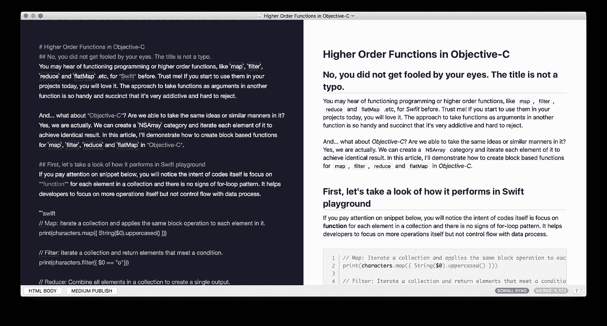

# Objective-C 中的高阶函数

> 原文：<https://betterprogramming.pub/higher-order-functions-in-objective-c-850f6c90de30>

## NSArray 的 Map、filter、reduce 和 flatMap 实现



作者提供的 Screencap。

# 不，你的眼睛没有说谎，题目不是错别字

你可能听说过函数式编程或高阶函数，如`map`、`filter`、`reduce`、`flatMap`等。，对于斯威夫特来说。相信我，如果你今天开始在你的项目中使用它们，你会爱上它们的。在另一个函数中使用函数作为参数的方法是如此方便和简洁，以至于很容易上瘾，很难拒绝。

那么，目标 C 呢？我们能在其中获得相同的想法或相似的方式吗？是的，我们可以。我们可以创建一个`NSArray`类别，并迭代它的每个元素以获得相同的结果。在本文中，我将演示如何在 Objective-C 中为`map`、`filter`、`reduce`和`flatMap`创建基于块的函数。

# 首先，让我们来看看它是如何在一个迅捷的操场上表现的

如果你注意下面的片段，你会注意到代码本身的意图是关注集合中每个元素的功能，没有`for-loop`模式的迹象。它帮助开发人员专注于更多的操作，而不是用数据处理控制流程。

*   **Map** :迭代一个集合，对其中的每个元素应用相同的块操作。
    `print(characters.map({ String($0).uppercased() }))`
*   **Filter** :迭代一个集合，返回满足条件的元素。
    `print(characters.filter({ $0 == “o”}))`
*   **Reduce** :将集合中的所有元素组合起来，创建一个输出。
    `print(characters.reduce(“”, { String($0) + String($1) }))`
*   **FlatMap** :展平一个集合的集合。
    `let _characters = [“Hello”.characters, “, “.characters, “playground”.characters] print(_characters.flatMap({ $0 }))`

# 好了，现在让我们把手弄脏

与 Swift 不同，高阶函数不是 Objective-C 中的内置函数。因此，我们需要创建自己的`category`来访问这些函数。如果你浏览下面的代码，核心概念基本上并不复杂。它围绕着函数`enumerateObjectsUsingBlock:`并根据其用途增加了一些小的变化。

# 那么，你如何使用它们呢？

用法和 Swift 很像但是有点啰嗦。但是，模式和思路还是一样的。我们只负责操作，不需要处理流量控制。

*   **Map** :迭代一个数组，对其中的每个元素应用相同的块操作。
    `NSLog(@”%@”, [array map:^id(id obj) { return [(NSString *)obj uppercaseString]; }]);`
*   **Filter** :迭代一个数组，返回满足条件的元素。
    `NSLog(@”%@”, [array filter:^BOOL(id obj) { return [(NSString *)obj isEqualToString:@”o”]; }]);`
*   **Reduce** :将一个数组中的所有元素组合成一个输出。

```
NSLog(@"%@", [array reduce:@"Hey, " block:^id(id obj1, id obj2) { return [NSString stringWithFormat:@"%@%@", obj1, obj2]; }]);
array = @[
  @[@"H", @"e", @"l", @"l", @"o"],
  @[@",", @" "],
  @[@"w", @"o", @"r", @"l", @"d", @"!"]
  ];
```

*   **FlatMap** :展平一个数组的数组。
    `NSLog(@”%@”, [array flatMap:^id(id obj) { return obj; }]);`

# 但是等等，这里可能有问题

是的，魔鬼总是在细节中。这就是为什么“但是”一直如此重要。作为一名有多年经验的开发人员，您可能想知道在 Objective-C 中这是否是一个好的实践？原因是类型安全或多或少成为了开发人员的责任。毕竟，Swift 和 Objective-C 在类型推断和类型安全的许多方面并不共享相同的理念。我的建议是为每个函数添加一个类限制器，以提高安全性。虽然添加一个类限制器可能会变得太罗嗦，但我仍然认为从长远来看这是更安全和更好的。

下面的代码片段演示了类限制器的用法。完整的实现可从这里的 GitHub 获得。

*   **Map** :迭代一个数组，对其中的每个元素应用相同的块操作。
    
*   **Filter** :迭代一个数组，返回满足条件的元素。
    `NSLog(@”%@”, [array filter:^BOOL(id obj) { return [(NSString *)obj isEqualToString:@”o”]; } class:[NSString class]]);`
*   **Reduce** :将一个数组中的所有元素组合成一个输出。

```
NSLog(@"%@", [array reduce:@"Hey, " block:^id(id obj1, id obj2) { return [NSString stringWithFormat:@"%@%@", obj1, obj2]; } class:[NSString class]]);
array = @[
    @[@"H", @"e", @"l", @"l", @"o"],
    @[@",", @" ", [@3](http://twitter.com/3)],
    @[[@6](http://twitter.com/6), [@8](http://twitter.com/8), [@6](http://twitter.com/6)],
    @[@"w", @"o", @"r", @"l", @"d", @"!"]
 ];
```

*   **FlatMap** :展平一个数组的数组。
    `NSLog(@”%@”, [array flatMap:^id(id obj) { return obj; } class:[NSString class]]);`