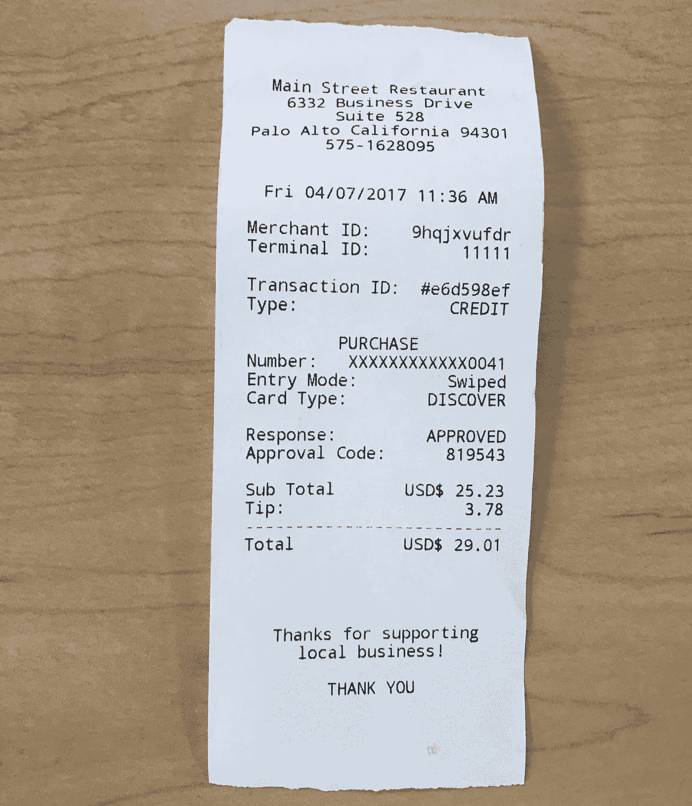
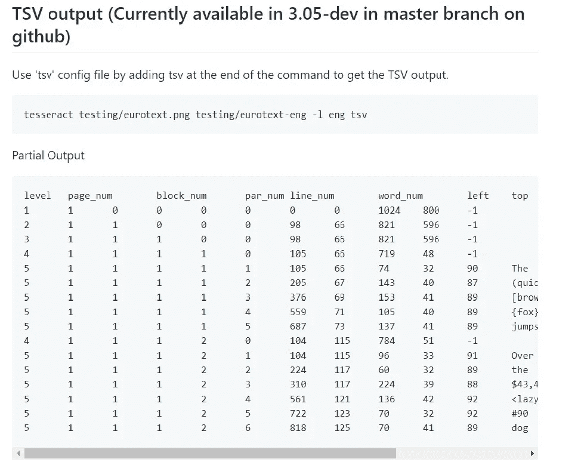
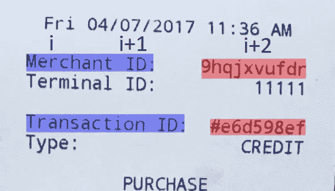
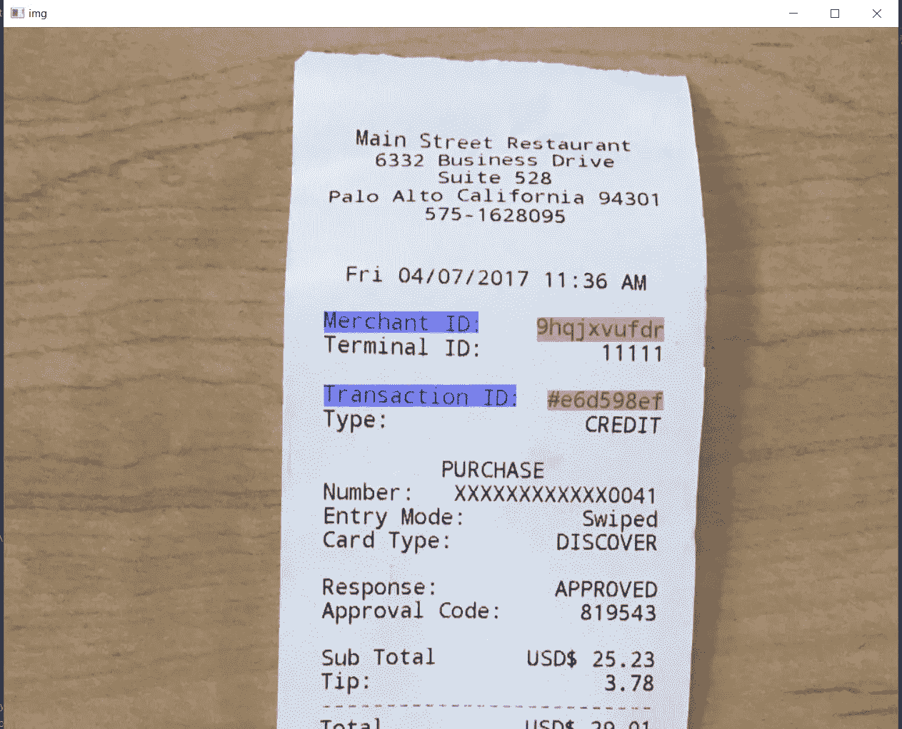

# 使用 Python 高亮显示输入图像中的特定单词

> 原文：<https://betterprogramming.pub/highlighting-specific-word-in-an-input-image-1cf3d4f8ae27>

## 玩日常实时捕捉的图像


照片由[哈尔·盖特伍德](https://unsplash.com/@halgatewood?utm_source=unsplash&utm_medium=referral&utm_content=creditCopyText)在 [Unsplash](https://unsplash.com/s/photos/word?utm_source=unsplash&utm_medium=referral&utm_content=creditCopyText) 拍摄

图像处理是当今的一个新趋势。处理日常实时捕捉的图像也不例外。

传统上，光学字符识别(OCR)所做的是将手写或打印的文本转换为机器编码的文本，无论是扫描的文档还是文档的照片。

这样，我们现在可以搜索一个关键字，并检查它是否存在于其中。

# 目标

如果我们能够在图像中突出显示单词本身，那就太酷了，对吧(不必要的眉毛摆动)？

# 让我们开始吧

我们使用流行的 [Python](https://www.python.org/) OCR，它是`[pytesseract](https://pypi.org/project/pytesseract/)` *，*Google 的[tessera CT OCR](https://www.pyimagesearch.com/2017/07/10/using-tesseract-ocr-python/)引擎的包装器。它基本上可以读取图像中的文本。

我们的输入图像是这样的:



这里我们试图突出显示商家 ID、交易 ID 及其值

首先，让我们导入代码中将要用到的所有模块。

```
import pytesseract
from pytesseract import Output
import cv2
```

我们在处理图像， [OpenCV](https://opencv.org/) 怎么能缺席晚会？如果尚未安装，使用命令`pytesseract`和 OpenCV。

```
pip install pytesseractpip install opencv-contrib-python
```

我见过一些`pytesseract`抛出错误的例子，比如:

```
tesseract is not installed or it’s not in your path.
```

在这种情况下，请使用:

```
tessdata_dir_config = '--tessdata-dir "E:/opencvdemo/Tesseract-OCR/tessdata"'
pytesseract.pytesseract.tesseract_cmd = 'C:/Program Files (x86)/Tesseract-OCR/tesseract.exe'
```

现在，让我们阅读图像并探索 pytesseract 模块的强大功能。

```
img = cv2.imread('imagetext.jpg')
d = pytesseract.image_to_data(img, output_type=Output.DICT, lang='eng', config=tessdata_dir_config)
n_boxes = len(d['level'])
```

在这里，`n_boxes`(这里等级给出如下，如下)给出了从 pytesseract 的`image_to_data`函数中检测到的项目的数量。

`image_to_data()`会将图像转换为具有以下内容的数据输出:



关于`image_to_data()`的更多解释，请参考 [GitHub](https://github.com/tesseract-ocr/tesseract/wiki/Command-Line-Usage#tsv-output-currently-available-in-305-dev-in-master-branch-on-github) 。

```
overlay = img.copy()
for i in range(n_boxes):
    text = d['text'][i]
    if text == 'Merchant' or text == 'Transaction':
        (x, y, w, h) = (d['left'][i], d['top'][i], d['width'][i], d['height'][i])
        (x1, y1, w1, h1) = (d['left'][i + 1], d['top'][i + 1], d['width'][i + 1], d['height'][i + 1])
        (x2, y2, w2, h2) = (d['left'][i + 2], d['top'][i + 2], d['width'][i + 2], d['height'][i + 2])
        # cv2.rectangle(img, (x, y), (x1 + w1, y1 + h1), (0, 255, 0), 2)
        cv2.rectangle(overlay, (x, y), (x1 + w1, y1 + h1), (255, 0, 0), -1)
        # cv2.rectangle(img, (x2, y2), (x2 + w2, y2 + h2), (0, 255, 0), 2)
        cv2.rectangle(overlay, (x2, y2), (x2 + w2, y2 + h2), (0, 0, 255), -1)
        # print(text)
```

我们复制图像以在图像上创建一个覆盖(标记类型的高亮)类型的遮罩，随着我们继续学习代码，您将会理解这一点。

之后，我们迭代直到框的总数(`n_boxes`)来找出我们的输入关键字是否存在。

`if`条件将过滤出我们需要的关键字，如果在第一次*迭代中存在*，那么我们将收集`left`、`top`、`width`和`height`来创建一个矩形。

“i+1”和“i+2”是连续两个框的关键字“商家”和“交易”，蛮蛮力的！



现在，我们已经完成了将复制的图像叠加到原始图像上，原始图像包含填充了颜色的矩形框(您可以根据自己的需要使用颜色，但要记住它们是在 BGR)。

我们需要让它变得透明一点，因为它们现在是不透明的。

```
alpha = 0.4  # Transparency factor.
# Following line overlays transparent rectangle over the image
img_new = cv2.addWeighted(overlay, alpha, img, 1 - alpha, 0)
```

`cv2.addWeighted`方法需要六个参数，就像`cv2.addWeighted(overlay, alpha, input image, beta, gamma)`一样。其中 alpha 是透明度因子，通过它，我们可以控制透明度。

```
r = 1000.0 / img_new.shape[1]  # resizing image without loosing aspect ratio
dim = (1000, int(img_new.shape[0] * r))
# perform the actual resizing of the image and show it
resized = cv2.resize(img_new, dim, interpolation=cv2.INTER_AREA)
cv2.imshow('img', resized)
cv2.waitKey(0)
cv2.destroyAllWindows()
```

这最后一步是可选的，是为了在不损失纵横比的情况下将图像调整到我们需要的尺寸。

使用`imshow()`方法，我们可以显示结果图像，然后用`waitKey(0)`保持窗口打开，再用`destroyAllWindows()`销毁所有窗口(非常简单，对吧！).



最终输出

# 结论

希望你看懂这篇文章，如有疑问，在下面评论。

如果我有任何错误，请纠正我，这是我的第一篇文章。