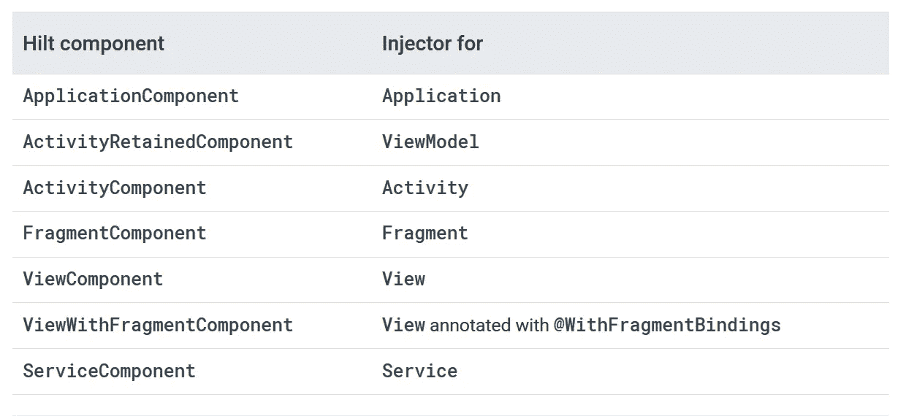

# hilt——一个新的 Android 依赖注入库

> 原文：<https://betterprogramming.pub/hilt-a-new-dependency-injection-library-for-android-e6e00e719aeb>

## 了解你需要知道的关于希尔特的一切


照片由 [Matam Jaswanth](https://unsplash.com/@mjaswanth?utm_source=medium&utm_medium=referral) 在 [Unsplash](https://unsplash.com?utm_source=medium&utm_medium=referral) 上拍摄

```
1\. [What's Dependency Injection?](#93ff)
2\. [Choosing the Right Technique for Your App](#3156)
3\. [History of DI in Android](#9c80)
4\. [Introducing Hilt—A Native DI Solution](#a8ae)
5\. [Terminology](#22dd)
6\. [Integration](#dae5)
7\. [Hilt Setup](#4059)
8\. [Hilt With Third-Party Dependencies](#c2af)
9\. [Hilt With ViewModels](#15ed)
```

# 什么是依赖注入？

*依赖注入(DI)* 是类获取其他类引用的独特方式。例如，假设类`BananaMilkshake`需要`Milk`类。在这里，`BananaMilkShake`依赖于`Milk`类。通常这些必需的类，像`Milk`，被称为依赖。

实施 DI 为您提供了以下优势:

*   代码的可重用性
*   易于重构
*   易于测试

有三种类型的依赖注入。

1.  在类本身中创建所需的对象(就像在`BananaMilkshake`类中创建的`Milk`类对象)
2.  从其他地方获取所需的对象(比如 Android-activity 组件中的上下文)
3.  提供所需的类对象作为参数(可以通过构造函数来创建)

# 为您的应用选择正确的技术

正如 Android 团队建议的那样，如果你的应用包含三个或更少的屏幕，你可以不使用 DI。但是三屏以上的，总是推荐用 DI。

如果您对 DI 提供的功能有深入的了解，那么选择它会更容易。

*   **可重用性:**随着项目的扩展，创建依赖关系的多个实现将变得更加容易，但是有了 DI 反转控制，依赖类不再控制依赖关系的创建方式
*   **易于重构:**依赖关系的对象创建可以在编译时检查，而不是在运行时隐藏
*   **易于测试:**有了 DI，就不会是一个产生依赖关系的类，所以测试会更容易

# Android 中 DI 的历史

早在 Android 开发初期，我们连 DI 这个概念都没有。开发人员根据需要创建对象，这导致了资源的过度使用和代码的不可重用性。

慢慢地，开发人员开始使用`ServiceGenerator`。`ServiceGenerator`是一个单例类，它将在必要时创建所需类的对象。如果我们再次请求这个类，它将返回之前创建的对象。

这个解决方案在一定程度上解决了这个问题。但是在`ServiceGenerator` s 中，维护对象的作用域是非常忙碌的，就像内存管理一样。然后是 Android 中 DI 的强大[匕首](https://dagger.dev/)库。

Dagger 和 Dagger2 对在 Android 上实现 DI 产生了巨大的影响。他们为开箱即用的开发带来了许多便利的特性:

*   创建您在手动 DI 部分中手动实现的`AppContainer`代码(应用程序图)
*   为应用程序图中可用的类构建工厂。这就是依赖性在内部得到满足的方式，也是我们不需要编写所有样板代码的原因。
*   重用依赖项或创建类型的新实例取决于您如何使用范围配置类型
*   Dagger 还通过释放不再使用的对象来关心内存管理

Dagger 库几乎解决了我们在实现 DI 时面临的所有问题。但是学习曲线非常深，尽管有 Dagger 代码生成，我们仍需要编写如此多的样板代码。

最近，Yigit Boyar 在一个视频中表示，Android 团队收到的 49%的请求都是要求他们增强 DI 实现流程。这是为 Android 开发 Hilt 的主要原因。

# 介绍 Hilt——一个本地 DI 解决方案

Hilt 构建在 Dagger 之上，提供了一种在 Android 应用中实现 DI 的标准方法。因此，Hilt 比 Dagger 工作得好得多——而且对开发人员来说实现起来也不太复杂。

要使用 Dagger 库实现 DI，我们需要自己编写模块、组件等等。最重要的是，每次我们创建一个新的 Android 组件——比如`Activity`、`Fragment`或`Service`——我们都需要手动将它们添加到各自的模块中，以便在必要时注入它们。

专为 Android 开发的 Hilt 采取了为开发者节省大量时间的措施。我们不再需要通过如此复杂的设置来注入`Fragment`、`Activity`或`ViewModel` s。

对于 Hilt，我们可以使用如下注释:

*   `@HiltAndroidApp`:我们需要将这个注释应用到我们的应用程序类，这将触发代码生成并创建基本组件
*   `@AndroidEntryPoint` : Hilt 创建一个依赖容器到它被分配的 Android 组件，这样它就可以注入依赖项

在本文接下来的部分中，您将详细了解这些注释。

# 术语

## @HiltAndroidApp

这个注释触发了 Hilt 的代码生成，包括应用程序的一个基类。应用程序容器是应用程序的父容器，这意味着其他容器(来自 Android 组件)可以访问它提供的依赖关系。

## @ androdidentrypoint

这个注释为每个 Android 组件生成一个单独的 Hilt 组件，这样它们就可以注入必要的依赖项。

## @注入

这用于请求依赖项的构造函数、字段或方法中。

## @模块

这用于创建依赖类对象的类(对于您不拥有的类，例如，第三方库类，如 OkHttp 或 Retrofit)。

## @InstallIn

还应该用@InstallIn 对 Hilt 模块类进行注释，以指定模块的范围。例如，如果我们用`@InstallIn(ActivityComponent::class)`注释模块，那么模块将绑定到活动生命周期。

## @提供

这用于模块类内部的方法，并提供依赖对象。

# 综合

打开根`build.gradle`，在 dependencies 节点下添加下面的 Hilt 依赖项。看一看:

出于代码生成的目的，我们需要添加 Hilt 插件，如下所示:

最后，我们需要添加所需的依赖项来访问项目中的 Hilt 库。看一看:

就是这样；我们已经成功整合了刀柄库。

# 刀柄设置

我们不需要复杂的设置来使用 Hilt 实现基本的 DI。首先，我们需要用`@HiltAndroidApp`注释我们的应用程序类，这样应用程序组件就会被创建。看一看:

用句柄注释一个“应用程序”类

所以现在我们可以在 application 类中注入类，如下所示:

在“应用程序”类中注入类

现在我们有了应用程序级的组件，我们可以为其他用`@AndroidEntryPoint`注释的 Android 组件提供依赖关系。

首先，让我们看看如何用这个注释实现`Activity`:

用句柄注释对“活动”进行注释

Hilt 目前支持以下 Android 组件:

*   `Application`(通过使用`@HiltAndroidApp`)
*   `Activity`
*   `Fragment`
*   `View`
*   `Service`
*   `BroadcastReceiver`

现在可以在那些用`@AndroidEntryPoint`标注的组件中注入依赖关系。看一看:

将依赖项注入“活动”

在这里，我们需要注意的是，在使用 Hilt 和 Android 组件时:

*   如果你用`@AndroidEntryPoint`注释一个 Android 组件，比如一个`Fragment`，那么被注释的`Fragment`所依赖的其他类也应该用`@AndroidEntryPoint`来注释
*   如果父类是抽象的，我们不需要用`AndroidEntryPoint`来注释它们
*   当在`Activity`上使用句柄注释时，注入发生在`onCreate`函数中，所以确保以安全的方式使用那些依赖项

# 带有第三方依赖项的句柄

要将第三方依赖(如翻新)注入到像`Activity` s 这样的 Android 组件中，我们需要使用模块。模块不过是用`@Module`标注的普通类，我们可以在其中创建第三方依赖的对象。让我们看看如何创建一个模块类:

带柄的简单@模块类

`@InstallIn`注释提供了与 Android 组件的模块绑定。这里，我们使用了`ApplicationComponent`，所以`NetworkModule`绑定到应用程序生命周期。

Hilt 提供了更多的组件，可以用来将依赖关系绑定到 Android 类——请看:



截图来自 Android 开发者官方网站

现在我们需要创建将`return`类型作为期望依赖项的函数。在这种情况下，依赖项是 Retrofit 和 OkHttp。我们还需要用`@Provides`注释这些函数，这样 Hilt 就会知道它们。看一看:

带第三方库的刀柄模块

# 带视图模型的刀柄

到目前为止，我们已经看到了如何使用 Android 组件和第三方库。现在，是时候向前迈出一步，与`ViewModel`注射一起工作了。

在继续前进之前，我们必须在我们的项目中添加一些额外的库，以使 Hilt 与 [Jetpack](https://developer.android.com/jetpack) 库如`ViewModel` s 和`WorkManager`一起工作。

在应用程序级`build.gradle`文件的 dependencies 标签下包含以下库。

这些库为像`ViewModel`和`WorkManger`这样的 Jetpack 库提供了扩展，以便与 Hilt 一起工作。他们将生成样板代码，为开发人员节省大量时间。

现在我们从`ViewModel`类开始。首先，我们需要将`@ViewModelInject`包含在`ViewModel`构造函数中。这将告诉 Hilt 如何提供`ViewModel`的实例。看一看:

带有“注入”注释的视图模型

现在，在像`Activity`和`Fragment`这样的 Android 组件中，我们可以不使用`@inject`而直接使用`by viewModels()`委托功能。看一看:

```
private val mainViewModel: MainViewModel **by viewModels()**
```

如果要使用`Activity`级的`ViewModel`，我们需要应用`by activityViewModels()`委托函数，而不是`by viewModels()`。仅此而已——你很适合带柄的 MVVM 建筑。

**重要提示:** Hilt 仍然是它的 Alpha 阶段，所以你需要 Android Studio Canary 版本才能使用它。由于它仍处于 Alpha 阶段，所以不要在生产层面上使用它。

# 奖金

要了解更多关于 DI 的信息，请阅读下面的文章。

*   [“使用 Dagger2 在 Android 中进行依赖注入”](https://medium.com/better-programming/dependency-injection-in-android-with-dagger2-d260b8a72bb0)
*   [“探索匕首-剑柄和匕首-安卓的主要区别”](https://proandroiddev.com/exploring-dagger-hilt-and-whats-main-differences-with-dagger-android-c8c54cd92f18)

目前就这些——希望你学到了有用的东西。感谢阅读。