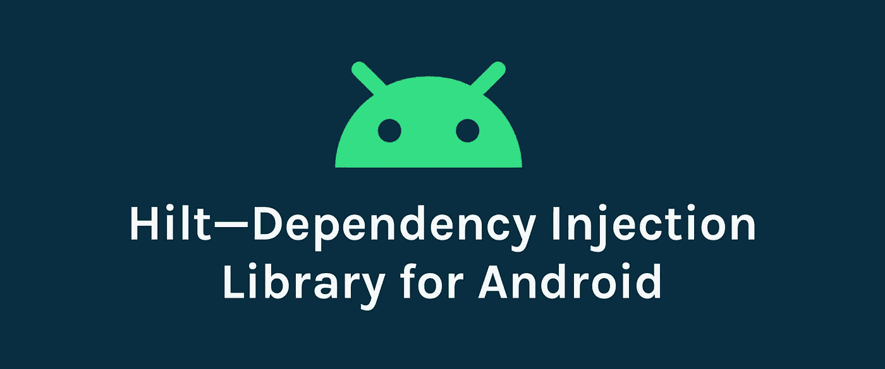

# 探索 Hilt:Android 的依赖注入库

> 原文：<https://betterprogramming.pub/hilt-dependency-injection-library-for-android-2aebf04e8147>

## Jetpack 推荐的依赖注入库



图片来源:作者

# 什么是依赖注入？

长期以来，依赖注入(DI)在程序设计中被广泛使用。DI 是一种技术，通过这种技术，类接收它所依赖的其他对象，而不是自己创建它们。实现依赖注入为您提供了以下优势:

*   代码的可重用性
*   易于重构
*   易于测试

# 依赖注入的基础

开发应用程序时，一个类可能需要引用其他类。例如，`Car`类可能需要一个`Engine`类的引用。这些必需的类被称为依赖项，在这个例子中，`Car`类依赖于运行`Engine`类的一个实例。我们可以通过三种不同的方式提供这些必需的依赖关系:

1.  依赖类**在其内部创建依赖的实例或对象**。在我们的例子中，在`Car`类中创建了`Engine`类的对象。
2.  使用其他地方的物品。我们使用`Context`和`getSystemService()`吸气剂的方式。
3.  将依赖关系作为**参数**提供给依赖类。在我们的例子中，通过构造函数或 setter 函数将`Engine`对象作为参数传递给`Car`类。

DI 非常适合 Android 开发。如果你曾经使用过 **Dagger，**官方的 DI 框架，或者任何其他 Android 的 DI 库，你会知道手动创建所有需要的依赖项需要多少努力和样板代码。对我来说，在使用匕首的起点，理解和执行事情就像一场噩梦。理解事情需要很多天，而有效地实现它们需要更多的时间。

# 匕首之柄简介

由于当前 DI 库中样板代码的数量和实现的难度，Android 团队提出了 Hilt。通过为我们项目中的每个 Android 类提供容器并自动管理它们的生命周期，Hilt 提供了一种在 Android 应用程序中实现 DI 的标准方法。Hilt 构建在 Dagger 之上，以减少项目中手工 DI 的工作量，并从编译时正确性、运行时性能、可伸缩性等方面获益。

> Hilt 是 Android 应用程序中用于 DI 的 Dagger 的简化形式，有更多的好处。

由于我们中的大多数人现在已经习惯了 Jetpack 的组件，因此，Hilt 现在是 Jetpack 的**推荐的**库，用于 Android 中的依赖注入。Hilt 是为 Android 开发的，目的是为开发者节省时间。

# 为什么是希尔特？

Hilt 的主要目标是简化 Android 应用程序的 Dagger 相关基础设施。Hilt 的好处是:

*   简化样板文件
*   分离的构建依赖项
*   简化配置
*   改进的测试

# 刀柄基础

在讨论实现之前，我们先来看看与 Hilt 相关的术语。与 Dagger 类似，Hilt 是一个完全基于注释的框架。我们经常使用的一些注释是:

## `**@HiltAndroidApp**`

这个注释需要应用到应用程序类，这样就可以生成组件。比起匕首那不是很容易吗？

## `@AndroidEntryPoint`

这个注释需要应用于 Android 组件，如片段、活动等。注入依赖关系。

Hilt 目前支持以下 Android 类:

*   `Activity`
*   `Fragment`
*   `View`
*   `Service`
*   `BroadcastReceiver`

## `@Inject`

该注释用于执行注入。它用于将依赖项注入到依赖类中。依赖项可以通过构造函数、字段或方法注入。这类似于匕首。

现场注射

构造函数注入

*由 Hilt 注入的字段不能是私有的。*

## `@Module`

这个注释用在我们提供依赖关系的类上面，也就是我们创建对象的地方。这类似于匕首。

## @InstallIn

Hilt 模块用`**@InstallIn**(**ActivityComponent::class**)`进行了注释，因为我们希望 Hilt 将依赖注入到`**Activity**`类中。这个注释意味着这个`**Module**`中的所有依赖项在应用程序的所有活动中都可用。

## @提供

注释用在模块中和方法之上，我们在其中创建对象以将它们作为依赖项传递。这个注释类似于 Dagger 中的注释。它主要用于提供第三方库实例。

# 刀柄设置

首先，将`hilt-android-gradle-plugin`插件添加到项目的根级`build.gradle`文件中:

接下来，在`app/build.gradle`文件中应用 Gradle 插件:

最后，在`app/build.gradle`文件中添加以下依赖关系:

开始使用 Hilt 的环境设置已经完成。一旦我们构建并同步了项目，我们就可以使用它们了。开始用刀柄吧！

# 剑柄在行动

让我们看看如何将一个简单的类注入到应用程序类中。

为了告诉 Hilt 如何提供一个类型的实例，在你想要被注入的类的构造函数中添加 **@Inject** 注释。Hilt 拥有的关于如何提供不同类型实例的信息也被称为**绑定**。

一旦我们在`Application`中启用了成员注入，我们就可以开始使用`@AndroidEntryPoint`注释在其他 Android 类中启用成员注入。

# 刀柄附带喷气背包支持

随着我们大多数人开始使用 Jetpack 库，支持 Jetpack 的 Hilt 需要一些额外的依赖。

Hilt 目前支持以下 Jetpack 组件:

*   `ViewModel`
*   `WorkManager`

让我们看看如何创建简单的 ViewModel 并将其注入到活动中。`**@ViewModelInject**`在 ViewModel 对象的构造函数中使用注释来提供一个 ViewModel 实例。

将这个视图模型注入到活动中要简单得多，只需一行代码:

```
private val sampleViewModel: SampleViewModel by **viewModels**()
```

`**viewModels()**` 是一个委托函数，可以用来注入`ViewModel`。这里不需要使用@Inject 注释。如果我们想使用`Activity`级别`ViewModel`，我们需要应用`**activityViewModels**()`委托函数，而不是`**viewModels**()`。

整个活动可能看起来像这样:

在[文档](https://developer.android.com/training/dependency-injection/hilt-jetpack)中了解更多关于 Jetpack 支持的信息。

用最简单的方法注入组件不是很有趣吗？开始使用 Dagger 初始版本的人会理解与 Dagger 相比，使用 Hilt 是多么容易。然而，这是一个匕首覆盖层，知道基本知识总是一件重要的事情。开始用刀柄。

# 参考

[带句柄的依赖注入](https://developer.android.com/training/dependency-injection/hilt-android#setup)

[刀柄文档](https://dagger.dev/hilt/)

请让我知道你的建议和意见。

感谢阅读！