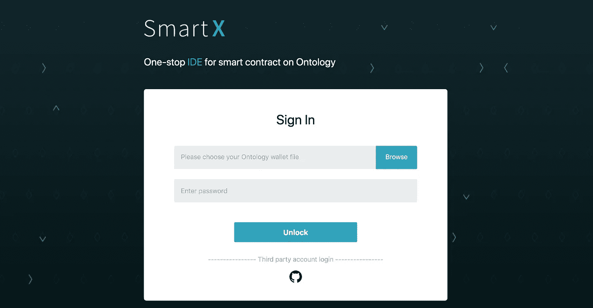
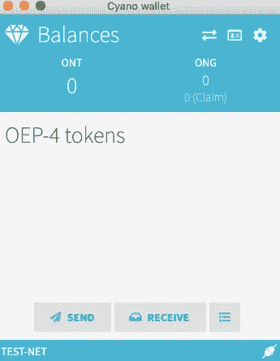
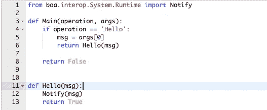
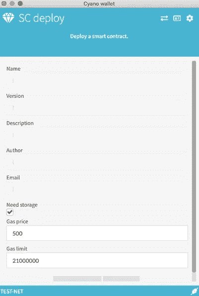
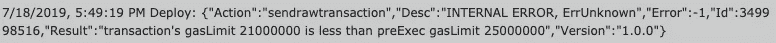
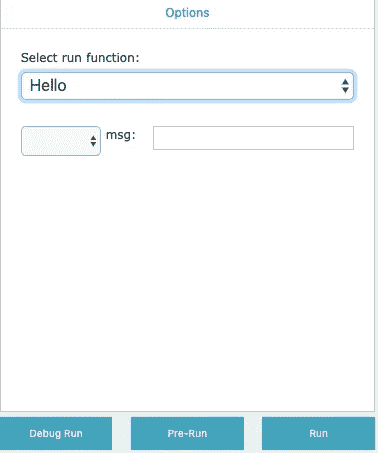
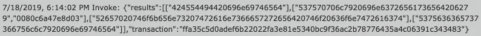

# 用 SmartX (Python)开发本体智能契约的搭便车指南

> 原文：<https://betterprogramming.pub/hitchhikers-guide-to-developing-ontology-smart-contracts-in-smartx-python-6a152fe8aad7>

## 本体链和 SmartX 及其智能契约开发环境的介绍

# **简介**

欢迎光临！我们很高兴你对使用[本体](https://ontio.github.io)开发智能合约感兴趣。本指南旨在为本体链和 [SmartX](https://ontio.github.io/documentation/SmartX_Tutorial_en.html) 及其智能合约开发环境提供最佳的入门体验。

如果出现以下情况，它将特别有用:

*   您对使用典型的数据结构和算法进行编程有着深刻的理解和丰富的经验。
*   你能流利地使用 [Python](https://www.python.org/) 或者在用[堆栈溢出](https://stackoverflow.com/)填补空白时足够舒适地使用 Python。
*   您知道区块链的一些基本高级应用(公共数据存储、事务处理)。

如果你想跳过牵手，只想自己把事情搞清楚，随便你！

# 开源资源

我们有一个大型的在线开源资源集合，涵盖了智能合约和使用本体的分散式应用程序(DApp)开发的所有知识，使用的语言不是 Python(如 [C#](https://docs.microsoft.com/en-us/dotnet/csharp/) 、JavaScript 和 Java)。

以下是一些入门指南:

*   [SmartX、智能合同开发、部署和调用简介](https://ontio.github.io/documentation/SmartX_Tutorial_en.html)
*   [本体 Python 智能合约 API](https://apidoc.ont.io/smartcontract/?python#introduction)
*   [本体 Python 智能合约 API 教程](https://github.com/punicasuite/tutorials/tree/master/smart-contracts-docs-cn)
*   [谷歌文档](https://drive.google.com/open?id=1Uk3-n_pttija8J5lcrBCNbUEZkGpZaQQ)
*   [本体 Python 智能合约演示](https://github.com/ONT-Avocados/python-template)
*   [整个本体 GitHub 知识库](https://github.com/ontio)
*   [本体开发者中心](https://developer.ont.io/)

对于那些决定留下来的人来说，如果你在遵循这个指南的过程中出现任何困惑，上面提供的资源仍然有用。

至此，让我们继续学习教程的内容。

# 1.开始使用 SmartX

为了获得最简单的初始设置体验，您的大多数智能合约都将在 SmartX 中完成。SmartX 是一个一站式的 web 浏览器 IDE，用于编译、部署和调用智能合同。

您可以在`[https://smartx.ont.io](https://smartx.ont.io/)`访问 SmartX，登录页面应该如下所示:

如果你没有本体钱包文件或者你不知道那是什么，不要担心。您可以点击“第三方帐户登录”下方的符号，使用您的 GitHub 帐户登录。如果您没有 GitHub 帐户，请创建一个。

# **2。氰基钱包**

等等！在我们进入智能合约开发的细节之前，您需要安装[氰基钱包](https://chrome.google.com/webstore/detail/cyano-wallet/dkdedlpgdmmkkfjabffeganieamfklkm?hl=en)。

氰基钱包是一个 web 扩展钱包，它包含本体的两个令牌(ONT 和 ONG)，以及您决定按照本体的 OEP4 令牌协议创建的任何令牌。

你可以在这里安装 Chrome 的氰基钱包:

*   [https://chrome . Google . com/web store/detail/cyano-wallet/dkdedlpgdmmkkfjabbffeganiaemfklkm？hl=en](https://chrome.google.com/webstore/detail/cyano-wallet/dkdedlpgdmmkkfjabffeganieamfklkm?hl=en)

一旦安装，氰基钱包可以从所有其他 Chrome 扩展的位置访问。

它会要求你创建一个账户，并记住一个助记短语和一个私钥——确保将这些记录在一个安全的地方。

一旦你过了这个阶段，氰基钱包应该看起来像这样:

虽然您的许多智能合约将依赖于氰基钱包来处理进出钱包地址的令牌传输，但氰基钱包对于持有 ONG 是最重要的，它是充当智能合约部署和调用的“Gas”的本体令牌。

对于那些不熟悉 Gas 的人来说，它基本上是一种交易费，当开发人员将智能合同部署到本体区块链时，或者当用户调用已部署的智能合同的功能时，就会支付这笔费用。

对于以太坊来说，费用是 ETH 的一小部分；对于本体而言，费乃 ONG。

所以在这一点上，你可能会想:“我怎么才能得到 ONG 呢？如果我一开始只是尝试开发基于本体的智能合约，我会投资购买 ONG 吗？”

这些都是可以立即解决的有效问题。

首先，在你的氰基钱包设置中，你可以在第一个下拉菜单中选择“TestNet ”,在第二个下拉菜单中选择任意节点地址。

然后，在`[https://developer.ont.io/](https://developer.ont.io/)`上，你可以通过滚动到主页的底部找到 TestNet ONT 和 ONG 的应用程序。

# 3.开发您的智能合同

一旦你通过你的 GitHub 帐户登录，创建你的第一个项目并选择你的编程语言(如果你正在阅读本教程，可能是 Python)。

现在，您的第一个智能合同项目已经打开并准备好进行开发，是时候开始了！

或者你会这么想。然而，在你真正开始开发你的智能合同之前，有一些重要的预防措施你需要知道。

因为智能契约是用 Python 编程的，所以很自然地认为 Python 的所有典型规则在这里都适用。然而，事实并非如此，以下是您需要了解的内容:

## **无外部模块**

在 SmartX 中开发时，Import 语句将限于特定于本体的库，我们将在后面介绍。

至于使您的 Python 体验高效的所有其他模块——您必须自己找到实现它们的方法。

## **没有抽象数据类型**

对于那些习惯于面向对象编程(OOP)的人来说，在您的智能契约开发之旅中，另一个大的适应等待着您——SmartX 只允许您使用基本类型、列表和映射。

实际上，您编写的函数必须存储通常在构造函数中处理的数据。

这种存储将发生在本体区块链上，使用从某些本体库中导入的函数。

## **限量处理**

SmartX 不处理浮点数，因此很难处理负数。

幸运的是，这些问题有解决方法。浮点数可以用数字乘以 10 的幂来表示，这取决于您想要多少个小数位。

例如，如果您想要表示精确到百分之一位的浮点数，请将您感兴趣的数字乘以 100。

至于负数，将您的“零”设置为一个大的正数，并根据这个“零”修改您的代码来解释正数和负数，这是一个直接的解决方法。

# 4.发展你的智能合同(这次是真的)

现在，记住以上所有内容，你终于可以开始开发你的第一份智能合同了。

如前所述，有一些特定于本体的库可以导入到 SmartX 中。作为一名智能合约开发者，掌握这些库并理解它们如何与本体区块链交互并完成你的目标是非常重要的。

向您介绍该文档的相关资源，以及利用这些库的智能合约示例，都列在本教程的顶部。

接下来，需要注意的是，您的智能合约必须遵循非常具体的格式。

为了让您的契约正确地编译并与 SmartX 交互，您必须在项目的顶部包含您的导入语句(就像任何普通的 Python 脚本一样)。

这是顶部的`main`方法，它调用你在程序后面定义的所有函数，这些函数在开始时必须遵循`main`方法。

例如，如果您要以这种格式实现一个经典的“Hello World”项目，它将如下所示:

注意 main 方法是如何包含一个`if`语句来检查调用的操作是否与契约中后来定义的函数的名称相匹配，并将参数设置为函数的输入。

main 方法需要为您在 smart contract 中定义的每个函数包含这种格式，以便 SmartX 可以在部署后调用您的函数。

# **5。部署您的智能合同**

您的智能合约与您以前编写的任何其他代码的最大区别之一是，您必须在测试您的功能之前“部署”它。

部署您的智能合约实际上是将它发送到区块链，以便您与区块链交互的功能(例如，在存储或事务方面)能够工作。

导航到 SmartX 的“Deploy”选项卡并填写描述智能合同信息的必填字段后，您可以选择部署合同的选项。

如果安装正确，氰基钱包应该弹出如下:

请注意,“气体价格”和“气体限制”都是您可以编辑的字段，通常，您需要更改的唯一字段是“气体限制”,并且只有在您的部署失败并且控制台记录了气体限制低于所需值的通知时才需要更改:

通常，这只是意味着您需要再次部署您的合同，并将气体限制设置为该数字。

即使你不需要改变“汽油价格”字段，你仍然需要关注它的值，确保你的氰基钱包账户有足够的 ONG 来支付成本。

重要的是要认识到，长期智能合同比短期合同有更高的天然气价格和天然气限制。

# **6。调用智能合同的功能**

这是令人兴奋的部分——您终于可以收获自己的劳动成果，并运行您在智能合同中编码的功能。

导航到 SmartX 的“运行”选项卡后，您可以从下拉菜单中选择想要运行的功能。如果您将函数包含在`main`方法中，并且按照前面的描述正确格式化，那么您的函数将只出现在下拉菜单中。

考虑到这一点，如果函数只作为不需要在智能契约之外调用的“助手”方法，您可以有意地将它们排除在`main`方法之外。

但是，如果您希望检查函数正在处理的值，您仍然可以通过选择“运行”选项左侧的“预运行”选项，使用 return 语句来查看该值。

这将在不与区块链交互的情况下运行您的函数，并记录函数的 return 语句要显示的值。

这可能是确保您的智能合约功能或发现需要修复的错误的有效方法。

# **7。调试您的智能合约**

错误是任何编程体验中不可避免的一部分，智能合约也是如此。

最初，不熟悉的开发环境可能有点吓人，一些错误消息可能看起来有点神秘，但是我们可以一起克服它:

`**Notify, Notify, Notify**`

这与其说是一种事后修复，不如说是一种过程中的解决方案。

SmartX 支持一个名为`Notify`的功能，它可以公开打印到区块链，并且可以立即在您的控制台上看到，如下所示。

在开发智能契约时，一个好的实践是在每个重要的代码块后包含一个带有可识别方法的`Notify`。

这是一种常见的调试技术，甚至在链外程序中也是如此——每个人都曾在某个时候使用 print 语句来指出他们的代码到底哪里出错了。

下面是一个使用“运行”选项后`Notify`返回控制台的例子:

当您的`Notify`语句的内容返回到控制台时，它将是十六进制字符串的形式，因此请确保导航到 SmartX 的“Tool”选项卡，找到一个合适的字符串转换工具来解码该语句。

另一件需要注意的事情是，在 SmartX 中，您可能需要使用“调试运行”来查看`Notify`语句。

通常，当你对有 bug 的代码使用“Run”时，一旦检测到 bug，它就会被取消，而不是在问题出现之前记录`Notify`。

这可能会令人沮丧，因为它没有给出太多关于您的代码可能在哪里出现问题的信息，但是如果出现问题，“Debug Run”选项是一个有用的替代选项。

## **勇于冒险**

有时，您的函数会成功运行，它的事务散列被记录在控制台中作为证据，但它不会做您期望它做的事情。

你已经尝试了所有的方法，并且即将放弃成为一名优秀的智能合同开发者的梦想。

不要放弃！

您可以将函数调用的事务哈希复制并粘贴到[本体区块链浏览器](https://explorer.ont.io/)中，选择 MainNet 或 TestNet(取决于您将智能合约部署到哪个)后，您可以看到您的智能合约事件的详细信息。

所有函数调用和智能合约部署都会产生类似的事务哈希，为了您的利益，可以在资源管理器中对它们进行跟踪。

# **6。结论**

恭喜你。你已经一路走到了最后，希望在这个过程中学到了一两件关于开发智能合同的事情。

在将来如何选择实现智能契约方面，您有很大的灵活性，而本体公共链是这方面的一个很好的起点。

对于那些对构建 DApps 感兴趣的人来说，Ontology 提供了许多开源资源，可以帮助您开始将智能合约转变为面向消费者的产品:

*   [本体 dAPI Github 知识库](https://github.com/ontio/ontology-dapi)
*   [Punica，本体 DApp 开发框架](http://punica.ont.io/)

就这样，祝你好运！