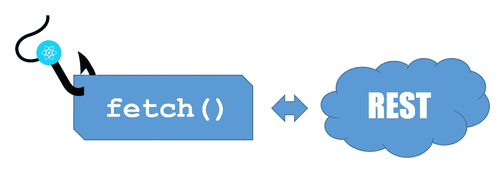
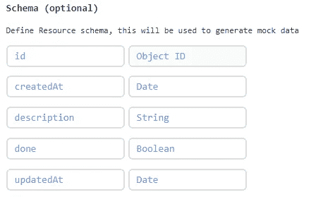
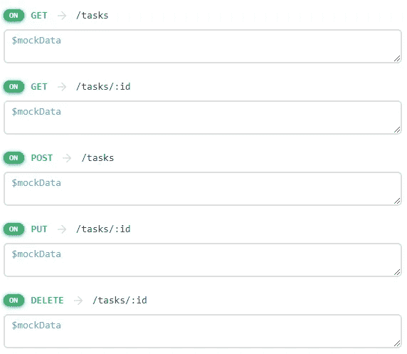

# 用 React 挂钩您的获取请求

> 原文：<https://betterprogramming.pub/hook-your-fetch-requests-with-react-e8c93dbad932>



从 16.8 版本开始， [React](https://reactjs.org/) 团队为社区提供了附加的钩子。

它们让我们编写功能组件，并使用类组件以前独有的特性，如状态、上下文和生命周期回调。

除此之外，React 文档为我们提供了构建自己的钩子来将组件逻辑提取到可重用函数中的可能性。

基于这种说法，我们可以在大多数项目中识别各种情况，在这些情况下，我们可以使用这种强大的功能来使开发更快、更容易。

比方说，您有两个或更多实现公共逻辑的组件。我们可以创建一个钩子来实现这个逻辑，并在我们所有的组件中使用它，这意味着更少的击键和重复的代码。

在其他适合使用钩子的情况中，本文讨论了何时必须与 REST API 通信来获取或提交数据。

为此，我们将构建一个管理需要完成的任务列表的示例应用程序(以前的待办事项示例)。

# 后端

由于本文关注的是应用程序的前端，我们将为后端使用一个模拟 REST API， [mockAPI.io](https://www.mockapi.io/) 。

它有一个免费的帐户选项，让你只能创建一个项目，但有多个端点。在我们的例子中，它非常合适，因为我们只需要一个端点(“任务”)。

该数据将有五个字段:

1.  `ID`
2.  `createdAt`
3.  `description`
4.  `done`(布尔型)
5.  `updatedAt`

您可以在下图中查看该字段的定义:



mockAPI 为每个资源/集合提供了四个 REST 动词:

1.  `GET`(取数据)
2.  `POST`(创建新数据)
3.  `PUT`(更新数据)
4.  `DELETE`(销毁数据)

`GET`动词可以和`ID`参数一起使用，以获取一个特定的任务或所有的任务。

下面是我在 mockAPI 中创建的定义的图片，所以你可以更好地形象化它。



剩余动词定义

mockAPI 给我的应用提供的后端地址是`https://5cfabdcbf26e8c00146d0b0e.mockapi.io**/**:endpoint` *。*

`:endpoint`是我们创建的资源(任务)的名称。

因此，如果你将浏览器指向`[https://5cfabdcbf26e8c00146d0b0e.mockapi.io**/**tasks](https://5cfabdcbf26e8c00146d0b0e.mockapi.io/tasks)` url，你会看到一个列表；我们的任务清单。

完成这一部分后，让我们开始工作中有趣的部分，那就是:

# 前端

好吧，这不是最有趣的部分，因为这不是我们应该建立的，但我们会实现的。

除此之外，识别可以使用钩子的情况的最简单的方法(至少对我来说)是构建应用程序组件，而不必担心这个问题。

我们的应用程序将由一个容器(`List`)组成，它将负责状态管理并向我们的后端发出获取请求。

在这个例子中，我们不会使用 Axios 或其他 HTTP 请求包装器；我们将使用 JavaScript 获取 API。

如果你对它不熟悉，你可以在 [MDN web 文档](https://developer.mozilla.org/en-US/docs/Web/API/Fetch_API/Using_Fetch)中了解更多。

其他组件都是表示性的:

*   `Filter`:处理选择过滤控件。从`List`容器接收过滤器值和`setFilter`回调。
*   `NewTask`:处理创建新`Task`的文本输入。从`List`容器接收`newTask`值和`setNewTask`回调。
*   `Task`:处理列表中显示的每个任务。接收任务本身和来自`List`容器的回调(`toogleTask`和`deleteTask`)。
*   `ActionButtons`:处理每个任务动作按钮的绘制和点击。从`Task`组件接收任务和回调(`toogleTask`和`deleteTask`)。

你可以在 [Codesandox](https://codesandbox.io/s/blissful-brown-bsezz) 上查看工作应用程序和完整的源代码。

这是简单明了的代码。我确信这不是最好的方法，还有很多改进的空间，但是对于本文来说，这已经很好了。

我们将关注处理获取数据的容器方法。

我把它们复制到这里，这样我们就可以清楚地看到代码的重复，我们可以用钩子把它们去掉。

我们将从运行在`useEffect`钩子内部的初始化代码开始:

它从 API 获取数据，将其转换为 [JSON](https://www.json.org/) ，并将其传递给其他函数，以给予它们正确的处理。

其他方法也是如此。我将用粗体和斜体标记相关代码。

```
const addTask = () => {
    if (!newTask) return;
    setLoading(true);
 ***fetch("***[***https://5cfabdcbf26e8c00146d0b0e.mockapi.io/tasks***](https://5cfabdcbf26e8c00146d0b0e.mockapi.io/tasks)***", {
      method: "POST",
      headers: {
        Accept: "application/json",
        "Content-Type": "application/json"
      },
      body: JSON.stringify({
        description: newTask,
        createdAt: new Date().toISOString(),
        done: false,
        updatedAt: ""
      })
    })
      .then(resp => resp.json())***
      .then(data => {
        const newList = [...list, data].sort((a, b) =>
          a.createdAt < b.createdAt ? 1 : -1
        );
        setList(newList);
        setNewTask("");
        setLoading(false);
      });
  };const toogleTask = task => {
    const { id, done } = task;
    setLoading(true);
    ***fetch(`***[***https://5cfabdcbf26e8c00146d0b0e.mockapi.io/tasks/${id}`***](https://5cfabdcbf26e8c00146d0b0e.mockapi.io/tasks/${id}`)***, {
      method: "PUT",
      headers: {
        Accept: "application/json",
        "Content-Type": "application/json"
      },
      body: JSON.stringify({
        done: !done,
        updatedAt: new Date().toISOString()
      })
    })
      .then(resp => resp.json())***
      .then(data => {
        const newList = list
          .map(l => {
            if (l.id === id) {
              l.done = data.done;
              l.updatedAt = data.updatedAt;
            }
            return l;
          })
          .sort((a, b) => (a.createdAt < b.createdAt ? 1 : -1));
        setList(newList);
        setNewTask("");
        setLoading(false);
      });
  };const deleteTask = task => {
    const { id } = task;
    setLoading(true);
 ***fetch(`***[***https://5cfabdcbf26e8c00146d0b0e.mockapi.io/tasks/${id}`***](https://5cfabdcbf26e8c00146d0b0e.mockapi.io/tasks/${id}`)***, {
      method: "DELETE",
      headers: {
        Accept: "application/json",
        "Content-Type": "application/json"
      }
    })
      .then(resp => resp.json())***
      .then(data => {
        const newList = list
          .filter(l => l.id !== data.id)
          .sort((a, b) => (a.createdAt < b.createdAt ? 1 : -1));
        setList(newList);
        setLoading(false);
      });
  };
```

我们在这里可以识别的唯一区别是，一些 Fetch 调用有默认的头。其他的，比如`GET`，不需要它(因为 Fetch API 使用的默认动词是`GET`)，但是看起来都一样。

那是我们可以装钩子的地方。这就是我们现在要做的。

# 定制挂钩

你可能已经知道(或者不知道):

> *“自定义钩子是一个 JavaScript 函数，其名称以“* `*use*` *”开头，可以调用其他钩子。”(* [*反应过来文档*](https://reactjs.org/docs/hooks-custom.html) *)*

所以最后，自定义钩子可以写成简单的 JavaScript 函数。

在我们的例子中，我们可以把它想象成一个函数，它接收端点 URL，存储它，并返回一个对象，该对象包含我们将使用不同动词进行 Fetch 调用的方法。

下面是我想出的代码:

简单明了的代码，没什么太复杂的。我已经添加了一个助手函数(`customFetch`)，所以我不必再次重写整个获取命令。

我们如何利用这一点？

第一步是在`List`容器中导入钩子。

在我的例子中，我将`useFetch`代码放在了`src/Hooks`文件夹中:

```
import useFetch from "../Hooks/useFetch";
```

第二步是使用钩子，通知端点 URL 并将其归属于一个常量。

```
const tasksApi = useFetch(
    "[https://5cfabdcbf26e8c00146d0b0e.mockapi.io/tasks](https://5cfabdcbf26e8c00146d0b0e.mockapi.io/tasks)"
  );
```

有了这两行代码，我们就可以使用我们的定制钩子了，比如在这个`addTask`代码中:

# 结论

就像我们在网络上看到的任何其他代码一样，钩子还有很大的改进空间。

一个很好的补充，我认为是有意义的，就是添加一个 HTTP 基本认证，它将 auth 令牌存储在状态中，并在所有后续的 Fetch 头中使用它。

然而，这是另一篇文章的内容，或者是读者的一个练习。

当然，如果您检查代码，您可以找到其他地方，您可以在那里创建一个定制的钩子或助手函数来使代码变得更小，例如数组排序部分，它在所有四个方法(`useEffect`、`addTask`、`deleteTask`和`toogleTask`)中重复出现。

然而，这可能也是另一篇文章的主题(或者这篇文章的评论)。

所以，我认为我们已经完成了这里的工作，并且已经完成了这篇文章想要达到的目标。

使用我们构建的`useEffect`钩子的工作应用程序可以在 [Codesandbox](https://codesandbox.io/s/todo-example-v2-usefetch-article-1d403) 中获得。

希望你喜欢这篇短文，并从中有所收获。

一如既往地欢迎任何建议或意见。