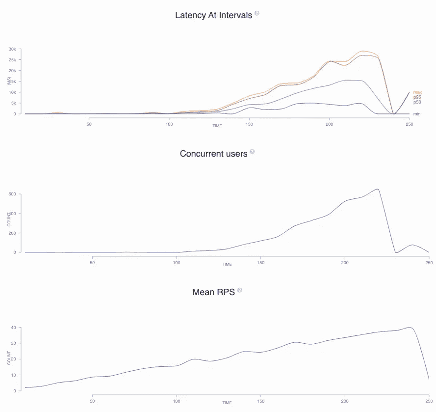
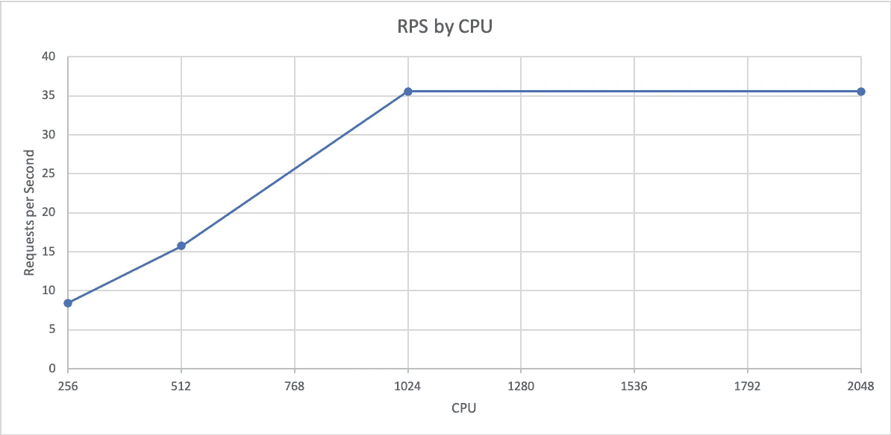

# Node.js 中的水平和垂直缩放

> 原文：<https://betterprogramming.pub/horizontal-vs-vertical-scaling-in-node-js-1b4f3ec8282>

## 了解节点如何随 CPU 扩展

爱德华·豪厄尔在 [Unsplash](https://unsplash.com?utm_source=medium&utm_medium=referral) 上拍摄的照片。

我听到很多人说我们应该水平扩展应用程序而不是垂直扩展，但是这真的是最好的扩展方式吗？在本文中，我们将探索 Node.js 如何随 CPU 伸缩，并看看如果我们这样做，是否还有其他需要考虑的事情。

# 测试基础设施

为了测试 Node.js，创建了一个带有端点的演示应用程序，可以用来模拟负载。[应用](https://hub.docker.com/r/harrymartland/node-load-app)已备案，可在 Docker Hub 上找到。源代码可以在 GitHub 上找到[。](https://github.com/HarryEMartland/node-scaling-experiment/tree/master/load-app)

该应用程序部署在具有不同 CPU 限制的 AWS ECS 上，并在前端放置了一个负载平衡器，以使其可公开访问。用于部署这个基础设施的代码可以在 GitHub 上找到[。如果你想自己动手，可以查看这个库并运行`yarn build`来构建 CloudFormation 栈。然后运行`yarn cdk deploy`。不同的实例部署在`<loadbalancer DNS>/<CPU>`，其中 CPU 是`256`、`512`、`1024`或`2048`中的一种。一旦完成，就可以用`yarn cdk delete`删除一切。](https://github.com/HarryEMartland/node-scaling-experiment/blob/master/cdk/lib/cdk-stack.ts)

# 负荷试验

[cannon](https://artillery.io/)用于对应用程序进行负载测试，从每秒一个请求(RPS)开始，在四分钟内增加到 40 RPS。通过在四分钟内缓慢加速，我们可以更准确地看到应用程序从哪一点开始失败。这一过程重复了四次——每种 CPU 尺寸一次。在 GitHub 上可以找到[火炮文件](https://github.com/HarryEMartland/node-scaling-experiment/blob/master/artillery/fib.yaml)和所有测试的结果[。您将找到可以下载来查看图表的`.html`文件。如果您想要原始输出，请查看同一个目录中的`.json`文件。测试的终点是计算第 30 个斐波那契数。这是一项计算量很大的任务，模拟真实世界的应用程序工作。](https://github.com/HarryEMartland/node-scaling-experiment/tree/master/artillery)

下图来自 512 CPU 测试。在测试的第一部分，延迟和并发用户保持不变。这表明应用程序运行良好，能够处理负载。一旦服务不堪重负，延迟和并发用户就会增加。请注意并发用户的增长看起来是指数级的。一旦服务达到极限，延迟也会从大约 50 毫秒急剧增加到超过 5 秒。一旦服务接收请求的速度超过它的处理速度，请求就会备份，这会使服务速度变慢，并导致更多的请求备份。

512 CPU 负载测试结果

# 结果

在绘制了每个 CPU 的测试开始失败的点(当并发用户和响应时间增加时)之后，我们可以看到 Node.js 随 CPU 线性扩展。这意味着，在大多数情况下，就每 CPU RPS 而言，增加 CPU 没有任何好处。下图描绘了这一点。请注意，`1024`和`2048`之间没有增加。这是由于节点的单线程性质。额外的 CPU 处于闲置状态。AWS Fargate 按部分 vCPU 收费，因此四个`256`pod 与一个`1024` pod 价格相同。因此，创造更大的豆荚没有经济利益。

如前所述，当应用程序无法处理负载时，并发请求和响应时间会激增。如果我们使用这些指标来自动扩展，当指标增加并且我们要求扩展时，服务已经在影响客户了。对此的解决方案是在 RPS 上进行扩展，并在其他指标受到影响之前设置值。这保持了良好的客户体验，并允许增加一些呼吸空间。

# 水平扩展的优势

主要好处是成本。我们要求更精确的资源数量。这意味着浪费更少。如果我们可以用半个 CPU 来处理负载，但只扩展完整的 CPU，我们就浪费了半个 CPU 的价格。

如果您的服务的流量在一天中发生变化，您可以缩减到最小的 pod 数量(通常是两个以获得弹性)。通过保持 CPU 小，它保持你的最低成本的价格下降。

通过增加流量中的 pod，我们还提高了弹性。如果一个 pod 出现故障，负载会分散到仍在运行的 pod 上。如果我们有十个吊舱，每个吊舱处理 10 个 RPS，其中一个出现故障，剩下的九个吊舱将只获得 1.1 个 RPS。如果我们只有五个 10 RPS 的服务，一个失败了，剩下的会得到 2.5 RPS。这足以让服务不堪重负。如果可用的话，拥有更多的单元还可以将负载分散到更多的可用性区域和节点上。

# 结论

努力抵制增加服务 CPU 的冲动。而是增加它们的数量。这将使您的应用程序的成本得到控制，同时也增加了它的弹性。您还应该自动缩放您的应用程序，但是在使用响应时间或并发请求时要小心，因为这可能会给您的客户带来糟糕的体验。

我希望这是您构建经济高效且有弹性的服务所需的证据。