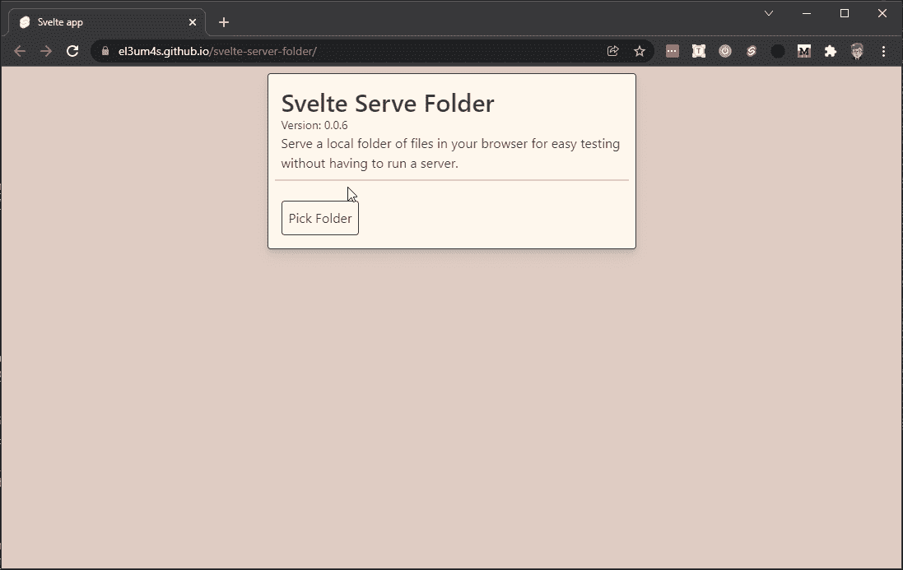
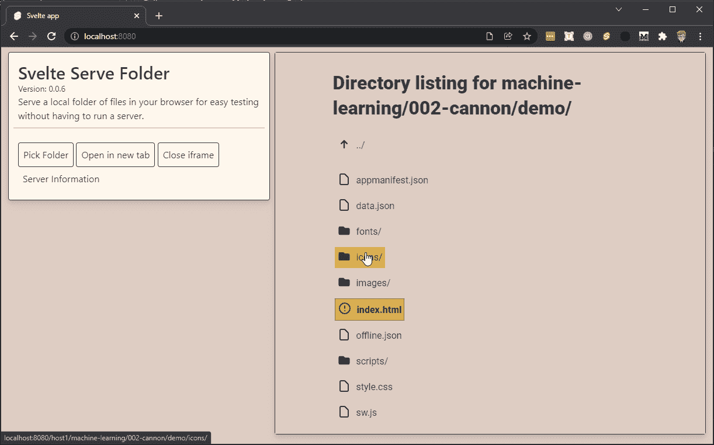

# 使用 TypeScript 和 Svelte 在浏览器中直接托管 Web Dev 文件的本地文件夹

> 原文：<https://betterprogramming.pub/host-a-local-folder-of-web-dev-files-directly-in-the-browser-using-typescript-and-svelte-397c113a8bf8>

## 为你的浏览器提供一个本地文件夹


由[大卫·布鲁诺·席尔瓦](https://unsplash.com/@brlimaproj?utm_source=medium&utm_medium=referral)在 [Unsplash](https://unsplash.com?utm_source=medium&utm_medium=referral) 拍摄的照片

我在 [gest-dashboard](https://javascript.plainenglish.io/the-journey-of-a-novice-programmer-82366ec7851a) 项目中遇到的困难之一是如何在浏览器中查看文件夹。或者说，如何使用包含本地保存的 HTML 文件的文件夹。只要它们是简单的文件，这就不是问题。当涉及到更复杂的 web 应用程序时，它变得更加困难。我试过两种解决方案。第一个是使用 Node.js 的`[http.createServer([options][, requestListener])](https://nodejs.org/api/http.html#httpcreateserveroptions-requestlistener)`。然而，这增加了我的项目的复杂性。

然后，[阿什利·古伦](https://www.construct.net/en/blogs/ashleys-blog-2)发了一个非常[有趣的知识库](https://github.com/AshleyScirra/servefolder.dev):

```
The page at servefolder.dev lets you host a local folder with web development files, such as HTML, JavaScript and CSS, directly in your browser. It works using Service Workers: everything is served from your local system only, nothing is uploaded to a server, and your files are not shared with anybody else.
```

换句话说，我直接在浏览器中创建了一个本地服务器，我可以用它来查看我的文件夹，就像它们在线一样。但是不在线。

从这个库开始，我创建了我的版本，苗条服务文件夹:



显然，最初的想法不是我的，我建议直接咨询 Ashley 的知识库。它的代码信息量很大。如此有教育意义，学习它是必要的。所以，在这篇文章中，我将报告我的笔记和我所理解的。我将通过重新创建原始存储库来实现这一点，只做一些更改:

1.  我将尽可能使用用 [TypeScript](https://www.typescriptlang.org/) 编写的代码:我已经注意到将来查阅 TS 代码对我来说更容易；
2.  在可能的情况下，我会使用 [Svelte](https://svelte.dev/) :在这种情况下，这不是必须的，但我计划用 Svelte 重用我在其他项目中学到的东西；
3.  我添加了通过一个 [iframe](https://developer.mozilla.org/en-US/docs/Web/HTML/Element/iframe) 直接在主页上查看文件夹内容的功能:在这种情况下，我需要了解如何将这种技术集成到 [Electron 的浏览器视图中](/how-to-use-browserview-with-electron-9998fa834b44)

有一点我不会用的是 [@rollup/plugin-html](https://github.com/rollup/plugins/tree/master/packages/html) 创建 html 模板。但是我想在接下来的几天里考虑一下。

# JavaScript 服务工作者

目前，我不考虑图形方面，而把重点放在服务人员上。如果你从未使用过它们，这就是我的情况，首先要做的是理解它们是什么。幸运的是，在 Mozilla.org 上你可以找到你需要的所有信息。所以，首先要做的是查看这个网站:

*   [服务工作者 API](https://developer.mozilla.org/en-US/docs/Web/API/Service_Worker_API) —简而言之，服务工作者的目的是在浏览器托管的页面和生成页面的服务器之间建立一座桥梁。它们通常用于允许站点脱机工作，并在后台管理通知和操作。它们不能直接访问 HTML 页面(所谓的 DOM)，它们是完全异步的，并且在浏览器处于匿名模式时不起作用。他们需要 HTTPS 的连接。

使用需要一些强制性的步骤:

*   每个服务人员必须首先通过`[ServiceWorkerContainer.register()](https://developer.mozilla.org/en-US/docs/Web/API/ServiceWorkerContainer/register)`方法注册
*   然后下载服务人员:这是一个自动过程，不需要用户采取任何行动
*   下载后，是时候安装它了:这个动作也是自动的，但在某些情况下，强制安装会更好。在这个项目中，Ashley 使用了[ `[ServiceWorkerGlobalScope.skipWaiting()](https://developer.mozilla.org/en-US/docs/Web/API/ServiceWorkerGlobalScope/skipWaiting)` ]和`[Clients.claim()](https://developer.mozilla.org/en-US/docs/Web/API/Clients/claim)`方法，这是一个很好的解决方案
*   最后，还有[激活](https://developer.mozilla.org/en-US/docs/Web/API/ServiceWorkerGlobalScope/activate_event)事件(可以被拦截和管理)

# 如何用 JavaScript 安装服务人员

一小段代码。用 JavaScript 注册服务人员很简单:

将`sw.js`文件(带有服务人员代码的文件)保存在根文件夹中是一个好主意:这将使您的生活变得容易得多。

在`sw.js`中，我添加了一个安装触发事件:

另一个由激活触发:

所以我安装了服务人员。但是如何使用它们呢？

# 使用文件系统访问 API 选择文件夹

嗯，就是这个想法。可以将本地文件夹的内容存储在内存中，而不是离线保存站点代码(或仅保存站点代码)。这样，当我们试图访问它时，它看起来就像是虚拟服务器上的一个文件。

简而言之:我们可以让浏览器相信这个文件夹不在本地，而是由本地服务人员保存的远程文件夹。

我可以在完全离线的环境下使用 web 应用程序吗:



显然，我们需要一种方法来允许文件从磁盘传递给服务人员。在这种情况下，[文件系统访问 API](https://developer.mozilla.org/en-US/docs/Web/API/File_System_Access_API) 非常优秀。

然后我创建了一个`pickFolder`功能来选择 pc 上的一个文件夹。

得到文件夹后，我需要一种方法来通知服务人员我的选择。我使用了一个`postToSW`函数:

现在，我可以从 HTML 页面向服务人员发送消息。但是我需要给`sw.js`文件添加一个函数:

但是如果服务工作器还没有初始化呢？

阿什利提出了一个优雅的解决方案，我花了一些时间才想出来。它由两个功能组成。第一种是创建一个计时器来等待必要的时间:

然后，我需要`[ServiceWorkerContainer.oncontrollerchange](https://developer.mozilla.org/en-US/docs/Web/API/ServiceWorkerContainer/oncontrollerchange)`属性在服务工作者接收新的活动工作者时进行拦截:

现在，我有了创建一个函数的所有工具，可以从 pc 上选择一个文件夹并通知服务人员:

稍后，您可以在 HTML 页面中使用所有这些内容。在我的例子中，我创建了`App.svelte`文件:

# 像在服务器上一样打开文件夹

总之，目前我可以从 pc 上选择一个文件夹，然后通知服务人员。但是接下来会发生什么呢？嗯，我需要一个`StartHost(e)`函数:

这允许我通过传递主机名和客户机 id 来回复 HTML 页面。我可以使用这些信息来创建一个按钮:

当我点击按钮时，一个新的页面打开了。但显然页面什么都没有。我需要在`sw.js`中添加一个特定的函数:

现在我必须回到主页。我为`fetch`事件添加了一个事件监听器

然后我创建了`handleFetch`函数:

`generateDirectoryListing`函数创建一个包含文件和文件夹列表的 HTML 页面。

阿什利·古伦的功能相当基础。在我的版本中，我做了一点改动，但都是细节。

# 在 iframe 中显示结果

此存储库的原始版本是在另一个浏览器选项卡中打开上传的文件夹。在我的版本中，我增加了在同一页面上直接查看内容的功能。只需使用一个`iframe`元素并输入相应的 URL:

好了，暂时就这些了。还有许多其他有趣的细节，但这些都是基本概念。我再次建议参考原始存储库:

[](https://github.com/AshleyScirra/servefolder.dev) [## GitHub-Ashley scirra/Serve folder . dev:在您的浏览器中提供一个文件的本地文件夹，以便于…

### 在您的浏览器中提供一个本地文件夹，以便在不运行服务器的情况下进行测试。- GitHub …

github.com](https://github.com/AshleyScirra/servefolder.dev) 

我的版本:

[](https://github.com/el3um4s/svelte-server-folder) [## GitHub-El 3um 4s/svelte-server-folder:浏览器中的服务器文件夹

### 在浏览器中提供文件夹。在 GitHub 上创建一个帐户，为 el3um4s/svelte-server-folder 开发做贡献。

github.com](https://github.com/el3um4s/svelte-server-folder) 

感谢阅读！敬请关注更多内容。

***不要错过我的下一篇文章—报名我的*** [***中邮箱列表***](https://medium.com/subscribe/@el3um4s)

[](https://el3um4s.medium.com/membership) [## 通过我的推荐链接加入 Medium—Samuele

### 阅读萨缪尔的每一个故事(以及媒体上成千上万的其他作家)。不是中等会员？在这里加入一块…

el3um4s.medium.com](https://el3um4s.medium.com/membership) 

*最初发表于*[*https://blog.stranianelli.com*](https://blog.stranianelli.com/how-to-serve-a-local-folder-of-files-in-your-browser/)

# 进一步阅读

*   在完成这篇文章后，我还发现了一个由韩写的很好的故事