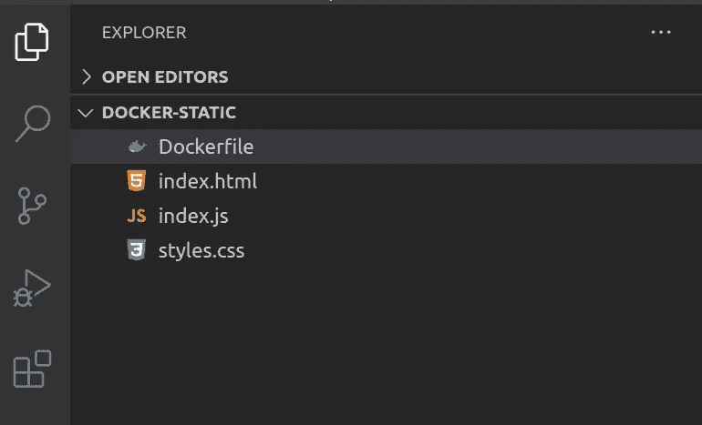
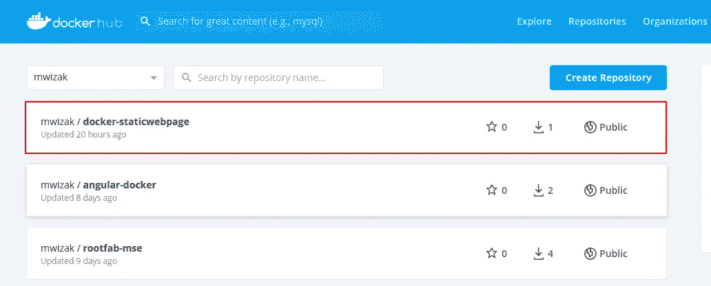
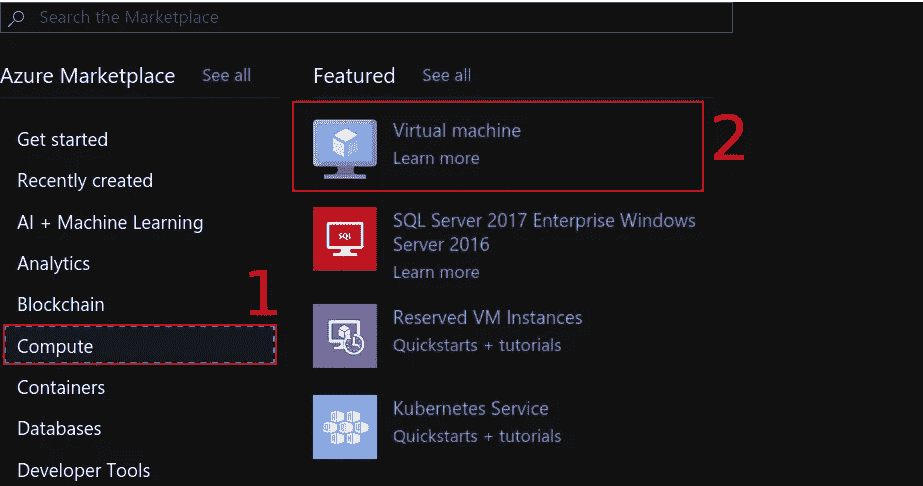
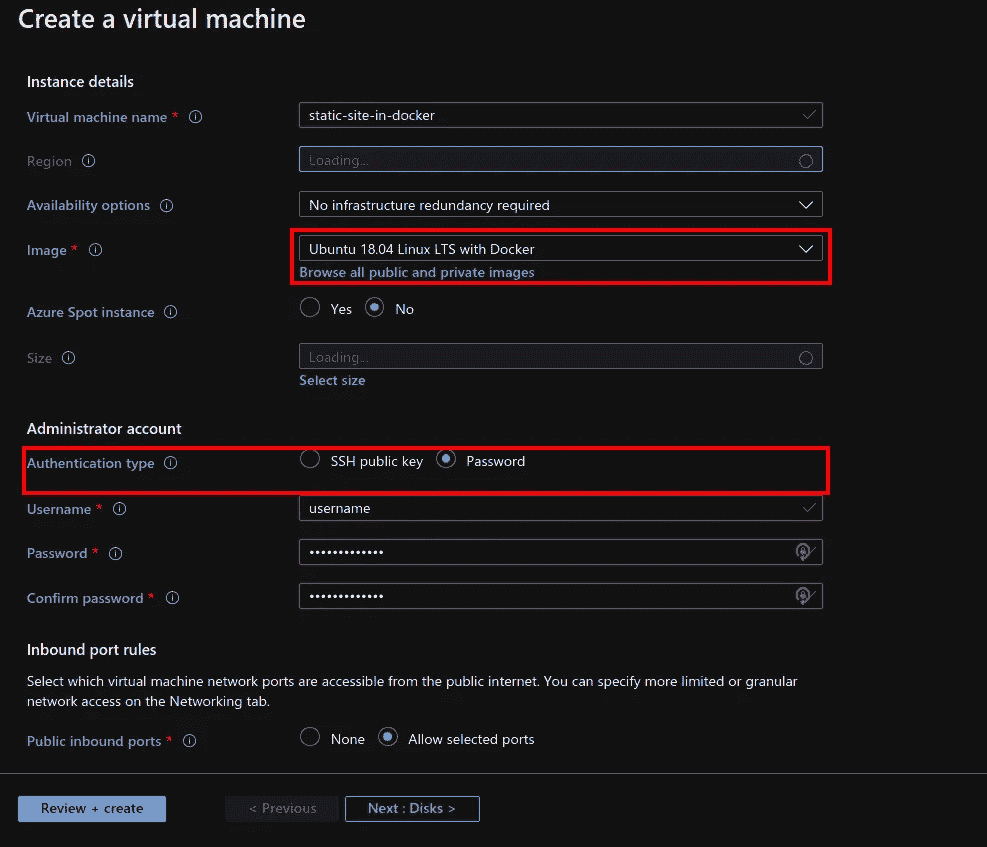
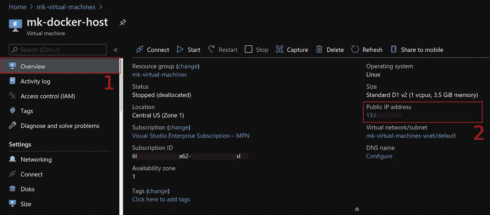
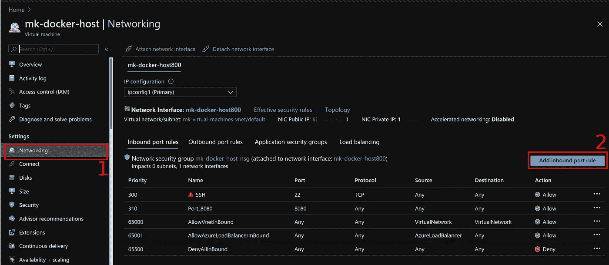
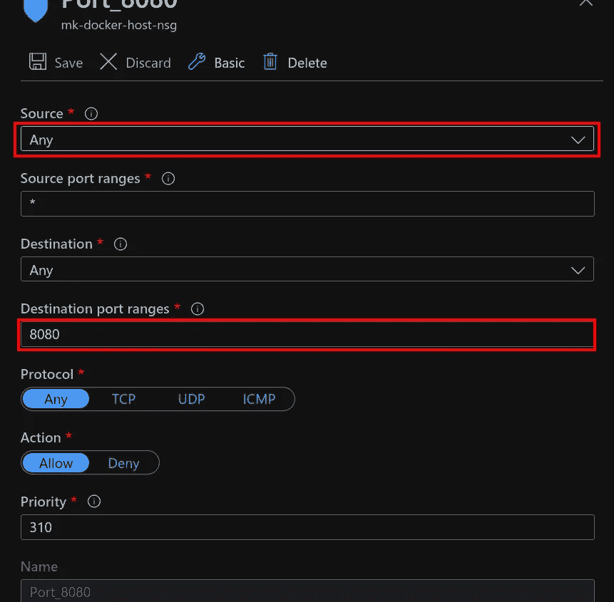
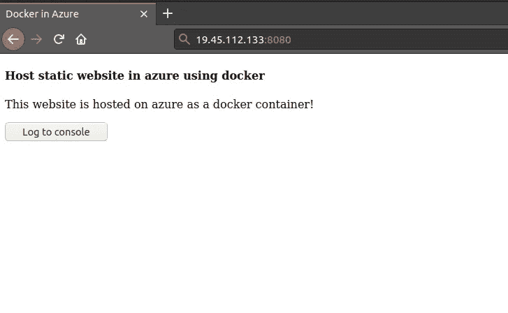

# 将你的静态网站作为 Docker 容器托管在 Azure 中

> 原文：<https://betterprogramming.pub/host-your-static-website-in-azure-as-a-docker-container-be127f00267d>

## 在 Azure 上容器化你的网站


照片由[埃德加·恰帕罗](https://unsplash.com/@echaparro?utm_source=unsplash&utm_medium=referral&utm_content=creditCopyText)在 [Unsplash](https://unsplash.com/s/photos/container?utm_source=unsplash&utm_medium=referral&utm_content=creditCopyText) 拍摄。

在本文中，我将与您分享如何在 [Azure](https://azure.microsoft.com/) 中将静态网站作为 Docker 容器轻松托管。托管应用程序从来没有比 Docker 更容易。这样做有以下好处:

*   轻松设置您的托管环境。
*   易于原型化。
*   与客户或其他开发人员轻松共享您的应用程序。

# 1.创建一个静态网站

我们将为静态网站创建一个目录，并将其命名为`docker-static`。但是你可以随意使用任何你喜欢的名字。

```
$ mkdir docker-static
```

我们的静态网站将由 HTML5、CSS 和 JavaScript 文件组成。继续在项目目录中创建以下文件:

```
$ touch html.index index.js styles.css
```

为了简单起见，我们的网站将有最少的功能。静态文件的 HTML 将包含一个按钮，单击该按钮将触发 JavaScript 函数。JavaScript 函数只是将一条消息记录到控制台。CSS 只是给网站添加了一些背景色。

## Index.html

您可以将以下 HTML 代码复制并粘贴到`index.html`文件中:

## 索引. js

将下面的 JavaScript 代码复制并粘贴到您的`index.js`文件中。我们已经声明了一个函数，它会在每次单击 HTML 中的按钮时记录到控制台:

```
function logToConsole(){
  console.log(`button clicked !`);
}
```

## 样式. css

在`styles.css`文件中，我们将简单地设置我们网站的背景颜色为浅灰色，如下所示:

```
body {
  background-color: lightgray;
}
```

# 2.创建 Docker 图像

在`docker-static`项目文件夹中，添加一个名为`Dockerfile`的文件。Docker 文件是我们用来定义创建 Docker 映像的指令的文件。

在此阶段，项目的文件夹结构及其对应的文件应该如下所示:



现在，将下面的代码复制并粘贴到 docker 文件中:

上面的 Dockerfile 文件分为两个阶段，分别标记为`static-site`和`server`。

在初始阶段，Dockerfile 只是将静态网站的所有文件复制到 Docker 镜像中的`app`文件夹。第二阶段(即服务器阶段)使用 [NGINX](https://www.nginx.com/) 作为基础映像。然后，它将静态站点的内容复制到 NGINX `html`文件夹中，站点将从该文件夹中得到服务。

此外，Docker 镜像暴露其内部端口:80，用于与外界交互。

## 构建 Docker 映像

现在我们已经连接好了 Docker 文件，我们将构建它来创建一个 Docker 映像。只需在项目文件夹中运行以下 Docker 命令:

```
$ docker build -t mwizak/docker-staticwebpage -f Dockerfile .
```

在上面的命令中，我们用名称`mwizak/docker-staticwebpage`标记了我们的 Docker 映像，其中“mwizak”是我的 Docker Hub 注册帐户的名称。

# 3.将图像推送到注册表

一旦映像构建完成，您可以将它推送到 Docker Hub 注册表，这样您就可以轻松地从任何 PC 上访问它。我将在这里使用 Docker Hub 注册中心，但也可以随意使用您选择的其他注册中心(例如 Azure container registry、Amazon ECR 等。).

要将图像推送到 Docker Hub，您首先必须登录您的帐户。运行命令:

```
$ docker login
```

通过身份验证后，您可以使用以下命令将映像推送到注册表中:

```
$ docker push mwizak/docker-staticwebpage
```

*注意:mwizak 是我的 Docker Hub 注册帐户的名称。相应地用您的帐户替换它。*

现在，登录到您的 Docker Hub 注册表，映像应该如下所示:



# 4.在 Azure 中创建虚拟机

我们将在 Azure 上的虚拟机中托管 Docker 映像中的静态网站。在这个例子中，我使用 Azure 作为云提供商，但是你可以使用任何你喜欢的提供商(例如谷歌云、AWS、阿里云等。).

首先，登录 Azure 门户。从主页中，选择“创建资源”

然后在下一步中，选择“计算”,然后选择“虚拟机”,如下图所示:



在下一步中，填写所有必要的详细信息。

虚拟机映像类型很重要。选择 Docker 预装的那个，这样就不用自己设置了。我使用名为“Ubuntu 18.04 Linux LTS 与 Docker”的 Zerta 镜像



在管理员账号选项中，选择【密码】，**，**然后提供用户名和密码。确保“允许选定的端口”已启用，以便能够通过 SSH 登录。

创建虚拟机可能需要几分钟时间。完成后，您可以通过 SSH 从本地或远程 PC 登录虚拟机，如下所示:

```
$ ssh username@19.45.112.133
```

`username`是您在创建虚拟机时提供的用户名，IP 地址是虚拟机的 IP 地址。

## 获取虚拟机 IP 地址

你可以从 Azure 门户获取你的虚拟机的 IP 地址。首先，在 Azure 门户中选择您的虚拟机。然后点击如下“概述”:



## 在端口 8080 上启用入站流量

要使您的网站在端口 8080 上提供服务，您必须添加一个入站端口规则。选择您的虚拟机，然后选择“网络”并单击“添加入站端口规则”，如下图所示:



将 source 设置为“Any”，然后在目的端口范围上输入端口号 8080，这是我们的静态站点将通过的端口。



# 5.服务器站点

要为站点提供服务，请从虚拟机的终端使用以下命令运行您推送到 Docker 注册表的 Docker 映像:

```
$ sudo docker run -ti -d -p 8080:80 mwizak/docker-staticwebpage 
```

*注意:如果您的本地机器(在本例中是虚拟机)上没有映像，Docker 将自动从互联网(即注册表)下载映像。*

既然已经下载并运行了映像，请在本地浏览器上访问 http://ip-address-of-vm:8080。瞧，Azure 中有一个托管为 Docker 容器的网站。

*注意:使用虚拟机的正确 IP 地址，后跟:8080(即端口号)。*



# 摘要

简而言之，这就是我们所做的:我们创建了一个简单的静态网站，然后将其打包为 Docker 容器。最后，我们在 Azure 的虚拟机(VM)上托管应用程序。