# 在 Heroku 上托管您的 Laravel 应用程序

> 原文：<https://betterprogramming.pub/hosting-your-laravel-app-on-heroku-198764167a85>

## 如何将你辛辛苦苦开发的应用程序送到其他人手中


照片由 [CHUTTERSNAP](https://unsplash.com/@chuttersnap?utm_source=medium&utm_medium=referral) 在 [Unsplash](https://unsplash.com?utm_source=medium&utm_medium=referral) 上拍摄

作为一名开发人员，有时您只需要快速在线托管一个应用程序进行测试，或者甚至向客户展示您的进度。在这种情况下，您可能不一定需要购买托管服务，因为您只是需要一个地方来托管您的应用程序以进行测试。

在本教程中，我们将研究在 Heroku 上免费托管一个 Laravel 应用程序。

Heroku 支持各种编程语言，如 PHP、JavaScript、Ruby on Rails、Python 等。无论是真正的 web 应用程序，还是您只是在寻找一个托管 REST API 的地方，这都是将您的应用程序放到网上的好方法。

# **在 Heroku 上托管新的 Laravel 应用程序**

你可以在 Heroku 上托管一个 Laravel 应用程序或网站。这是一个非常无缝的过程。如果你遵循本教程中的步骤，你会发现它非常容易。

首先，我们需要创建一个 Laravel 应用程序。此外，为了将数据库合并到我们的应用程序中，我们将创建一个数据库。我们还将创建一个与之通信的非常简单的 REST API。我们将在本教程中使用的数据库是 PostgreSQL。

## **1。在 Heroku 上注册**

## **2。下载并安装**[**Heroku CLI**](https://devcenter.heroku.com/articles/heroku-cli)

访问网站，下载并安装适用于您的操作系统的 Heroku CLI。这将允许我们在部署应用程序时使用 Heroku CLI。

## 3.**生成新的 Laravel 应用程序并构建 API**

导航到系统上希望应用程序驻留的特定文件夹。打开 cmd 并导航到该文件夹，或者使用 Git Bash。键入以下内容以生成一个全新的 Laravel 8 应用程序。

```
composer create-project — prefer-dist laravel/Laravel <name-of-app>
```

我们将把我们的应用程序命名为`herokuApp`。因此，上面的命令变成了:

```
composer create-project --prefer-dist Laravel/Laravel herokuApp
```

这将创建一个名为`herokuApp`的新项目。在这之后，在命令行输入`cd herokuApp`进入应用程序文件夹。进入文件夹后，键入`php artisan serve`启动您的 Laravel 服务器。你会看到这个。我们的本地 Laravel 应用程序现在已经启动并运行。

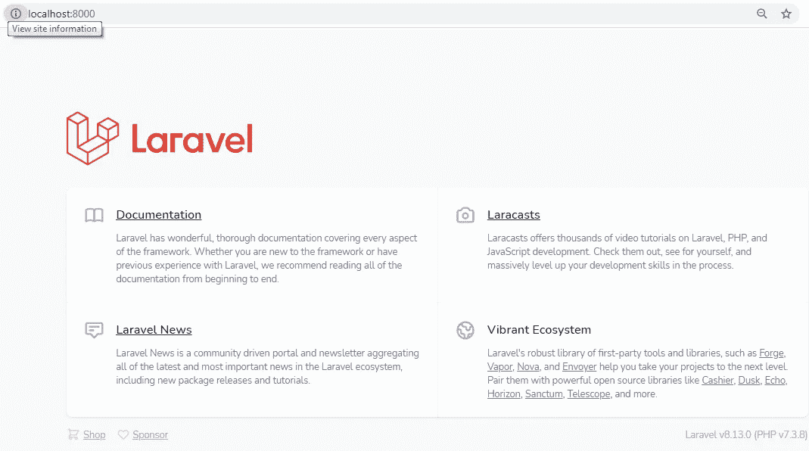

Laravel 服务器已启动

或者，如果您使用 XAMPP，您可以将项目文件夹移动到您的`htdocs`文件夹中；如果您使用 WAMP，您可以将项目文件夹移动到`www`文件夹中。像打开普通的 PHP 项目一样打开。

您现在可以为数据库创建您的模型、迁移、控制器和种子。`php artisan make:model Footballer -m`上的`-m`标志帮助我们用一个命令创建一个模型和相应的迁移表。

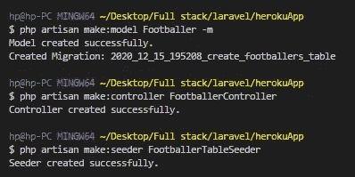

模型、控制器和迁移已创建

接下来，更新您的`Migrations`表，并添加您需要的字段，如下所示。

```
<?phpuse Illuminate\Database\Migrations\Migration;use Illuminate\Database\Schema\Blueprint;use Illuminate\Support\Facades\Schema;class CreateFootballersTable extends Migration{/*** Run the migrations.** @return void*/public function up(){Schema::create(‘footballers’, function (Blueprint $table) {$table->id();$table->string(‘name’);$table->string(‘position’);$table->timestamps();});}/*** Reverse the migrations.** @return void*/public function down(){Schema::dropIfExists(‘footballers’);}}
```

运行`php artisan migrate`创建表格。

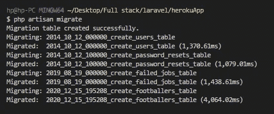

迁移表已创建

打开位于`database\seeder`目录下的`FootballerTableSeeder.php`文件，如下图所示进行编辑。这将帮助我们用数据填充表格。

```
<?phpnamespace Database\Seeders;use Illuminate\Database\Seeder;
use App\Models\Footballer;class FootballerTableSeeder extends Seeder
{
    /**
     * Run the database seeds.
     *
     * @return void
     */
    public function run()
    {
        //
        //This resets the table, deleting all the data everytime the function is called.
        Footballer::truncate(); Footballer::create([
            'name' => 'Sadio Mane',
            'position' => 'Winger',
        ]); Footballer::create([
            'name' => 'Oxlade Chamberlain',
            'position' => 'Midfielder',
        ]); Footballer::create([
            'name' => 'Virgil Van Dijk',
            'position' => 'Defender',
        ]); Footballer::create([
            'name' => 'Allison Becker',
            'position' => 'Goalkeeper',
        ]); }
}
```

接下来，调用位于相同文件夹中的`DatabaseSeeder.php`文件中的表，如下所示。

```
<?phpnamespace Database\Seeders;use Illuminate\Database\Seeder;class DatabaseSeeder extends Seeder
{
    /**
     * Seed the application's database.
     *
     * @return void
     */
    public function run()
    {
        $this->call(FootballerTableSeeder::class);
    }
}
```

运行`php artisan db:seed`来实际播种表格。

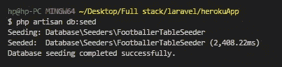

植入的表格

这是我们数据库的照片。您可以看到数据已成功保存在数据库中。

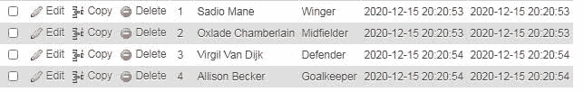

显示植入数据的数据库

现在，让我们在位于`routes`文件夹中的`api.php`文件中创建两个 API 端点，如下所示。

```
<?phpuse Illuminate\Http\Request;
use Illuminate\Support\Facades\Route;//Import Controller
use App\Http\Controllers\FootballerController;/*
|--------------------------------------------------------------------------
| API Routes
|--------------------------------------------------------------------------
|
| Here is where you can register API routes for your application. These
| routes are loaded by the RouteServiceProvider within a group which
| is assigned the "api" middleware group. Enjoy building your API!
|
*/Route::middleware('auth:api')->get('/user', function (Request $request) {
    return $request->user();
});Route::get('/footballers', [FootballerController::class, 'index'])->name('show.footballers');
Route::get('/footballers/{id}', [FootballerController::class, 'show'])->name('show.footballer');
```

现在让我们在控制器中创建`index`和`show`函数来处理逻辑。

```
<?phpnamespace App\Http\Controllers;use Illuminate\Http\Request;use App\Models\Footballer;class FootballerController extends Controller
{
    //
    public function index(){
        $footballers = Footballer::get()->toJson(JSON_PRETTY_PRINT);
        return response($footballers, 200);
    } public function show($id=null){
        $footballer = Footballer::where('id', $id)->first(); //You can also use
        /*
        $footballer = Footballer::find($id);*/ if($footballer){
         $footballer = $footballer->toJson(JSON_PRETTY_PRINT);
         return response($footballer, 200);
        }
        else{
            return response()->json([
                "message" => "Footballer not found",
              ], 404);
        }
    }
}
```

现在可以在`localhost:8000/api/footballers`和`localhost:8000/api/footballers/{id}`到达端点。

注意，Laravel 会自动将`api`添加到 API 路径中。

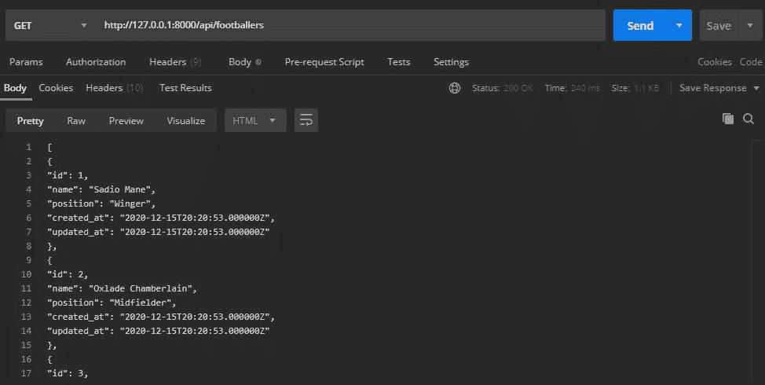

在本地测试“足球运动员”端点

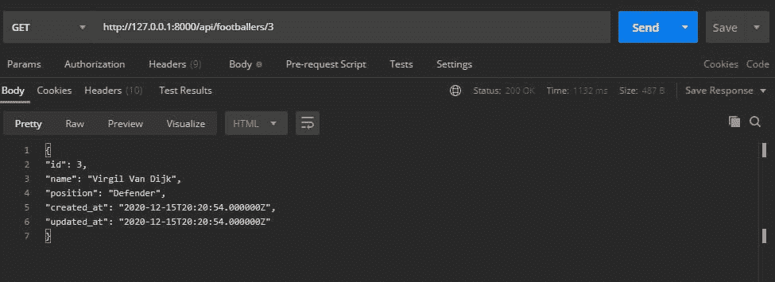

在本地测试“footballers/{id}”端点

## **4。创建一个过程文件**

这是 Heroku 的一种配置文件。它有助于指定应用程序在启动时执行的命令。例如，您可以将您的应用程序的 web 服务器或工作进程等。

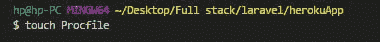

创建 Procfile

创建 Procfile 后，将以下内容添加到文件中:`web: vendor/bin/heroku-php-apache2 public/`。

## **5。初始化 Git，添加文件，并提交**

我们需要把源代码交给 Heroku。我们将通过 Git 版本控制来实现这一点。首先，您必须初始化一个 Git 存储库。

类型`git init`。

默认情况下，Laravel 将不需要或不应该被公众看到的文件放在它的`.gitignore`文件中。但是如果您正在构建一个应用程序(这可能不是 Laravel)，您应该担心创建一个`.gitignore`文件并向其中添加这些秘密文件和配置，这样它们就不会被 Git 跟踪。

添加用于暂存的文件，并使用`git add`提交它们。然后输入`git commit -m “message here”`。

## **6。登录 Heroku**

要登录 Heroku，输入`Heroku login`，并按照提示进行操作。

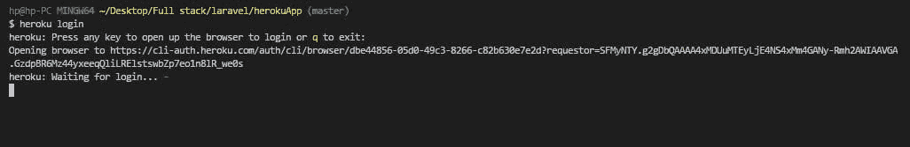

通过命令行界面登录 Heroku

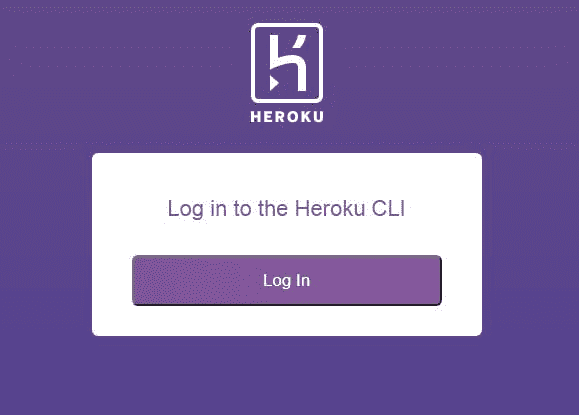

在浏览器上完成登录

给我看这个是因为我最近用过。如果这是我第一次尝试登录，我会被要求提供我的电子邮件和密码。

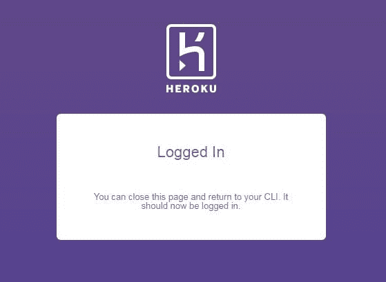

登录状态

## **7。创建 Heroku 应用程序**

现在，让我们全力以赴。要在 Heroku 上创建一个应用程序，输入`heroku create app (name of app)`。如果你没有为应用程序命名，Heroku 会为它创建一个随机的名称和网址；然而，如果这个名字已经存在于 Heroku 平台上，你必须找到一个新的唯一的名字。

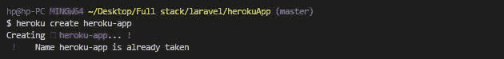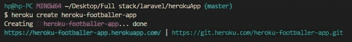

现在，如果我们转到 Heroku 仪表板，我们会看到我们的应用程序已经创建好了。


在 Heroku 上创建的应用

如果您键入`git remote -v`，您将看到 Heroku 已经提供了正确的路径。

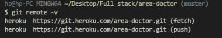

应用程序的远程路径

## **8。将您的代码推送到 Heroku，并开始初始设置**

要将代码推送到 Heroku，运行命令`git push Heroku master`。这会将代码推送到 Heroku。设置好一切，并安装所需的依赖项。

您还可以在仪表板上看到，根据我们提供给 Procfile 的信息，我们希望使用 Apache 服务器。

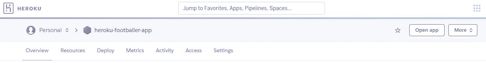

打开应用程序

现在，让我们打开应用程序。点击“打开应用程序”按钮。您将得到一个服务器错误，如下所示。

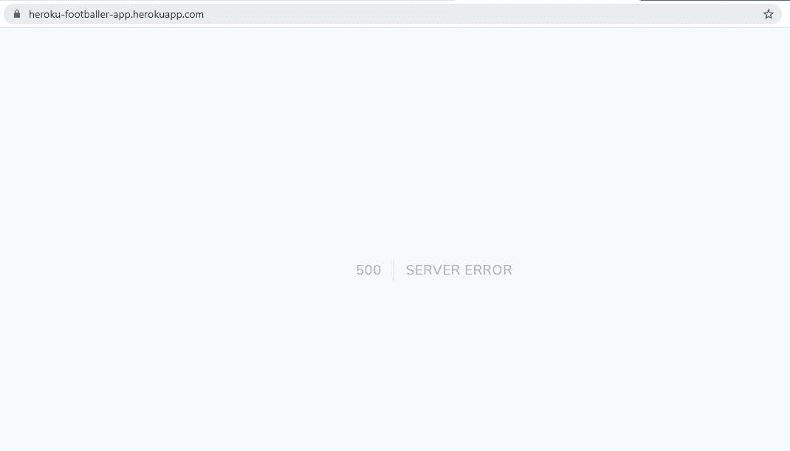

发生这种情况是因为应用程序工作所需的环境配置变量位于我们的`.env`文件中(在根目录中),还不在 Heroku 上。我们可以通过两种方式添加这些配置变量:

1.  从您的 Heroku 仪表板添加。
2.  从 Heroku CLI 添加。

我将向你展示这两种方法。要从仪表板添加，请转到您的设置，然后单击“显示配置变量”

先来补充一下`APP_DEBUG=true`。这将允许我们看到特定的错误，而不是一般的`500 || Server Error`。

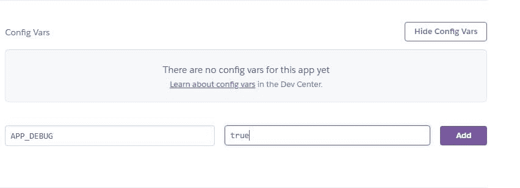

如果我们刷新页面，我们现在可以看到实际的错误是什么。由于`APP_DEBUG`已经被启用，Laravel 告诉我们哪里出错了:没有应用程序密钥。

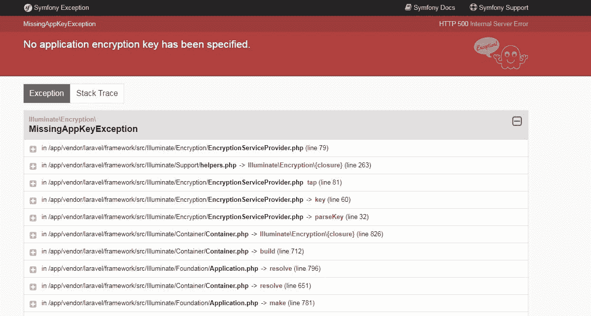

将应用程序密钥复制到您的`.env`文件中，并保存在 settings 下的 Config Vars 中，就像我们对`APP_DEBUG`所做的那样。

`APP_KEY=value (check your .env file for this)`

现在，如果我们再次刷新，我们会看到应用程序已经启动并运行，如下图所示。

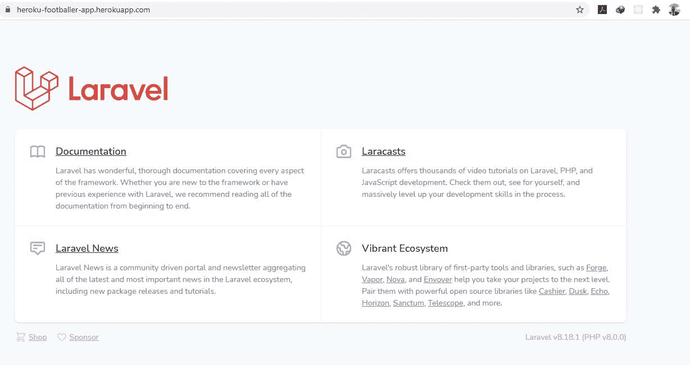

我们需要设置应用程序的其余配置变量。我们将使用第二种方法(通过 Heroku CLI)来实现。

我们将使用命令`heroku config:add ENV_CONFIG=value`。例如，让我们将`APP_NAME, APP_ENV and APP_URL`添加到配置变量中。

`heroku config:add APP_NAME=Heroku-Football-App (Use the name of your app here)`

`heroku config:add APP_ENV=production`

`heroku config:add APP_NAME= https://heroku-footballer-app.herokuapp.com/ (Use the url of your app here)`

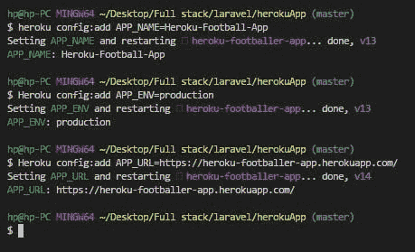

添加了配置变量

现在让我们看看 Heroku 上的配置变量。您会看到变量已经被添加到配置变量列表中。

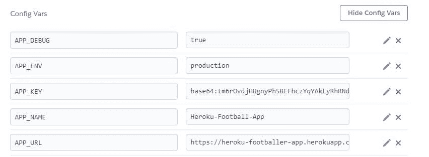

## **9。创建数据库**

我们的 Laravel 应用程序现在在 Heroku 上运行。然而，这只是旅程的一半。我们需要将数据库连接到我们的应用程序。

我们将使用 PostgreSQL，但是您可以使用任何您想要的数据库——MySQL、MongoDB 等。我发现 PostgreSQL 在 Heroku 上很容易实现。它非常类似于我们在本地环境中使用的 MySQL。另外，他们有一个非常友好的免费套餐。在本教程中，我使用了免费的爱好开发计划。如果您需要更多的可扩展性和功能，您也可以获得付费版本。

因此，要使用该数据库，我们将把它作为一个附加组件安装。

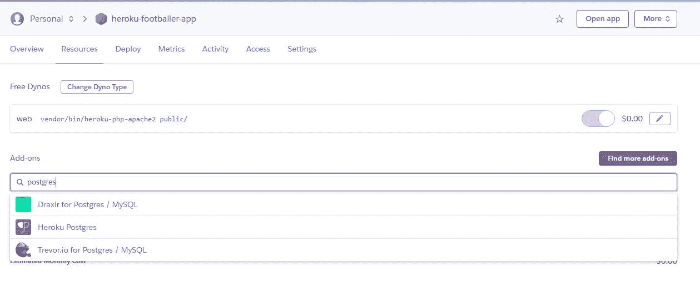

已选择 PostgreSQL 加载项

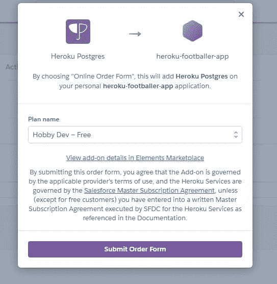

添加了 PostgreSQL 加载项

## **10。获取数据库凭证**

我们需要获得这个数据库的凭证，这样我们就可以将它与我们的应用程序集成在一起。这将为我们提供数据库登录信息，如`CONNECTION`、`NAME`、`PORT`、`USERNAME`、`PASSWORD`和`HOST`。

幸运的是，在 Heroku CLI 上只需要一行命令就可以完成。这将显示出设置数据库所需的所有变量。类型`heroku pg:credentials:url`。

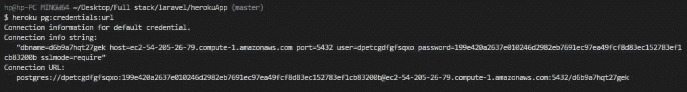

数据库凭据

首先，我们需要将`DB_CONNECTION`添加为`pgsql`；然后，我们将数据库配置变量添加到配置变量列表中。

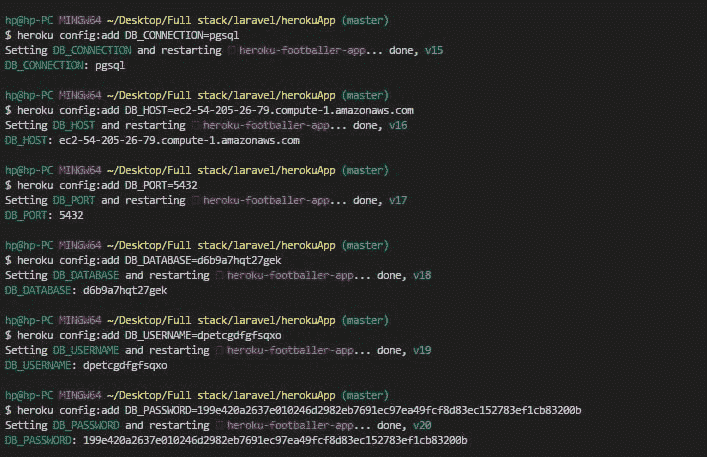

添加了数据库配置变量

## **11。迁移和播种您的表**

现在我们的数据库已经设置好了，让我们运行迁移。为此，运行`heroku run php artisan migrate`。

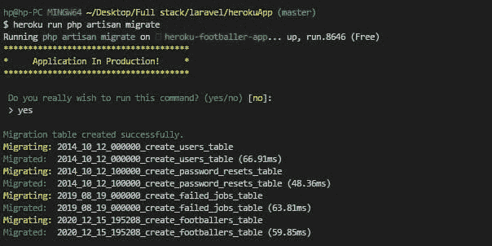

在生产中完成迁移

在 Heroku 上的 Resources 下，单击数据库。您将看到数据库现在包含了我们迁移的所有表。

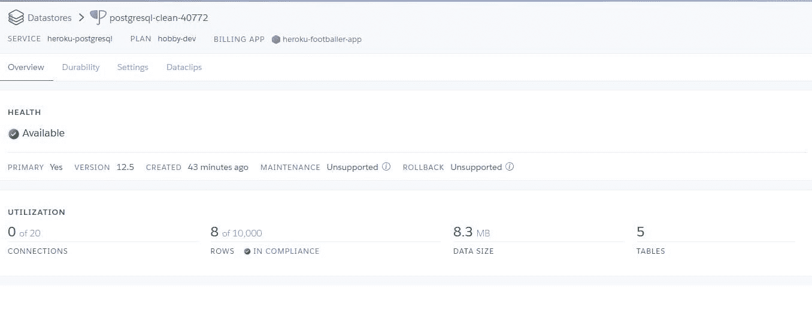

所有的表都已添加到生产数据库中

此外，要查看数据库中的所有表并执行 SQL 查询，请单击 Dataclips 菜单。

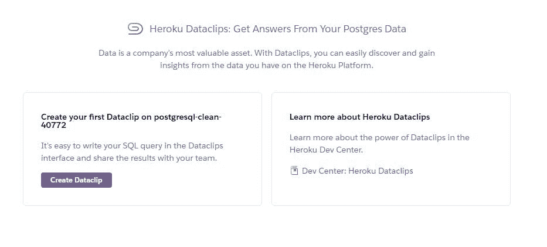

查看所有表格

点击“创建新的数据剪辑”

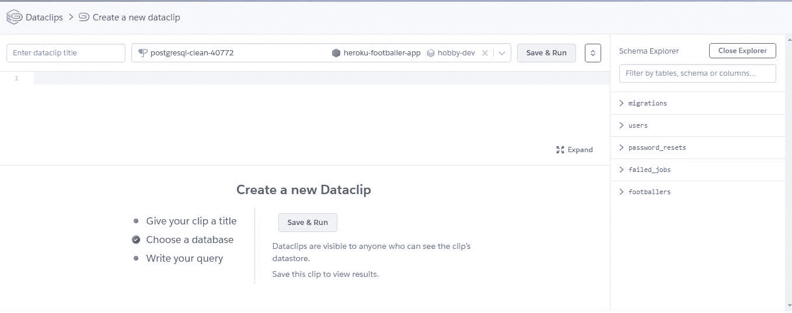

创建数据剪辑

现在让我们用一些数据作为数据库的种子，就像我们对应用程序的本地版本所做的那样。

`heroku run php artisan db:seed`

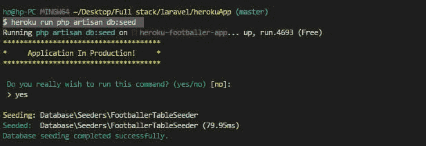

## **12。测试邮递员**

你成功了。我们的申请 100%完成。现在，让我们在邮递员身上测试一下。我们将测试在本地版本中测试过的相同端点。

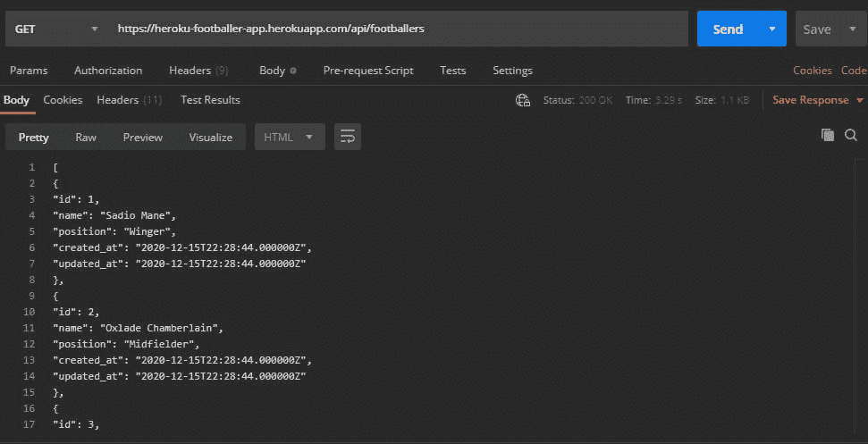

在生产中测试“足球运动员”端点

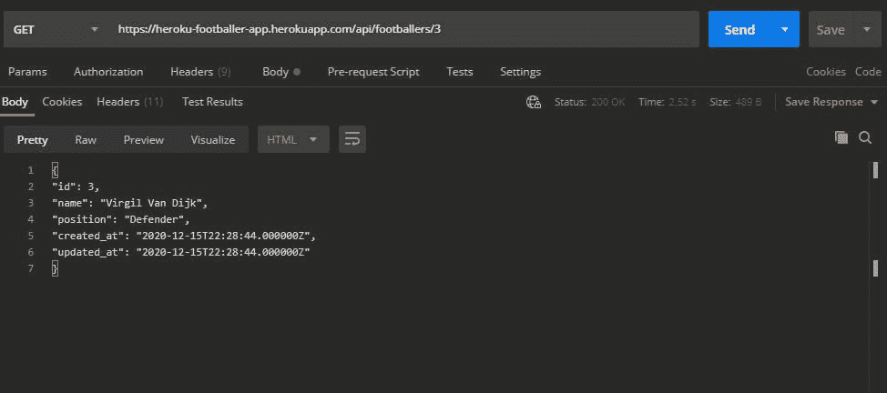

在生产中测试“footballers/{id}”端点

## 13。奖励步骤

如果你犯了一个错误或者你的代码中有其他的内容，只需要做以下的事情:

1.`git add`

2.`git commit -m “message”`

3.`git heroku push master`

4.你完了！

感谢阅读。